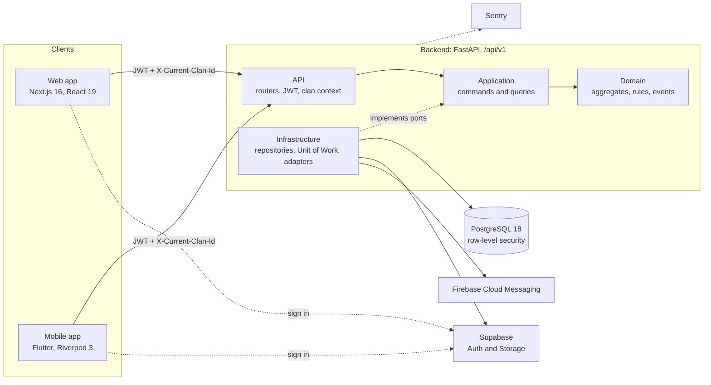

# FamilyRoots 🌳

**A digital gia phả for Vietnamese family clans.** FamilyRoots keeps a clan's family tree accurate across generations, on the web and on mobile, with the rules Vietnamese genealogy actually needs: đời counted through the father's line, đa thê, lunar death anniversaries, and dates nobody remembers exactly.

[](https://github.com/namphuongtran/familyroots/actions/workflows/backend-ci.yml)
[](https://github.com/namphuongtran/familyroots/actions/workflows/web-ci.yml)
[](https://github.com/namphuongtran/familyroots/actions/workflows/mobile-ci.yml)
[](LICENSE)


## Giới thiệu

**FamilyRoots** là nền tảng gia phả số dành cho các dòng họ Việt Nam. Mỗi dòng họ là một không gian riêng biệt, được bảo vệ ở cả tầng ứng dụng lẫn tầng cơ sở dữ liệu. Thành viên cùng xây dựng và gìn giữ cây gia phả: đời được tính tự động theo dòng cha, hỗ trợ đa thê với thứ tự vợ, ngày giỗ theo âm lịch, ngày tháng không chắc chắn (khoảng năm, năm, tháng), cùng các loại tên truyền thống như tên húy, tên tự, tên thụy. Quyền hạn được phân theo từng dòng họ (xem, chỉnh sửa, quản trị), mọi thay đổi đều được ghi nhật ký. Ứng dụng có giao diện web (Next.js) và di động (Flutter), hỗ trợ tiếng Việt, tiếng Anh, tiếng Trung và tiếng Pháp.

## Why FamilyRoots

Generic genealogy tools assume a Western family model. A Vietnamese clan record does not fit it:

- **Đời (generation) is a clan-wide number**, counted from the founder (thủy tổ) through the father's line (con theo đời cha). It has to stay consistent even when two descendants of the founder marry each other.
- **A man may have several wives (đa thê)**, and each child's mother must still be attributed correctly on the tree.
- **The day that matters is the death anniversary (ngày giỗ)**, and it recurs on the lunar calendar, not the solar one.
- **Old dates are uncertain**: "around 1750", "some time in 1802", "the 3rd month". Forcing them into an exact date invents history.
- **One person has several names**: a taboo birth name (tên húy), a courtesy name (tên tự), a posthumous name (tên thụy), titles and aliases.
- **People belong to more than one clan**, through their father's and their mother's families, or by marriage.

FamilyRoots models each of these in its domain layer rather than in free-text notes, and records the decisions behind them as ADRs.

## Project status

FamilyRoots is in active development. The roadmap target is **one real Vietnamese clan using the web app for real data**.

| Part | State |
|---|---|
| **Backend API** | The most complete layer. 16 route groups under `/api/v1`, row-level security on every clan-owned table, 228 test files (101 unit, 122 integration against real PostgreSQL) |
| **Web** | A working app, mid-migration to feature slices. `auth`, `persons` and `invitations` are migrated; tree, events, documents and admin still run on the earlier code |
| **Mobile** | The M0 spine of a Riverpod 3 rebuild (ADR-034): sign-in, verification and clan selection. It compiles and CI builds an APK; it has not yet been walked on a real device |
| **Infrastructure** | Six CI workflows and the Render blueprint are real. The Pulumi project is a scaffold of stubs |

Work is tracked in [GitHub Issues](https://github.com/namphuongtran/familyroots/issues). The milestone order and the reason for each boundary are in [docs/roadmap.md](docs/roadmap.md).

## Features

### Genealogy built for Vietnamese clans

- **Computed đời**: one authority computes generation numbers through the father's line, including pedigree collapse ([ADR-027](docs/decisions/027-doi-single-authority.md)).
- **Đa thê**: concurrent marriages ordered by `spouse_order`, with mother attribution on the tree ([ADR-012](docs/decisions/012-computed-generation-mother-attribution.md)).
- **Historical dates**: every date is a `HistoricalDate` with a precision of `exact`, `year`, `month`, `circa` or `unknown`, a display text such as "khoảng 1750", and an optional lunar date ([ADR-011](docs/decisions/011-historical-date-precision.md)).
- **Lunar calendar**: lunar events recur on the lunar calendar and are converted to solar dates at UTC+7 ([ADR-018](docs/decisions/018-vietnamese-lunar-calendar.md)).
- **Traditional names**: tên húy, tên tự, tên thụy, biệt hiệu and chức tước, stored next to the full name.
- **Branches and founder**: clan branches (chi, nhánh) and exactly one founder (thủy tổ) per clan.
- **Vietnamese name search without diacritics**: PostgreSQL `unaccent` and `pg_trgm`, so `nguyen van an` finds `Nguyễn Văn An`, with results ranked by trigram similarity.

### Collaboration and safety

- **Multi-clan workspaces**: one account, many clans. The active clan travels in the `X-Current-Clan-Id` header, much like switching Slack workspaces.
- **Clan isolation, in two layers**: every clan-scoped query is filtered in the application layer, and PostgreSQL row-level security covers all 13 clan-owned tables ([ADR-008](docs/decisions/008-rls-defense-in-depth.md)). An integration test fails if a clan-owned table is left without a policy.
- **Role-based access**: `viewer`, `editor` and `admin` per clan, plus a platform-wide `super_admin`.
- **Joining a clan**: token invitations, approval of pending members, identity claims (a user claims "this person in the tree is me" and an admin approves), and change requests for proposed edits.
- **Audit log**: every auditable domain event records the actor, the action, old and new values as JSONB, the IP address and the user agent.
- **Soft deletes**: persons, marriages, parent-child links, documents and events are kept with a deletion flag. A relationship is hidden on read when either person is deleted ([ADR-051](docs/decisions/051-edge-visibility-derived-not-cascaded.md)).

### Content, reminders and reach

- **Interactive family tree** on the web, drawn with XYFlow (React Flow) over a tree read model with kinship paths and a focus view.
- **Documents and photos** in Supabase Storage: a private bucket served through short-lived signed URLs, a public avatar bucket, and a retention purge after soft delete ([ADR-019](docs/decisions/019-document-soft-delete-purge.md)).
- **Events and reminders**: solar or lunar events, optionally recurring (death anniversaries, birthdays and more). A daily scheduler job sends push notifications through Firebase Cloud Messaging.
- **Export**: GEDCOM and a full clan export.
- **Multilingual**: the web app ships Vietnamese, English, Chinese and French; the mobile app ships Vietnamese and English; the API localizes its messages in the same four languages.

## Architecture



- **Backend**: DDD, CQRS and hexagonal architecture ([ADR-001](docs/decisions/001-ddd-cqrs-hexagonal.md)). The domain layer imports no framework, the application layer imports only the domain, and six `import-linter` contracts enforce those boundaries in CI.
- **Writes** go through a Unit of Work that collects domain events and dispatches them before commit. The dispatcher is in-process, so events are not durable integration events.
- **One API contract**: every 2xx body is `{"data": ...}`, lists add `"meta": {cursor, has_more, limit}` with cursor pagination, and errors keep a stable structured envelope ([ADR-010](docs/decisions/010-response-envelope-cursor-pagination.md)). The specification lives in [docs/contracts/](docs/contracts/README.md).
- **Two databases, on purpose**: the application database is migrated by Alembic; Supabase owns `auth.*` and Storage ([docs/ops/local-supabase.md](docs/ops/local-supabase.md)).
- **Design system**: both clients follow **Arbor Heritage**, an editorial look with tonal surfaces instead of divider lines, soft ambient shadows, Plus Jakarta Sans and Manrope, and layouts that survive 200% text size ([design spec](docs/superpowers/specs/2026-08-02-design-system-and-screens.md)).

## Tech stack

| Area | Technology |
|---|---|
| **Backend** | Python 3.14, FastAPI, SQLAlchemy 2 (async), psycopg 3, Pydantic 2, Alembic, APScheduler, firebase-admin |
| **Web** | Next.js 16 (App Router), React 19, TypeScript 6, TanStack Query 5, Tailwind CSS 4, Radix UI, next-intl, XYFlow 12, zod, React Hook Form, Zustand (UI state only) |
| **Mobile** | Flutter 3.44 / Dart 3.12 (Android and iOS), Riverpod 3, go_router, Dio, freezed, supabase_flutter |
| **Database** | PostgreSQL 18 with `pg_trgm`, `unaccent` and row-level security |
| **Auth and storage** | Supabase Auth (JWT, email and password; Google and Apple OAuth on the web) and Supabase Storage |
| **Notifications** | Firebase Cloud Messaging, scheduled by APScheduler |
| **Observability** | Sentry on all three apps, a Prometheus metrics endpoint on the backend |
| **Deploy** | Render (backend, Docker), Vercel (web) |
| **CI/CD** | GitHub Actions: `backend-ci`, `web-ci`, `mobile-ci`, `pr-checks`, `infra-ci`, `db-backup` (nightly `pg_dump`) |
| **Infrastructure as code** | Render blueprint; Pulumi (Python) scaffold |
| **Quality tooling** | ruff, mypy (strict), import-linter, pytest · ESLint, dependency-cruiser, Vitest, Testing Library, MSW, Playwright · dart format, flutter analyze, flutter test · gitleaks, pre-commit |
| **Package managers** | uv (backend), pnpm 10 (web), pub (mobile) |

## Repository layout

```
familyroots/
├── backend/          # FastAPI service: domain, application, infrastructure, api/v1
├── web/              # Next.js app: clan dashboard, admin, platform backoffice
├── mobile/           # Flutter app for Android and iOS
├── supabase/         # Local Supabase stack config (auth, Storage buckets)
├── infra/            # Pulumi, Render blueprint, Supabase, Firebase and Sentry config
├── scripts/          # Seeding, backup and restore drill, super-admin bootstrap, local Supabase
├── docs/             # Architecture (arc42), contracts, ADRs, ops runbooks, guides
├── .github/          # CI workflows, PR template, issue template
├── CONTEXT.md        # Domain glossary: ownership and membership terms
├── docker-compose.yml
└── Makefile          # Common dev commands (`make help`)
```

## Getting started

### Prerequisites

- **Docker**, for PostgreSQL, pgAdmin and the local Supabase stack
- **Python 3.14** and [**uv**](https://docs.astral.sh/uv/)
- **Node.js 22.12+** and **pnpm 10**, which also run the pinned Supabase CLI through `npx`
- **Flutter 3.44 / Dart 3.12**, for the mobile app only
- **pre-commit**

### Run it locally

```bash
git clone https://github.com/namphuongtran/familyroots.git
cd familyroots
pre-commit install
cp .env.example .env

# 1. Databases: the application database and the local Supabase stack (auth + Storage)
make docker-up        # PostgreSQL 18 on :5432, pgAdmin on :5050
make supabase-up      # starts Supabase and waits until every container is healthy
make supabase-env     # prints SUPABASE_URL and the keys the backend needs

# 2. Backend on http://localhost:8000 (Swagger UI at /docs while APP_DEBUG=true)
cd backend
cp .env.example .env  # set DATABASE_URL, paste the values from `make supabase-env`
uv sync
uv run alembic upgrade head
uv run uvicorn app.main:app --reload
```

In a second terminal, seed a test clan and its users, then start the web app:

```bash
make seed             # a test clan, four users and their roles, in both databases

cd web
cp .env.example .env.local
pnpm install
pnpm dev              # http://localhost:3000
```

The mobile app takes every setting through `--dart-define`; there is no `.env` file:

```bash
cd mobile
flutter pub get
flutter run \
  --dart-define=API_BASE_URL=http://10.0.2.2:8000/api/v1 \
  --dart-define=SUPABASE_URL=<url> \
  --dart-define=SUPABASE_PUBLISHABLE_KEY=<key> \
  --dart-define=SENTRY_DSN=<dsn>
```

`10.0.2.2` is the Android emulator's alias for your machine. A physical device needs your LAN address, and the backend must then listen on `--host 0.0.0.0`.

More detail: [developer onboarding](docs/guides/onboarding.md), [local Supabase](docs/ops/local-supabase.md), [seeding test users](docs/ops/seed-test-users.md). Run `make help` for every shortcut.

## Quality gates

Each app has one full gate, and a change is not done until its gate is green. The commands live in one place each, so they do not drift:

- **Backend**: "Backend full quality gate" in [CLAUDE.md](CLAUDE.md#key-global-commands): pytest, ruff check, ruff format, mypy and import-linter.
- **Web**: the full gate in [web/CLAUDE.md](web/CLAUDE.md): type-check, lint, format, dependency-cruiser, Vitest, build, and Playwright end-to-end tests.
- **Mobile**: "Mobile full quality gate" in [CLAUDE.md](CLAUDE.md#key-global-commands): dart format, build_runner with a stale-code check, flutter analyze and flutter test.

How a test is written here, and why it must be seen to fail, is in [.claude/rules/testing.md](.claude/rules/testing.md).

## Documentation

Start at [docs/README.md](docs/README.md) for the full index.

| Topic | Read |
|---|---|
| Architecture | [Overview](docs/architecture/overview.md), [Software Architecture Document (arc42)](docs/sad/README.md), [Data model](docs/architecture/data-model.md) |
| Domain | [Domain rules](docs/architecture/domain-rules.md), [Tree read model](docs/architecture/tree-read-model.md), [Glossary](CONTEXT.md) |
| Security | [RBAC](docs/architecture/rbac.md), [Multi-tenancy](docs/architecture/multi-tenancy.md), [Auth flow](docs/architecture/auth-flow.md) |
| API | [API design](docs/architecture/api-design.md), [Contracts](docs/contracts/README.md) |
| Decisions | [ADR index](docs/decisions/README.md), 62 records |
| Operations | [Ops runbooks](docs/ops/README.md), [Infrastructure as code](docs/guides/iac-guide.md), [Flutter build and publish](docs/guides/flutter-build-publish.md) |
| Planning | [Roadmap](docs/roadmap.md) |

## Roadmap

| Milestone | Goal |
|---|---|
| **M0** | Make the UI verifiable: colour tokens, fonts, contrast, dark mode, 200% text scale |
| **M1** | Finish clan isolation and the data rules |
| **M2** | The web feature slices: auth, persons, relationships, tree, events, documents, admin |
| **M3** | Deploy and operate: infrastructure decision, monitoring, a restore drill against production data |
| **M4** | Mobile milestones M1 to M4: persons, kinship, events, documents |

The reasons behind this order are in [docs/roadmap.md](docs/roadmap.md). Live status is in [GitHub Issues](https://github.com/namphuongtran/familyroots/issues).

## Contributing

- Pick an open issue labelled `ready-for-agent`, or open one first. **One pull request per issue.**
- Branch names: `feat/…`, `fix/…`, `chore/…`, `docs/…`, `ops/…` or `infra/…`.
- Pull request titles follow [Conventional Commits](https://www.conventionalcommits.org/), checked in CI by `pr-checks`. Allowed types: `feat`, `fix`, `chore`, `docs`, `infra`, `test`, `refactor`, `style`, `perf`, `ci`.
- Fill in the [pull request template](.github/PULL_REQUEST_TEMPLATE.md), run the gate for every app you touched, and update the matching contract or ADR in the same pull request.
- Never commit secrets or `.env` files; `pr-checks` runs gitleaks.

```
feat(persons): add posthumous name to the person form
fix(tree): keep a pedigree-collapsed child under both parents
docs(contracts): document the claims cursor pagination
```

## License

[Apache License 2.0](LICENSE)
