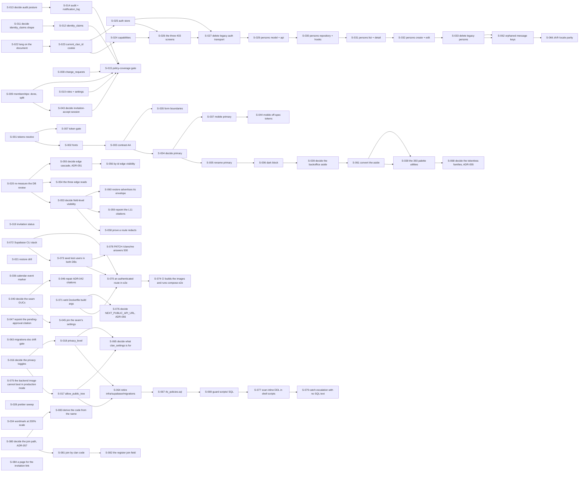

# Seed issue tracker

Scheduled work, decomposed. [`../.claude/rules/seeds.md`](../.claude/rules/seeds.md) is the
authority on what a seed is, what fields it carries, and why. This file is the tracker and does not
restate that rule.

**This file may be cited, and it is the only tracker.** It holds scheduled work as seeds, items owed
with an owner and an unmet trigger, and claims not verified. [`roadmap.md`](roadmap.md) holds the
milestone order and no work.

**This file decides nothing.** Every seed points at the ADR, spec, contract, or source file that
owns its subject. Where a seed and its owner disagree, the seed is the bug.

**Opened 2026-08-13** with 33 seeds, 0 done, 12 open, and 21 blocked.

**Re-taken 2026-08-13, after S-001 and S-002 landed: 34 seeds, 2 done, 14 open, and 18 blocked.**
All four moved, and here is each one:

- **Seeds, 33 to 34.** S-002 opened S-034 while verifying its own work.
- **Done, 0 to 2.** S-001 and S-002.
- **Open, 12 to 14.** S-003, S-007, and S-034 became open. S-001 and S-002 left for `done`.
- **Blocked, 21 to 18.** S-002, S-003, and S-007 left it. Nothing became blocked.

**Re-taken again 2026-08-13, after S-034 landed: 34 seeds, 3 done, 13 open, and 18 blocked.** Two of
the four moved:

- **Done, 2 to 3.** S-034.
- **Open, 14 to 13.** S-034 left for `done`. Nothing became open, because S-034 unblocked nothing.
- **Seeds** stayed 34 and **blocked** stayed 18.

**Re-taken again 2026-08-13, after S-003 landed: 36 seeds, 4 done, 15 open, and 17 blocked.** All
four moved:

- **Seeds, 34 to 36.** S-003 opened S-035 and S-036 while verifying its own work, the same way S-002
  opened S-034.
- **Done, 3 to 4.** S-003.
- **Open, 13 to 15.** S-004 became open, because S-003 was its only blocker. S-035 and S-036 arrived
  open. S-003 left for `done`. Net plus two.
- **Blocked, 18 to 17.** S-004 left it. Nothing became blocked.

**Re-taken again 2026-08-14, after S-004 landed: 37 seeds, 5 done, 16 open, and 16 blocked.** All
four moved:

- **Seeds, 36 to 37.** S-004 opened S-037, the mobile half of its own decision, the same way S-002
  opened S-034 and S-003 opened S-035 and S-036.
- **Done, 4 to 5.** S-004.
- **Open, 15 to 16.** S-005 became open, because S-004 was its only blocker. S-037 arrived open.
  S-004 left for `done`. Net plus one.
- **Blocked, 17 to 16.** S-005 left it. Nothing became blocked.

**Re-taken again 2026-08-14, after S-005 landed: 37 seeds, 6 done, 16 open, and 15 blocked.** Two of
the four moved:

- **Done, 5 to 6.** S-005.
- **Blocked, 16 to 15.** S-006 left it, because S-005 was its only blocker.
- **Open** stayed 16: S-006 arrived and S-005 left. **Seeds** stayed 37, because S-005 opened
  nothing. S-034 is the only other seed that opened nothing. The reason here is that S-005 found
  its one surprise, the backoffice dark ground, inside its own scope, so the fix went in the same
  change rather than into a new seed.

**Re-taken again 2026-08-21, after S-006 landed: 39 seeds, 7 done, 17 open, and 15 blocked.** Three
of the four moved:

- **Seeds, 37 to 39.** S-006 opened S-038 and S-039 while verifying its own work, the same way
  S-002 opened S-034 and S-003 opened S-035 and S-036. Both are what S-006 found once the palette
  was real: the app has 393 hardcoded palette utilities that no token override can reach, and the
  one hand-built dark surface now needs a role the spec does not publish.
- **Done, 6 to 7.** S-006.
- **Open, 16 to 17.** S-038 and S-039 arrived open. S-006 left for `done`. Net plus one.
- **Blocked** stayed 15, because S-006 unblocked nothing. It was the last seed in the M0 palette
  chain, and the two seeds it opened are actionable today.

**Re-taken again 2026-08-22, after four seeds landed in one parallel batch: 42 seeds, 11 done, 17
open, and 14 blocked.** Three of the four moved, and this is the first entry here covering more
than one seed:

- **Seeds, 39 to 42.** S-040, S-041, and S-042 arrived. All three came out of the batch rather than
  out of planning: two agents found the same class of thing, which is a claim in a document that
  the code contradicts.
- **Done, 7 to 11.** S-007, S-008, S-011, and S-013, run in parallel in four worktrees.
- **Open stayed 17**, and the stillness hides four movements that cancel. The four seeds left for
  `done`, minus four. S-012 and S-014 became open, because S-011 and S-013 were their only
  blockers, plus two. S-040 and S-041 arrived open, plus two. S-042 arrived `blocked`, so it is
  not counted here.
- **Blocked, 15 to 14.** S-012 and S-014 left it, minus two. S-042 arrived blocked by S-041, plus
  one. Net minus one.

**One thing this batch proved, and it is worth more than the four seeds.** Per-branch green
proved nothing about the composition, exactly as `.claude/rules/seeds.md` warns. The two
documentation seeds each edited `docs/decisions/README.md` to narrow the same sentence, and git
could not merge them. That conflict was resolved by hand on the integration branch, and the
sentence now carries a note saying it is a merge point. The fence that failed was mine: both
agents were told to add their own row to that index, which guarantees both touch it.

**Re-taken again 2026-08-22, after a second parallel batch of four: 47 seeds, 15 done, 19 open, and
13 blocked.** All four moved:

- **Seeds, 42 to 47.** Five arrived, and none came out of planning. S-009 opened **S-043** by
  splitting, S-037 opened **S-044**, and S-040 opened **S-045** and **S-046**. **S-047** is
  different from the other four: it is an `Owed` row whose trigger was met, so it became a seed and
  the row was deleted in the same change.
- **Done, 11 to 15.** S-009, S-022, S-037, and S-040, run in parallel in four worktrees.
- **Open, 17 to 19.** The four left for `done`, minus four. The five new seeds arrived open, plus
  five. S-023 became open, because S-022 was its only blocker, plus one. Net plus two.
- **Blocked, 14 to 13.** S-023 left it. Nothing became blocked.

**This batch merged with no conflict, which is the fence working rather than luck.** The four
branches touched disjoint sets: `backend/**` plus three `docs/architecture` and `docs/ops` files,
`docs/decisions/**` alone, `mobile/**` alone, and `web/**` plus two more. The previous batch's
conflict came from telling two agents to add a row to the same index, so this time exactly one
agent was allowed inside `docs/decisions/`. **The cost of that fence is recorded too**: S-009 found
a decision it could not write up, because ADRs were fenced away from it, and that is part of why
S-043 exists rather than being resolved inside S-009.

**Three things this batch found that no seed asked for, and all three were in a document rather
than in code.** S-040 found that its own seed miscounted a diff and named one GUC writer where
there are two. S-022 found that its seed's title describes a layout Next.js will not compile. The
coordinator found that this file's claim "Flutter is not installed on this machine" is false: the
SDK is present and merely absent from `PATH`, and three rows rested on the wrong conclusion. In
every case the code was right and the plan was the thing an agent reads first, which is the failure
this file was opened to stop.

**Re-taken again 2026-08-22, after a third parallel batch of four: 48 seeds, 19 done, 18 open, and
11 blocked.** All four moved:

- **Seeds, 47 to 48.** S-044 opened **S-048**, a third off-spec mobile token it found while
  re-reading the two it was given.
- **Done, 15 to 19.** S-023, S-043, S-044, and S-045.
- **Open, 19 to 18.** The four left for `done`, minus four. S-024 and S-025 became open, because
  S-023 was their only blocker, plus two. S-048 arrived open, plus one. Net minus one.
- **Blocked, 13 to 11.** S-024 and S-025 left it. Nothing became blocked.

**This batch merged with one conflict, and the fence that failed was the coordinator's again.** Both
backend agents were allowed to add prose to `backend/CLAUDE.md`, and both added it to the same
section. Resolved by hand on the integration branch, keeping S-045's new paragraph and S-043's newer
version of the sentence they both touched, because S-043 had resolved one of the two cases that
sentence counts. The lesson repeats from the previous batch: **two agents told to write into one
file will collide, whatever the file is.**

**The batch's most valuable event was a seed that could not finish an edit and said so.** Migration
032 falsifies two assertions in `backend/tests/integration/test_rls_activation.py`, and that file was
fenced to the concurrent S-045 agent. The S-043 agent recorded the outstanding edit in ADR-048 rather
than racing for the file, and the coordinator applied it on the integration tree. **Per-branch green
would have merged a red tree.** This is the first time the combined-tree rule at
`.claude/rules/seeds.md` has caught a real break rather than a merge conflict.

**One agent died mid-run**, when the machine slept, and it had already committed three times with a
clean tree. Its work was verified from the commits rather than from a report: the fence, the
migration up and down and up again on a throwaway database, and the planted inversion re-run
independently, which reproduced the agent's own figures exactly (`9 failed, 3 passed`, then `12
passed`). **A report is convenient, not evidence.**

**Re-taken again 2026-08-22, after a fourth parallel batch of four: 49 seeds, 23 done, 16 open, and
10 blocked.** All four moved:

- **Seeds, 48 to 49.** S-048 opened **S-049**.
- **Done, 19 to 23.** S-012, S-024, S-041, and S-048.
- **Open, 18 to 16.** The four left for `done`, minus four. S-042 became open, because S-041 was its
  only blocker, plus one. S-049 arrived open, plus one. Net minus two.
- **Blocked, 11 to 10.** S-042 left it. Nothing became blocked.

**This batch merged with no conflict, and the fence is finally the right shape.** Two agents worked
inside `web/` at once, in different worktrees, split by file rather than by directory: one owned
`playwright.config.ts`, `e2e/**`, and `web/CLAUDE.md`, the other owned `src/domain/capability/**` and
was told the first one's files by name. Both `CLAUDE.md` files were fenced to a single owner or to
nobody, and the two agents locked out of them **returned their prose in their reports**, which the
coordinator applied on the integration tree. That is the fence keeping information rather than
losing it, which is the thing the previous two batches got wrong.

**S-041 closed a defect that had made three consecutive batches report a red gate that was not one.**
`web/.env.local` is untracked, so every `git worktree` lacked it and four e2e cases measured the
missing-Supabase banner instead of the code. The end state was then measured in **both** environments
rather than argued: 38 passed in a worktree with no env file, and 38 passed in the primary checkout
where one exists.

**The batch's sharpest finding is that a green guard can be green over the opposite of what it
guards.** S-012 flipped its deny-all policy to `USING (true) WITH CHECK (true)` — handing the request
role every clan's claims — and the existing "RLS is on and there is a policy" assertion **still
passed**. The coverage guard is now split in two, each half asked its own question. S-015 inherits
that shape, and it is worth more than the table this seed covered.

**Three of the four seeds in this batch were wrong about something in their own text**, all written
within the previous two days: S-048 cited a line that had moved and offered an answer its own
`Out of scope` forbade, S-012's governing ADR mispredicted an error path, and S-024's premise about
role nesting held only by luck. The code was right in every case.

**Re-taken again 2026-08-22, after a fifth parallel batch of four: 51 seeds, 27 done, 15 open, and
9 blocked.** All four moved:

- **Seeds, 49 to 51.** S-021 opened **S-050** and S-049 opened **S-051**.
- **Done, 23 to 27.** S-014, S-021, S-025, and S-049.
- **Open, 16 to 15.** The four left for `done`, minus four. S-026 became open, because S-024 and
  S-025 were its only blockers, plus one. S-050 and S-051 arrived open, plus two. Net minus one.
- **Blocked, 10 to 9.** S-026 left it. Nothing became blocked.

**This batch found a claim in this file that was simply wrong, rather than stale.** S-021's premise,
and the `Not verified` row repeating it, said no dated restore-drill result existed. One had existed
since 2026-07-14, in the very runbook the seed cites. The row was **deleted rather than softened**,
because softening a wrong claim leaves a reader believing a weaker version of something that was
never true. What was actually missing was a **current** result, not a dated one.

**The batch also found a real gap behind that false one.** No drill has ever restored an RLS-carrying
dump, and the drill structurally cannot notice: the dump carries no cluster role, a role is
cluster-wide so the same-cluster drill finds one already there, and all three checks run as a
superuser that bypasses RLS. That is S-050.

**The coverage guard needed a third posture, one batch after it needed a second.** S-012 split it in
two because a permissive policy passed. S-014 found that `audit_logs` — clan-keyed on reads,
permissive on inserts, and with **no** UPDATE or DELETE policy — passes the clan-isolated half while
telling a later reader something false about its writes. **Each split was found by planting an
inversion, never by reading the code.**

**S-049 is the third time in three weeks that a green test asserted a setting rather than an
outcome**, after S-001's CSS probe and S-012's coverage guard. Three folder notes now say the same
thing in three places, and none of them is where the fourth instance will be found. That became
**S-051**.

**Re-taken again 2026-08-22, after a sixth parallel batch of four: 52 seeds, 31 done, 13 open, and
8 blocked.** All four moved:

- **Seeds, 51 to 52.** S-010 split and opened **S-052**.
- **Done, 27 to 31.** S-010, S-026, S-047, and S-051.
- **Open, 15 to 13.** The four left for `done`, minus four. S-027 became open, because S-026 was its
  last blocker, plus one. S-052 arrived open, plus one. Net minus two.
- **Blocked, 9 to 8.** S-027 left it. Nothing became blocked.

**A seed about evidence caught the coordinator overstating evidence.** S-051 was commissioned to
write down "a test pins an outcome, not a setting". Reading its own commissioning text at source, it
found the claim that the mobile app "painted a line for 19 days" was false — no widget used a
`Divider` at all. That sentence was written by the coordinator in two places, and both are corrected
above rather than quietly edited. **The rule earned its place before it was finished being written.**

**One agent hit a session limit mid-edit having committed nothing.** Its worktree held three screens,
their tests, four locale files, and a middleware change. The coordinator ran the full gate on that
tree **unchanged**, found it coherent and green, and committed it as recovered work with the
interruption recorded in the commit message. **What could not be recovered is the report**, so the
`T-04` check S-026 requires is recorded as a `Not verified` row rather than assumed from a green
gate. A gate is not evidence about a claim the gate does not check.

**S-026 was told to close an inherited debt and correctly refused.** Its own text, written by the
coordinator when closing S-024, assigned the orphaned `capability.ts` here. All three of its screens
are pre-authorization surfaces where the user has no clan role, so there is nothing to derive.
Wiring a consumer in would have created a module that exists to silence a checker — the defect this
tracker has now named three times. The debt moves to S-027, which owns the legacy hook that is the
real consumer.

**S-010 split exactly where its own text predicted, and found the other half of a hazard nobody had
recorded.** The seed knew `user_clan_roles` reads fail silently. It did not know the writes fail
loudly: `add_membership` inserts on the same clan-less session, so a single policy would produce a
silent lockout on `/auth/login` and a 500 on `/auth/onboard`. It also established that
`clan_settings` is **dead scaffold** — nothing anywhere constructs a row — which is a hidden
precondition for S-016, S-017, and S-018.

**Re-taken again 2026-08-22, after a seventh parallel batch of four: 57 seeds, 35 done, 15 open, and
7 blocked.** All four moved:

- **Seeds, 52 to 57.** S-020 opened **S-053**, **S-054**, **S-055**, and **S-056**; S-050 opened
  **S-057**.
- **Done, 31 to 35.** S-020, S-027, S-050, and S-052.
- **Open, 13 to 15.** The four left for `done`, minus four. S-015 became open, because S-052 was its
  last blocker, and S-029 because S-027 was, plus two. Four of the five new seeds arrived open, plus
  four; S-056 arrived `blocked`. Net plus two.
- **Blocked, 8 to 7.** S-015 and S-029 left it, minus two. S-056 arrived blocked, plus one.

**Two agents drafted a seed at the same number, and the coordinator resolved it.** S-050 and S-020
each proposed an S-053. S-020's four seeds kept the numbers, because renumbering the larger drafted
block risks more stale cross-references than renumbering one; S-050's became **S-057**. Its body says
so, so a reader arriving from S-050's text is not left wondering.

**The most serious finding of this batch is operational, not architectural.** A restore into a new
cluster produces a database the application **cannot use**, and the drill reports `DRILL: PASS`.
Everything structural survives — 18 tables, 85 indexes, 13 RLS-enabled tables, 17 policies, all
identical — while grants to `familyroots_app` go from 72 to 0 and the role itself is absent, so
`SET LOCAL ROLE` fails on every request transaction. **`pg_restore` emits no warning**, because the
policies target `PUBLIC` and nothing in the dump names the role. S-050 established the role-free
cluster rather than assuming it, by system identifier, which is what makes the result mean anything.

**The coverage guard needed a fourth posture, one batch after it needed a third.** S-052 found that
`user_clan_roles` mutations are keyed on the primary key alone, with no `clan_id` predicate, and
covered exactly those — permissive reads, clan-keyed writes, the **mirror of ADR-043**: a record leaks
by being read, a capability leaks by being written. **Every one of the four splits was found by
planting an inversion, and none by reading the code.** S-015 is now open and its body records that its
own question has changed.

**An absence claim built on a name search is a claim about names.** S-020 found its own 2026-08-13
measurement false: field-level visibility does ship, as a tuple constant and a function, and
`grep "field_visibility\|visible_fields"` searched for column names nobody ever chose. It also
established that the edge-cascade defect is **client-visible**, not dormant — two reads over one
marriage row give a client two different answers.

**A seed's end state can contradict its own `Out of scope`.** S-027 was told to delete `axios` and to
leave the other legacy slices alone; every one of those slices imports `axios`. Enumerating importers
first, which the seed itself required, is what caught it.

**Re-taken again 2026-08-22, after an eighth parallel batch of four: 57 seeds, 39 done, 12 open, and
6 blocked.** Three of the four moved:

- **Done, 35 to 39.** S-015, S-029, S-054, and S-057.
- **Open, 15 to 12.** The four left for `done`, minus four. S-030 became open, because S-029 was its
  only blocker, plus one. Net minus three.
- **Blocked, 7 to 6.** S-030 left it. Nothing became blocked.
- **Seeds** stayed 57. **This is the first batch since 2026-08-14 that opened no new seed**, and the
  reason is worth naming: three of the four were building against measurements earlier seeds had
  already taken, rather than discovering the ground as they went.

**A fourth instance of "a test pins an outcome, not a setting" turned up on the day the rule was
written.** S-029 found that `api-layer-has-no-react` had **never fired**: dependency-cruiser's
`to.path` matches a dependency's resolved file path, so an anchored `^react$` can never match
`node_modules/react/index.js`. Verified independently — a planted `react` import in the api layer
produced **0 violations** before the fix and a named error after it. **The rule that seed was
verified by was the rule that could not fail.**

**S-015 inverted what its own seed asked for, and the inversion is the point.** The seed wanted the
list of clan-owned tables written in one place. It derived the list from `pg_class` instead and wrote
down only the **exclusions**, each with its reason — because a written inclusion list is the thing
that goes stale, and because the failure this repository actually suffered is a table shipping
**unclassified**. The `clan_id` signal is used as a **veto on exemptions** rather than as the
membership rule, since this repository holds a counterexample in each direction. **Coverage came out
complete**: 18 ordinary tables, 14 clan-owned, all 14 in exactly one posture.

**A measurement changed an implementation rather than confirming it.** S-054 wrote the obvious join,
watched it pass, then measured it: two inner joins cost 3.598 ms and seq-scanned 18,000 persons
twice, where the anti-join it shipped costs 0.246 ms and stays index-driven. **The join's cost grows
with the table; the anti-join's grows with the work the read already does.** The reasoning went into
the module docstring so the next reader does not simplify it back.

**The batch closed the operational defect S-050 found.** A restore into a role-free cluster now
bootstraps the role and its grants, and the drill proves it with a real two-sided query rather than a
grant count. In the negative control, checks 1, 2, and 3 all still read `OK` — which is exactly what
reported `DRILL: PASS` on the same broken database before.

**Re-taken again 2026-08-22, after a ninth parallel batch of four: 57 seeds, 43 done, 12 open, and
2 blocked.** Three of the four moved:

- **Done, 39 to 43.** S-016, S-030, S-042, and S-055.
- **Open** stayed 12. The four left for `done`, minus four; S-017, S-018, S-031, and S-056 became
  open as their blockers closed, plus four.
- **Blocked, 6 to 2.** Only S-032 and S-033 remain blocked, both behind the persons screen chain.
- **Seeds** stayed 57, the second batch running to open nothing new.

**Two ADR seeds ran in one batch for the first time, and the fence that made it safe was narrow.**
Each owned only its own ADR file, **neither touched `docs/decisions/README.md`**, and both returned
their index row to the coordinator, who applied both. No conflict.

**Three seeds were rewritten by the decisions this batch produced**, which is the chain working
rather than churn. S-017 and S-018 stopped being "enforce or hide" and became one reversible
migration each. **S-056 stopped being a cascade build entirely** and became a two-read predicate fix,
because ADR-051 decided against the cascade S-056 existed to build.

**ADR-051 found a fourth shape and settled it on a measurement.** Migration 022's guard is cheap on a
soft-delete and **full on a restore**, and every invariant counts live rows only — so a cascade takes
the hidden person's edges out of every invariant while the person is hidden, and **the gap is
writable**. Deriving visibility on read keeps ADR-006's restore clause exactly, because there is no
cascade state to lose. The export argument for cascading was checked at source and did not survive:
flagging the edge would make the lossless archive **lossy**.

**ADR-044 found that its own seed had the cost backwards.** All three options read "delete" as the
expensive one; with no rows in the table, delete is the **exactly reversible** one. Two of S-016's own
claims were false, and the useful one is that the value domain **is** documented — and unenforced,
with one value duplicating another column and `private` having no defined meaning at all.

**Two seeds proved a gate rather than trusting it, one day after S-029 found a rule that could never
fire.** S-030 planted cross-feature imports at `server/` and `hooks/` to prove `depcruise` sees them.
S-042 could not measure its defect at all until it stood up a second dev server, and said plainly
which three files outside its fence that cost.

**Re-taken again 2026-08-22, after a tenth parallel batch of four: 60 seeds, 47 done, 12 open, and
1 blocked.** All four figures moved:

- **Done, 43 to 47.** S-031, S-046, S-053, and S-056.
- **Open, 12 to 12.** The four left for `done`, minus four; S-032 became open as S-031 closed, and
  S-058, S-059, and S-060 arrived open, plus four.
- **Blocked, 2 to 1.** Only **S-033** remains blocked, behind S-032.
- **Seeds, 57 to 60.** S-053 opened all three of S-058, S-059, and S-060.

**The batch found that the web lint gate had been answering differently depending on what ran before
it, and the coordinator fixed the checker.** S-042 gave Playwright a second Next.js dist dir in the
ninth batch and added it to `.gitignore:17`, but not to eslint's ignores; `eslint-config-next` ships
the ignore for `.next/` and cannot know about a second one. On a clean checkout `pnpm lint` was
green. After `pnpm test:e2e` the directory existed and `eslint .` reported **49 errors, every one of
them under `.next-banner-e2e/` and none under `web/src`**. S-031 reproduced it and correctly refused
to fix it, because the file was outside its fence. **A gate whose answer depends on execution order
is not a gate.** Fixed at `9d5b088` with a control: with the ignore in place, a planted
`text-gold-500` still fails the S-003 rule, so the ignore is narrow enough that `src/` is still
linted.

**The sharpest finding of the batch is a fourth instance of "a test pins an outcome, not a setting",
and it was measured twice.** ADR-049 kept the redacted field set fixed at `phone`/`email`. While
measuring it, S-053 found that **no test proves any route calls the redaction**: both PII test files
call `handler.redact_pii(...)` directly and issue no HTTP request, and both route-level suites
replace the call with a no-op. Delete `backend/app/api/v1/persons.py:337-339`, so `GET /persons/{id}`
stops redacting entirely, and the suite still reports `1351 passed` and `All checks passed!`. The
coordinator re-ran it independently and got the same reading. **It is not a live leak** — all three
call sites are present and correct — and the gap became **S-058**. The evidence is a comment: the
batch suite says "PII redaction (L11) is covered in test_person_pii_visibility", pointing at a suite
that does not cover the wiring. **A test author citing another suite is making a citation, and it
has to be read at source like any other.**

**ADR-049 decided on a measurement rather than an argument.** Three constants, written in three
layers by three separate changes, draw the same line and agree exactly: `_UPDATABLE_FIELDS` minus
`SUBMITTABLE_PERSON_FIELDS` is `['email', 'phone']`, and so are `_PII_FIELDS` and
`EXCLUDED_PERSON_FIELDS`. Configurable lost on the failure direction: it lands on `clan_settings`,
which ADR-044 measured dead, and **"no row" is the universal case**, so a per-clan set must resolve
missing to the maximal set or ship as total disclosure on day one.

**S-046 found its own tracker entry had decayed the same way its subject had.** The seed's table of
where ADR-042's citations had landed was itself the reading at `634a0c5`; four more commits had
moved them again by the time the seed was worked. It chose section-plus-quoted-sentence over line
numbers, on the ground that **a line number always resolves and a quotation fails loudly**, and then
caught the recursion: its own 32-line amendment moved the six line numbers the seed used to cite
ADR-042. The coordinator repaired those in this file for the same reason.

**S-056 checked what its own change stopped guarding.** Repointing the two isolation tests at the new
read ports would have left the loader that `PATCH` and `DELETE` use with no isolation proof at all,
and `grep -rn "marriage_not_found" backend/tests` returns nothing. It added two tests rather than
moving two. **When a guard moves, check what it stopped guarding** — the S-014 shape, working.

**Re-taken again 2026-08-22, after an eleventh parallel batch of four: 61 seeds, 51 done, 9 open, and
1 blocked.** All four figures moved:

- **Done, 47 to 51.** S-019, S-032, S-039, and S-058.
- **Open, 12 to 9.** The four left for `done`, minus four; S-033 became open as S-032 closed and
  S-061 arrived open, plus two; S-038 became blocked, minus one.
- **Blocked, 1 to 1.** S-033 left it and **S-038** entered it, for the reason below.
- **Seeds, 60 to 61.** S-039 opened S-061.

**One seed reversed a recorded owner decision, and the maintainer was asked before it merged.**
S-019's brief told it to read the *contract* before choosing between a sweep and a derived read. It
read further, and found that `specs/2026-07-25-invitation-expiry-reinvite-design.md:5` records an
**owner decision** — "not a list-display change" — that excludes the option the seed recommended.
**The seed's own text asserts the choice "is not a maintainer decision", and that sentence is
wrong.** The work was finished and green; it was held, the conflict was put to the maintainer with
the three dated records side by side, and the maintainer chose to merge and record the reversal.
That is [ADR-053](decisions/053-invitation-status-is-derived-not-stored.md), and the 2026-07-25 spec
now carries a dated amendment with its superseded clause struck rather than deleted. **A seed is not
authority to overturn a decision the maintainer made. Read the spec, not only the contract.**

**S-039 withdrew the measurement its own seed was built on, and found a live accessibility failure
underneath.** The seed said S-006 had made the backoffice rail nearly vanish against the page.
Re-measured, and re-checked independently by the coordinator: the rail's neighbour is not the page
but `bg-gray-50` at `backoffice/layout.tsx:32`, so the step is **19.27:1 in both schemes** and
**S-006 changed nothing there**. What is broken is the thing the seed asked to protect: the brand
mark is a token that flips on a ground that cannot, measuring 15.19:1 in light and **1.90:1 in
dark**, below AA, shipped since 2026-08-21, invisible to every gate because `contrast.test.ts` only
sweeps token pairs. **The 1.09:1 state the seed described is real but arrives with S-038**, which is
why S-038 is now blocked by S-061. An ordering nobody would have found by reading the code.

**S-058 closed the fourth instance of "a test pins an outcome, not a setting" with four controls, one
per route.** Each deletion fails exactly one named test and no other, every one reading
`'0900000058' != None`. The coordinator re-ran one independently. It changed **no production code**:
368 insertions, all in tests. It also fixed the comment that caused the gap — a test author's claim
that redaction "is covered in test_person_pii_visibility", pointing at a suite that issues no HTTP
request at all.

**S-032 measured its 409 path failing before trusting it**, and found a real `T-04` defect while
checking the conflict dialog at 320 px and 200% scale: a flexbox `min-width:auto` overflow of 38 px
that no page-level scrollbar revealed, because Radix computes `overflow-x` to `auto`. It also named
what it did not look at, which is the half that is usually left out.

**The ADR index was wrong, and the check that found it is now written down there.** ADR-052 landed in
the previous batch with no row in `docs/decisions/README.md`. Nothing caught it, because an ADR file
and the index are two places and only the index is read when someone asks which numbers are taken.
Three rows were added this batch — 046, 052, and 053 — and the index now carries a two-directional
check to run whenever an ADR lands.

**Re-taken again 2026-08-22, after a twelfth parallel batch of four: 63 seeds, 55 done, 8 open, and
none blocked.** All four figures moved:

- **Done, 51 to 55.** S-017, S-033, S-059, and S-061.
- **Open, 9 to 8.** The four left for `done`, minus four; S-038 became open as S-061 closed, and
  S-062 and S-063 arrived open, plus three.
- **Blocked, 1 to 0.** S-038 left it and nothing entered. **The board carries no blocked seed for the
  first time since it was written.**
- **Seeds, 61 to 63.** The coordinator opened S-062 and S-063 from what this batch measured.

**Two agents each found that a document they were told to trust had scoped its own search too
narrowly, and the two findings are the same shape.** S-059 found that ADR-049 says `L11` was "never
committed"; re-run over the whole tree rather than over `backend/`, `git log -S"L11"` returns
`bae1ee4` (2026-07-04), which added a review document defining the label, deleted by `733decc` eight
days later. S-017 found that ADR-044's **Measurement 1** searched `backend/app web/src mobile/lib` while
its prose reads "no reader in the backend", and one reader sat in `backend/tests`. **This sentence
said "Measurement 3" until 2026-08-22**, when S-018's agent read the ADR and found the amendment
under Measurement 1; the amendment itself was correctly placed and only this description of it was
wrong. Both were verified
by the coordinator and both ADRs now carry a dated amendment. **The scope of a search is part of the
claim it supports** — the general form of "a name search is a claim about names", which ADR-044's own
Measurement 2 already states one paragraph below the table that got it wrong.

**S-033 could not do what its own seed said, and said so instead of forcing it.** The two paths the
seed names do not exist, and two live files outside its slice consume the chain it was told to
delete. It followed S-027's precedent — trim to what the out-of-scope files need, delete the rest —
and it refused to reconcile the seed's nine-day-old "102 files" figure with today's 51 rather than
adopting either. **The measurement that seed existed to take is therefore not usable**, and the
closing note says so rather than letting a ratio be quoted forward.

**One honest hedge produced a seed.** S-033 was fenced out of `web/messages/*.json` and reported the
orphaned-key question as "unconfirmed, not observed" rather than "none". The coordinator ran the
check: **44 keys are orphaned, and `relationship_form` is a dead namespace** with 16 keys and zero
surviving callers. A confident "none" would have closed the question wrongly. That is **S-062**.

**A document had drifted one batch earlier and the coordinator had merged it.**
`docs/ops/migrations.md` said `Head = 035_rls_clan_settings` while `036` was already in the tree.
S-017 repaired it while doing something else. Nothing enforces the two staying equal, which is
**S-063**.

**S-061 corrected itself before committing, and reported the deviation.** Its first pass invented a
sizing and ordering for the brand row that ADR-046's per-line table does not specify, and it had
already written that invention into `.claude/rules/tailwind.md`. It caught this on re-reading the
table literally, reverted the code, and fixed both doc passages. **The value is in reporting it**:
an agent that quietly fixes its own deviation teaches the next one nothing.

**Re-taken again 2026-08-22, after a thirteenth parallel batch of four: 65 seeds, 59 done, 6 open,
and none blocked.** Three of the four moved:

- **Done, 55 to 59.** S-018, S-028, S-060, and S-063.
- **Open, 8 to 6.** The four left for `done`, minus four; the coordinator opened S-064 and S-065,
  plus two.
- **Blocked** stayed 0.
- **Seeds, 63 to 65.**

**Two seeds were dispatched to depend on each other on purpose, and the composition was the test.**
S-018 added migration `038` and owned `docs/ops/migrations.md`; S-063 built a gate over that file and
was fenced out of editing it. S-063 was told to derive the chain from Alembic at run time and never
to hardcode a head, because a revision it had never seen would land in the same tree. **On the
combined tree the gate passed** — and the coordinator then removed `038` from the document and
watched it fail naming `038_drop_privacy_level`. That is the drift that shipped unnoticed in batch 9,
now caught by a check that knew nothing about the migration.

**Three agents each found that a document they were told to trust was wrong, and each found it by
reading rather than by being asked.**

- **S-060 corrected this file.** S-060's own text said "nothing asserts the generated schema". False:
  `test_openapi_typed_responses.py` asserts it for 29 routes. The true statement is narrower and
  better — its docstring says it pins "representative routes", it **samples**, and neither `restore`
  nor its `DELETE` sibling was in the sample. **A sampling guard cannot see drift on a route it does
  not name.** It also recommended **against** building the obvious general guard, because the naive
  rule flags 6 of 20 routes and all 6 are correct: "a guard with a 30 percent false-positive rate
  gets suppressed, and a suppressed guard is worse than none."
- **S-018 found the seed's "only place" claim false.** The value domain was in `data-model.md`
  twice, the column table **and** the ER diagram at `:212`. Trusting "only" would have left the
  domain alive in the diagram after the column died. ADR-044's Measurement 4 now carries a dated
  amendment, and `docs/decisions/README.md`'s ADR-044 row no longer points at a line that holds
  nothing.
- **S-028 found the count in its own title stale**: 99 files, not 112.

**S-018 caught a worthless measurement of its own, mid-measurement.** Its first catalogue comparison
piped through `cat -A`, which BSD `cat` rejects; both files came out empty and `diff` called them
identical. **Two empty files matching.** It threw the reading away and redid it with `od -c` and
`cmp`. That is the rule catching its own author.

**A CI gate landed with a trap inside it, and the coordinator closed it in the same batch.** S-028
added `pnpm format:check` to CI. There was **no `web/.prettierignore` at all**, so the sweep also
reformatted `pnpm-lock.yaml`. Measured on the integration tree: `pnpm install --lockfile-only`
rewrites that file back to pnpm's style, reversing the prettier diff exactly, after which
`format:check` exits 1. **The next `pnpm add` on any branch would have failed CI.** S-028 flagged
the reformat and confirmed `--frozen-lockfile` still read it — true, and not the whole risk. Fixed at
`38f0b25` with two controls: prettier still fails on planted drift in `web/src`, and after pnpm
regenerates the lockfile `format:check` is clean.

**Two documents finished emptying and became seeds.** `infra/supabase/migrations/001_initial_schema.sql`
still declares both dropped columns and **no check reads that directory at all** — S-063's new gate
compares the doc to Alembic, and `test_schema_baseline.py` compares the ORM to Alembic. That is
**S-064**. And ADR-044 § 5's hand-off is now fully due: `clan_settings` is an empty table with five
unread columns and an RLS policy guarding a reader that does not exist, while `rbac.md:113-115`
still promises a screen no endpoint backs. That is **S-065**, which carries ADR number 054.

**Re-taken again 2026-08-22, after a fourteenth parallel batch of four: 68 seeds, 64 done, 4 open,
and none blocked.** All four figures moved:

- **Done, 59 to 64.** S-035, S-038, S-062, S-064, and S-065. **Five, because S-038 closed S-035 too**
  — S-038's own text authorises that, calling S-035 "a subset of this seed", and it is the one
  sanctioned exception to one-pull-request-per-seed here.
- **Open, 6 to 4.** Five left for `done`, minus five; the coordinator opened S-066, S-067, and S-068,
  plus three.
- **Blocked** stayed 0.
- **Seeds, 65 to 68.**

**The coordinator's own measurement was wrong, and the agent that inherited it caught it.** S-062's
seed said 44 message keys were orphaned. **The true count is 34.** The coordinator's scan checked
literal `t('...')` calls against surviving `useTranslations` callers and missed two reach paths that
both exist here: `getTranslations`, next-intl's **server-component** form, which made
`PersonProfile.tsx:60` invisible while it read four of those keys literally; and a computed
`t(labelKey)` over a tuple in `PersonForm.tsx`. **Ten of the forty-four were live.** The seed's own
"Read this before deleting" paragraph warns about exactly this, and the person who wrote the warning
committed the error. **An absence claim built on one call form is a claim about that call form.**

**The S-063 gate fired on a real migration, unplanted.** The batch before, the coordinator had to
plant the drift to prove the gate worked. This time S-065 added migration `039` and the gate stopped
it, naming `039_drop_clan_settings` on both the chain and the head. A check written a day earlier, by
an agent fenced out of the document, caught a different agent forgetting.

**S-064's seed understated its subject by an order of magnitude, and the agent measured rather than
trusting.** The coordinator wrote that seed from two other agents' side findings, and **nobody had
read the directory**. Applied to a real Postgres, the hand-written set was **27 columns short of
head** (no `HistoricalDate`, no optimistic-lock `version`), **8 columns ahead**, one table over, and
would not apply at all (`auth.uid()`). Two of its extra columns are the pre-rename names
`test_schema_baseline.py:51-60` asserts must **not** exist. **And its tree functions carried no clan
predicate**: `002_tree_functions.sql` has zero `created_by_clan_id`, `003_path_finder.sql` names
`p_clan_id` once as a parameter and never uses it. A database bootstrapped from it walked the tree
across clans. Verified independently by the coordinator.

**A checker that could never run was found and fixed.** `infra-ci.yml` filters on `infra/pulumi/**`
and `backend-ci.yml` on `backend/**`, so **a pull request touching only `infra/supabase/` ran no gate
at all** — including S-064's new guard and S-063's. S-064 widened the backend job to `infra/**` and
`docs/ops/migrations.md`. That guard also asserts the **property, not the path**: no `.sql` under
`infra/` may declare `CREATE TABLE`, proved by a second control that plants a **differently named**
file.

**S-065 caught a backwards claim of its own before shipping it.** Its first draft said a downgrade
that forgot the RLS policy would leave `test_rls_activation.py` red. Reading the guard at source
showed the opposite: it asserts the catalogue's RLS set **equals** the union of the posture sets, so
a **correct** downgrade makes it red and a policy-less one passes. Corrected in the ADR and the
migration docstring.

**One measurement error travelled through three documents before anyone read it at source.** ADR-044
said all seven `clan_settings` columns were unread; the coordinator repeated it in S-065's text; both
were true of `backend/app` and false of the tree, because `default_language` is read by
`test_rls_phase10_clan_settings.py:198,205` — put there by S-017 the day before. **The coordinator
wrote the "scope of a search is part of the claim" amendment into ADR-044 one day earlier and then
made the same error in the next seed.**

**S-038 stopped at 41 uses rather than inventing values**, which its out-of-scope line requires, and
named every one with its file and line. It also found that `globals.css`'s own comment already names
giỗ as `heritage`'s intended use, and made `EventCard` the first surface to paint it. **A token may
already exist for a use you think is uncovered.** The 41 became **S-068**, which carries ADR 055.

**Re-taken again 2026-08-22, after a fifteenth parallel batch of four: 70 seeds, 68 done, 2 open, and
none blocked. Every seed that existed when the batch began is now closed** — the first time the board
has had nothing open in it. The two that remain were opened by what the batch measured.

- **Done, 64 to 68.** S-036, S-066, S-067, and S-068.
- **Open, 4 to 2.** All four left for `done`, minus four; the coordinator opened S-069 and S-070.
- **Blocked** stayed 0. **Seeds, 68 to 70.**

**The batch's finding is a latent cross-clan write, and it was one `supabase db push` away.**
S-067's seed said `infra/supabase/rls_policies.sql` "is not what the database runs, **and cannot
be**". That is true only of plain Postgres, **and that was the trap.** Given a stub `auth.uid()` —
which a real Supabase project supplies for free — 31 of its 32 statements applied cleanly **on top of**
the shipped set, taking `public` from 20 policies to 39. **Policies compose**: all 20 it declared
were PERMISSIVE, zero RESTRICTIVE, and Postgres OR's permissive policies for the same command and
role, so applying it would have **widened** clan isolation rather than replacing it. Its
`persons_insert_editor_above` carried **no clan predicate at all**, and the agent proved the
consequence at the database layer — an editor approved in clan A only, with `app.clan_id` set to
clan A, inserted a row owned by clan B; dropping that one policy made the identical insert fail.

**And the seed named the wrong function, in the direction that matters.** The coordinator's text
built its whole argument on `auth.user_clan_id()` and its `LIMIT 1`. Read at source, that function
**was never called** — one line in the file, its own definition. The defect sat in
`auth.user_clan_role()`, identical `LIMIT 1`, called by **10 of the 20 policies**. **Had that reading
been "repaired" to say the `LIMIT 1` one is unused and therefore harmless, the file would have looked
safer than it was.** A correction can move a claim the wrong way.

**A seed established a user-facing fact by reading library source rather than guessing.** S-066 was
told to find out what next-intl does with a missing key before deciding what "done" meant. It read
`request.ts` — which loads one locale's JSON with no fallback, no `getMessageFallback`, no `onError`
— and then the library itself. The answer is neither of the two obvious ones: a Chinese or French
user hitting one of the 61 missing keys saw **the literal string `document.upload` rendered as UI
text**, with a console error. Not English, not a crash.

**Two agents edited `web/messages/*.json` at the same time and the result was consistent.** The
coordinator declared the overlap rather than pretending a fence solved it, told each to name what it
touched, and prepared to resolve by hand. Git merged cleanly, and the gate proved the outcome: all
four locales at **381 keys with identical sets**, with S-036's new key present in all four and
S-066's widened parity test — now covering the whole file — passing on the combined tree.

**Four seeds have now independently invented the same workaround, which means a tool is missing.**
S-031, S-032, S-036, and S-039 each built a throwaway route, read it, and deleted it before
committing, because the e2e harness can reach only `/vi/login` and `/vi/register`. S-068 made the cost
explicit: **none of the ten files it converted sits on a reachable route**, so its own seed's
verification instruction was impossible as written, and it said so. That is **S-070**.

**A guard was found to be watching the wrong directory.** Both `infra/` guards watch files that never
execute. `scripts/restore_drill.sh:149` feeds `scripts/restore_bootstrap_role.sql` to `psql -f`, and
**no guard watches `scripts/` at all.** Nothing is wrong there today, which is the point: nothing
would notice if it changed. S-067 wrote it down rather than widening its own guard, because that
would have closed two seeds in one change. That is **S-069**.

**Three counting errors were caught this batch, all of them the coordinator's, and all the same
shape.** S-066's seed carried locale totals measured before S-062 merged. S-062's own "34 keys"
counted top-level entries where the flattened total was 40, because `relationship_form` held two
nested objects. And S-067's seed named the unused function. **None changed a decision. All three
would have reached a later reader as fact.**

**Re-taken 2026-08-22, after a sixteenth batch of three: 77 seeds, 71 done, 4 open, 2 blocked.** The
batch was three rather than four because only three seeds were unblocked; S-073 and S-070 waited on
S-072 and now S-070 waits on S-073 alone.

**The batch's finding is not on any of its three seeds. The production backend image cannot boot.**
S-072 found it while checking something else, and the coordinator verified all four links at source.
`render.yaml:8` builds `backend/Dockerfile` and `:13-14` sets `APP_ENV: production`.
`readiness.py:22` takes `Path(__file__).resolve().parents[2]`, which is `backend/` in the source tree
and **`site-packages` in the image**, because the Dockerfile installs the app as a wheel while
copying `alembic.ini` to `/app`. So `expected_head()` returns `None`, `migration_status` returns
`unknown`, and `main.py:113-119` raises `RuntimeError` in production mode. Measured against a
database at `039_drop_clan_settings`: 503, `"migrations":"unknown"`, `Application startup failed`.

**The comment above the broken line is the lesson**: "it works however the process is **launched**".
True of launching, false of **installing**. And `docker-compose.yml:52` bind-mounts
`./backend/app:/app/app:ro`, so **compose hides the defect it would otherwise be first to catch**.
That is **S-075**, and it is the highest-priority open seed on this board.

**Two seeds corrected the coordinator's own text, both in the direction that matters.** S-071's seed
said the server half "reads the run-time environment correctly". Measured false by probe:
`NEXT_PUBLIC_*` inlining is a build-time substitution across the whole bundler graph, not scoped to
Client Components, so `middleware.ts` was baked too — and its `if (!supabaseUrl || !supabaseKey)`
branch meant **the built image performed no session check at all**. No user was exposed: nothing
builds or ships the web image, and production web goes out through `vercel deploy --prod`. **S-074's
framing was flattened in the same way** and is now sharpened: the two images are not equally exposed,
and the unverified one that actually ships is the backend.

**S-069 refused the rule that would have passed with the least thought.** "Forbid table and policy
DDL" admits `CREATE INDEX`, `CREATE EXTENSION`, `CREATE FUNCTION`, `DROP DATABASE`, and `DROP OWNED`
by omission. Its classifier **defaults to deny** — an unclassified statement is `unknown`, which no
sanction covers — and its third check, on `SUPERUSER`, `BYPASSRLS`, `CREATEROLE`, a `PUBLIC` grantee,
and `WITH GRANT OPTION`, **can never be overridden by the allow-list**. The coordinator verified that
independently: `ALTER ROLE familyroots_app BYPASSRLS` planted inside the allow-listed file is class
`role`, which check 2 permits there, and check 3 still caught it. **Being on the list is not a blank
cheque**, and it was proven rather than asserted.

**The CI path-filter hole was found for the third directory.** S-064 found `infra/`. S-069 found
`scripts/`: no workflow carried `scripts/**`, so a pull request touching only that directory ran no
gate at all — **including the guard built to watch it**. Verified across all six workflow files.

**S-072 caught a "set is a setting" defect in its own health check, the fourth recorded instance.**
Its first `wait_for_health` looped over `docker ps`, which lists only **running** containers, so
stopping `supabase_auth` — the container the whole stack exists for — removed it from the set and the
check printed `all containers healthy`, rc=0. Fixed to pin the roster first, then assert over
`docker ps -a`, with three planted failures each caught and named.

**And it found the trap that would have cost the next person an afternoon**, with a control:
`SUPABASE_URL=http://supabase.localhost:54321` returns 200, `http://127.0.0.1:54321` returns **401
`invalid_token`** — on the same healthy stack, with the same token. `supabase status` prints the
`127.0.0.1` form. `127.0.0.1` cannot mean both the host and the inside of a container, so
`[auth] external_url` pins the issuer to a name that can.

**Re-taken 2026-08-22, after a seventeenth batch of four: 79 seeds, 75 done, 3 open, 1 blocked.**

- **Done, 71 to 75.** S-073, S-075, S-076, and S-077.
- **Open, 4 to 3.** Four left for `done`; S-070 became open as its last blocker cleared, and the
  coordinator opened S-078 and S-079.
- **Blocked, 2 to 1.** Only S-074 remains, behind S-070.

**The production backend image boots, and the guard it exists for was observed working for the first
time.** S-075 shipped `migrations` as a real package and looked it up with `importlib.resources`,
removing the path arithmetic entirely. From a built image: `{"status":"ok",...,"migrations":"current"}`.
Against a database one revision behind, the same image reports `behind` and **refuses to boot**, which
is the behaviour the guard was written for and which **had never once been seen from an artefact**.

**S-075 said which half of its own fix does the work, and found out by running the control rather
than reasoning.** Restoring the old `parents[2]` while keeping the packaging fails only the *second*
of its two new tests: **the packaging change alone makes the image boot.** The `readiness.py` change
removes a depth assumption that would break again, silently, the first time that module moves a
directory. **That is a more useful report than "both changes were needed".**

**It also found the fourth instance of "a test pins an outcome, not a setting" without looking for
it.** `test_expected_head_reads_migration_scripts` carried the docstring "The scripts directory must
be readable from the **installed layout**" and asserted the source tree. It was green for the entire
life of a defect that stopped production from booting.

**Two live defects were found by agents doing something else, and both were unreachable before.**
S-073 became the first thing able to log in as a clan admin, and `PATCH /clans/me` answers **500 on
every edit that changes something while the write lands anyway** — `clans.py:84` validates an ORM
instance after the handler commits. **A no-op PATCH returns 200**, so any smoke test that re-sends the
same value passes forever. That is **S-078**. And S-077 named a hole in its own guard: every guard
here reads SQL *text*, so `createuser --superuser` escalates with **nothing for a scanner to read**.
That is **S-079**.

**Two agents caught falsely-green readings of their own.** S-073 had written
`uv run mypy … | tail -3; echo rc=$?`, so `$?` read `tail`'s status while mypy reported three errors;
it re-ran the gate chained with `&&`. And S-072's health check, recorded above, is the same family.
**A pipeline's exit status is the last command's, and a gate that reads it is measuring the wrong
thing.**

**Three of the coordinator's citations were wrong this batch and each was caught by the agent working
from it.** S-075's seed cited `docker-compose.yml:52` for the bind mount, which is `interval: 15s`;
the mount is at `:63`. S-073's seed listed `clan_memberships` beside `user_clan_roles` as if both
joined a user to a clan; `clan_membership.py:25` foreign-keys to **`persons.id`**. Both claims were
right and both pointers were wrong. **The third was the coordinator's own commit**: `3db8f96` swept
four Playwright MCP scratch files into the repository through `git add -A`. Removed in `f636381`,
with `.playwright-mcp/` now ignored and a `git check-ignore` control proving it.

**Re-taken 2026-08-26, after the maintainer read the register screen: 84 seeds, 75 done, 5 open, and
4 blocked.** Three of the four moved, and **none moved because work landed.** This is the first entry
here whose whole cause is one person using the product:

- **Seeds, 79 to 84.** S-080 through S-084 arrived. The report was that the register screen's "Clan
  Code" is hard to remember. Reading the tree found three defects behind it and one gap beside it:
  the join field's label says "Clan Code" while its placeholder says `UUID` and it submits `clan_id`
  (`web/src/app/[locale]/(auth)/register/page.tsx:240,246,81`); the create half makes a person invent
  a URL slug the spec says should be derived from the name
  (`superpowers/specs/2026-08-02-design-system-and-screens.md:862-864`); and the invitation flow,
  which is built, hands the admin an API path that answers `POST` only
  (`backend/app/application/invitation/handlers.py:65`), with no page in `web/src/app` to land on.
- **Open, 3 to 5.** S-080 and S-084 arrived open, both carrying `Blocked by: none`.
- **Blocked, 1 to 4.** S-081, S-082, and S-083 arrived blocked. **Done** stayed 75.

**The spec had already decided this and nobody had read it against the code.** Spec § 7.1b, at
`superpowers/specs/2026-08-02-design-system-and-screens.md:854-865`, describes the readable-slug
field and the live slugification. Neither was built, and the gate is green either way, because no
test on this page asks what the field wants. **That is the same shape as § "A test pins an outcome,
not a setting", reached from the other end: here there was no assertion at all.**

**One correction landed with this batch.** The Maintenance section said the next free ADR number was
053 while 053 to 056 all existed on disk. `docs/decisions/README.md:69` was right and this file was
wrong, which is the reverse of the 046 case that section records. S-080 allocates **057**.

The figures were taken by reading the board's own `Status` cell, with:

```bash
awk -F'|' '/^\| S-[0-9]/ {gsub(/^ +| +$/,"",$4); c[$4]++; n++} \
  END {printf "seeds: %d\n", n; for (k in c) printf "%s: %d\n", k, c[k]}' docs/SEEDS.md
```

**Re-take them that way rather than by adding one to the previous figures**, and say which of the
four moved. This file's first draft claimed 20 open and 13 blocked, and the board held 12 and 21.
Nothing checks this, which is why the command is written down here rather than remembered.

**The target these seeds run at is the maintainer's**, set the same day: **one real Vietnamese clan
uses the web app for real data.** Mobile M1 to M4 lands after, and only its device-walk unblock is on
the critical path.

## Where the work stands

**Front of the work: S-001 and S-002, both done as of 2026-08-13.** Nothing on a screen could be
verified until the semantic colour tokens resolved and the real typefaces loaded, which is the design
spec's own ordering at
[`superpowers/specs/2026-08-02-design-system-and-screens.md`](superpowers/specs/2026-08-02-design-system-and-screens.md)
§ 2.8.1, line 400: tokens first, then fonts, "because a fallback font changes every measurement".
They sat at the head of M0 and transitively blocked the rest of it. **S-003 is done as of 2026-08-13
too, and S-004 and S-005 both closed on 2026-08-14**, the first as ADR-041 and the second as the
rename that carried it into `web/src`. **S-006 closed that chain on 2026-08-21**, and it was the
last seed in it. What M0 leaves behind is not the chain but the two seeds S-006 opened once the
palette was real, S-038 and S-039, plus S-035 and S-036.

**S-003 moved three token values and changed no pixel, and both halves of that matter.**
`muted-foreground`, `destructive`, and `input` now clear WCAG AA, each taking the value design spec
§ 2.1 already names for its role. The floor is now gated rather than conventional:
`web/src/app/contrast.test.ts` recomputes 30 pairs from `globals.css` in `pnpm test:unit`, which is
the shape spec § 5 `T-01` asks for. Recomputing found two failing pairs the seed did not name, so
**six pairs failed, not four**. But no screen
references any of the three tokens, so nothing on screen improved. Forms still draw their boundary
with `border-gray-300` at 1.47:1. That gap is S-035.

**S-002 opened S-034, and that is the honest cost of measuring something.** Verifying the fonts at
200% text scale, which the seed required, found that `/vi/login` and `/vi/register` scroll
horizontally at 320 px: the `FamilyRoots` wordmark is one unbreakable word in a `max-w-sm` column. It
fails design spec § 5 `T-04`, it is pre-existing, and the mandated font makes it worse rather than
causes it. The measurement is in the S-002 record and the fix was S-034, **done 2026-08-13**: both
wordmarks now carry a `<wbr>` break opportunity, so the mark spends a second line rather than the page
scrolling, and `web/e2e/text-scale.spec.ts` holds the condition at 320 px and 200% scale.

**S-003 withdrew a measurement S-001 recorded, and S-007 has to be rewritten around it.** Tailwind v4
emits an `@theme` variable only when a generated rule references it. So a token that no class in
`web/src` uses is absent from the built CSS, and a `color: var(--color-x)` probe returns the inherited
body colour instead of the value. Re-measured 2026-08-13 on `/vi/login`, in `next dev` and in a
production build: fifteen of the seventeen return `lab(8.11897 0.811279 -12.254)`, **which is the
exact value the S-001 record names as its negative control**. The two states are indistinguishable to
that probe, so the control pinned nothing and S-001's table of seventeen computed values cannot be
reproduced. **S-001's fix is intact**: each token reaches the browser with its declared hex as soon as
a class asks for it, confirmed from build output. What is withdrawn is the reading, not the repair.
The consequence lands on **S-007**, whose job is a gate for exactly this and whose `Sources` line
named that probe as the likely mechanism. Its seed body now carries the warning and two mechanisms
that do work.

**S-022 was the widest thing open, and it closed on 2026-08-22.** It transitively blocked ten
seeds, every one of PR 1 and PR 2. **The front of that chain is now S-023**, the `current_clan_id`
cookie, which carries nine of those ten behind it: S-024 through S-027 and S-029 through S-033,
counted from the board's own `Blocked by` cells on 2026-08-22. Nothing in M2 starts before it.

**S-022 did not ship the shape its own title describes, and a reader of the title alone will
misread the tree.** Next.js forces `app/page.tsx` and `app/api/*`, which sit outside `[locale]`, to
share one root layout with it, so `<html>` could not move. `app/layout.tsx` stays the single root
layout and resolves the locale through next-intl's `getLocale()`. The full record, including the
stale `Sources` line the seed carried, is under
[S-022](#s-022-move-html-and-body-into-the-locale-aware-layout).

**S-005 is done as of 2026-08-14, and the product is repainted.** It was the most expensive open
seed and never the widest: it carried ADR-041 into `web/src`, replacing 78 uses of the red ramp
across 20 files and 8 uses of `bg-cream`, and it unblocked exactly one seed, S-006. **Width and cost
are different measures**, and saying so here stops a reader ordering the work by the wrong one.

**What is on screen now, read in Chromium on 2026-08-14 rather than inferred from class names:** the
page ground is `#fbf8f1`, the wordmark and the primary button are the leaf green `#3e5c38`, and a
focused field draws a white 2px offset then the `#1d1b16` ring. The full record, including the four
traps the seed hit, is under [S-005](#s-005-rename-primary-to-the-decided-value-across-websrc).

**The `heritage` family ships unused, and that is deliberate.** Four tokens exist in `@theme` and no
screen paints one, because the thủy tổ marker is a colour emoji and no giỗ surface exists yet. The
ADR's reasoning is that deferring the family is what put red in `primary` to begin with: a marker
with no token takes the nearest token instead.

**A sentence that stood here until 2026-08-14 was wrong, and it is worth knowing why nobody caught
it.** It said `bg-primary` "paints things red across the app today". Counted while closing S-004:
`bg-primary` appears **zero** times in `web/src`. What paints red is the indexed ramp, 78 times
across 20 files, `ring-primary-500` alone accounting for 28. The claim was plausible, cited the
right file, and named the wrong class. Grep for the class before you size a repaint.

**Read this before writing any isolation seed.** Six of the fourteen clan-owned tables carry a
row-level security policy, measured 2026-08-13 from `backend/migrations/versions/`. Two of the eight
uncovered tables **cannot take the policy shape the other six use**, and that is why S-011 and S-013
exist as decisions rather than as work: `identity_claims` has no `clan_id` column at all, and
`audit_logs.clan_id` is nullable on purpose. A policy copied from migration 027 onto either one
would read as protection and would either hide rows that belong to nobody or break the platform
audit trail.

**Three claims in the files this tracker replaces were already wrong when it was written, and that is
why the rule exists.** Both `roadmap.md` and `work-register.md` read "Last updated: 2026-08-03".
Measured 2026-08-13:

| The old file said | The tree said |
|---|---|
| `roadmap.md:127` listed audit `ip_address`/`user_agent` as dormant | `backend/app/models/audit_log.py:36-37` declares both, `backend/app/infrastructure/event_dispatcher.py:87` writes them |
| `README.md:56` called row-level security an "inert pilot" on documents | Migrations `027`, `028`, and `029` extended it to `events`, `branches`, `parent_child`, `marriages`, and `persons` |
| `work-register.md:31` said Flutter 3.44.8 was installed locally | `which flutter` and `which dart` both return nothing on this machine, 2026-08-13 |

The third is in [Not verified](#not-verified) rather than repaired, because a dated claim about
another machine is not this repository's to correct.

**Where `work-register.md` went, for a reader arriving from an older commit.** It was deleted on
2026-08-13. Its § 1.2 owner actions and § 2.2 mobile blockers became rows in
[Owed](#owed-with-an-owner-and-a-trigger). Its § 3 open gaps became seeds S-019, S-022, and S-028
plus rows in [Not verified](#not-verified). Its § 4 landed table is not carried forward, because
`git log` holds it.

**Ten pointers at the deleted file were left in place on purpose, across six files.** Counted
2026-08-13 with `git grep -n "work-register"`, excluding this file and `roadmap.md`, both of which
mention it only to record that it is gone:

| File | Lines | Why it was left |
|---|---|---|
| `decisions/034-mobile-riverpod-rebuild.md` | 82 | An ADR is a dated record of what was true when it was accepted |
| `decisions/040-metrics-token-floor-and-throttle.md` | 4, 11 | Same. Line 4 says which section it closed, which is the evidence |
| `superpowers/plans/2026-08-02-mobile-m0-spine.md` | 6036, 6102 | A finished plan records the files its own increment edited |
| `superpowers/plans/2026-08-02-web-spine.md` | 3071, 3077, 3114 | Same. Line 3077 records a defect in that plan's own file list |
| `superpowers/specs/2026-08-02-mobile-architecture-design.md` | 405 | Same |
| `mobile/lib/features/auth/presentation/pending_approval_page.dart` | 11 | The only one that is not a historical record. It is in the [Owed](#owed-with-an-owner-and-a-trigger) register with its reason |

**Editing any of the first nine to match today would destroy the evidence it exists to hold.** A
dated record edited to stay current stops being a record. The table above is what a reader arriving
from one of those pointers needs, which is why it names the lines rather than saying "several".

## How to read the chain

A seed with `Blocked by: none` is actionable today. Start there. When a seed is done, read its
`Unblocks` line and mark those seeds `open`.

**The graph is exactly the `Blocked by` relation and holds nothing else.** It carried one extra edge
in its first draft, S-001 to S-022, expressing a preference about which order to work in rather than
a dependency. That edge was removed: a graph that mixes hard blocks with soft preferences cannot be
read for the one thing it is for. Where a preference exists, the seed's own body says so, and S-022
does.



## Status board

| ID | Title | Status | Blocked by |
|---|---|---|---|
| S-001 | Make the seventeen dead semantic colour tokens resolve | done | none |
| S-002 | Load the two mandated typefaces and reference them | done | S-001, done |
| S-003 | Bring the four failing colour pairs to WCAG AA | done | S-002, done |
| S-004 | Decide the primary colour and the heritage family, in ADR-041 | done | S-003, done |
| S-005 | Rename primary to the decided value across `web/src` | done | S-004, done |
| S-006 | Add the `.dark` block, and settle which dark mechanism wins | done | S-005, done |
| S-007 | Gate: fail the build when an `@theme` token cannot resolve | done | S-001, done |
| S-008 | Enable clan-isolation RLS on `change_requests` | done | none |
| S-009 | Enable clan-isolation RLS on `clan_invitations` and `clan_memberships` | done | none |
| S-010 | Enable clan-isolation RLS on `user_clan_roles` and `clan_settings` | done | none |
| S-011 | Decide the policy shape for `identity_claims`, which has no `clan_id`, in ADR-042 | done | none |
| S-012 | Enable RLS on `identity_claims` in the shape S-011 decides | done | S-011, done |
| S-013 | Decide the RLS posture for `audit_logs` and `notification_log`, in ADR-043 | done | none |
| S-014 | Enable RLS on the two tables S-013 decides for | done | S-013, done |
| S-015 | Gate: fail when a clan-owned table carries no policy | done | S-008, S-009, S-010, S-012, S-014, S-043, S-052 — all done |
| S-016 | Decide whether v1 ships `allow_public_tree` and `privacy_level` at all, in ADR-044 | done | none |
| S-017 | Drop `allow_public_tree` by reversible migration, per ADR-044 § 1 | done | S-016, done |
| S-018 | Drop `privacy_level` by reversible migration, per ADR-044 § 2 | done | S-016, done |
| S-019 | Make a clan invitation's reported status agree with its `expires_at` | done | none |
| S-020 | Re-measure the four dormant database-review items against the code | done | none |
| S-021 | Run the restore drill against a real dump, and date the result | done | none |
| S-022 | Move `<html>` and `<body>` into the locale-aware layout | done | none |
| S-023 | Land the `current_clan_id` cookie and the server request context on it | done | S-022, done |
| S-024 | Derive capabilities per clan role, in `domain/capability` | done | S-023, done |
| S-025 | Rewrite the auth store around the clan context | done | S-023, done |
| S-026 | Land the three blocked-state screens | done | S-024, done; S-025, done |
| S-027 | Delete the legacy auth transport and the `axios` dependency | done | S-025 done, S-026 done |
| S-028 | Clear the 112-file prettier drift in one sweep | done | none |
| S-029 | Land `features/persons` model and api against the frozen contract | done | S-027, done in part |
| S-030 | Land the persons repository, query keys, and hooks | done | S-029, done |
| S-031 | Land the persons list and detail screens | done | S-030, done |
| S-032 | Land the persons create and edit forms, with `409 stale_write` | done | S-031, done |
| S-033 | Delete the legacy persons code | done | S-032, done |
| S-034 | Make the `FamilyRoots` wordmark survive 200% text scale at 320 px | done | none |
| S-035 | Draw form boundaries with `border-input` rather than `border-gray-300` | done | S-003, done |
| S-036 | Give the calendar's event marker a channel other than gold | done | none |
| S-037 | Move the mobile `ArborTokens` primary onto ADR-041's leaf green | done | none |
| S-038 | Move the 393 hardcoded palette utilities onto the semantic tokens | done | S-061, done |
| S-039 | Decide what the backoffice aside is made of, in ADR-046 | done | S-006, done |
| S-040 | Make ADR-008 and `rls.py` agree about which GUCs the seam sets, in ADR-047 | done | none |
| S-041 | Make the web e2e gate supply its own environment | done | none |
| S-042 | Make the missing-Supabase banner survive 200% text scale at 320 px | done | S-041, done |
| S-043 | Decide which session the invitation-accept path runs on, then cover `clan_invitations`, in ADR-048 | done | none |
| S-044 | Reconcile mobile's two remaining off-spec token values with spec § 2.1 | done | none |
| S-045 | Pin the exact set of settings the RLS seam writes | done | none |
| S-046 | Repair ADR-042's four stale line citations into ADR-008 | done | none |
| S-047 | Repoint `pending_approval_page.dart`'s citation at the register that replaced it | done | none |
| S-048 | Decide what mobile's `outlineVariant` is, and pin it | done | none |
| S-049 | Make `dividerTheme` do what its comment says, or say what it does | done | none |
| S-050 | Drill a restore of a dump carrying the RLS migrations, into a fresh cluster | done | none |
| S-051 | Make "a test pins an outcome, not a setting" a rule rather than a third note | done | none |
| S-052 | Decide which session resolves a caller's clan roles, then cover `user_clan_roles`, in ADR-050 | done | none |
| S-053 | Decide what field-level visibility means in v1, in ADR-049 | done | none |
| S-054 | Make the three edge reads agree with the tree and the timeline about a soft-deleted person | done | none |
| S-055 | Decide whether person soft-delete cascades to its edges, and how restore identifies them, in ADR-051 | done | none |
| S-056 | Give the two by-id relationship reads the same soft-delete predicate the batch reads carry | done | S-055, done |
| S-057 | Make a restore into a new cluster produce a database the application can use, in ADR-052 | done | none |
| S-058 | Make a person read prove, through the API, that a stranger's `phone` comes back `null` | done | none |
| S-059 | Repoint the six `L11` citations at ADR-049, which is the definition they were reaching for | done | none |
| S-060 | Make `POST /persons/{id}/restore` advertise the envelope it actually returns | done | none |
| S-061 | Convert the backoffice aside off `bg-gray-950` in one edit, per ADR-046 | done | S-039, done |
| S-062 | Remove the 44 message keys S-033's deletion orphaned, and the dead `relationship_form` namespace | done | S-033, done |
| S-063 | Gate: fail when `docs/ops/migrations.md` and the Alembic chain disagree | done | none |
| S-064 | Retire or regenerate `infra/supabase/migrations/`, which is now two columns out of date | done | none |
| S-065 | Decide what `clan_settings` is for, now that it is an empty table with five unread columns | done | none |
| S-066 | Bring `zh.json` and `fr.json` up to the 61 keys `vi` and `en` already carry | done | S-062, done |
| S-067 | Delete or rewrite `infra/supabase/rls_policies.sql`, which contradicts the clan model | done | S-064, done |
| S-068 | Decide what the eight tokenless colour families mean, in ADR-055 | done | S-038, done |
| S-069 | Guard the one directory where SQL actually runs, which is `scripts/` and not `infra/` | done | S-067, done |
| S-070 | Make an authenticated route reachable in the e2e harness | open | S-071, S-072, S-073 — all done |
| S-071 | Give `web/Dockerfile` the build arguments Next.js inlines at build time | done | none |
| S-072 | Stand the Supabase CLI stack up beside `pgdb`, mirroring the production split | done | none |
| S-073 | Seed a test clan, its users and their roles into both databases, reproducibly | done | S-072, done |
| S-074 | Gate: build both images and run the compose e2e suite in CI | blocked | S-070 |
| S-075 | Make the backend image able to boot, which today it cannot in production mode | done | none |
| S-076 | Decide what `NEXT_PUBLIC_API_URL` should be, given it is baked at build time | done | none |
| S-077 | Scan the DDL that shell scripts run inline, which no guard sees | done | S-069, done |
| S-078 | Make `PATCH /clans/me` stop answering 500 on every edit that changes something | open | none |
| S-079 | Catch privilege escalation that runs through a CLI with no SQL text to read | open | S-077, done |
| S-080 | Decide what a person types to join a clan, and what an admin shares, in ADR-057 | done | none |
| S-081 | Let the join path resolve a clan by its code rather than by its UUID | open | S-080, done |
| S-082 | Make the register join field ask for the code its label promises | blocked | S-081 |
| S-083 | Derive the clan code from the clan name, live and editable | open | S-080, done |
| S-084 | Give an invitation link a page it can land on | in progress | none |
| S-085 | Let a person register with no clan, so an invitee can create an account | open | none |
| S-086 | Make `accept_path` hand the admin the URL ADR-057 says it hands them | blocked | S-084 |
| S-087 | Make the slug the API accepts and the slug the database accepts be one shape | open | none |
| S-088 | Unwrap the envelope on the last two `/auth` calls the web client reads raw | open | S-070 |
| S-089 | Stop the dashboard re-running its auth effect thousands of times per load | open | S-070 |
| S-090 | Make the backoffice shell survive 200% text scale at 320 px | open | S-070 |
| S-091 | Connect the login form's labels to its inputs | open | none |
| S-092 | Move the two hardcoded sidebar strings into the message catalogue | open | none |
| S-093 | Route a clanless mobile user to onboarding rather than a screen that says they applied | open | none |
| S-094 | Make two web e2e runs in two worktrees unable to measure each other | open | none |
| S-095 | Decide what the remaining hardcoded web strings are, then sweep the ones that are copy | open | none |
| S-096 | Connect the register form's six label and input pairs | blocked | S-082 |

**Fourteen seeds carry `Blocked by: none`, and that is a claim about today.** They are S-001, S-008,
S-009, S-010, S-011, S-013, S-016, S-019, S-020, S-021, S-022, S-028, S-034, and S-036. Each was read
on 2026-08-13, and for each one no second decision from the maintainer stands between an agent and its
end state. **S-001 and S-034 are done**, so twelve of the fourteen are open. **S-037 is a fifteenth**,
added 2026-08-14 by ADR-041 and carrying `none` too, so the count in the heading is the 2026-08-13
count and not today's. **Five more carry `none` as of 2026-08-22**: S-043, S-044, S-045, S-046, and
S-047, **and three more the same day**: S-058, S-059, and S-060, all opened by S-053. Read the
board rather than this paragraph for today's set. **S-006, S-007, and S-035 are also open** without carrying `none`: each had its
only blocker satisfied rather than never having one. That trio said "S-004, S-007, and S-035" until
2026-08-14, when S-004 and S-005 both went to `done` and S-006 took the place they left. **Four seeds are themselves the
decision**: S-011, S-013, and S-016 produce an ADR and nothing else, and S-020 produces seeds and
register rows. Those are actionable because writing the decision down is the work. S-004 was the
fourth decision seed and closed on 2026-08-14 as ADR-041.

**Two of the fourteen carry a warning that they may split.** S-009 and S-010 each depend on which
database role a read runs as, and if that read happens before a clan is selected then the seed
contains a decision and must be split. That is the normal outcome the rule describes, and both seed
bodies say so rather than leaving it to be found.

---

## M0. Make the surface verifiable

The design spec fixed its own repair order at
[`superpowers/specs/2026-08-02-design-system-and-screens.md`](superpowers/specs/2026-08-02-design-system-and-screens.md)
lines 399 to 403: tokens first, "because until the semantic tokens resolve, nothing else can be
verified on screen"; then fonts, "because a fallback font changes every measurement"; then contrast;
then the primary rename; then dark mode last, because "a dark palette built on a broken light one
cannot be checked". S-001 to S-007 follow that order. **S-034 sits at the end of this section and
breaks the numbering on purpose**: it was opened on 2026-08-13 by S-002, and a seed ID is allocated
when the seed is written and never renumbered, so it carries 034 while belonging to M0's subject.

**Read `.claude/rules/tailwind.md` before the spec, where the two disagree.** The rule was measured
2026-08-13 and the spec § 2.8.1 was measured 2026-08-03. The rule is newer on three points and all
three matter here: the count of dead tokens was **seventeen** and not thirteen, the mandated
typefaces **are** already in the repository, and S-001 and S-002 closed the token and font defects
later on 2026-08-13. The rule's § 8 is now the record of how the fonts are wired and of the five
traps that setup carries.
The spec's § 2.8.1 A is a dated measurement and is left as the record of that date, so it still
reads as if the tokens were dead. **Do not read § 2.8.1 A as current.** Its § 2.8.1 D and F, on the
primary conflict and the contrast failures, are still true.

## S-001. Make the seventeen dead semantic colour tokens resolve

**Status:** done, 2026-08-13 · **Blocked by:** none · **Unblocks:** S-002, S-007

**The defect is systematic, not a typo, which is why this is one seed and not seventeen.**
`web/src/app/globals.css:36-58` declares seventeen semantic colours in `@theme` in the form
`hsl(var(--x))`. `web/src/app/globals.css:124-147` then defines those variables in `:root` as **hex
strings**, for example `--border: #e5e7eb`. `hsl()` takes hue, saturation, and lightness, so
`hsl(#e5e7eb)` is invalid CSS and the browser drops the whole declaration. The shadcn convention
this was copied from stores bare channels such as `45 33% 95%`, not hex.

**Two of the seventeen are worse than dead.** Neither `--secondary` nor `--secondary-foreground` is
defined anywhere in the file, so `--color-secondary` at `:42` and `--color-secondary-foreground` at
`:43` both resolve against nothing. This seed said "one" when it was written, and the count was
corrected on 2026-08-13 by reading `:root` at `globals.css:124-147` at the parent commit `53f121d`:
it defines fifteen of the seventeen, and both `secondary` names are missing.

**The count is seventeen and two sources say thirteen.** `.claude/rules/tailwind.md` § 2 counted
seventeen on 2026-08-13 and names them. Design spec § 2.8.1 A says thirteen, because it probed
thirteen: it omits `destructive-foreground`, `accent-foreground`, `popover-foreground`, and
`card-foreground`, each of which carries the same `hsl(var(--x))` form. **Take seventeen.** The four
the spec missed are `*-foreground` variants, which is exactly where a partial fix would leave text
unreadable on a repaired background.

**End state.** All seventeen names in `@theme` hold a value the browser accepts, and probing each
one in Chromium returns **exactly the value the file declares for that name**, with the seventeen
no longer collapsing to one identical value. The spec gives the probe at
`design-system-and-screens.md:405-409`: set `color: hsl(var(--<name>))` on an element and read
`getComputedStyle`. All of them returning one identical value is the signature of the current
failure. `--secondary` either gains a value or the token is deleted, and the seed says which.

**This end state said "seventeen different computed values" and that was not reachable.** Counted
from `globals.css:124-147` at the parent commit `53f121d`, the fifteen defined tokens hold only ten
distinct hex values: `#ffffff` is shared by `card`, `popover`, and `destructive-foreground`;
`#1a1a1a` by `foreground`, `card-foreground`, and `popover-foreground`; `#e5e7eb` by `border` and
`input`. Seventeen distinct results would therefore require repainting, which this seed's own
**Out of scope** forbids. The corrected assertion above is what the spec's probe was actually for,
and it is stronger: it pins each token to its own declared value rather than only counting them.

**Verification.** The full web gate in `web/CLAUDE.md`. Plus the browser probe above, re-run, with
the seventeen computed values recorded in the commit message. **The gate does not check this**: no
command in it reads a computed colour, so the probe is the evidence and the gate is only proof
nothing else broke. **Run the probe against the parent commit as a negative control**, and record
that it returns one identical value for all seventeen.

**What was done, 2026-08-13.** The `hsl(var(--x))` indirection was removed rather than repaired:
each of the seventeen now carries its hex literal directly in `@theme`, and the duplicate `:root`
block was deleted. Converting the hex values to the bare HSL channels shadcn expects was rejected,
because rounding to HSL changes the value and this seed may not change a value.
`.claude/rules/tailwind.md` § 2 already told a new token to put its value straight in `@theme`, so
this makes the existing seventeen follow the rule the repository had already written.

`--secondary` **gained a value**, and so did `--secondary-foreground`: `#7a6248` and `#ffffff`,
taken from the `secondary` row of design spec § 2.1 at `design-system-and-screens.md:101`. Deleting
the two tokens was the alternative. Adopting the spec value was chosen because the spec is the named
authority for this file, no source file uses `bg-secondary` today so nothing changes on screen, and
S-004 will need the token to exist. `#ffffff` on `#7a6248` computes to 5.72:1, which clears WCAG AA
for normal text, so this adds no work to S-003. No other token's value changed.

**Measured 2026-08-13**, Chromium via Playwright, `next dev` on `127.0.0.1:3210`, page `/vi/login`:

| Token | Computed | Token | Computed |
|---|---|---|---|
| `border` | `rgb(229, 231, 235)` | `accent` | `rgb(254, 243, 199)` |
| `input` | `rgb(229, 231, 235)` | `accent-foreground` | `rgb(146, 64, 14)` |
| `ring` | `rgb(196, 30, 58)` | `destructive` | `rgb(239, 68, 68)` |
| `background` | `rgb(248, 244, 236)` | `destructive-foreground` | `rgb(255, 255, 255)` |
| `foreground` | `rgb(26, 26, 26)` | `popover` | `rgb(255, 255, 255)` |
| `secondary` | `rgb(122, 98, 72)` | `popover-foreground` | `rgb(26, 26, 26)` |
| `secondary-foreground` | `rgb(255, 255, 255)` | `card` | `rgb(255, 255, 255)` |
| `muted` | `rgb(243, 244, 246)` | `card-foreground` | `rgb(26, 26, 26)` |
| `muted-foreground` | `rgb(107, 114, 128)` | | |

Eleven distinct values across the seventeen, which matches the eleven the file declares. The
negative control was run on the same server with the fix stashed: all seventeen returned
`lab(8.11897 0.811279 -12.254)`, the inherited body colour, and the probe exited non-zero.

> **Corrected 2026-08-13 by S-003. The table above could not be reproduced, and the probe it was
> taken with cannot decide the question it was asked.** Tailwind v4 emits an `@theme` variable only
> when a generated rule references it, so a token no class in `web/src` uses is absent from the
> built CSS and `color: var(--color-x)` falls back to the inherited colour. Re-measured on
> `/vi/login` in `next dev` on `:3210` and again in a production build: only `border` and
> `foreground` return their declared hex, and the other fifteen return
> `lab(8.11897 0.811279 -12.254)`. `border` survives because the `*` rule applies `border-border`,
> and `foreground` because an emitted rule sets `accent-color` from it.
>
> **That is the same value this record names as the negative control**, so a passing probe and a
> failing one are indistinguishable, and the control pinned nothing. What S-001 actually fixed is
> real and still holds: the seventeen carry hex literals in `@theme`, and each reaches the browser
> with its declared value as soon as a class asks for it, verified by build output on 2026-08-13.
> **What is withdrawn is the measurement, not the fix.** Check a token by reading `globals.css`, as
> `web/src/app/contrast.test.ts` does. `.claude/rules/tailwind.md` § 2 carries the full account, and
> S-007 carries the warning for whoever builds the gate.

**What was checked in a browser, and what was not.** Only `/vi/login` was opened. Every other route
redirects to it without a Supabase session, so no dashboard, tree, or member screen was seen. On
`/vi/login`, full-page screenshots before and after the change are byte-identical
(SHA-256 `a812e073d8f9…`), and the four elements that paint a border kept the same computed
`border-color`, because each sets its own `border-gray-*` class. That matters because
`* { @apply border-border }` at `globals.css:143` was dead and is now live.

**Sources.** `web/src/app/globals.css:36-58` for the `@theme` block, `:42` for `--secondary`,
`:124-147` for the `:root` hex values; `.claude/rules/tailwind.md` § 2 for the count of seventeen
and the dead-class list; `superpowers/specs/2026-08-02-design-system-and-screens.md` § 2.8.1 A for
the browser measurement and `:405-409` for the probe.

**Out of scope.** The primary colour conflict, which is S-004, and the rename behind it. Contrast
ratios, which are S-003. Dark mode, which is S-006. Changing which value a token holds beyond making
it resolve: this seed makes the existing intent work, and repainting is a decision.

---

## S-002. Load the two mandated typefaces and reference them

**Status:** done, 2026-08-13 · **Blocked by:** S-001, done 2026-08-13 · **Unblocks:** S-003

**Three separate font defects, and the app renders in none of the fonts anyone chose.**

| # | What happens | Where |
|---|---|---|
| 1 | `Inter` is loaded through `next/font/google` with the Vietnamese subset and exposed as `--font-inter`. Nothing reads `--font-inter` | `web/src/app/[locale]/layout.tsx:10` |
| 2 | `globals.css` hardcodes `font-family: 'Inter', 'Noto Sans', sans-serif` on `body`. A literal family name does not match the obfuscated name `next/font` generates, so the subsetted file is downloaded and discarded | `web/src/app/globals.css:157` |
| 3 | `Playfair Display` is named for headings and never loaded at all: no `next/font` call, no `@font-face`, no dependency | `web/src/app/globals.css:160` |

**Neither font is the mandated font.** The Arbor Heritage mandate is **Plus Jakarta Sans** for
headings and **Manrope** for body. Design spec § 2.8.1 C says neither string appears anywhere in the
repository. **That was true on 2026-08-03 and is not true now**: both files are committed at
`mobile/assets/fonts/PlusJakartaSans.ttf` and `mobile/assets/fonts/Manrope.ttf` and declared in
`mobile/pubspec.yaml`, recorded in `.claude/rules/tailwind.md` § 8. So the web app can load the same
files the mobile app already ships, and the two clients cannot drift.

**This is blocked by S-001 rather than independent, and the reason is measurement.** A fallback font
changes every type measurement in spec § 2.3 and § 6, so contrast and layout checked against the
wrong font have to be re-checked.

**End state.** Plus Jakarta Sans and Manrope load through `next/font/local` from files in the
repository, are exposed as CSS variables, and are referenced by `--font-sans` and `--font-serif` in
`@theme`. No literal family name remains in `globals.css`. The computed `font-family` on `body` and
on an `h1`, read in a browser, names the loaded font and not a system fallback. Vietnamese diacritic
coverage is confirmed by rendering a full-diacritic string, and the seed records which string.

**Verification.** The full web gate. Plus a browser reading of computed `font-family` on `body` and
`h1`, and a screenshot of a full-diacritic Vietnamese string at 200% text scale, which is
requirement `T-04`. State plainly what was and was not checked in a browser.

**Sources.** `web/src/app/[locale]/layout.tsx:10`; `web/src/app/globals.css:60-62` for the `@theme`
font tokens, `:157` and `:160` for the hardcoded families; `.claude/rules/tailwind.md` § 8 for all
three defects and for the correction to the spec; `mobile/pubspec.yaml` for the declared font files;
`superpowers/specs/2026-08-02-design-system-and-screens.md` § 2.3 for the type scale.

**Three of those line numbers had moved by the time the seed was worked**, because S-001 rewrote the
same file in between. Read at the parent commit `bf661c5` on 2026-08-13, the `@theme` font tokens
were `globals.css:66-68` and the two hardcoded families were `:147` and `:150`. The seed's numbers
were taken before S-001 landed. Nothing else in the seed changed, and the defect was where the seed
said it was.

**Out of scope.** `web/src/app/fonts/GeistVF.woff` and `GeistMonoVF.woff`. They are project-template
leftovers that nothing references, and `.claude/rules/tailwind.md` § 8 says not to wire them up.
Deleting them is its own small change and needs no seed.

**What was done, 2026-08-13.** Both families load through `next/font/local` in
`web/src/app/layout.tsx`, which is the layout that renders `<html>`, so the two variables sit on the
document element. `globals.css` reads them through `@theme`: `--font-serif` carries Plus Jakarta Sans
and `--font-sans` carries Manrope, and the `body` and `h1`-to-`h6` rules in `@layer base` now
`@apply font-sans` and `@apply font-serif`. The dead `next/font/google` call for `Inter` and its
unread `--font-inter` variable are deleted. No family name is spelled anywhere in `globals.css`:
`--font-mono` also lost its `JetBrains Mono` and `Menlo` names, which no file loads, and each font
token's fallbacks are now generic keywords only.

**The files are copies, and a test holds them to the originals.**
`web/src/app/fonts/PlusJakartaSans.ttf` and `Manrope.ttf` are byte-for-byte copies of
`mobile/assets/fonts/`, with `OFL.txt` beside them because the licence requires it.
`web/src/app/fonts/fonts-in-sync-with-mobile.test.ts` compares SHA-256 hashes in the unit gate.
Pointing `next/font/local` at the mobile path instead was rejected: it builds here and in CI, but it
depends on the deployment uploading files outside the project root, which is a Vercel setting nobody
in this repository can read. The seed's "the two clients cannot drift" is therefore held by the test
rather than by a shared path.

**Both files are variable fonts, and that changed the wiring.** Read with `fontTools` on 2026-08-13:
each carries a `wght` axis from 200 to 800, and Manrope's name table reads `Manrope ExtraLight` with
its default instance at 200. So both faces declare `weight: '200 800'`. Without the range the browser
paints body text at the ExtraLight default. This is the trap most likely to be reintroduced, and it
is now in `.claude/rules/tailwind.md` § 8.

**Measured 2026-08-13**, Chromium via Playwright, against a **production** build (`pnpm build` then
`pnpm start`), page `/vi/login`:

| Read | Value |
|---|---|
| computed `font-family` on `body` | `manrope, "manrope Fallback", system-ui, sans-serif` |
| computed `font-family` on the `h1` | `plusJakartaSans, "plusJakartaSans Fallback", system-ui, sans-serif` |
| `document.fonts` entries | `plusJakartaSans: loaded, 200 800` and `manrope: loaded, 200 800` |
| `document.fonts.check` on each first family | `true` for both |

**The family name is generated from the JavaScript constant**, not from the file or the family in the
font, so the readable name is `manrope` rather than `Manrope`. **Defect row 2 above calls that name
"obfuscated" and it is not**, at least not under the Turbopack build this repo uses: it is readable
and it tracks the constant. The row is left as written because it is a dated reading, and the defect
it describes was real. Only the word is wrong. `document.fonts.check` against the
whole stack returns `false`, because `next/font` also registers an unused metric-adjusted
`… Fallback` face and `check` is false for any list holding an unloaded face. Both facts cost a test
rewrite and are recorded in `web/e2e/fonts.spec.ts` so the next reader does not pay for them again.

**Vietnamese coverage, checked at source rather than assumed.** `fontTools` reports 721 glyphs in
Plus Jakarta Sans and 678 in Manrope, and neither is missing any character of the string the seed
promised to record:

```
Nguyễn Trần Đỗ Phạm Hưng Việt ạảãăắằẳẵặâấầẩẫậđêếềểễệôốồổỗộơớờởỡợưứừửữựỳỵỷỹý
```

plus its uppercase forms `ÀÁÂÃÈÉÊÌÍÒÓÔÕÙÚĂĐĨŨƠƯ`. Rendered at 200% text scale in Chromium at 320 px
width, every mark paints in both the 400 and 700 weights with no missing glyph box and no clipped
tone mark.

**The negative controls were run, and both halves of the fix are pinned.** Three controls, in the
order they were run:

| The fix removed | What happened |
|---|---|
| body rule back to `font-family: 'Inter', 'Noto Sans', sans-serif` | 3 of the 4 tests then in `web/e2e/fonts.spec.ts` failed, reporting the received value `Inter, "Noto Sans", sans-serif`. The heading test stayed green, correctly: only the body rule was touched |
| `h1`-to-`h6` rule back to `font-family: 'Playfair Display', 'Noto Serif', serif` | **all 4 passed**, which is a hole in the test rather than a passing fix |
| `--font-serif` back to `Playfair Display, Noto Serif, Georgia, serif` | the 3 heading assertions failed and the 2 body ones stayed green |
| one byte appended to `web/src/app/fonts/Manrope.ttf` | the drift test failed and named the file |

**The second control is why there are five tests and not four.** The utilities layer beats the base
layer, so every heading in `web/src` carrying `font-serif` reads the token directly and renders
correctly even when the base rule names a dead font. A fifth test injects a heading with no class,
which is the only way to reach the base rule. It fails under the third control above, so the base
rule is now pinned too.

**What was checked in a browser, and what was not.** Only `/vi/login` and `/vi/register` were opened,
in Chromium and in the Pixel 5 viewport. Every other route redirects to login without a Supabase
session, so no dashboard, tree, or member screen was seen in either font. Firefox and Safari were
not opened at all. The e2e suite reads `/vi/login` only.

**This seed found a T-04 failure that it did not fix, and S-034 owns it.** At 320 px width with the
root font size at 200%, `/vi/login` and `/vi/register` both scroll horizontally: page `scrollWidth`
382 against a `clientWidth` of 320, measured against the production build on 2026-08-13. The
overflowing box is the `FamilyRoots` wordmark, `h1.font-serif.text-3xl`, at `clientWidth` 256 and
`scrollWidth` 350. **It is pre-existing and this change makes it worse.** Re-measured on the same
page with the two tokens forced back to the old literal names, so the browser paints a system
fallback, the page `scrollWidth` is 342 rather than 382: Plus Jakarta Sans is wider than the fallback
at that size. Fixing it is layout work on a wordmark, not font work, so it is its own seed.

**The font payload grew, and no seed owns that.** The production build emits both files whole,
176 KB and 165 KB, measured in `.next/static/media/` on 2026-08-13. `next/font/local` neither
subsets nor converts. Subsetting to woff2 would cut most of the 341 KB, and it is an
[Owed](#owed-with-an-owner-and-a-trigger) row rather than a seed: a derived file cannot be
hash-compared to the mobile original, so the drift test needs a different mechanism first, and that
is a decision.

---

## S-003. Bring the four failing colour pairs to WCAG AA

**Status:** done, 2026-08-13 · **Blocked by:** S-002, done 2026-08-13 · **Unblocks:** S-004, S-035

**Four real failures, computed rather than assumed.** Design spec § 2.8.1 F, at
`design-system-and-screens.md:366-378`, holds ratios computed from the hex values in the file:

| Pair | Ratio | Why it matters |
|---|---|---|
| `muted-foreground #6b7280` on `background #f8f4ec` | 4.41 | The same helper text **passes** on a card at 4.83 and fails on the page. A reviewer checking one screen calls it fine |
| `destructive-foreground #ffffff` on `destructive #ef4444` | 3.76 | The white label on a red confirm button |
| `destructive #ef4444` on white | 3.76 | Red error text |
| `gold-500 #d4af37` on white | 2.10 | Unusable for text at any size |

**The destructive path is the one that matters most and it is the least legible thing in the
palette.** Spec § 2.8.1 F states the reason in full: a 78-year-old trưởng họ most needs to read what
is about to happen. The spec also names a value that clears 4.5, `#b91c1c` or darker.

**Gold is ornament, and nothing stops someone reaching for `text-gold-500`.** Spec § 2.1 already
treats gold as ornament. The seed's job is to make that enforceable rather than conventional.

**End state.** Every foreground and background pair the app actually uses clears 4.5 to 1 for normal
text, or 3 to 1 for large text and non-text boundaries, and the ratios are recomputed from the values
in the file after S-001 and S-002 landed rather than carried forward from 2026-08-03. `muted-foreground`
clears on **both** the card and the page background. Gold is unusable as a text colour, either by
being removed from the text-colour scale or by a lint rule, and the seed says which. The `border`
token at 1.13 gains a value that clears 3 to 1 where it is used on an input, which spec § 2.8.1 F
identifies as the one place a boundary is required.

**Verification.** The full web gate. Plus the ratio table recomputed and recorded in the commit
message, with the date. A ratio is a measurement, so a number carried forward from the spec is not
evidence about the tree after two token seeds have landed.

**What was done, 2026-08-13.** Three token values moved, and each moved to a value design spec § 2.1
already names for that role rather than to one invented here:

| Token | Was | Is | Spec § 2.1 role | `design-system-and-screens.md` |
|---|---|---|---|---|
| `muted-foreground` | `#6b7280` | `#6e6653` | `on-surface-muted`, "Tertiary text, timestamps, helper text" | `:89` |
| `destructive` | `#ef4444` | `#a32218` | `danger` | `:124` |

`destructive` was taken from spec § 2.1 rather than from § 2.8.1 F's floor of `#b91c1c`, which also
clears 4.5 at 6.47. The spec value is the one the S-005 rename will land on, so taking it now avoids
moving the token twice. **It is one digit from `heritage` `#a3182f`**, which is the ceremonial red
for the thủy tổ marker and giỗ and is a separate family on purpose per § 9-J1, so `globals.css`
carries a comment saying do not swap them.

**`input` gained `#8a8072`, and `border` deliberately did not move.** The seed's end state names the
`border` token, and that is the one place this record departs from it. `globals.css` applies
`border-border` to `*`, so darkening `border` draws a visible 1px line around every element, which
the Arbor Heritage no-line rule forbids (`.claude/rules/tailwind.md` § 5). Spec § 2.8.1 F agrees that
`border` at 1.13 "is *not* a defect by itself" and locates the requirement on inputs, and `input` is
the token an input's boundary reads. So `input` is the one held to 3:1. **The value is derived, not
quoted:** spec § 2.1 offers no bordered-input colour because it specifies a filled field instead,
`surface-container-low #F4EFE4`. § 2.8.1 F allows either branch; this seed took the darker border as
the smaller change, and if S-005 adopts the fill then `input` goes away.

**Gold is banned by a lint rule, which is the answer to the seed's "say which".** Removing gold from
the text scale is not available: Tailwind v4 generates `text-gold-500`, `bg-gold-500`, and
`border-gold-500` from the single `--color-gold-500` variable, so trimming the text utility would
also remove the fills § 2.1 wants. `web/eslint.config.mjs` therefore carries a `no-restricted-syntax`
pair matching `text-gold-` in any string literal, so `cn('text-gold-500')` is caught as well as a
`className` attribute. It cannot see a class assembled at runtime. `bg-gold-*` and `border-gold-*`
stay legal. The ramp does not clear 4.5 for text until `gold-800` at 6.22; for genuine gold text
§ 2.1 names `gilt #8a6a16`, which arrives with S-005. **The rule found exactly one violation**,
`components/family-tree/MemberNode.tsx:36`, a `text-gold-500` on a 👑 glyph. It was removed: a colour
emoji font supplies its own colours and ignores `color`, so the class had never painted anything, and
the crown already carries the founder state as a glyph, which is what T-06 asks for.

**Six pairs failed, not four, and eleven cases failed.** Recomputed 2026-08-13 from
`globals.css` at the parent commit `268e61e`, which is after S-001 and S-002 landed. The seed's own
table came from the spec and was one commit stale. The two the seed did not name:

| Pair | Ratio | Why it was missed |
|---|---|---|
| `muted-foreground #6b7280` on `muted #f3f4f6` | 4.39 | The spec table pairs `muted-foreground` with `card` and `background` but never with `muted`, which is the surface named after it. It is the worst of the three |
| `destructive #ef4444` on `cream #fdfbf7` | 3.64 | `body` paints `cream`, not `background`. The spec measured `background` |

`cream` is why the `muted-foreground` defect never showed on screen: at 4.68 it passes on the ground
`body` actually paints, and fails only on the two tokens no screen uses. **Counted 33 pairs, 11
failing before and 0 after.** The full before-and-after table is in the commit message.

**`web/src/app/contrast.test.ts` is the gate, and this is the requirement's own shape.** T-01 asks
for "a token-pair audit script over the approved pairs list, not spot-checking screenshots"
(`design-system-and-screens.md:767`). The test parses the hex values out of `globals.css` and
computes 30 asserted pairs, 4.5:1 for text and 3:1 for `input` and `ring` under T-02. It throws
rather than skipping when a token is renamed, because a pair table that silently resolves to nothing
passes every assertion. **Negative control run 2026-08-13:** with the three old values restored,
`pnpm vitest run --project unit src/app/contrast.test.ts` failed 11 of 31, and they were the 11 the
recomputation named. With the new values, 31 pass.

**The test reads the stylesheet, and that is a finding, not a shortcut.** Tailwind v4 emits an
`@theme` variable only when a generated rule references it. No screen uses these tokens, so they are
**absent from the built CSS**, and a `var(--color-x)` probe returns the inherited body colour
instead. Measured 2026-08-13 on `/vi/login`, in `next dev` on `:3210` and in a production build:
only `border` and `foreground` return their declared hex; the other fifteen return
`lab(8.11897 0.811279 -12.254)`, the body colour. **That is the same value S-001 recorded as its
negative control**, so the probe cannot tell "no class asks for it yet" from "the declaration was
dropped". See the correction added to the S-001 record below, and the warning added to S-007.

**What was checked in a browser, and what was not.** The values were confirmed to reach a real
build, by adding a throwaway file carrying `text-muted-foreground bg-destructive border-input`,
running `pnpm build`, and reading the output: `--color-muted-foreground:#6e6653`,
`--color-destructive:#a32218`, and `--color-input:#8a8072`, each with its
`.class{…var(--color-x)}` rule. The file was deleted in the same step. **No screen was inspected
for a visual change, because there is nothing to see:** counted across `web/src` excluding
`globals.css`, zero files reference `muted-foreground`, `bg-muted`, `bg-background`, `border-input`,
`ring-ring`, or any `*-destructive` class. **So this seed changed no pixel.** Moving the screens onto
the tokens is S-035, and the gold event dot is S-036.

**Sources.** `superpowers/specs/2026-08-02-design-system-and-screens.md:366-378` for the ratio table
and `:385-397` for the destructive, gold, and border reasoning; `:767-768` for `T-01` and `T-02`, and
`:772` for `T-06`, the rule that colour is never the only channel; `:89` for `on-surface-muted`,
`:114-115` for `gilt` and `gilt-decor`, and `:124` for `danger`.

**The `globals.css` citation on this line was wrong, and it is worth saying how.** It read
`web/src/app/globals.css:124-147` "for the current values". Read 2026-08-13 at the parent commit
`268e61e`, lines 124 to 147 held `@layer base`, the `@utility text-balance` block, and the four
`:root` design tokens. **None of the seventeen semantic values was in that range**; they were in
`@theme` at `:42-64`, which is where S-001 put them. After this seed added comments they sit at
`:62-97`. The citation resolved to a real file and a real range, which is why nothing caught it, and
that is the failure mode `.claude/rules/evidence.md` names: a pointer that resolves is not a pointer
that holds the claim.

**Out of scope.** Dark-mode contrast, which cannot be computed until S-006 exists. The primary
colour itself, which S-004 decides. Auditing every screen: this seed fixes the token values, and a
screen that composes them wrongly is that screen's own defect.

---

## S-004. Decide the primary colour and the heritage family, in ADR-041

**Status:** done, 2026-08-14 · **Blocked by:** S-003, done 2026-08-13 · **Unblocks:** S-005, S-037

> **Closed 2026-08-14 by
> [`docs/decisions/041-primary-green-heritage-family-single-background.md`](decisions/041-primary-green-heritage-family-single-background.md).**
> The four questions were answered by the maintainer that day: primary is the leaf green `#3E5C38`;
> `heritage` becomes a four-token family; the page ground is the spec's `#FBF8F1`, so **neither** of
> the two values this seed asked between wins; and the rename lands in one change.
>
> **The ADR decides a fifth thing this seed did not ask, and S-005 cannot start without it.** The
> nine-entry `--color-primary-*` ramp is deleted rather than recoloured, because spec § 2.1
> publishes no nine-step green and an agent told only "rename primary to green" would have to invent
> eight values. The spec's tonal set replaces it, hover and pressed are derived by darkening (spec
> § 4.1 line 582), and `--color-ring` becomes `#1D1B16` rather than the new primary.
>
> **Two claims in the body below were measured false while closing this seed.** They are left
> standing, because a seed is a record of what was believed when it was written, and the corrections
> are here:
> - It says `bg-primary` "is used across the app". It is used **zero** times in `web/src`. The red
>   comes from the indexed ramp, 78 uses across 20 files.
> - It counts "two different values both called the background". There are **four** warm whites in
>   play once the other client is read: `#fdfbf7`, `#f8f4ec`, the spec's `#FBF8F1`, and mobile's
>   `#FDFCF7` at `mobile/lib/core/theme/tokens.dart:29`.
>
> **A third correction lands on the spec, not on this seed.** Spec § 9-J1 names two mobile theme
> files that ADR-034 deleted; `ls` finds neither on 2026-08-14. And spec § 2.1 claims the focus ring
> `#1D1B16` "guarantees ≥3:1 against every ground in the system, including `primary` and `heritage`
> fills". Measured 2026-08-14: 2.29 and 2.24. The ADR keeps the decision and explains what saves it.

**This is a decision seed, and it is here because the answer repaints the product.** One agent
cannot reach the end state without the maintainer, which is the rule's own test at
`.claude/rules/seeds.md`.

> **Line numbers in this seed were re-read 2026-08-13, while S-003 was being closed, and three
> claims below were repaired.** They described `globals.css` as it was **before** S-001 deleted the
> duplicate `:root` block, and S-003 then moved every line below the gold ramp by adding comments.
> The repairs are marked inline. The reasoning in this seed was not touched: the conflict it names is
> real and still unresolved. **Grep for the token rather than trusting a line number here.**

**Two sources disagree about what the primary colour is.** `web/src/app/globals.css:16` and the
`--color-primary` ramp make primary the red `#c41e3a`. Design spec § 2.1 makes primary the green
`#3E5C38`, and reserves red as a separate family, `heritage: #A3182F`, for the thủy tổ marker and
giỗ. So the app's "primary" is the spec's *accent*, and the spec's actual primary does not exist in
the app.

**The spec argues its own side and the argument is not cosmetic.** Spec § 2.8.1 D records the
reasoning: a red-dominant interface reads as alarm in a product whose most common actions are
neutral, and red has to stay affordable for heritage moments and for destructive confirmation. It
concludes "this document is correct and the app is the bug".

**Three names for one value, and two of the three are dead.** `--color-primary-500` at
`globals.css:11`, a bare `--color-primary` at `:16`, and `:root --primary` at `:174` all hold
`#c41e3a`. Only `--color-primary` generates `bg-primary`; the `:root` pair at `:174-175` is dead
code, because `--color-primary` is a literal rather than an `hsl(var(...))` indirection and so
nothing consumes `--primary`.

**Two different values are both called the background, and this seed used to name a third that does
not exist.** `--color-cream` at `:44` is `#fdfbf7` and the body paints it. `--color-background` at
`:65` and `:root --cream` at `:177` are both `#f8f4ec`. **There is no unprefixed `--background`**:
this seed cited one at `:124`, and S-001 deleted the whole duplicate `:root` block that would have
held it, so the token has not existed since 2026-08-13. Two names for two values under three labels
is still the defect, and both values also exist in the cream ramp under different indices, at `:39`
and `:40`. Spec § 2.8.1 E measured this.

**End state.** `docs/decisions/041-*.md` exists and decides four things: which colour is primary,
whether `heritage` becomes a token family, which of the two background values is the background, and
whether the rename happens in one change or per slice. It records the cost either way, because the
red is on screen today and `bg-primary` is used across the app. The ADR number is **041**, allocated
here: 040 was the highest on `main` on 2026-08-13.

**Verification.** No gate. This seed changes one Markdown file under `docs/decisions/` and no code.
The check is that `docs/decisions/README.md` lists the new ADR, which the root `CLAUDE.md` requires
in the same pull request.

**Sources**, all re-read 2026-08-13. `web/src/app/globals.css:11`, `:16`, and `:174` for the three
primary names; `:44` and `:65` for the two background values, with `:177` for the third label and
`:39-40` for the same two values inside the cream ramp;
`superpowers/specs/2026-08-02-design-system-and-screens.md` § 2.1 for the green and the heritage
family, § 2.8.1 D and E for the conflict and the argument; `.claude/rules/tailwind.md` § 2, which
already says to write this ADR before touching a token.

**Out of scope.** Doing the rename, which is S-005. Any other token value. The `radius` and
animation tokens, which nothing disputes.

---

## S-005. Rename primary to the decided value across `web/src`

**Status:** done, 2026-08-14 · **Blocked by:** S-004, done 2026-08-14 · **Unblocks:** S-006

> **Closed 2026-08-14. The full web gate passes, all seven commands, and the paint was read in a
> browser rather than inferred from the class names.** Measured that day in Chromium on `/vi/login`,
> against `next dev` on `:3100`: `body` paints `rgb(251, 248, 241)` `#fbf8f1`, the wordmark and the
> submit button both paint `rgb(62, 92, 56)` `#3e5c38`, the button label is `#ffffff`, and focusing
> the email field draws `rgb(255, 255, 255)` at 2px then `rgb(29, 27, 22)` `#1d1b16` at 4px, which
> is the ring with its offset. Hovering the button settles on `oklab(0.414437 -0.0487442 0.0404288)`,
> `#385433`, identical to a direct `color-mix(in oklab, #3e5c38 94%, black)` probe. **78 ramp uses
> across 20 files and 8 `bg-cream` uses are gone**, re-counted after the change.
>
> **Four things this seed learned, each of which would have shipped a defect quietly:**
>
> - **A blanket rename would have broken the one dark surface.** `components/backoffice/BackofficeSidebar.tsx:30`
>   is `bg-gray-950`, and its brand mark carried `text-primary-400`. Measured 2026-08-14 against
>   `#030712`, which is what Tailwind v4's `gray-950` resolves to: the old red gave **6.01:1**,
>   `primary` `#3e5c38` gives **2.68:1**, and `primary-container` `#d6e4ce` gives **15.19:1**. That
>   mark takes `primary-container`, and the file carries the measurement. No gate can see this: the
>   ground is a Tailwind palette colour, not a token, so `contrast.test.ts` never sweeps it.
> - **`getComputedStyle` on a mid-transition element returns the old colour spelled in `oklab`.**
>   Read immediately after `.hover()`, the hovered fill came back as `oklab(0.44089 …)`, which
>   converts to exactly `#3e5c38`, the unhovered value. It reads precisely like "the hover class did
>   nothing". Wait for `transition-colors` to finish. The trap is now in `.claude/rules/tailwind.md`
>   § 2.
> - **The derived hover fills are invisible to every gate this repository runs.** A `color-mix` is
>   not a hex, so the pair table cannot parse one, and deleting the token makes Tailwind stop
>   generating `bg-primary-hover` silently. `contrast.test.ts` now asserts the *derivation* instead:
>   that each `-hover` token mixes black into the token it darkens.
> - **The offset is a class, not a token, so the token gate cannot hold it.** ADR-041 requires the
>   2px offset because the ring is 2.29:1 on a filled button. `web/src/app/focus-ring.test.ts` is
>   new: it fails when a `focus:ring-ring` appears without `focus:ring-offset-`. It ignores a bare
>   `ring-ring`, because a selection indicator is not a focus ring; `MemberNode.tsx` and
>   `EventCalendar.tsx` are the two.
>
> **Each of the four checks was seen to fail before it was trusted.** Run 2026-08-14: `primary` moved
> to `#8fbf85` failed 4 contrast cases; `--color-heritage-container` deleted made `token()` throw;
> the derived hover replaced by the literal `#3a5634` failed the derivation case; and one
> `focus:ring-offset-2` removed from `login/page.tsx:97` failed that file's row in the new gate.
>
> **Two claims elsewhere were measured wrong while closing this, and neither is repaired at source.**
> ADR-041 says sweeping `primary-container` and `heritage-container` against the page measures "1.20
> and 1.20"; recomputed 2026-08-14 they are **1.25 and 1.20**. The ADR is a dated record, so the
> corrected pair sits in `contrast.test.ts` beside the rows it explains. And
> `.claude/rules/tailwind.md` said `gilt` `#8a6a16` "arrives with the S-005 rename": it did not, and
> could not, because ADR-041 does not decide the gold family. That sentence is corrected in place,
> because a rule file is not a dated record.
>
> **The S-003 record above predicts the same two things, and its text is left standing.** It says
> `gilt` "arrives with S-005" and that "if S-005 adopts the fill then `input` goes away". Neither
> happened: ADR-041 decides `primary`, `heritage`, `background`, and `ring`, and says nothing about
> the gold family or the filled field. `input` `#8a8072` stays, and S-035 is the seed that would
> revisit it. A seed record is what was believed when it was written, so the correction lives here
> rather than there.
>
> **What this seed did not do, though its own text allows a reader to expect it.** The `heritage`
> family exists in `@theme` and **no screen paints it**. The end state below asks for the thủy tổ
> marker and giỗ surfaces to use it; neither surface has a colour to move. The marker at
> `components/family-tree/MemberNode.tsx:42` is a colour emoji, which ignores `color`, and S-003
> already removed the dead `text-gold-500` beside it. No giỗ surface exists in `web/src` at all.

**Read ADR-041 first, and take the values from it rather than from the spec.** The spec is the input
to that decision, not its record. It exists as of 2026-08-14 at
[`decisions/041-primary-green-heritage-family-single-background.md`](decisions/041-primary-green-heritage-family-single-background.md),
and its "What seed S-005 must do" section lists the six edits with their line numbers. Two things in
it are load-bearing and easy to skip: the ramp is **deleted**, not recoloured, and the focus ring
ships with its 2px offset, because the ring measures 2.29:1 directly on a filled button.

**End state.** Every occurrence of the old primary is gone from `web/src`, in all three of the forms
S-004 found: the `@theme` ramp, the bare `--color-primary`, and the dead `:root` pair. `bg-primary`
and `text-primary-foreground` paint the decided colour. The two competing background values are one
value under one name. If ADR-041 created a `heritage` family, it exists in `@theme` and the thủy tổ
marker and giỗ surfaces use it. `.claude/rules/tailwind.md` § 2 is updated in the same change,
because its dead-class list and its "working tokens" list are both wrong once this lands.

**Verification.** The full web gate, and note that `pnpm test:unit` now recomputes the contrast pairs
for you: `web/src/app/contrast.test.ts` holds `primary` and `ring` against every ground, so a primary
that fails AA fails the gate rather than needing a table re-run by hand. **Do not re-run the browser
probe from the S-001 record.** It was withdrawn on 2026-08-13 for the reason in the corrected note
under that seed, and a token this rename touches will read as broken when it is not. Add a row to
`contrast.test.ts` for any new token this seed creates, `heritage` included, because the gate only
checks pairs somebody wrote down.

**Sources**, re-read 2026-08-13 after S-003 added comments to `globals.css` and moved every line
below the gold ramp. `docs/decisions/041-*.md`, which does not exist yet and which this seed reads as
its authority; `web/src/app/globals.css:6-17` for the primary ramp; `:16` and `:174` for the two
surviving duplicates; `:44` `--color-cream: #fdfbf7`, `:65` `--color-background: #f8f4ec`, and `:177`
`--cream: #f8f4ec` for the three names holding two background values. **Two of the three numbers this
line used to carry were wrong before S-003 touched the file**: it cited `:124` and `:131`, which held
`@layer base {` and its closing brace. Grep for the token, not the line. `.claude/rules/tailwind.md`
§ 2 for the two lists that go stale.

**Out of scope.** Dark mode. Any screen's composition. Moving `src/components/ui/` to
`src/shared/ui/`, which `web/CLAUDE.md` records as an undecided sub-project B question.

---

## S-006. Add the `.dark` block, and settle which dark mechanism wins

**Status:** done, 2026-08-21 · **Blocked by:** S-005, done 2026-08-14 · **Unblocks:** S-038, S-039

> **Closed 2026-08-21. The full web gate passes, all seven commands, and the flip was measured in a
> real browser rather than inferred from the stylesheet.** ADR-045 is the decision this seed owed.
> **The mechanism is `prefers-color-scheme`, alone**, and the class-based variant on
> `globals.css:3` is deleted: the Tailwind v4 default `dark:` variant *is* the media query, so
> deleting the override makes the default the decision, and palette and variant switch on one
> signal. `data-theme` was never added. The reason the choice was one-sided rather than a matter of
> taste: a class and an attribute are both inert until something sets the marker, that something is
> a theme switch, and a switch is out of this seed's scope. Either would have shipped thirty
> declarations of CSS that never activate on any device.
>
> **Twenty-five tokens are overridden** — the seventeen semantic names plus the `primary` and
> `heritage` families — in one unlayered `@media` block. `contrast.test.ts` runs its whole pair
> table twice, once per scope: **157 unit tests, up from 119, zero failures.** Worst dark ratio
> 6.07:1 against the 4.5 floor and 6.07:1 against the 3 floor. `e2e/dark-theme.spec.ts` is new and
> holds `body` on `/vi/login` and `/vi/register` under both emulated schemes; e2e is now 36 tests
> in 4 files, up from 24 in 3.
>
> **The seed's own verification line asked for something that does not work, and this is the
> substitution.** It asked for "the S-001 probe run twice, once light and once dark, returning
> seventeen distinct values each time". That probe was withdrawn on 2026-08-13 for the reason
> recorded under S-007: Tailwind v4 omits an `@theme` variable no class references, so fifteen of
> the seventeen return the inherited colour on a healthy tree and a probe cannot tell that from a
> dropped declaration. **The probe was not run.** What replaced it is the source-level table run
> per scope, which is strictly stronger for "does the token resolve", plus a browser assertion on
> a real screen for the one question a browser answers better, which is who won the cascade.
>
> **Five things this seed learned, and the first two are the ones that would have shipped
> quietly:**
>
> - **A file-wide token read does not fail when it reads the wrong theme. It agrees with you.**
>   The pair table matched `--color-x: #hex` over the whole stylesheet, which was correct only
>   while one scope declared colours. Planted on 2026-08-21 — `hexTokens(css)` for
>   `hexTokens(LIGHT_SCOPE)` — **all 156 cases still passed**, because each palette is internally
>   consistent, so grading dark against dark clears AA exactly as light against light does. The
>   note first written on the parser claimed the reader would see a failure naming a light pair;
>   that claim was wrong and is corrected in the file. The gate is a new case, `reads light and
>   dark as two different palettes`, which lists all 25 tokens when the read goes file-wide.
> - **`var()` inside a `color-mix` is resolved against the wrong scope when the sRGB fallback is
>   emitted.** Measured on a production build, 2026-08-21: with `var(--color-primary)` in the dark
>   block, Lightning CSS emitted the dark fallback as `#4d6948`, the *light* primary lightened, and
>   `primary-foreground` `#12280d` on it measures **2.57:1**. So every browser with a dark
>   preference and no `color-mix()` support, roughly 2019 to 2023, got an unreadable hover label,
>   and no source-level check could see it. Naming the literal `#a3c398` lets the build resolve the
>   mix outright to `#aac8a0` with no fallback branch at all: **8.60:1**. The literal duplicates a
>   value, which ADR-041 § 5 warns about, so it is gated rather than trusted.
> - **Spec § 4.1 line 582 has a dark half that S-005 did not need and this seed did.** Hover is
>   the fill "darkened 6% (light) / **lightened 8% (dark)**". Darkening `#a3c398` moves it toward
>   the ground and reads as the button receding under the pointer.
> - **`body` painted the page with a token and its text with a Tailwind grey.** `text-gray-900`
>   #111827 on the new #15140f page. So the ground flipped and the ink did not, and the browser
>   reported the ink as `lab(8.11897 0.811279 -12.254)` — the same value `.claude/rules/tailwind.md`
>   § 2 records as the inherited body colour, which is what made it recognisable. It is
>   `text-foreground` now. The e2e case asserts ground and ink in one expectation so this cannot
>   come back half-fixed.
> - **A checker that forbids naming a rejected mechanism is the wrong checker.** The mechanism
>   cases look for `.dark` and `data-theme` in `globals.css`, and `globals.css` explains at length
>   which mechanisms lost. The fix was to strip comments before parsing, not to delete the
>   explanation. A mention is not a mechanism.
>
> **Six negative controls, each watched failing on 2026-08-21 and then reverted:** the file-wide
> read (names all 25 tokens); the dark hover literal moved one digit off its token (names both
> hexes); a class-based variant restored (`not to contain '.dark'`); one dark override deleted
> (4 failures — the coverage case plus three contrast cases now measuring a light value on dark
> grounds); a dark value pushed under AA (3 failures, 2.10 to 2.43); and the media query made
> unmatchable, which turned the browser spec red on both routes while the two light cases stayed
> green.
>
> **What this seed did not do, though its own text lets a reader expect it.** The end state says
> "the dark palette from spec § 2.2 is implemented", and it is — as *tokens*. **The screens are
> not dark.** Counted 2026-08-21 across `web/src`: **393 hardcoded palette utilities in 41 files**,
> `text-gray-*` 187, `border-gray-*` 82, `bg-gray-*` 33, `divide-gray-*` 2, and 89 in the red,
> amber, blue, green, purple, rose, pink, and orange families. A palette colour has no dark value,
> so none of them flips. **S-038 owns that**, and it is the honest size of what is left: this seed
> made dark mode possible and did not make the app dark. A screenshot in dark mode today shows a
> dark page with light grey boxes on it.
>
> **And the surface this seed was told to expect to replace is still there.** The backoffice aside
> at `components/backoffice/BackofficeSidebar.tsx:30` is still `bg-gray-950` `#030712`, and it is
> now worse than before rather than better: against the new `#15140f` page the boundary nearly
> vanishes. Replacing it properly needs an inverse-surface role that neither spec § 2.1 nor § 2.2
> publishes, so it is a decision and not an edit. **S-039 owns it, and carries ADR-046.**

> **Two things S-005 left on this seed's desk, both measured 2026-08-14.** First, ADR-041 did not
> settle the mechanism contradiction and says so: this seed still owns the choice between the
> class-based variant on `globals.css:3`, `prefers-color-scheme`, and `data-theme`. Second, one dark
> surface already exists and it is hand-built, not the dark palette: the backoffice aside at
> `components/backoffice/BackofficeSidebar.tsx:30` is `bg-gray-950`. `primary` `#3e5c38` measures
> **2.68:1** on it, so its brand mark had to take `primary-container` at **15.19:1** instead. Expect
> to replace that surface, and note that the light-palette contrast gate cannot see it, because
> `gray-950` is a Tailwind palette colour rather than a token.

**Dark mode is declared and not built.** `web/src/app/globals.css:3` declares
`@custom-variant dark (&:is(.dark *))`, which is the class-based form. No `.dark` selector exists
anywhere in the stylesheet, confirmed by walking every loaded `CSSRule` in spec § 2.8.1 B. Nothing
in `web/src` sets a `dark` class, and there are **zero** `dark:` utilities in `web/src` today,
measured 2026-08-13 across `.ts`, `.tsx`, and `.css` in `.claude/rules/tailwind.md` § 3.

**There is a contradiction to settle, and it is small enough to belong to this seed.** Line 3 uses
the class-based variant. Spec § 2.8 asks for `@media (prefers-color-scheme: dark)` **and**
`:root[data-theme="dark"]`. Those are three mechanisms for one behaviour. `.claude/rules/tailwind.md`
§ 3 says to settle it in the ADR rather than in a component; ADR-041 is that ADR if the decision is
still open when S-004 is written, and this seed records which mechanism won and where.

**Zero `dark:` utilities is why this seed is last and not first.** Nothing regresses when it lands,
and nothing depends on it. A dark palette over a broken light palette cannot be checked, which is the
spec's stated reason for putting it last at `:403`.

**End state.** One dark mechanism is chosen and the other two are absent from the stylesheet. The
dark palette from spec § 2.2 is implemented over the repaired light tokens. Every one of the
seventeen semantic names resolves in dark as well as light, checked with the same probe. Contrast is
recomputed for the dark pairs, because a palette inverted from a compliant light set is not
automatically compliant.

**Verification.** The full web gate. Plus the S-001 probe run twice, once light and once dark,
returning seventeen distinct values each time. Plus a dark contrast table, computed and dated.

**Sources.** `web/src/app/globals.css:3`; `superpowers/specs/2026-08-02-design-system-and-screens.md`
§ 2.2 for the dark palette, § 2.8 for the two mechanisms it asks for, § 2.8.1 B for the measurement;
`.claude/rules/tailwind.md` § 3 for the zero-utility count and the contradiction.

**Out of scope.** A user-facing theme switch. Persisting a preference. Components branching on the
theme in TypeScript, which `.claude/rules/tailwind.md` § 3 forbids outright.

---

## S-007. Gate: fail the build when an `@theme` token cannot resolve

**Status:** done, 2026-08-22 · **Blocked by:** S-001, done 2026-08-13 · **Unblocks:** nothing yet

> **Closed 2026-08-22. The full web gate passes, all seven commands, and the gate was watched
> failing four separate ways before it was believed.** `web/src/app/theme-tokens.test.ts` is new
> and holds **171 cases**. `pnpm test:unit` went from 157 to **328** in 12 files.
>
> **Mechanism 2 was taken, and mechanism 1 was rejected for a reason worth keeping.** The check
> reads `globals.css`, generates one utility candidate per declared token, feeds them to Tailwind
> through `@source inline(...)` with `source(none)`, and asserts on the emitted CSS. Parsing the
> `@theme` source, which is what `contrast.test.ts` does, only judges the text an author typed: it
> cannot see a token that never reaches the build, cannot see what Lightning CSS did to a value on
> the way out, and cannot see an invalid value that is still a literal.
>
> **No probe file lands in `web/src`, and that is what removes the ambiguity the seed warns
> about.** The candidate list is built in memory, so every token is referenced by construction.
> Once that is true, absence from the build means the build dropped it, and no longer means "no
> class asks for it yet". That distinction is the whole reason this seed could not use the S-001
> browser probe. Compile cost is about 25 ms and the unit gate still finishes under 400 ms.
>
> **`.github/workflows/web-ci.yml` gained a comment and no step.** `pnpm test:unit` in
> `build-and-test` already runs the check; a second step would run the same 328 cases twice. The
> comment names the three stylesheet gates that live inside that step and nowhere else, because a
> gate hidden inside another command is a gate the next reader deletes by accident.
>
> **Four planted defects, each run and reverted 2026-08-22, and a fifth for the namespace guard:**
> `--color-input: hsl(var(--input))`, the exact S-001 shape, 4 failed; the same with `--input`
> restored beside it so the value is a literal that is still not a colour, 4 failed; the same
> defect in the **dark** scope, proving the second palette is gated too, 9 failed; and `bg-input`
> dropped from the candidate list, which is what "no class asks for it yet" looks like, 2 failed.
> Adding `--spacing-huge: 99px` makes the whole file refuse to collect rather than silently
> covering four namespaces out of five. Every plant was on the shipped stylesheet.
>
> **Re-planted by the coordinator on the merged tree, 2026-08-22**, because per-branch green
> proves nothing about the composition. `--color-input: hsl(var(--input))` turned **two** gates
> red at once, which is the shape you want: S-003's pair table threw on the renamed token, and
> S-007's new check named it and said why. Restored to 328 passing.
>
> **One finding that is not this seed's, and it changes how you read a green e2e run.**
> `pnpm test:e2e` fails 4 of 36 in a workspace with no `web/.env.local`, and it is **not** a
> regression: the same 4 fail on bare `a955248`. Without the two Supabase variables the app
> renders a "Supabase environment is not configured" banner, and the unbreakable
> `NEXT_PUBLIC_SUPABASE_URL` string inside it measures `scrollWidth` 504 in a 190 px paragraph, so
> `text-scale.spec.ts` fails on both public routes in both projects. `web/.env.local` is
> **untracked**, confirmed with `git ls-files`. So the gate's result depends on a file git does
> not carry, and the banner does not hold `T-04`. Those are **S-041** and **S-042**.

**Seventeen dead tokens survived every gate this repository runs, and that is the finding.** On
2026-08-13 `pnpm type-check`, `pnpm lint`, `pnpm depcruise`, and `pnpm build` all pass over
`globals.css` as it stands. CSS that the browser drops is not a build error. So the class of defect
is invisible, and S-001 fixes the instance while this seed closes the class.

**S-001 left you a working probe to start from.** Its commit message carries the script: Playwright
against `next dev`, injecting one `<span class="text-<name>">` per token and reading
`getComputedStyle`. It needs one temporary source file so Tailwind generates the utilities, which is
the part this seed has to make permanent rather than throwaway.

**Blocked by S-001 and not the reverse, deliberately.** A gate landed first would be red on arrival,
and a red gate gets disabled.

**End state.** A check runs in `web` CI, fails when a name in `@theme` resolves to nothing, and
names the offending token in its output. The check is watched failing against a planted defect
before it is believed: re-introduce one `hsl(var(--x))` over a hex value, see the named failure,
remove it. That negative control is recorded in the commit message. `.github/workflows/web-ci.yml`
runs it in the `build-and-test` job.

**Verification.** The full web gate, plus the new check. Plus the planted-defect run described above.
A gate that has never been seen to fail pins nothing.

**Do not build this on a runtime probe. Read this first, added 2026-08-13 by S-003.** The `Sources`
line below calls the spec's browser probe "the most likely mechanism". It is the wrong mechanism, and
it would produce a gate that reports a defect on a healthy tree. Tailwind v4 emits an `@theme`
variable only when a generated rule references it, so a token that no class in `web/src` uses is
**absent** from the built CSS, and `color: var(--color-x)` then returns the inherited body colour.
Measured on `/vi/login` in `next dev` on `:3210` and in a production build: fifteen of the seventeen
return `lab(8.11897 0.811279 -12.254)` today, and every one of the fifteen is healthy. A probe cannot
tell "no class asks for it yet" from "the declaration was dropped", because both produce that value.

So this seed's end state has to be reached another way, and the choice is the seed's to make. Two
that do work: parse the `@theme` block and fail on any value that is not a literal, which is what
`web/src/app/contrast.test.ts` already does for the pairs it checks; or generate a probe source file
carrying every token's utility class, build, and assert on the emitted CSS, which is how S-003
confirmed its three values reached a real build. **The second is closer to what this seed asks for**,
because it catches an invalid value that is still a literal. Whichever is chosen, the planted-defect
control stays mandatory, and the planted defect must be watched failing on the **shipped** class set
rather than on a probe page.

**Sources.** `.github/workflows/web-ci.yml` for the job list; `web/CLAUDE.md`, "Testing", for the
four existing harnesses; `web/src/app/globals.css` for the defect to plant;
`superpowers/specs/2026-08-02-design-system-and-screens.md:405-409` for the probe, **which the
paragraph above withdraws**; `.claude/rules/tailwind.md` § 2 for the emission rule and the
measurement behind it.

**Out of scope.** Contrast checking in CI, which S-003 landed for token pairs in
`web/src/app/contrast.test.ts` and which this seed does not extend to rendered screens. Token naming
rules. Dark mode.

---

## S-034. Make the `FamilyRoots` wordmark survive 200% text scale at 320 px

**Status:** done, 2026-08-13 · **Blocked by:** none · **Unblocks:** nothing yet

**Opened 2026-08-13 by S-002**, which measured this while verifying the fonts and did not fix it,
because it is layout work on a wordmark rather than font work.

**The measurement, taken against a production build.** `pnpm build` then `pnpm start`, Chromium via
Playwright, viewport 320 px wide, `document.documentElement.style.fontSize` set to `32px`, which is
200% of the 16 px default:

| Page | `scrollWidth` at 100% | `scrollWidth` at 200% | `clientWidth` |
|---|---|---|---|
| `/vi/login` | 320 | 382 | 320 |
| `/vi/register` | 320 | 382 | 320 |

The only overflowing box on either page is the wordmark, `h1.font-serif.text-3xl.text-primary-700`,
at `clientWidth` 256 and `scrollWidth` 350. `FamilyRoots` is one unbreakable word inside a
`max-w-sm` column, so it cannot wrap. Every other element on both pages fits.

**This is a `T-04` failure.** Design spec § 5 requires no clipped glyph, no overlap, and **no
horizontal page scroll at 320 dp width** at 200% text scale. `.claude/rules/tailwind.md` § 7 names
`T-04` as one of the requirements most often missed. Horizontal scroll on the first screen a member
ever sees is the worst place to have it.

**Pre-existing, and S-002 made it worse.** Measured on the same page with `--font-sans` and
`--font-serif` forced back to the old literal family names, so the browser paints a system fallback:
page `scrollWidth` 342 rather than 382, and the wordmark box 310 rather than 350. So the defect
existed before the mandated fonts landed, and Plus Jakarta Sans is wider than the fallback at
`text-3xl`. Do not read this seed as a regression from S-002, and do not "fix" it by changing the
font.

**End state.** At 320 px width and 200% root font size, `/vi/login` and `/vi/register` have
`document.documentElement.scrollWidth` equal to `clientWidth`, and the wordmark is still legible and
still reads as the product name. An e2e test asserts the no-overflow condition at that width and
scale, and it is watched failing against the current markup before it is believed.

**Two shapes are worth weighing before you pick one**, and the seed does not decide: a fluid size
that shrinks the wordmark at small widths, for example `text-2xl sm:text-3xl` or a `clamp()`, or
letting the mark break across two lines. The first keeps one line and costs size, the second keeps
size and costs a line. Whichever you choose, the mandate at `.claude/rules/tailwind.md` § 5 forbids
solving it with a fixed height.

**Verification.** The full web gate in `web/CLAUDE.md`, plus the new e2e assertion, plus the
planted-failure run: revert the layout fix, watch the named test fail, restore it.

**Sources.** `web/src/app/[locale]/(auth)/login/page.tsx:48` and
`web/src/app/[locale]/(auth)/register/page.tsx:117` for the two wordmarks;
`superpowers/specs/2026-08-02-design-system-and-screens.md` § 5 for `T-04`;
`.claude/rules/tailwind.md` § 7 for the requirement list and § 5 for the fixed-height ban; the S-002
record above for the measurement and the fallback comparison.

**Out of scope.** Every other screen at 200% scale. Only the two public pages were measured, because
every other route redirects to login without a Supabase session. A wider sweep needs a session and is
its own seed. Also out of scope: the sidebar and header wordmarks at
`components/layout/Sidebar.tsx:65` and `components/backoffice/BackofficeSidebar.tsx:33`, which were
not measured.

**What was done, 2026-08-13. The mark keeps its size and spends a line.** The seed offered two shapes
and left the choice open. Both `h1` bodies became `Family<wbr />Roots`, at
`web/src/app/[locale]/(auth)/login/page.tsx:48` and `register/page.tsx:117`. `<wbr>` is a break
**opportunity**: the browser uses it only when the line does not fit, so the mark is one line at every
normal size and two lines only when it has to be. Nothing about the type size, the font, or the
column changed.

**Why not the fluid size, which was the other shape offered.** It does not reach. The column is
256 px wide at this width and scale, `px-4` having doubled with the root font size, and the mark
measures 350 px at `text-3xl`. `text-2xl` would still measure about 280 px, so it would leave the
page scrolling; only `text-xl` or smaller would fit. Shrinking the product name to a third of the
surrounding heading scale to satisfy a scale requirement inverts the requirement. A `clamp()` on `vw`
was rejected for a second reason: `vw` does not grow with text zoom, so it fixes the measurement by
opting the wordmark out of scaling at all.

**Measured against a production build, 2026-08-13.** `pnpm build` then `pnpm start` on port 3210,
Chromium via Playwright, viewport 320 px, `:root { font-size: 32px }`:

| Page | Root size | Page `scrollWidth` / `clientWidth` | Wordmark `scrollWidth` / `clientWidth` | Lines |
|---|---|---|---|---|
| `/vi/login` | 16 px | 320 / 320 | 288 / 288 | 1 |
| `/vi/login` | 32 px | 320 / 320 | 256 / 256 | 2 |
| `/vi/register` | 16 px | 320 / 320 | 288 / 288 | 1 |
| `/vi/register` | 32 px | 320 / 320 | 256 / 256 | 2 |

The seed's failing figures were page 382 and wordmark 350 on both pages. `textContent` reads
`FamilyRoots` in all four rows, so nothing a screen reader announces or a copy-paste yields changed.

**Looked at in a browser, and this is what was and was not checked.** Screenshots at both scales on
`/vi/login`: at 100% the mark is one centred line, at 200% it reads `Family` over `Roots`, centred,
with no clipped glyph and nothing overlapping it. That is an eye on two screenshots of one page, not
the per-release screenshot set `T-04` asks for. `/vi/register` was measured but not looked at, and no
other route was either.

**`web/e2e/text-scale.spec.ts` holds the condition**, four tests over two pages, and both Playwright
projects run it, so eight. It asserts the page total and the wordmark box separately: the total alone
reports that something overflows and leaves the next reader to find out what.

**The negative control was run, and the test file was not touched between the two runs.** With both
`<wbr />`s reverted by `git checkout` the eight failed, at page 382 against 320 and wordmark 350
against 256, which are the seed's own figures. Restoring them turned all eight green.

**One trap the test carries, because it cost a confusing log line.** Setting the scale with
`documentElement.style.fontSize`, which is what `e2e/fonts.spec.ts` does, raises a React hydration
attribute mismatch in the dev-server log: `<html>` is React-owned and the test writes to it before
hydration finishes. The warning is produced by the test and says nothing about the app, which is
exactly how a later reader would misread it. This spec injects a `:root` rule with
`page.addStyleTag` instead, and the log is clean.

**Left undone on purpose, and the `Out of scope` line above is wrong about it.** It names two sidebar
wordmarks. There is one. Read 2026-08-13, `grep -rn FamilyRoots web/src/`:
`components/layout/Sidebar.tsx:65` holds `Gia Phả` and the file contains no `FamilyRoots` anywhere,
and the backoffice mark is at `components/backoffice/BackofficeSidebar.tsx:35` rather than `:33`. That
one mark is still one unbreakable word, it carries `text-xs` rather than `text-3xl`, and it sits behind
a Supabase session, so this seed could not measure it. Fixing it blind would be a change nobody has
watched fail. The correction is also in `.claude/rules/tailwind.md` § 7, which is where the next agent
looks.

---

## S-035. Draw form boundaries with `border-input` rather than `border-gray-300`

**Status:** done, 2026-08-22 · **Blocked by:** S-003, done 2026-08-13 · **Unblocks:** nothing yet

**S-003 gave `input` a value that clears 3:1 and no control asks for it.** Counted 2026-08-13 across
`web/src`, excluding `globals.css`: `border-input` appears in zero files. Every form draws its own
boundary with `border-gray-300` `#d1d5db`, which measures **1.47:1 on a white card**. WCAG 1.4.11
wants 3:1 for the boundary of a control a user has to find, and spec § 5 `T-02` restates it. So the
token is compliant and every form on screen is not.

**This is a screen sweep, which is why it is not part of S-003.** That seed's `Out of scope` says
plainly that it fixes token values and that "a screen that composes them wrongly is that screen's own
defect". Doing the sweep inside it would also have changed the look of every form in the app inside a
commit whose stated job was to move three hex values.

**Read this before choosing how.** Spec § 2.1 does not specify a bordered input at all. It specifies
a **filled** field, `surface-container-low #F4EFE4`, and it puts `outline-variant #B3A98F` behind
high-contrast mode only. Spec § 2.8.1 F offers both branches: "It needs a darker value for that use,
or inputs need a filled treatment instead." S-003 built the darker-border branch because it was the
smaller change. If this seed prefers the fill, then `--color-input` in `globals.css` becomes dead and
must be deleted in the same change, along with its row in `web/src/app/contrast.test.ts`. **Either
branch is a design choice, so if it is not obvious after reading § 2.1, stop and make it S-004's
business rather than deciding it in a form.**

**End state.** No `<input>`, `<textarea>`, or `<select>` in `web/src` carries `border-gray-*`. Each
one either carries `border-input` or the filled treatment spec § 2.1 names, and whichever branch was
taken, the boundary or the fill measures at least 3:1 against the surface behind it. `contrast.test.ts`
still passes and its `input` rows agree with the branch taken. If the fill branch won, `--color-input`
is gone rather than left unused.

**Verification.** The full web gate in `web/CLAUDE.md`. Plus a browser reading of one form at 320 px,
because no command in that gate reads a computed colour: open `/vi/login`, read the computed
`border-color` or `background-color` of the email field, and record the measured ratio with the date.
Note that a `var(--color-input)` probe on a page whose classes do not use the token returns the
inherited colour, not the value; `.claude/rules/tailwind.md` § 2 explains why, and the fix for this
seed is exactly what makes the probe start working.

**Sources.** `web/src/app/[locale]/(auth)/login/page.tsx:97` and `:109` for `border-gray-300` on the
two login fields; `web/src/app/[locale]/(auth)/register/page.tsx:161` for the register form;
`web/src/app/[locale]/(dashboard)/admin/clan/page.tsx:30` and `:38` for an input and a textarea;
`web/src/app/globals.css` for `--color-input: #8a8072`;
`superpowers/specs/2026-08-02-design-system-and-screens.md:83` for `surface-container-low`, `:90` for
`outline-variant`, `:392-395` for the two branches, and `:768` for `T-02`.

**Out of scope.** The focus ring, which is `--color-ring` and moves with S-004's primary decision.
Touch-target size (`T-03`) and form semantics (`T-13`) on the same fields: both are real and both are
their own work. Any component extraction: this seed changes classes on the forms that exist, and
moving them into a shared `Input` primitive is a `src/shared/ui/` decision that `web/CLAUDE.md`
records as open.

---

## S-036. Give the calendar's event marker a channel other than gold

**Status:** done, 2026-08-22 · **Blocked by:** none · **Unblocks:** nothing yet

**A 4 px gold dot is the only thing that says a day has an event.** `bg-gold-500` `#d4af37` on the
`cream` `#fdfbf7` ground measures **2.03:1**, recomputed 2026-08-13. It carries information, so WCAG
1.4.11 asks for 3:1, and it is the sole channel, so spec § 5 `T-06` is failed as well: "Every state
carries text or an icon in addition to colour," verified by rendering in greyscale. In greyscale that
dot nearly disappears.

**S-003 banned gold text and left this alone on purpose.** `bg-gold-*` is legal and should stay
legal, because spec § 2.1 keeps `gilt-decor #d4af37` for exactly this kind of ornament. The defect is
not the colour on its own. It is that ornament is being asked to carry meaning.

**End state.** A day with an event is identifiable without colour, checked by viewing the month grid
in greyscale. Whatever marks it measures at least 3:1 against the ground behind it if it is a
graphic, or 4.5:1 if it is text. The count of events on a day is available to a screen reader rather
than implied by a dot, which is what `T-06` and `T-13` together ask for.

**Verification.** The full web gate in `web/CLAUDE.md`. Plus the greyscale reading `T-06` names,
recorded with the date: a screenshot of the month grid with a CSS `grayscale(1)` filter, and a
statement that a day with an event is still identifiable. The calendar sits behind a Supabase
session, so say plainly whether it was reached with a real session or rendered in a component test.

**Sources.** `web/src/components/events/EventCalendar.tsx:77` for the dot;
`superpowers/specs/2026-08-02-design-system-and-screens.md:115` for `gilt-decor` being fills only,
and `:772` for `T-06`.

**Out of scope.** The rest of the events screen, and whether the calendar is the right shape at all.
Gold as a text colour, which S-003 already made a lint error. The lunar calendar rules, which
`docs/architecture/domain-rules.md` owns.

---

## S-037. Move the mobile `ArborTokens` primary onto ADR-041's leaf green

**Status:** done, 2026-08-22 · **Blocked by:** none · **Unblocks:** nothing yet

**The seed missed the thing that mattered, and it would have shipped a false end state.**
`ColorScheme.fromSeed` does not return its seed; it derives a tonal palette from it. Measured
2026-08-22: the bronze seed produced `scheme.primary` `#7E570F`, and the leaf green produces
`#3E6837`. So changing `tokens.dart` alone would have left the app painting a colour held in no
token file, on a codebase whose stated rule is that colours live in `tokens.dart` only. Spec § 2.8
already required the fix and nothing had implemented it. `buildAppTheme` now passes `primary` and
`onPrimary` to `ColorScheme.fromSeed` explicitly.

**No test asserted the primary colour before this seed**, so the value was unpinned in both
directions. Three now exist, and a ratchet test fails if any `Color(0x…)` literal appears outside
`tokens.dart`.

**The two calls this seed was told to make.** `surface` is reconciled to ADR-041's `#FBF8F1`:
mobile's `#FDFCF7` is sourced by no spec section and no ADR, and ADR-041 decision 3 chose the
spec's value over both incumbents precisely so no client re-opens it. Contrast on the new ground,
computed 2026-08-22: `onSurface` 16.22:1, `primary` 7.09:1, `error` 8.59:1. The `heritage` family
is **not** added, and the reason is in `mobile/CLAUDE.md`: ADR-041 decision 2's argument for
shipping the container pair early is web-shaped, because web's rename removes red from `primary`
while mobile's bronze took no red away. The four values are recorded there with the rule that the
seed building the first thủy tổ marker adds them together with the widget and golden that render
them.

**Negative controls, three, all watched failing 2026-08-22.** The bronze restored; the `fromSeed`
pin removed, which produced `#3E6837` against an expected `#3E5C38`; and a planted
`Color(0xFF123456)` in `app_theme.dart`, which the ratchet caught.

**Gate, on the combined tree, 2026-08-22.** `dart format` 73 files, 0 changed; `build_runner` wrote
7 outputs; `git diff --exit-code` clean; `flutter analyze` "No issues found!"; `flutter test` 131
passed. Both goldens were re-baselined and both images viewed, the 2.0-scale one included; neither
screen renders a filled primary, so the shift in both is the warm ground.

**Two mobile token values are still off-spec and became S-044.**

**Created 2026-08-14 by S-004, and it is not blocked by S-005.** Both seeds read ADR-041 and neither
reads the other. They are separate seeds rather than one because they land in different languages
under different quality gates, and the seeds rule forbids one pull request closing two seeds unless
they are the same change. These are not.

**The two clients disagree about the primary colour, and the disagreement is newer than the spec
says.** `mobile/lib/core/theme/tokens.dart:32` declares `primary: Color(0xFF7A5C2E)`, a bark bronze.
ADR-041 decided on 2026-08-14 that primary is the leaf green `#3E5C38`, which binds both clients:
the Arbor Heritage mandates bind both, per the root `CLAUDE.md`, and a design system that is true on
one client is not one.

**Do not use spec § 9-J1 as the source for what mobile holds.** It names
`mobile/lib/app/theme/colors.dart` `#4A6741` and `mobile/lib/core/theme/app_colors.dart` `#37563B`.
`ls` found neither file on 2026-08-14; ADR-034 deleted both in the Riverpod rebuild. The live value
is the one in `tokens.dart`, and it is neither of those two greens.

**The mobile file is smaller than the web one, and that is the whole reason this seed is cheap.**
`tokens.dart` holds seven colours in one `ArborTokens.light()` factory, and `mobile/CLAUDE.md`
records that `ThemeData` is built *from* the tokens, so no widget hardcodes a colour. Counted
2026-08-14, `mobile/lib` holds seven `0xFF` literals in total, all seven in that one file.

**End state.** `ArborTokens.light()` carries ADR-041's `primary` `#3E5C38` with `onPrimary`
`#FFFFFF`. `surface` is reconciled with ADR-041's `background` `#FBF8F1` or the seed records, in its
own text, why mobile keeps `#FDFCF7`. No `0xFF` literal exists outside `tokens.dart`. Whether
mobile also gains the `heritage` family is this seed's call to make and to write down: no mobile
screen renders a thủy tổ marker yet, so adding the four tokens with no consumer is defensible only
if the seed says so.

**Verification.** The mobile full quality gate, `CLAUDE.md:80`. Note the two traps that gate
carries: `dart run build_runner build` then `git diff --exit-code`, because generated code is
committed, and goldens are excluded from CI but **must be re-baselined locally** if any golden
renders a primary-coloured surface. Look at the 2.0-scale image before accepting it.

**Sources**, all read 2026-08-14. `mobile/lib/core/theme/tokens.dart:32` for the bronze and `:29`
for mobile's `surface` `#FDFCF7`; `docs/decisions/041-primary-green-heritage-family-single-background.md`
for the decision this seed carries; `superpowers/specs/2026-08-02-design-system-and-screens.md`
§ 9-J1 for the two deleted paths, and § 2.1 for the values; `mobile/CLAUDE.md` § "UI: Arbor Heritage
design system" for tokens being the only place a colour may live.

**Out of scope.** The dark palette, spec § 2.2, on either client. Any mobile screen's composition.
The web rename, which is S-005. Reconciling `onSurface` `#1D1B16` with web's `foreground` `#1a1a1a`,
which ADR-041 names and deliberately leaves open.

---

## S-044. Reconcile mobile's two remaining off-spec token values with spec § 2.1

**Status:** done, 2026-08-22 · **Blocked by:** none · **Unblocks:** nothing yet

**Both values moved to spec § 2.1.** `surfaceContainerLow` `#F5F1E6` → `#F4EFE4`, and `error`
`#8C1D18` → `#A32218`, all read at source 2026-08-22 and confirmed by the coordinator against spec
lines 83 and 124. Neither original was sourced by anything: each appears in exactly two places, the
token file and `superpowers/plans/2026-08-02-mobile-m0-spine.md:3146,3150`, which records what was
built rather than what it should be. That is the same argument ADR-041 decision 3 made about
mobile's old `surface`. `#A32218` is web's `--color-destructive` exactly
(`web/src/app/globals.css:136`), so both clients now carry one red under one value.

**The name stays `error`, not the spec's `danger`.** `ColorScheme.error` is the field a Material
widget reads, and a token spelled differently from the field it feeds is a trap. ADR-041 decision 2
made the same call in the other direction on web, keeping `-foreground` over the spec's `on-`.

**Contrast, computed 2026-08-22.** `error` is a foreground in exactly one place, the message line of
`ErrorView` (`mobile/lib/shared/widgets/error_view.dart:41`), and its ground is
`surfaceContainerLow`, **not** `surface`. `#A32218` measures **6.54:1** there and 7.07:1 on
`surface`, the latter reproducing ADR-041's own `destructive` figure exactly. White on it is 7.50:1.
It replaces 7.95:1, so the move costs contrast and stays clear of the 4.5:1 floor.

**S-037's `fromSeed` trap was still live on one token, and this seed found it.** Measured 2026-08-22
before the change, `scheme.surfaceContainerLow` was **`#F2F5EB`**, a green-tinted tone derived from
the leaf-green seed, while the token said `#F5F1E6`. S-037 passed five tokens to
`ColorScheme.fromSeed` and missed this one. No shipped screen showed it, because `cardTheme.color`
and both card-ground widgets read the token directly — but any Material widget defaulting to
`colorScheme.surfaceContainerLow` (`Drawer`, the M3 menu and sheet surfaces) would have painted the
derived tone. `buildAppTheme` now passes it, and the test pins all six overrides.

**Negative controls, four, all watched failing 2026-08-22.** Each token value restored, and each
`fromSeed` override deleted, producing `#F2F5EB` and Material's default `#BA1A1A` respectively. The
fourth is worth keeping in mind: without the override the app paints `#BA1A1A`, not the old token. A
fifth came free — `flutter test test/goldens/` failed on both images before re-baselining, which
proves the baselines were not stale-passing.

**Gate, on the combined tree, 2026-08-22.** `dart format` 73 files, 0 changed; `build_runner` wrote
0 outputs; `git diff --exit-code` clean; `flutter analyze` "No issues found!"; `flutter test` **133
passed**. Both goldens re-baselined and both images viewed, the 2.0-scale one included.

**A trap for whoever plants the next negative control here.** Undoing a planted control with
`git checkout -- <file>` reverts the file to `HEAD` and silently wipes every other edit in it. Undo
a control with the inverse edit instead.

**A third token is off-spec and became S-048.**

**Opened 2026-08-22 by S-037**, which fixed `primary`, `onPrimary`, and `surface` and left these
two alone on scope grounds, the same way S-002 opened S-034 and S-003 opened S-035 and S-036.

**Two values in `mobile/lib/core/theme/tokens.dart` disagree with the spec**, both read
2026-08-22. `:34` holds `surfaceContainerLow` `#F5F1E6`; spec § 2.1 names `surface-container-low`
`#F4EFE4`. `:38` holds `error` `#8C1D18`; spec § 2.1's `danger` is `#A32218`, and ADR-041 uses
`destructive #a32218` on web. A design system that is true on one client is not one, which is the
argument ADR-041 already made for `primary`.

**End state.** Each of the two values either matches spec § 2.1, or this seed records in its own
text why mobile keeps its own. `test/core/theme/theme_test.dart` pins whichever is chosen, so the
value is held by a test rather than by convention. S-037 established that pattern.

**Verification.** The mobile full quality gate, `CLAUDE.md:80`, plus re-baselined goldens. Expect
both golden images to shift: `surfaceContainerLow` is the card ground in `my_clans`. `error` does
not appear in either image. Look at the 2.0-scale image before accepting it. **Flutter is installed
on this machine but is not on `PATH`** — see the `Not verified` register.

**Sources.** `mobile/lib/core/theme/tokens.dart:34` and `:38`, read 2026-08-22;
`superpowers/specs/2026-08-02-design-system-and-screens.md` § 2.1 for both spec values;
`docs/decisions/041-primary-green-heritage-family-single-background.md` for `destructive` on web.

**Out of scope.** The dark palette, spec § 2.2. The `heritage` family, which `mobile/CLAUDE.md`
pairs with its first consumer. Reconciling `onSurface` `#1D1B16` with web's `foreground`, which
ADR-041 deliberately leaves open.

---

## S-048. Decide what mobile's `outlineVariant` is, and pin it

**Status:** done, 2026-08-22 · **Blocked by:** none · **Unblocks:** nothing yet

**The value moved to spec § 2.1, `#CFC7B4` → `#B3A98F`, and it is now passed to
`ColorScheme.fromSeed`.** `#CFC7B4` was sourced only by
`superpowers/plans/2026-08-02-mobile-m0-spine.md:3151`, the record of what was built. ADR-041 says
nothing about this role.

**This seed's premise was two claims wearing one coat, and only one was true.** "Nothing reads it"
holds: `grep -rn outlineVariant mobile/lib` still returns five hits, all inside `tokens.dart`. **"No
`ColorScheme` field takes it" is false**, verified by the coordinator in the Flutter 3.44.8 source:
`ColorScheme.outlineVariant` exists (`color_scheme.dart:1299`), `fromSeed` accepts it (`:343`), and
`_DividerDefaultsM3` reads it (`divider.dart:369`), along with the outlined-card, both tabs, chip,
and banner defaults classes. **Measured before the fix, `buildAppTheme().colorScheme.outlineVariant`
was `#C2C8BC`**, a leaf-green-derived tone.

**That is the `fromSeed` trap a third time, and it is now three for three.** `primary` (S-037),
`surfaceContainerLow` (S-044), `outlineVariant` (S-048). **Every token checked so far had a
`ColorScheme` counterpart that was wrong.** Whoever touches `tokens.dart` next should assume the
remaining tokens are wrong until measured, rather than assume they are right.

**Deleting the field lost on that same fact.** `mobile/CLAUDE.md` note 3 rejects tokens as values "no
gate can check and no screen can show"; both halves fail here. Deleting would not have removed the
colour from the app, only the record of what it should be. **The high-contrast answer was never
available:** this seed's own `Out of scope` forbids building that mode, and the 15%-opacity condition
governs a widget that draws a line, not the value such a mode would take 15% of. That contradiction
is a defect in this seed's text.

**Negative controls, two, both watched failing**, both undone with the inverse edit rather than
`git checkout --`. **The goldens did not shift and were not re-baselined** — the seed predicted that
and the prediction held, confirmed by the coordinator with `git diff --name-only`.

**Gate, on the combined tree, 2026-08-22.** `dart format` 73 files, 0 changed; `build_runner` wrote 0
outputs; `git diff --exit-code` clean; `flutter analyze` "No issues found!"; `flutter test` **134
passed**.

**No ADR.** It applies ADR-041's already-decided principle to a fourth token, exactly as S-037 and
S-044 did without one, and reverses no recorded decision.

**Two citation defects in this seed's own text.** It cites `tokens.dart:39` for the value; `:39`
holds `surface`, and the value was at `:49`, because S-044 added a comment above it in the same
commit that wrote this seed. **That is the third mobile seed in two days whose own citation or count
was wrong.**

**A no-line-rule gap was found and deliberately left alone; it became S-049.**

**Opened 2026-08-22 by S-044**, which found a third off-spec value while re-reading the two it was
given. The S-044 seed says "two values disagree with the spec". Three do, and that is the second time
in two days a mobile seed's own count was low.

`mobile/lib/core/theme/tokens.dart:39` holds `outlineVariant` `#CFC7B4`. Spec § 2.1
(`superpowers/specs/2026-08-02-design-system-and-screens.md:90`) names `outline-variant` `#B3A98F`.
Both read 2026-08-22. Like the two values S-044 moved, `#CFC7B4` is sourced only by
`superpowers/plans/2026-08-02-mobile-m0-spine.md:3151`.

**This is not the one-line change S-044 made, and that is why S-044 left it alone rather than
finishing the set.** `grep -rn outlineVariant mobile/lib` returns five hits, all inside `tokens.dart`
itself: the field, the factory, the declaration, the `copyWith`, and the `lerp`. **Nothing reads it.**
No screen and no golden can show the difference, and no `ColorScheme` field takes it. Changing an
unpinned token with no consumer is how a wrong value gets in, so S-044 recorded the disagreement in a
comment at `tokens.dart:39-42` and stopped.

**The token also carries a rule that no code implements**, which is the part that makes this a
decision. `mobile/CLAUDE.md`'s no-line rule allows `outline_variant` **only** in high-contrast
accessibility mode, **at 15% opacity**. Mobile has no high-contrast mode, and no opacity is applied
anywhere. So there are three defensible answers: take the spec's value and pin it now; pair the token
with the accessibility mode that is its only legal consumer; or delete the field until that mode
exists.

**End state.** One of the three is chosen and written down. If the value stays or moves,
`test/core/theme/theme_test.dart` pins it, next to the S-044 pins. If it is deleted, `copyWith` and
`lerp` lose the field with it.

**Verification.** The mobile full quality gate, `CLAUDE.md:80`. **Prepend the SDK to `PATH` first:**
`export PATH="$HOME/development/flutter/bin:$PATH"`. Goldens will not shift, because nothing renders
this token; say so plainly rather than re-baselining out of habit.

**Sources.** `mobile/lib/core/theme/tokens.dart:39`, read 2026-08-22;
`superpowers/specs/2026-08-02-design-system-and-screens.md:90`;
`superpowers/plans/2026-08-02-mobile-m0-spine.md:3151`; `mobile/CLAUDE.md`, the no-line rule, for the
15% opacity condition.

**Out of scope.** The dark palette, spec § 2.2. Building a high-contrast mode. The `heritage` family,
which `mobile/CLAUDE.md` pairs with its first consumer.

---

## S-049. Make `dividerTheme` do what its comment says, or say what it does

**Status:** done, 2026-08-22 · **Blocked by:** none · **Unblocks:** nothing yet

**The theme now suppresses the line: `dividerTheme` gained `color: Colors.transparent`.**
`thickness: 0` and `space: 0` stayed, so an accidental `Divider` is inert in layout as well as in
paint.

**The part this seed refused to assume was measured, and the hairline is painted.** A real `Divider`
inside a `ColoredBox` inside a `RepaintBoundary`, then `toImageSync` and every pixel read back as raw
RGBA. Over the page ground `#FBF8F1` at device pixel ratio 3.0, two raster rows changed, to `#D7D1C0`
and `#D7D0C0`; over a dark `#102030` control ground, `#61645F` and `#626560`. About 50% coverage on
each of two rows — one device pixel of ink antialiased across the boundary it straddles, which is
exactly what Flutter's "exactly one device pixel" promises.

**Visibility was measured and then deliberately not used as the reason.** It moves with the ground,
the display, and the device pixel ratio, so no code can hold it. **The rule forbids drawing the line,
not noticing it**, so the test asserts that no pixel changed rather than that no pixel is
conspicuous.

**The other branch lost on arithmetic, not on taste.** Deleting `dividerTheme` sounds like the honest
answer. Verified by the coordinator at source: `_DividerDefaultsM3` (`material/divider.dart:359-370`)
would then supply `thickness: 1.0`, `space: 16`, and `colorScheme.outlineVariant` at full opacity —
so honesty would have been bought by making the forbidden line **larger** than the hairline it
replaced. "Enforced by review at the widget layer" is also exactly what already failed: the comment
claimed the theme did the job from `0785036` on 2026-08-03, and nothing checked it for 19 days.

**High contrast turns the line back on in this field and nowhere else:**
`color: t.outlineVariant.withValues(alpha: 0.15)`, `thickness: 1`. That is the second half of why
S-048 was right to keep the token rather than delete it.

**The test was the real defect, and it is the part worth copying.**
`expect(theme.dividerTheme.thickness, 0)`, named "dividers have no thickness", was true and green
while the theme went on choosing the colour of the line it claimed to suppress. **Corrected
2026-08-22 by S-051**: this note first said "the app painted a line the whole time", which is false.
No file under `mobile/lib` used `Divider` or `VerticalDivider` in that window —
`grep -rn "Divider" mobile/lib` returns 14 lines, every one a localisation key named `orDivider`, a
comment, or the `dividerTheme` declaration, re-checked by the coordinator. The real defect is that
the first screen to add a divider would have drawn the forbidden line with the suite still green.
That is bad enough; do not overstate it. **A test that pins a setting is evidence about the
setting.** That is now the third instance here, after S-001's probe and S-012's coverage guard, and
it became **S-051**.

**Negative controls, three, all watched failing, all undone by inverse edit.** The third exists
because the first two both stop at the horizontal case, leaving the `VerticalDivider` half never seen
failing. **A loop needs a control per branch, not per test.**

**Goldens did not shift and were not re-baselined**, as predicted, confirmed with
`git status --porcelain`. **Gate, on the combined tree:** `flutter test` **134 passed**. Net zero on
the count — one test replaced one test.

**One reproduction caveat.** `Size(800.0, 0.0)` holds for a loose-height parent; the same `Divider`
as `MaterialApp.home` reports `Size(800.0, 600.0)` because tight constraints override the internal
`SizedBox`. A reader who reproduces it differently should not conclude the seed was wrong.

**Opened 2026-08-22 by S-048**, which found it while establishing that `outlineVariant` is reachable
from a widget.

**A theme setting claims to suppress something it does not suppress.**
`mobile/lib/core/theme/app_theme.dart:50` reads
`dividerTheme: const DividerThemeData(thickness: 0, space: 0)`, commented "The no-line rule:
boundaries come from background shifts, not borders." `mobile/test/core/theme/theme_test.dart` pins
`thickness == 0` under the name "the no-line rule: dividers have no thickness".

**Thickness zero is not absence, and Flutter documents it plainly.** Verified by the coordinator at
`/Users/southern/development/flutter/packages/flutter/lib/src/material/divider.dart:86-87`: "A
divider with a [thickness] of 0.0 is always drawn as a line with a height of exactly one device
pixel."

**Measured 2026-08-22** by pumping a bare `Divider` under `buildAppTheme()`:
`Divider.createBorderSide(context)` returned `color #B3A98F, width 0.0, style BorderStyle.solid` —
the token, because the theme sets no divider colour — and the widget laid out at `Size(800.0, 0.0)`.
**So the theme picks the colour of a line it believes it has suppressed.** Whether that hairline is
actually visible at zero height was **not** measured pixel by pixel; establishing that is part of
this seed rather than an assumption it may rest on.

**Nothing renders it today**, checked 2026-08-22: no screen in `mobile/lib` uses `Divider`,
`VerticalDivider`, `TabBar`, `Chip`, or `Card.outlined`. The first one that lands draws a line the
no-line rule forbids, at full opacity, outside high-contrast mode.

**This carries a decision, which is why S-048 did not fold it in.** Either the theme actively
suppresses the line, and then this seed must say how a future high-contrast mode turns it back on; or
the theme stops claiming to, and the rule is enforced by review at the widget layer. Both change what
the pinned test asserts.

**The test is the deeper problem.** It asserts a field value, not what gets painted. That is the same
defect shape as the S-001 probe that could not tell a resolved token from an unresolved one, and as
the coverage guard S-012 had to split.

**End state.** A test renders a real `Divider` under `buildAppTheme()` and asserts what it paints,
rather than asserting a field value. The comment at `app_theme.dart:50` and the test name agree with
that measurement. Whichever branch is taken is written down in `mobile/CLAUDE.md`.

**Verification.** The mobile full quality gate, `CLAUDE.md:80`. **Prepend the SDK to `PATH` first:**
`export PATH="$HOME/development/flutter/bin:$PATH"`. Goldens shift only if a screen gains a divider,
which is out of scope, so say so rather than re-baselining out of habit.

**Sources**, all read 2026-08-22. `mobile/lib/core/theme/app_theme.dart:50`;
`mobile/test/core/theme/theme_test.dart`, the test named "the no-line rule: dividers have no
thickness"; Flutter 3.44.8 `material/divider.dart:86-87` and `:184-211`; `mobile/CLAUDE.md`, the
no-line rule and note 5.

**Out of scope.** Building a high-contrast mode. The `outlineVariant` value, which S-048 settled.
Adding a divider to any screen.

---

## S-050. Drill a restore of a dump carrying the RLS migrations, into a fresh cluster

**Status:** done, 2026-08-22 · **Blocked by:** none · **Unblocks:** S-057

**`DRILL: PASS`, exit 0, one run — and the restored database could not serve a request-role session.**
The seed's prediction was right and **the failure is the result**. No script was changed; verified,
`git diff main -- scripts/` is empty.

**It was the first drill here to run at chain head:** `OK — dump at 035_rls_clan_settings, matches
repo head`, where both earlier runs reported a `016` dump against a `WARN`.

**The role-free cluster was established rather than assumed**, which is the part that makes the
result mean anything. A second container is a second `initdb`, proven by a distinct
`system_identifier` (`7676696829999001645` against the dev cluster's `7656068655264079917`) and one
non-builtin role, `postgres`. Then:

```
BEGIN
ERROR:  role "familyroots_app" does not exist
psql exit: 1
```

**Why that breaks everything.** Verified by the coordinator: `RLS_ENABLED` defaults to `True`
(`backend/app/core/config.py:71`), and the seam issues `SET LOCAL ROLE` (`backend/app/core/rls.py:63`)
at the start of **every** request transaction. The restored database is **armed but unusable**.

**What restores and what does not.** Tables 18, indexes 85, constraints 228, functions 55, triggers
13, extensions 4, RLS-enabled tables 13, policies 17 — **identical** in source and restored. Grant
rows to `familyroots_app`: **72 against 0**. The role itself: absent. **`pg_restore` emitted no
warning at all**, because the 17 policies target `PUBLIC` and nothing in the dump names the role.

**The obvious way to build the head dump was wrong, and catching it changed the number.** Restoring
the `016` dump and running `017` to `035` on top left **0** table grants, because
`pg_restore --no-privileges` had already dropped what migration `002` granted. Dumping that would
have **overstated** the gap. Rebuilt from base: 18 tables, 72 grant rows.

**Three probes, labelled as probes rather than as drill results, bound the repair.** Creating the
role alone gives `permission denied for table persons`. Role **plus** the grants from `002` and `026`
works, and isolation holds two-sided, 3 rows against 0. Dropping `--no-privileges` makes
`pg_restore --exit-on-error` fail with exit 1 — it converts a silent breakage into a loud one rather
than fixing anything. **Probe D was run twice** and both runs are recorded: the first exit-code
reading went through zsh's `PIPESTATUS` and read `0` incorrectly.

**A single-database `pg_dump` cannot carry a role, because a role is cluster-wide.** It belongs to
`pg_dumpall --roles-only` or to a bootstrap step, and choosing between them is a decision. That is
**S-057**.

**No application gate applies, and none was run.** One Markdown file changed.

**Opened 2026-08-22 by S-021**, which found it while doing what it was asked and reported it rather
than folding in the fix.

**The two drills on record both restored a pre-RLS dump, and the drill cannot see what that misses.**
`docs/ops/backup-restore.md`'s log holds 2026-07-14 and 2026-08-22, both against a dump reporting
`016_document_soft_delete`. RLS arrived in migrations 026 to 034. Three facts compose into the gap,
each verified at source on 2026-08-22:

- `scripts/db_backup.sh:40` and `scripts/restore_drill.sh:116` both pass
  `--no-owner --no-privileges`, so no cluster role and no `GRANT` is carried.
- Migration 002 creates the role: `CREATE ROLE ... NOLOGIN` at
  `backend/migrations/versions/002_rls_documents_pilot.py:38`; `026_rls_activation_grants.py:30-36`
  extends its grants.
- **A role is cluster-wide.** A drill restoring into the same cluster finds `familyroots_app` already
  present and notices nothing. A real recovery restores into a **new** cluster, where
  `SET LOCAL ROLE familyroots_app` (`backend/app/core/rls.py:63`) has nothing to switch to.

**The drill's own checks would not catch it.** All three connect as the superuser that created the
scratch database, and that role bypasses RLS. A restored database with no `familyroots_app` role and
no grants still reports `DRILL: PASS`.

**End state.** A dated row in `docs/ops/backup-restore.md`'s drill log records a restore of a dump
taken at chain head, into a cluster that did not previously hold the `familyroots_app` role, and
states whether the restored database can serve a request-role session. **Whatever it reports is
recorded as it was.** If the restore leaves the database unusable by the app, that failure is the
result and the repair is its own seed — the same rule S-021 ran under.

**Verification.** `bash scripts/restore_drill.sh <dump.gz>` against a dump at head, plus one explicit
check the drill does not make: connect to the restored database and run
`SET LOCAL ROLE familyroots_app`. Record both the `DRILL:` line and that statement's outcome. No
application gate applies unless a script changes.

**Two things the next agent needs.** The local dev database `family_roots` is still at `016`, so a
head dump means migrating it first or dumping the integration test database instead. And Homebrew's
`libpq` is keg-only on this machine, so prepend `/opt/homebrew/opt/libpq/bin` to `PATH` or the script
will report `DRILL: FAIL` and blame Postgres for being down when it is not.

**Sources.** `docs/ops/backup-restore.md`, the 2026-08-22 drill-log row written by S-021;
`scripts/db_backup.sh:40`; `scripts/restore_drill.sh:116`;
`backend/migrations/versions/002_rls_documents_pilot.py:38`;
`backend/migrations/versions/026_rls_activation_grants.py:30-36`; `backend/app/core/rls.py:63`.

**Out of scope.** Restoring production. Changing what `db_backup.sh` dumps. Deciding whether roles
should be dumped at all, which is a decision and would be its own seed.

---

## S-051. Make "a test pins an outcome, not a setting" a rule rather than a third note

**Status:** done, 2026-08-22 · **Blocked by:** none · **Unblocks:** nothing yet

**The rule is a section in `.claude/rules/seeds.md`, "A test pins an outcome, not a setting", and no
ADR was written, so 049 stays free.** That file already owns this repository's verification
discipline — the gate-set table, "verify lint with the plain command", and "demand a negative
control", which this rule extends. **It is also the file observed to load**: the session that closed
this seed received the root `CLAUDE.md` and `seeds.md` as project instructions and did **not** receive
`nextjs.md` or `tailwind.md`, which carry `paths: web/**`. That is one observation, not a mechanism,
and the `Not verified` row about `paths:` is unchanged — so no new `paths`-less file was created on
an untested assumption.

**No ADR**, because all 46 rows of `docs/decisions/README.md`, read 2026-08-22, decide something
about the system this repository builds rather than how an agent works; because an ADR does not load
into a session; and because the ADR index was fenced to another agent this batch.

**This seed's own table was wrong on one row, and the seed that wrote it caught the seed that
commissioned it.** The mobile row said the app "painted a line for 19 days". It did not. The
correction is recorded above in this table and in the S-049 body, and `mobile/CLAUDE.md` note 6 was
corrected in place rather than deleted, because it had been cited. **A seed about evidence caught its
own author overstating evidence**, which is the strongest argument for writing the rule down at all.

**One nuance the rule records.** The `web` instance was a probe run by hand as a seed's evidence, not
a committed test, and it is the loosest fit to the rule's wording, because the probe was reaching for
an outcome that did not depend on the token. That is why the rule carries **two** check questions
rather than one.

**`.claude/rules/tailwind.md` § 2 and `mobile/CLAUDE.md` note 6 now point at the rule** instead of
restating it. `backend/CLAUDE.md` was fenced to a concurrent agent, so its pointer text was returned
to the coordinator and applied on the integration tree.

**No gate was run, and that is correct.** Three Markdown files changed. Running a backend or mobile
gate would have produced a green result that is evidence about nothing this change touched — the
exact failure the rule describes.

**Opened 2026-08-22 by S-049, which was the third instance in three weeks.** Each time the defect was
found by accident, by someone doing something else, and each time it was written down only where that
one agent happened to be working.

**The three instances, each measured, each in a different language and layer:**

| Where | The test asserted | What was actually true |
|---|---|---|
| `web`, in S-001 and S-003 | a CSS probe read back a token's computed value | Tailwind emits an `@theme` variable only when a rule references it, so the probe returned the inherited body colour and could not tell a resolved token from a dead one. S-003 withdrew S-001's whole measurement table |
| `backend`, in S-012 | "RLS is on and the table has at least one policy" | a policy flipped to `USING (true) WITH CHECK (true)` — handing the request role every clan's rows — **passed**. S-014 then found the split still passed for a third posture |
| `mobile`, in S-049 | `theme.dividerTheme.thickness == 0`, named "dividers have no thickness" | Flutter draws a thickness-0 divider as exactly one device pixel. The assertion was true and green from 2026-08-03 to 2026-08-22 while the theme chose the colour of a line it claimed to suppress. **This row first said the app "painted a line for 19 days"; that was wrong** — no widget used a `Divider`, so the defect is that the first screen to add one would have drawn it with the suite green |

**The common shape.** Each test asserted a **setting the code sets**, which is a fact the code already
guarantees, instead of the **outcome the setting is supposed to produce**. Such a test cannot fail for
the reason anyone cares about. It is the same defect as an unsourced citation reaching a later reader:
it passes every mechanical check and carries no evidence.

**Why this is a seed and not a note.** It has been written three times as a folder-level note, in
`.claude/rules/tailwind.md`, `backend/CLAUDE.md`, and `mobile/CLAUDE.md`. A reader in one folder does
not see the other two, and the fourth instance will be found the same way — by accident.

**End state.** The rule is written once where every session reads it, with the three instances as its
evidence, and each folder note points at it rather than restating it. The rule says what to assert
instead: render and read pixels, execute and read the statement, request and read the response.
**Whether it earns an ADR is this seed's call to make and to write down** — it is a rule about how
this repository verifies things, not a technical decision, and `.claude/rules/` may be the right home.
The ADR number, if one is used, is **049**.

**Verification.** Documentation only, so no gate. Say so plainly. The check is that each of the three
folder notes now points at one place, and that the rule names all three instances with their file
references.

**Sources.** The S-001, S-003, S-012, S-014, and S-049 bodies in this file, all closed and all
carrying their own measurements; `.claude/rules/seeds.md`, the "Demand a negative control" paragraph,
which this rule extends rather than replaces.

**Out of scope.** Rewriting any of the three tests — all three are already fixed. Auditing the rest of
the suite for a fourth instance, which would be its own seed and needs this rule written first.

---

## S-053. Decide what field-level visibility means in v1, in ADR-049

**Status:** done, 2026-08-22 · **Blocked by:** none · **Unblocks:** S-058

**The 2026-08-13 measurement this seed replaces was too strong, and the correction is why this is a
decision rather than a build.** S-020's table said field-level visibility "returned no
implementation". Re-measured 2026-08-22, that is false. A field-level visibility rule ships today. It
is hardcoded, it covers exactly two fields, and it is keyed on role plus self:

- `backend/app/application/person/handlers.py:31` — `_PII_FIELDS = ("phone", "email")`.
- `:35-54` — `_redact_person_pii` returns early for `admin`, resolves the viewer's own linked person,
  and nulls both fields on every other person.
- `:148` and `:239` apply it on the read path **and** on the update-response path, so
  `?profile=full` cannot bypass it.
- `backend/tests/integration/test_person_pii_visibility.py` proves both sides end to end.

**What the old search missed, and it is a lesson worth keeping.**
`grep -rni "field_visibility\|visible_fields"` searches for **column names nobody ever chose**. It
cannot find a rule expressed as a tuple constant and a function. **An absence claim built on a name
search is a claim about names, not about behaviour.**

**So the real question is not "does it exist" but "is two fields, fixed, the v1 answer".** Three
options, each defensible. Keep the rule fixed at `phone`/`email` and say so in the contract, which is
the smallest honest change. Make the field set configurable per clan, which lands on `clan_settings`
and therefore on ADR-044's territory. Extend the fixed set without making it configurable.

**A second defect, found while measuring, closable inside whichever option wins.**
`docs/contracts/rest-persons-api.md` never mentions the rule. Checked 2026-08-22,
`grep -rn "phone" docs/contracts/*.md` matches `error-codes.md`, `rest-change-requests-api.md`,
`rest-exports-api.md`, and `rest-clans-api.md` — and **not** the persons contract, which is the one a
client reads before rendering a person card. **A client today cannot tell a null `phone` from a
redacted one.**

**End state.** `docs/decisions/049-*.md` exists and chooses one option. It names the field set, the
roles that see each field, and the failure direction, which must be closed: an unresolvable viewer
role **redacts rather than reveals**. `docs/contracts/rest-persons-api.md` states the rule in the
same pull request. The ADR number is **049**, allocated here — released by S-051, which pre-allocated
it and wrote a rule instead.

**Verification.** If the ADR chooses "keep it fixed", this is one ADR, one contract file, and one
index row: **no gate**, and say so. If it changes what is redacted, the backend full quality gate,
plus a test per newly covered field watched failing against a deleted check. **A redaction test that
has only ever seen the admin case proves nothing.**

**Sources.** `backend/app/application/person/handlers.py:31`, `:35-54`, `:148`, `:239`;
`backend/tests/integration/test_person_pii_visibility.py`;
`docs/contracts/rest-persons-api.md` for the surface that omits it; `docs/architecture/rbac.md`.

**Out of scope.** `clan_settings.privacy_level`, which is S-018 and is a whole-tree control rather
than a per-field one. Any screen. Redaction outside the person aggregate.

---

## S-054. Make the three edge reads agree with the tree and the timeline about a soft-deleted person

**Status:** done, 2026-08-22 · **Blocked by:** none · **Unblocks:** nothing yet

**All three reads now hide an edge with a soft-deleted person on either end**, matching the timeline
and the tree. **No cascade shipped**: `PersonDeleted` still has no consumer and the edge rows still
carry `is_deleted = false`, which one test proves with raw SQL. S-055's decision is untouched, and
the filter stays correct whichever way it goes.

**The predicate is an anti-join, and the reason is measured rather than stylistic.** The agent wrote
the obvious join first, watched it pass, and **then went and measured it**. On PostgreSQL 18.4
against 20,000 persons / 10,000 marriages / 5,000 parent-child rows, `EXPLAIN (ANALYZE)` of the
marriages batch read for 100 ids:

| Predicate | Time | Plan |
|---|---|---|
| edge's own flag only, before this seed | 0.115 ms | bitmap heap scan |
| **`NOT EXISTS`, what shipped** | **0.246 ms** | Nested Loop Anti Join over `pk_persons` |
| two inner joins on `persons` | 3.598 ms | Hash Join, **seq-scanning 18,000 live persons twice** |
| two correlated `EXISTS` | 3.922 ms | Postgres flattens it into that same hash join |

**The join's cost grows with the size of `persons`; the anti-join's grows with the number of edges
matched, which the read already pays for.** The timeline keeps its join because it needs the spouse's
**name**, so it must visit the row anyway. The reasoning is in the module docstring so the next
reader does not "simplify" it back.

**The negative control ran both ways.** The S-020 assertions restored from `HEAD` and run against the
fix failed four tests on **four different values**, including the timeline-disagreement test — which
fails because the two reads now agree. With the two persistence files reverted, seven of the nine new
tests failed; the two that passed are the `404` premise and the raw-SQL edge-rows check, **neither of
which is about the filter**. **The file was replaced, not repaired assertion by assertion.**

**It also checked the other direction**, which a read filter can easily overshoot:
`GET /tree/subtree/{survivor}` returns the same child and spouse sets as the edge reads.

**What leaked is the edge and the uuid, not the name.** Stated that precisely and not overstated.

**Docs in the same commit.** `rest-persons-api.md` carries a dated compatibility note: no field
changed, but **a count can go down without an edge being deleted**. `domain-rules.md:122`'s
"invisible everywhere … It's not just reads" is corrected — the write-guard half stands, the read
claim was false for seven weeks.

**This is the half of the edge-cascade item that needs no decision, and it is the half a client can
see.** Measured 2026-08-22 by `backend/tests/integration/test_edge_cascade_on_person_soft_delete.py`,
which S-020 added: with one spouse and one child soft-deleted,
`GET /persons/{survivor}/marriages` returns the edge to the deleted spouse,
`GET /persons/{survivor}/parent-child` returns the edge to the deleted child, and
`POST /persons/batch` with `include=stats` answers `spouse_count: 2, child_count: 2` for a survivor
with one live spouse and one live child. **The same API answers `404` for the deleted person in the
same run.**

**Two reads over one marriage row disagree today**, confirmed at source.
`GET /persons/{id}/timeline` joins both persons and filters the counterpart
(`person_query_port.py:207-216`), and so does the tree builder. The three reads above filter only the
**edge's own** `is_deleted` (`person_query_port.py:56,81`; `person_repository.py:260-270`) and never
look at the person the edge points at.

**Why this is separable from the cascade, which is S-055.** A read filter needs no schema change, no
event consumer, and no answer to the restore-symmetry question. **It also stays correct whatever
S-055 decides**, because rows written before a cascade ships would not carry the cascade's flag, so
the reads would still need the predicate.

**What leaks is the edge and the uuid, not the name.** `app/schemas/marriage.py:61-85` and
`app/schemas/parent_child.py:40-59` carry ids and no name field. **State it that precisely; do not
overstate it.**

**End state.** All three reads omit an edge whose counterpart person is soft-deleted, matching the
timeline and the tree. `docs/contracts/rest-persons-api.md` says so, in the same pull request.
`docs/architecture/domain-rules.md:122` is corrected: it claims a soft-deleted person is "invisible
everywhere" and that "It's not just reads", and the four readings above show the read side was not
closed.

**Verification.** The backend full quality gate. **The negative control comes free and is already
written**: `test_edge_cascade_on_person_soft_delete.py` asserts today's behaviour, so every
`surfaces`/`counts` test in it **must fail** when this seed lands. Replace that file with
wanted-behaviour tests; **do not edit its assertions one at a time to make a change land green.**
Keep its two-sided shape — the live spouse and live child must still appear, or a read that returned
nothing would pass.

**Sources.** `backend/tests/integration/test_edge_cascade_on_person_soft_delete.py`, dated
2026-08-22; `person_query_port.py:56,81` and `:207-216`; `person_repository.py:260-270`;
`backend/tests/integration/test_soft_deleted_spouse_filtering.py`;
`docs/architecture/domain-rules.md:122`; `docs/decisions/006-soft-vs-hard-delete.md`.

**Out of scope.** Cascading `is_deleted` onto the edge rows, which is S-055 and S-056. Restore
semantics. Any write guard.

---

## S-055. Decide whether person soft-delete cascades to its edges, and how restore identifies them, in ADR-051

**Status:** done, 2026-08-22 · **Blocked by:** none · **Unblocks:** S-056

**ADR-051 chose a fourth shape this seed did not name: do not cascade, and make the derived rule the
decision rather than the absence of one.** An edge is visible when its own `is_deleted` is false
**and** neither endpoint person's is true.

**The distinction from this seed's third option is load-bearing.** "Let S-054's read filter be the
whole answer" reads as an omission. Deriving is a positive rule with a name and an obligation, and it
is **the only shape that keeps ADR-006's second clause exactly** — the person's flag is one of the
three inputs, so restoring a person un-hides the edges its delete hid, while an edge an admin deleted
separately keeps its own flag and stays hidden. **Nothing is stored to tell the two apart, so nothing
can be lost.**

**What settled it was measured, and the coordinator reproduced it.** Migration 022's guard
early-returns on a soft-delete (`IF NEW.is_deleted THEN RETURN NULL`) and skips the advisory lock
(`IF NOT NEW.is_deleted THEN PERFORM pg_advisory_xact_lock`), so cascading a **delete** is cheap. But
re-activating an edge is an `is_deleted → false` UPDATE, which runs the **full** biological-parent cap
and the recursive ancestry walk — and both count live rows only, as do all three unique backstops.

**So a cascade takes the hidden person's edges out of every database invariant while the person is
hidden, and the gap is writable.** Delete father `P`; add a second biological parent `Q` to child `C`
while `P` is hidden; restore `P` — the trigger raises, the person is restored, some edges are back,
one failed. **Under the derived rule `P→C` never leaves the count**, so `Q→C` is refused at creation
time, when a human is present to be told.

**The failure direction is closed by the shape of the predicate rather than by care.** There is no
cascade state to determine. Visibility is a total function of three booleans that always exist, and
the predicate is a disjunction of hiding conditions, so **missing information can only hide an edge,
never make one appear**. A stored cascade runs the wrong way: a lost cascade leaves the row
`is_deleted = false`, visible to any reader that trusts the row, with no record that it was owed.

**The strongest argument for cascading was checked and did not survive.** The export **does** read
both edge tables directly with no `is_deleted` filter, confirmed by the coordinator at
`export_query_port.py:55-66`. But GEDCOM already applies this exact rule in memory, and the JSON
archive is **lossless by contract** — flagging the edge would make it **lossy**, because an importer
could no longer tell an admin-deleted marriage from a spouse-deleted one, which is the distinction
ADR-006's second clause exists to preserve.

**No column the schema already carries works as a marker.** `deleted_at` against the person's fails
the two-endpoint case: delete `A` at T1, delete `B` at T2 with the stamp still T1, restore `A`, and
the edge re-appears while `B` is still deleted.

**A trap it hit and recorded.** `trg_parent_child_clan_lock` is declared on `UPDATE OF is_deleted`,
so it looks like it fires on a soft-delete — but the function body wraps the lock in
`IF NOT NEW.is_deleted`. **Reading the trigger declaration alone gives the wrong answer**, and the
agent says it read it wrong first.

**It found a fourth leaking read this seed did not name**, which became S-056's whole job.

**No gate was run, and that is correct.** One ADR, one dated amendment above the untouched 2026-07-02
text, one index row.

**An ADR already decided this once, and it was never built.**
`docs/decisions/006-soft-vs-hard-delete.md`, in its update dated 2026-07-02: "soft-deleting a person
will also soft-delete its edges; `restore` re-activates only the edges hidden by that same delete."
Re-measured 2026-08-22: `Person.soft_delete` (`backend/app/domain/person/entity.py:267-280`) sets the
person's own three flags and emits `PersonDeleted`, and `grep -rn "PersonDeleted"` outside
`backend/app/domain/person` returns one catalog row, one architecture sentence, and two test
references — **no consumer**. The decision stands unimplemented after seven weeks.

**This is a decision seed because of the second clause.** "Re-activates only the edges hidden by that
same delete" needs a way to tell an edge the cascade hid from an edge an admin deleted through
`DELETE /marriages/{id}` **before** the person was deleted. That needs a marker on the row, a rule
reading `deleted_at` against the person's, or a narrower promise. **That is a schema decision.**

**Three shapes, each defensible.** Cascade with a marker column: honest, costs a migration. Cascade
with no marker and drop the restore-symmetry promise, amending ADR-006 by dated amendment rather than
leaving it contradicted. Do not cascade at all, and close the client-visible half with S-054's read
filter alone, which also amends ADR-006.

**The third option is not obviously wrong, and the ADR must say why it lost or won.** S-054 makes the
reads agree without touching data. The remaining argument for cascading is that restore then yields a
consistent graph, and that an export or a future consumer reading the edge tables directly sees what
the API sees. `docs/contracts/rest-exports-api.md` is the surface to check first.

**End state.** `docs/decisions/051-*.md` chooses one shape and states the failure direction, which
must be closed: **an edge whose cascade state cannot be determined stays hidden rather than
reappearing.** If it cascades, the ADR names where — a `PersonDeleted` consumer, the command handler,
or a database trigger — and says why, **given that `backend/CLAUDE.md` records the in-process
dispatcher is not a durable integration channel.** ADR-006's 2026-07-02 update is amended by dated
amendment. The ADR number is **051**, allocated here.

**Verification.** No gate. One ADR, one amendment, one index row. Say so plainly.

**Sources.** `docs/decisions/006-soft-vs-hard-delete.md`, the 2026-07-02 update;
`backend/app/domain/person/entity.py:267-280` and `:283-296`;
`backend/tests/integration/test_edge_cascade_on_person_soft_delete.py`;
`docs/decisions/025-per-clan-edge-write-serialization.md`;
`docs/decisions/019-document-soft-delete-purge.md` for the one aggregate that changed its delete
posture and how that was written up; `backend/CLAUDE.md` for the dispatcher's durability posture.

**Out of scope.** Building it, which is S-056. The read filter, which is S-054 and does not wait for
this. Hard delete, which ADR-006 settles.

---

## S-056. Give the two by-id relationship reads the same soft-delete predicate the batch reads carry

**Status:** done, 2026-08-22 · **Blocked by:** S-055, done 2026-08-22 · **Unblocks:** nothing yet

**This seed was rewritten on 2026-08-22, because ADR-051 decided against the cascade it was written
to build.** It adds **no column, no `PersonDeleted` consumer, and no trigger**. Read ADR-051 § 8 and
do not re-open the choice.

**S-055 found a fourth leaking read that S-054 did not fix.**
`GET /relationships/marriages/{id}` and `GET /relationships/parent-child/{id}` still return an edge
whose endpoint person is soft-deleted, while the same API answers `404` for that person. Same class
of defect as the three S-054 closed, reached by edge id rather than by person.

**Do not fix it with a one-line predicate, and this is the whole reason the seed is worth writing
down.** The same repository method loads the row for **update and delete** as well as for the read
(`backend/app/application/relationship/handlers.py:69,114,158,184`). Hiding the row there would
silently take away an admin's ability to repair or remove an edge that touches a soft-deleted
person, **and that row then becomes unreachable through the API entirely.** So the read gets its own
accessor and the command handlers keep the unfiltered one.

**End state.** Both by-id reads hide an edge whose endpoint person is soft-deleted, matching the
three batch reads. The predicate **reuses `_no_deleted_endpoint`**
(`backend/app/infrastructure/persistence/person_query_port.py:84`) rather than becoming a third copy.
The write path is untouched.

**The failure direction is unchanged and stays closed:** an edge whose state cannot be determined
stays hidden.

**Verification.** The backend full quality gate, `CLAUDE.md:76`. No migration, so no `upgrade` or
`downgrade`. **The test must pin the outcome, not the setting**: with a spouse soft-deleted, the `GET`
answers `404` **and** the `DELETE` for the same id still succeeds **in the same run**. A test that
only checks the `404` would pass over a change that broke the admin's repair path. **Negative
control**: delete the predicate and watch the `404` assertion fail, while the `DELETE` assertion keeps
passing both ways — which is what proves the two halves are separate.

**Sources.** `docs/decisions/051-edge-visibility-derived-not-cascaded.md` § 8;
`backend/app/infrastructure/persistence/relationship_repository.py:151-160` and `:191-200`;
`backend/app/application/relationship/handlers.py:69,114,158,184,197-198,205-206`;
`backend/app/infrastructure/persistence/person_query_port.py:84`.

**Out of scope.** Any cascade. The batch reads, which S-054 closed. The export, which already agrees.

## S-057. Make a restore into a new cluster produce a database the application can use, in ADR-052

**Status:** done, 2026-08-22 · **Blocked by:** none · **Unblocks:** nothing yet

**Closed by ADR-052.** `scripts/restore_bootstrap_role.sql` holds a guarded `CREATE ROLE` and the
seven grant statements from migrations 002 and 026; `scripts/restore_drill.sh` runs it and adds a
fourth check that **queries as the real role, two-sided**. `db_backup.sh` is byte-identical to `main`.

**There is no separate production variant, and that is the decision.** One file is both the drill's
step and the human recovery step, because **two mechanisms meaning the same thing are two places to
drift** — and drift is what this seed is about.

**Two more shapes were found and rejected, and one was close.** The fourth shape the seed asked for —
run the Alembic chain into the target and restore `--data-only` — makes the chain the source of truth
with no copying, and **stops testing the backup**: it tests the repo's schema plus the dump's data, it
needs the dump to sit exactly at head while the drill deliberately accepts an older one, and it needs
the repo and `uv` present at recovery time. The fifth, dropping `--no-privileges` so the dump carries
its own grants, has zero duplication and lost on two measured facts: it **repairs nothing already in
the bucket**, and a Supabase dump's grants to `anon`/`authenticated`/`service_role` would abort
`pg_restore --exit-on-error` on a plain cluster.

**On drift, which is what the fourth-shape hint was really about:** the seven statements are
schema-wide (`ON ALL TABLES IN SCHEMA public`, and the matching `ALTER DEFAULT PRIVILEGES`), not a
table list, so a new table needs no edit. **Check 4 runs a real query as the real role rather than
counting grant rows**, so it turns red when the privilege set actually changes.

**Three negative controls, and the third is the one worth copying.** Bootstrap call deleted:
`FAIL — role "familyroots_app" does not exist`. Role kept, grants stripped:
`FAIL — permission denied for table persons`. **And a third planted by hand to check the check fails
for the right reason**: `persons_sel` flipped to `USING (true)` makes the foreign-clan reading `3`
instead of `0`, so check 4 catches broken isolation and not only a missing role.

**Checks 1, 2, and 3 all read `OK` during the first control.** That is what makes it worth
recording: those three are exactly what reported `DRILL: PASS` on the same broken database.

**End state proven in a cluster shown role-free before the restore**, by distinct `system_identifier`
and a `pg_roles` count of `0`. After: `DRILL: PASS`, 72 grant rows on 18 tables, and
`OK — familyroots_app sees 3 person(s) under clan 1111…, 0 under a clan that owns nothing`.
`familyroots_app` is `rolbypassrls = f`, so those are policy decisions rather than privilege ones.

**What it leaves owed, named rather than waved away.** The bootstrap holds a **copy** of what
migrations 002 and 026 grant, and nothing enforces the two stay equal. A privilege class no query
exercises — `TRUNCATE`, for example — would not be caught. `docs/ops/migrations.md` carries the rule
that a migration changing the role's privileges changes the bootstrap in the same pull request.

**Opened 2026-08-22 by S-050**, which measured the failure and did not repair it, because the repair
contains a decision. **The seed ID moved**: S-050's agent drafted this as S-053, and the coordinator
renumbered it because a concurrent agent had drafted four seeds at those numbers.

**A restore into a new cluster produces a database the application cannot use, and the drill reports
`DRILL: PASS`.** Measured 2026-08-22, third row of `docs/ops/backup-restore.md`'s drill log. A dump at
`035_rls_clan_settings` restored into a cluster holding no `familyroots_app` role; the drill exited 0;
`SET LOCAL ROLE familyroots_app` on the restored database returned
`ERROR:  role "familyroots_app" does not exist`.

**What restores and what does not.** Base tables 18, indexes 85, constraints 228, functions 55,
triggers 13, extensions 4, RLS-enabled tables 13, policies 17: identical. Grant rows to
`familyroots_app`: **72 in the source, 0 in the restored.** The role itself: absent.

**Three probes bound the repair, all 2026-08-22.** Creating the role alone yields
`permission denied for table persons`. Role plus the seven grant statements from
`002_rls_documents_pilot.py:44-50` and `026_rls_activation_grants.py:30-36` works, and isolation holds
two-sided. Dropping `--no-privileges` makes `pg_restore --exit-on-error` fail with exit 1, because
the `GRANT` names a role the target cluster lacks — **it does not fix anything.**

**The decision, which is why this needs an ADR.** Where the role and its grants come from on
recovery. At least three shapes: a `pg_dumpall --roles-only` companion object beside each dump; a
documented bootstrap step a human runs before `pg_restore`; or an idempotent bootstrap inside
`scripts/restore_drill.sh` plus a production variant. Each trades recovery-time simplicity against
carrying role definitions off-provider. **Decide it in the ADR before writing code.** The number is
**052**, allocated here.

**End state.** A restore into a cluster that did not previously hold `familyroots_app` yields a
database where `SET LOCAL ROLE familyroots_app; SELECT count(*) FROM persons` succeeds under the
owning clan and returns 0 under another. **`scripts/restore_drill.sh` makes that check itself**, so
`DRILL: PASS` means the application can use the result. The drill log carries a dated row proving it.

**Verification.** The drill against a dump at head, into a cluster confirmed by
`SELECT count(*) FROM pg_roles WHERE rolname='familyroots_app'` returning `0` **before** the restore.
**Negative control:** with the bootstrap removed, the drill must print `DRILL: FAIL` and name the
missing role. **A drill that stays green without the fix pins nothing** — that is precisely the defect
this seed removes. If a script changes, the backend full quality gate.

**Two things the next agent needs**, both learned by S-050. The dev database `family_roots` is still
at `016`, so a head dump means migrating it or building a staging database from base — and **restoring
the `016` dump then migrating on top gives 0 grants**, which understates the source and overstates the
gap. Homebrew's `libpq` is keg-only here, so prepend `/opt/homebrew/opt/libpq/bin` to `PATH` or the
script reports `DRILL: FAIL` and blames Postgres for being down when it is not.
`scripts/restore_drill.sh` honours `PGPORT`, so a fresh container needs no script edit.

**Sources.** `docs/ops/backup-restore.md`, the 2026-08-22 fresh-cluster section; `scripts/db_backup.sh:40`;
`scripts/restore_drill.sh:116`; `backend/migrations/versions/002_rls_documents_pilot.py:38,44-50`;
`backend/migrations/versions/026_rls_activation_grants.py:30-36`; `backend/app/core/rls.py:63`;
`backend/app/core/config.py:71`.

**Out of scope.** Restoring production. Point-in-time recovery. Changing any RLS policy.

---

## S-058. Make a person read prove, through the API, that a stranger's `phone` comes back `null`

**Status:** done, 2026-08-22 · **Blocked by:** none · **Unblocks:** nothing yet

**Opened 2026-08-22 by S-053, which measured it and correctly did not fix it**, because that is a
build with its own gate and closing two seeds in one pull request is forbidden here.

**The redaction rule is tested. Nothing tests that any route calls it.** ADR-049 fixed the rule at
`phone` and `email`. Eight cases cover the function. But both files that exercise it call
`handler.redact_pii(...)` directly and issue no HTTP request
(`backend/tests/integration/test_person_pii_visibility.py:74,79,84`;
`backend/tests/unit/application/test_person_pii_visibility.py`), and both route-level suites replace
the call with a no-op that returns `None` (`backend/tests/test_persons.py:60`;
`backend/tests/unit/api/test_persons_batch_endpoint.py:85-86`).

**Measured twice on 2026-08-22, the second time by the coordinator independently.** Delete the three
lines at `backend/app/api/v1/persons.py:337-339`, so that `GET /persons/{id}` stops redacting
entirely, and the whole suite still passes: `1351 passed in 53.59s`, and `ruff check .` prints "All
checks passed!". Reverted immediately both times.

**This is a fourth instance of § "A test pins an outcome, not a setting"** in
`.claude/rules/seeds.md`, and the sharpest yet, because the comment at
`test_persons_batch_endpoint.py:86` says in as many words that "PII redaction (L11) is covered in
test_person_pii_visibility" — pointing at a suite that does not cover the wiring. **A test author
citing another suite is making a claim about that suite, and it has to be read at source like any
other citation.**

**State what it is not, so nobody overstates it.** This is **not a live leak**: all three call sites
are present and correct on `main` at `9d5b088`. It is **not** a claim the logic is untested. The gap
is the wiring, and it sits one `await` line away from silence.

**End state.** For each of the four redacting routes — `GET /persons`, `GET /persons/{id}`,
`POST /persons/batch`, and `PATCH /persons/{id}` — a test **sends a request and reads the response
body**: a `viewer` reading a stranger gets `"phone": null` and `"email": null` out of the JSON, and
an `admin` reading the same person gets the values. The two route suites stop stubbing `redact_pii`
to a no-op, or the new tests do not use those fakes.

**Verification.** The backend full quality gate, `CLAUDE.md:76`. **Negative control, one per route:**
delete the `await handler.redact_pii(...)` call from each of `persons.py:126`, `:267`, `:337` and
from `handlers.py:148`, one at a time, and quote the named test failing for each. A single control
covering one route would leave the other three exactly as unwatched as they are today.

**Sources.** `backend/app/api/v1/persons.py:126,267,337`;
`backend/app/application/person/handlers.py:148,230`;
`backend/tests/integration/test_person_pii_visibility.py:74,79,84`;
`backend/tests/unit/application/test_person_pii_visibility.py`; `backend/tests/test_persons.py:60`;
`backend/tests/unit/api/test_persons_batch_endpoint.py:85-86`;
`docs/decisions/049-contact-pii-is-the-whole-field-visibility-rule.md` § 5;
`.claude/rules/seeds.md` § "A test pins an outcome, not a setting".

**Out of scope.** Changing what is redacted, which ADR-049 fixed. The clan export, which is
admin-only and unredacted by decision. Repointing the six `L11` citations.

---

## S-059. Repoint the six `L11` citations at ADR-049, which is the definition they were reaching for

**Status:** done, 2026-08-22 · **Blocked by:** none · **Unblocks:** nothing yet

**Opened 2026-08-22 by S-053, found while measuring something else.** Six files cite `L11` as the
authority for the contact-PII redaction rule. **Nothing in this repository defines `L11`.** Counted
2026-08-22 by the coordinator, `grep -rn "L11" backend docs .claude` outside the worktrees returns
seven lines in six files, and every one is a citing site:

- `backend/app/application/person/handlers.py:29` and `:147`
- `backend/tests/unit/api/test_persons_batch_endpoint.py:86`
- `backend/tests/unit/application/test_person_pii_visibility.py:1`
- `backend/tests/unit/domain/test_person_handlers.py:85`
- `backend/tests/integration/test_person_pii_visibility.py:1`
- `docs/decisions/037-change-requests-workflow.md:191`

`git log -S"L11"` shows it entered with commit `8dbf159` on 2026-07-05 as a review-list label that
was never committed to the tree. **So an ADR rests on a label that names nothing.** This is the
"pointer that resolves to nothing" failure in its purest form: `L11` is short enough to look like an
identifier, and no reader has ever checked it.

**ADR-049 is now the definition it was reaching for.**

**End state.** The five citations under `backend/` name
`docs/decisions/049-contact-pii-is-the-whole-field-visibility-rule.md` instead of `L11`.
**`docs/decisions/037-change-requests-workflow.md:191` is left as written**, because prior ADRs are
immutable here and are dated records of what was believed. If 037 is to say anything, it says it in
a dated amendment, and the seed should decide which and say why.

**Verification.** The backend full quality gate, `CLAUDE.md:76`, because five of the six files are
under `backend/`. No behaviour changes, so there is nothing to plant. **Say plainly that the gate
proves compilation and not the citations**, and check each new pointer by opening ADR-049 and reading
the text it names.

**Sources.** The seven lines listed above, all read 2026-08-22;
`docs/decisions/049-contact-pii-is-the-whole-field-visibility-rule.md` § "Measurement 8b".

**Out of scope.** Changing the redaction rule, which ADR-049 fixed. Route-level tests, which are
S-058.

---

## S-060. Make `POST /persons/{id}/restore` advertise the envelope it actually returns

**Status:** done, 2026-08-22 · **Blocked by:** none · **Unblocks:** nothing yet

**Opened 2026-08-22 by S-053, found while reading the persons routes. Verified by the coordinator
the same day, and it is narrower than first reported.**

`backend/app/api/v1/persons.py:398` decorates the route `responses=ok(PersonResponse)`, but
`:414` returns `{"data": {"message": t("person.restored"), "id": str(person_id)}}`. **The generated
OpenAPI schema therefore promises a person object and the route sends a message envelope.**

**Three facts make this a one-line seed rather than a judgement call.** The sibling route
`DELETE /persons/{id}` at `:379` already uses the right helper, `responses=ok_message()`, and returns
the same shape. `docs/contracts/rest-persons-api.md:66-67` already states that **both** `DELETE` and
`restore` return a message envelope, and `:149` repeats it. So the contract and the runtime agree
with each other, and the decorator is the only thing that disagrees with both. **The code is right.
The advertisement is wrong.**

**End state.** `POST /persons/{id}/restore` is decorated `responses=ok_message()`, matching its
sibling and matching what it returns. `docs/contracts/rest-persons-api.md` needs no change, and the
seed should confirm that by reading it rather than assuming it.

**Verification.** The backend full quality gate, `CLAUDE.md:76`. **A green gate is not evidence
here**, and the reason is narrower than this seed first said. **Corrected 2026-08-22 by the agent
that closed it:** `backend/tests/unit/api/test_openapi_typed_responses.py` **does** assert the
generated schema, for 29 routes, and one of them pins this very `MessageData` ref on a different
path. It **samples** — its own docstring at `:11-12` says it pins "representative routes across
every v1 router" — and neither `restore` nor its `DELETE` sibling was in the sample. **A sampling
guard cannot see drift on a route it does not name**, which is "a set is a setting too" one level
up. Read the generated OpenAPI document for this
path and quote the response schema before and after. If nothing in the suite would have caught the
drift, say so — that absence is the finding, and it may be worth its own guard over every route that
returns a message envelope.

**Sources.** `backend/app/api/v1/persons.py:379`, `:398`, `:414`;
`docs/contracts/rest-persons-api.md:66-67`, `:149`.

**Out of scope.** Any other route's decorator. Changing what `restore` returns.

---

## S-061. Convert the backoffice aside off `bg-gray-950` in one edit, per ADR-046

**Status:** done, 2026-08-22 · **Blocked by:** S-039, done 2026-08-22 · **Unblocks:** S-038

**ADR-046 already decided this. Read it and do not re-open the choice**:
`docs/decisions/046-backoffice-aside-is-a-surface-step-not-an-inverted-region.md`, whose "What has to
change" section carries the per-line edit. This seed cites it rather than restating it.

**You are closing a live AA failure, not tidying a colour.** `BackofficeSidebar.tsx:42` is
`text-primary-container`, a token that flips with the scheme, on `bg-gray-950` at `:30`, a palette
colour that cannot. Computed from `web/src/app/globals.css` on 2026-08-22: `#d6e4ce` on `#030712` is
**15.19:1**; `#2b4526` on `#030712` is **1.90:1**. It has shipped that way since 2026-08-21, and
`contrast.test.ts` cannot see it because it only sweeps token pairs.

**The one non-obvious requirement: convert the aside whole, in one edit.** A partial conversion is
worse than none. `text-gray-100`, the aside's current ink, measures **1.00:1** on `muted` in light —
invisible. `text-gray-400` measures 2.36:1. So the ground and every ink move together or not at all.
`web/src/app/[locale]/backoffice/layout.tsx:30` and `:32` move in the **same** change, because `:32`
is the surface the rail is measured against.

**Two things this seed owes besides the colour.**

- **`.claude/rules/tailwind.md` § 3's last paragraph stops being true** once the aside is not a
  hand-built dark surface. Rewrite it, do not delete it: it should say what replaced the exception.
- **A `Backoffice.rail_label` message in `web/messages/*.json`.** ADR-046 makes this a condition of
  landing, and the reason is measured: `t(labelKey)` gives real Vietnamese for the four nav items,
  but `BackofficeSidebar.tsx:44-45` and `:80` are the literal strings `FamilyRoots`, `Backoffice`,
  and `Sign out`. `vi` is the default locale, so promoting the rail without this puts an English word
  at the top of a Vietnamese rail.

**End state.** The aside takes `muted` as its ground and the ordinary semantic tokens as its ink. No
token is added to `@theme`, because every pair the rail composes is already in `contrast.test.ts`'s
`CASES`. The brand mark reaches AA **in both schemes**, and the numbers are recorded with their date.

**One question ADR-046 left open on purpose, and this seed may not close it silently.** The chosen
step is thin: `muted` against the content ground is **1.04:1** in light, weaker than the decorative
`border` token at 1.13. Web's light `muted` is `#f3f4f6`, a cool Tailwind grey, where spec § 2.1
publishes `surface-container` `#EDE6D7` (step 1.17). Moving that token would hide a palette change
inside a backoffice change. **If you think the step must be stronger, say so and open a seed. Do not
change `muted`.**

**Verification.** The **full** web gate in `web/CLAUDE.md`. Plus S-007's `@theme` token gate, which
must still pass, and `contrast.test.ts`, which must show every rail pair at AA **in both schemes**.
**Negative control:** the assertions that fail must be about the pairs you changed. Revert the ground
alone, leaving the inks, and watch the light-mode `text-gray-100` case read 1.00:1 — that is the
partial conversion this seed forbids, and seeing it fail is what proves the whole-file rule.

**Sources.** `docs/decisions/046-backoffice-aside-is-a-surface-step-not-an-inverted-region.md`;
`web/src/components/backoffice/BackofficeSidebar.tsx:30,42,44-45,80`;
`web/src/app/[locale]/backoffice/layout.tsx:30,32`; `web/src/app/globals.css:30,250`;
`web/src/app/contrast.test.ts`; `.claude/rules/tailwind.md` § 3.

**Out of scope.** The other 392 palette utilities, which are S-038 and wait on this. Changing
`muted`. Any backoffice screen's content.

---

## S-062. Remove the 44 message keys S-033's deletion orphaned, and the dead `relationship_form` namespace

**Status:** done, 2026-08-22 · **Blocked by:** S-033, done 2026-08-22 · **Unblocks:** nothing yet

**Opened 2026-08-22 by the coordinator, after S-033 said honestly that it had not confirmed this.**
S-033's fence gave `web/messages/*.json` to S-061 for that batch, so it reported "unconfirmed, not
observed" rather than "none". **That hedge is why the finding exists**: a confident "none" would have
closed the question wrongly.

**Measured 2026-08-22 by the coordinator**, by extracting every `useTranslations('<ns>')` namespace
and every `t('<key>')` leaf from the six components S-033 deleted, then checking each leaf against
the surviving `web/src`:

- **44 keys are now referenced nowhere**, across four namespaces: `member` (12), `member_form` (17),
  `members` (3), and `relationship_form` (12).

  > **This count is wrong by ten, and the correction is this seed's most useful output.** Measured
  > 2026-08-22 by the agent that closed it: **the true orphan count is 34.** The coordinator's scan
  > checked literal `t('...')` calls against surviving `useTranslations('<ns>')` callers, and missed
  > two other reach paths that both exist in this tree. `getTranslations` is next-intl's
  > **server-component** form, so `web/src/features/persons/ui/PersonProfile.tsx:60` was invisible to
  > the scan while reading `deceased`, `birth_place`, `death_place`, and `notes` literally. And
  > `PersonForm.tsx` builds `t(labelKey)` over a tuple, reaching `birth_place` and `death_place`
  > under `member_form`. **Ten of the forty-four were live**, and deleting them would have broken the
  > UI with no test able to notice. This is the same defect the paragraph directly below warns
  > about, committed by the person who wrote the warning: **an absence claim built on one call form
  > is a claim about that call form.**
- **`relationship_form` is a dead namespace, not a set of dead keys.** It holds 16 keys in
  `web/messages/vi.json` and **zero** surviving files call `useTranslations('relationship_form')`.
  The other three namespaces keep live callers — 5, 4, and 2 files — so only individual keys are
  orphaned there.

**End state.** The 44 keys are gone from all four locale files, and `relationship_form` is gone as a
namespace. All four files stay valid JSON with the same key set as each other, which is the property
that actually matters and which nothing currently checks.

**Verification.** The **full** web gate in `web/CLAUDE.md`. **A green gate is not evidence here**, and
say so: nothing loads an unused key, so deleting one cannot fail a test. **The control has to be
built rather than planted.** Assert that the four locale files carry identical key sets, and watch
that assertion fail by deleting one key from `vi.json` alone. Without it, this seed can silently
delete a key from three files and leave it in the fourth.

**Read this before deleting.** A key that no `t()` call names may still be reached by a computed
name. Search for template-built keys before trusting the list, and say what you searched. The list
above was built from literal `t('...')` calls only.

**Sources.** The six files S-033 deleted, read at `main` before deletion:
`web/src/components/members/{MemberDetailClient,MemberForm,MemberCard,MemberSearch,MemberList,RelationshipForm}.tsx`;
`web/messages/{vi,en,zh,fr}.json`.

**Out of scope.** Any key not in the measured list. Adding a locale. The `Backoffice.rail_label` key
S-061 added.

---

## S-063. Gate: fail when `docs/ops/migrations.md` and the Alembic chain disagree

**Status:** done, 2026-08-22 · **Blocked by:** none · **Unblocks:** nothing yet

**Opened 2026-08-22 by the coordinator, after S-017 found the drift and the coordinator confirmed it
had shipped.** `docs/ops/migrations.md:119` on `main` at `62a863d` read
"Head = `035_rls_clan_settings`", while `backend/migrations/versions/036_rls_user_clan_roles.py` had
already landed in the previous batch. S-052 shipped the migration and did not update the file, and
**nothing caught it, including the coordinator, who merged it.**

**The shape of the defect is the one this repository keeps meeting.** Two places record the same
fact, only one of them is executable, and the other is what an agent reads first. That is the same
failure `.claude/rules/seeds.md` was adopted for on 2026-08-13.

**End state.** A check fails when the migration chain on disk and the chain listed in
`docs/ops/migrations.md` disagree, on either the head or the set of revisions. It runs in the backend
gate, so an agent meets it before opening a pull request rather than in CI.

**Decide and say which**: derive the doc's list from Alembic and fail on difference, or assert the
head only. The first is stronger and the second is cheaper. **Do not make the check pass by
loosening what it compares.**

**Verification.** The backend full quality gate, `CLAUDE.md:76`. Set your own `TEST_PG_DB_NAME`.
**Negative control, and it is the point of the seed:** revert `docs/ops/migrations.md` to its
`62a863d` state, which is missing `036`, and watch the new check fail naming that revision. Then
restore. A check that has never been seen to catch the exact drift that motivated it pins nothing.

**Sources.** `docs/ops/migrations.md` at `62a863d`, line 119;
`backend/migrations/versions/036_rls_user_clan_roles.py`, landed in the batch before it;
`backend/migrations/versions/037_drop_allow_public_tree.py`, which S-017 added along with the repair.

**Out of scope.** `infra/supabase/migrations/`, the hand-written parallel set that
`docs/ops/migrations.md` already records as drifted with Alembic as the source of truth. Any
migration's content.

---

## S-064. Retire or regenerate `infra/supabase/migrations/`, which is now two columns out of date

**Status:** done, 2026-08-22 · **Blocked by:** none · **Unblocks:** nothing yet

**Opened 2026-08-22 by the coordinator, from findings S-017 and S-018 each reported and neither
acted on**, both being outside their seeds.

`infra/supabase/migrations/001_initial_schema.sql` is a hand-maintained mirror of the baseline DDL.
It still declares **both** columns dropped on 2026-08-22: `allow_public_tree` at `:427` and
`privacy_level` at `:429`. `docs/ops/migrations.md` already records the set as drifted, with Alembic
as the source of truth.

**Nothing catches this, and S-063's new gate does not either.** That gate compares
`docs/ops/migrations.md` to the Alembic chain. `backend/tests/integration/test_schema_baseline.py`
compares the **ORM** to **Alembic**. No check reads `infra/supabase/migrations/` at all. **If anyone
bootstraps a database from that file they get a schema Alembic will not recognise**, which is worse
than having no file.

**This seed contains a decision, and it is a small one, which is why it is a seed rather than an
`Owed` row.** Either the directory is deleted, or it is regenerated from Alembic and a check keeps
it honest. **Deleting is the smaller claim** — a parallel set that nothing reads and nothing checks
is a liability, and Alembic is already the source of truth by written decision. Take that unless
reading shows a deployment path that consumes the file. **Read `infra/` and the Render and Vercel
configuration before choosing**, and say what you found either way.

**End state.** Either the directory is gone and every pointer to it is repaired, or it is
regenerated and a check fails when it and Alembic disagree. `docs/ops/migrations.md` "Known risks"
is updated to say which, because that is where the drift is currently recorded as accepted.

**Verification.** The backend full quality gate, `CLAUDE.md:76`. Set your own `TEST_PG_DB_NAME`.
**If you delete: a green gate proves nothing**, because nothing referenced the file. Say so, and
instead grep the whole tree plus the CI workflows for the path and quote the result. **If you
regenerate: plant the drift** — remove a column from the generated file and watch the new check name
it.

**Sources.** `infra/supabase/migrations/001_initial_schema.sql:427,429`;
`docs/ops/migrations.md` "Known risks"; `backend/tests/integration/test_schema_baseline.py`;
`backend/migrations/versions/037_drop_allow_public_tree.py` and `038_drop_privacy_level.py`.

**Out of scope.** The Alembic chain. Any migration's content. Pulumi, which is its own `Owed` row.

---

## S-065. Decide what `clan_settings` is for, now that it is an empty table with five unread columns

**Status:** done, 2026-08-22 · **Blocked by:** none · **Unblocks:** nothing yet

**ADR-044 § 5 hands this to the coordinator by name, and both its preconditions are now met.**
S-017 and S-018 landed on 2026-08-22, so `clan_settings` today is: **zero rows**, **five unread
columns**, and an **RLS policy guarding a reader that does not exist**.

Measured 2026-08-22 by S-016 and unchanged since: nothing constructs a `ClanSettings`, no trigger
creates a row, and the only reference is `Clan.settings` (`backend/app/models/clan.py:35`), which no
caller consumes.

**Two documents still promise the feature, and that is the sharper half.**
`docs/architecture/rbac.md:113-115` carries `View clan settings` and `Edit clan settings` rows in the
permission matrix, and **no endpoint reads or writes the table** — confirmed 2026-08-22 over
`backend/app/api/` and `backend/app/application/`. That is the design spec's own J22 defect
verbatim: **a permission matrix is not evidence that an endpoint exists.**
`docs/contracts/rest-clans-api.md:168` uses the phrase "clan settings" for the `PATCH /clans/me`
body, which is clan **info** and a different thing, in a way that reads as covering this table.

**This is a decision seed. Choose one and record why the others lost.** Drop the table entirely, and
say what a future settings feature would build instead. Keep it and build the row creator, which
ADR-044 § 5 costs out. Or keep it dormant and **write down that it is dormant** where a reader meets
it, which is the option that costs least and buys least.

**Pre-allocated ADR number: 054.** Confirm it is free in `docs/decisions/README.md` before writing,
and remember that this tracker wins over that index when they disagree.

**End state.** `docs/decisions/054-*.md` chooses one option. Whichever it is,
`docs/architecture/rbac.md:113-115` stops promising a screen no endpoint backs, and
`docs/contracts/rest-clans-api.md:168` stops being ambiguous about which "settings" it means. **Both
corrections land in the same change as the decision**, because a decision that leaves the misleading
documents standing has not been made.

**Verification.** If the decision is drop, the backend full quality gate plus `upgrade` and
`downgrade`, with the downgrade proved against a database that never carried the revision — the
pattern S-018 established. If the decision is documentation only, say **"no gate"** plainly.
**Delete the two `Not verified` rows about `clan_settings` in the same change**, because a register
row never lives in two places.

**Sources.** `docs/decisions/044-privacy-toggles-dropped-from-v1.md` § 5;
`backend/app/models/clan_settings.py`; `backend/app/models/clan.py:35`;
`backend/migrations/versions/035_rls_clan_settings.py` for the policy;
`docs/architecture/rbac.md:113-115`; `docs/contracts/rest-clans-api.md:168`.

**Out of scope.** `allow_public_tree` and `privacy_level`, both already dropped. Building a privacy
feature, which ADR-044 § 2 fixes the terms for if it ever returns.

---

## S-066. Bring `zh.json` and `fr.json` up to the 61 keys `vi` and `en` already carry

**Status:** done, 2026-08-22 · **Blocked by:** S-062, done 2026-08-22 · **Unblocks:** nothing yet

**Found 2026-08-22 by S-062 while building a control it needed for something else, and confirmed by
the coordinator the same day.** Counted from the four files directly:

| Locale | Keys |
|---|---|
| `vi` | 420 |
| `en` | 420 |
| `zh` | **359** |
| `fr` | **359** |

> **These four figures were stale before the seed was worked, and the correction is instructive.**
> Re-counted 2026-08-22 by the agent that closed it: **380 / 380 / 319 / 319**. Seed S-062 merged
> after this text was written and removed 40 leaf keys from every locale, a uniform shift that left
> **the 61-key gap itself unchanged**. The coordinator then found the arithmetic did not close —
> S-062 reported deleting 34 and 40 disappeared — and resolved it: `relationship_form` had **16
> top-level entries**, two of which (`status`, `type`) were nested objects, giving **22 leaf keys**.
> Both counts are true measurements of different things, the namespace went whole either way, and no
> key was wrongly deleted. **Say which unit you counted in.**

`zh` and `fr` are each missing **the same 61 keys**, across five namespaces: `auth`, `common`,
`document`, `event`, and `relationship`.

**This is why S-062's parity test is scoped to three namespaces rather than the whole file**, and
that scoping is recorded in the test's own comment. A whole-file assertion fails immediately on this
drift. **Do not widen that test until this seed lands, and do not narrow it further to make anything
pass** — S-062 chose the honest scope and said so.

**What next-intl does with a missing key is the thing to establish first**, because it decides
whether this is a defect or an untranslated string. Find out and write it down: does it fall back to
the default locale, render the key, or throw? The answer changes what "done" means here.

**End state.** All four locale files carry the same key set, and S-062's parity test is widened from
three namespaces to the whole file **in the same change**, so the drift cannot return. The Vietnamese
and English values are the source; `zh` and `fr` receive translations, not copies of the English.

**Verification.** The **full** web gate in `web/CLAUDE.md`. **The control already exists** — widen
`web/messages/message-key-parity.test.ts` to the whole file and watch it fail before you add the
keys, then pass after. Quote both readings. That is stronger than a planted control, because the
failure is real.

**Sources.** `web/messages/{vi,en,zh,fr}.json`; `web/messages/message-key-parity.test.ts` and its
scoping comment, added by S-062 on 2026-08-22.

**Out of scope.** Adding a locale. The 34 keys S-062 removed. Translation quality review, which is
not something this repository can check.

---

## S-067. Delete or rewrite `infra/supabase/rls_policies.sql`, which contradicts the clan model

**Status:** done, 2026-08-22 · **Blocked by:** S-064, done 2026-08-22 · **Unblocks:** nothing yet

**Opened 2026-08-22 by the coordinator, from a finding S-064 reported and was fenced out of acting
on** — it names a file outside the directory S-064 owned.

**S-064 deleted `infra/supabase/migrations/` and this file survived, because S-064's new guard
asserts that no `.sql` under `infra/` declares `CREATE TABLE`, and this one declares none.** It is a
hand-written RLS policy set. **Nothing executes it and no check reads it**, and it sits on the one
boundary this product cannot get wrong.

**It contradicts the clan model at its root.** Read 2026-08-22: it defines its own
`auth.user_clan_id()` at `:11-16`, returning **the first approved clan** via `LIMIT 1`. This product
does not have "the user's clan": a user may belong to several, and the active one arrives per request
as `X-Current-Clan-Id` and is injected as `app.clan_id` by the RLS seam (ADR-008, ADR-047). **A
policy keyed on `LIMIT 1` would silently pick the wrong clan for any multi-clan user.**

> **This paragraph names the wrong function, and the direction of the error is the point.** Read at
> source 2026-08-22 by the agent that closed the seed, and re-checked by the coordinator:
> **`auth.user_clan_id()` was never called.** The string appears exactly once in the file — its own
> definition at `:11`. The defect sat in its sibling `auth.user_clan_role()` at `:20-26`, which has
> the identical `LIMIT 1` with no `ORDER BY` and **was called by 10 of the 20 policies** (`:58`,
> `:63`, `:68`, `:80`, `:92`, `:104`, `:116`, `:128`, `:140`, `:162`).
>
> **Had this reading been "repaired" to say the `LIMIT 1` function is unused and therefore harmless,
> the file would have looked safer than it was.** A correction can move a claim in the wrong
> direction, and this is what that looks like.

**It is also not what the database runs**, and cannot be: applied to a fresh `alembic upgrade head`
on 2026-08-22 it stopped at its first statement with `ERROR: schema "auth" does not exist`. The
deployed policies come from migrations `002` and `027` through `036`.

**Deleting is the smaller claim, for the same reason it was in S-064**: a policy set that nothing
runs, nothing checks, and that disagrees with the shipped model is a liability rather than a
reference. **Take it unless reading shows a Supabase-hosted path that applies it** — and say what
you searched, because S-064's deletion rested on its search and not on its gate.

**End state.** Either the file is gone and every pointer to it is repaired (`infra/README.md` and
`docs/guides/iac-guide.md` both list it), or it is rewritten to match ADR-008 and ADR-047 and
something applies it. **If it is rewritten, say what runs it**; a second unexecuted copy is the
defect S-064 just removed.

**Verification.** The backend full quality gate, `CLAUDE.md:76`. Set your own `TEST_PG_DB_NAME`.
**If you delete, a green gate proves nothing** and you must say so — give the search instead.
**Consider whether S-064's guard should widen** to catch a `.sql` file under `infra/` that declares
a policy, not only a table. If you widen it, plant a policy file and watch it fail.

**Sources.** `infra/supabase/rls_policies.sql:11-16,20-25,29-33`;
`backend/tests/unit/test_no_parallel_table_ddl_under_infra.py`;
`docs/decisions/008-rls-defense-in-depth.md`; `docs/decisions/047-rls-seam-sets-clan-id-only.md`;
`infra/README.md`; `docs/guides/iac-guide.md`.

**Out of scope.** `infra/supabase/seed.sql`. Any Alembic policy. Pulumi.

---

## S-068. Decide what the eight tokenless colour families mean, in ADR-055

**Status:** done, 2026-08-22 · **Blocked by:** S-038, done 2026-08-22 · **Unblocks:** nothing yet

**S-038 swept 289 palette utilities onto semantic tokens and stopped at 41 it could not move,
because no token exists for them.** It did not invent values, which its own out-of-scope line
forbids, and it named every one. That list is this seed.

**41 occurrences across 10 files, measured 2026-08-22**, in blue, green, purple, rose, pink, and
orange:

- **Gender coding**, twice: `components/family-tree/MemberNode.tsx:25,27` (border) and
  `components/members/MemberAvatar.tsx:22-23` (fill).
- **Role and status**: `components/admin/RoleSelector.tsx:22` (editor); `admin/PendingUsersList.tsx:72`
  (approve).
- **Event kinds**: `components/events/EventCard.tsx:16-17` (birthday, wedding anniversary).
- **Platform chrome**: `app/[locale]/platform/layout.tsx:16` (super-admin banner).
- **Stat cards**: `platform/metrics/page.tsx:11-19`, `platform/clans/page.tsx:30`,
  `(dashboard)/dashboard/page.tsx:9-21`, `backoffice/dashboard/page.tsx:85,138`.

**And three raw hex literals that are not Tailwind classes at all.**
`components/family-tree/TreeCanvas.tsx` passes `#93c5fd`, `#f9a8d4`, and `#d1d5db` to
`@xyflow/react` as a `nodeColor` prop. S-038's scope was grep-defined over utility classes, so these
were outside it. **They carry the same defect: a hex cannot flip with the colour scheme.**

**This is a decision seed and not a sweep, which is why it is separate.** Each group asks a different
question. Gender coding asks whether this product encodes gender in colour at all — spec § 5 `T-06`
forbids colour as the only channel, and two surfaces currently lean on it. Stat cards ask whether an
arbitrary six-colour rotation is information or decoration. **Answer each group before naming a
token**, because a token invented to cover a use nobody defended is how a palette rots.

**ADR number 055**, allocated here. Confirm it is free before writing, and remember this tracker wins
over `docs/decisions/README.md` when they disagree.

**One precedent from S-038 worth following.** It found that `globals.css`'s own comment names giỗ
(death anniversary) as `heritage`'s intended use, and made `EventCard` the first surface to paint it.
**A token may already exist for a use you think is uncovered — read the comments in `globals.css`
before concluding anything is missing.**

**End state.** `docs/decisions/055-*.md` decides, per group, whether the use gets a token, loses its
colour, or gains a second channel. Any token it adds is in `@theme`, **referenced by a generated
class** (or it will not exist in the built CSS, which is the S-001 defect), and swept into
`contrast.test.ts` with AA in both schemes.

**Verification.** If the ADR adds tokens and moves code: the **full** web gate, plus S-007's token
gate, plus `contrast.test.ts` showing every new pair at AA in both schemes, plus an
`e2e/dark-theme.spec.ts` case per converted surface **watched failing against a planted palette
class** — the control S-038 established. If the decision is documentation only, say **"no gate"**
plainly.

**Sources.** The ten files and line numbers above, all read 2026-08-22 by S-038;
`web/src/components/family-tree/TreeCanvas.tsx` for the three hexes; `web/src/app/globals.css` for
the token set and its comments; spec § 2.1, § 2.2, and § 5 `T-06`;
`docs/decisions/045-dark-mode-prefers-color-scheme-only.md`.

**Out of scope.** The 289 uses S-038 already moved. Renaming `accent`, which ADR-045 leaves open.
Any screen's layout.

---

## S-069. Guard the one directory where SQL actually runs, which is `scripts/` and not `infra/`

**Status:** done, 2026-08-22 · **Blocked by:** S-067, done 2026-08-22 · **Unblocks:** nothing yet

**Opened 2026-08-22 by the coordinator, from a finding S-067 made about its own guard.** Both guards
in `backend/tests/unit/test_no_parallel_table_ddl_under_infra.py` are scoped to `infra/`. **`infra/`
is a directory where SQL never ran.** The one place SQL genuinely executes is `scripts/`:
`scripts/restore_drill.sh:149` runs `psql "$SCRATCH_DSN" … -f "$BOOTSTRAP_SQL"` on
`scripts/restore_bootstrap_role.sql`.

**Nothing is wrong today**, and that is worth stating first. That file declares neither a table nor a
policy — it creates the `familyroots_app` role and its grants, which is exactly what ADR-052 decided
it should do. **The gap is that nothing would notice if it changed.**

**The asymmetry is the finding.** Two guards now watch a directory whose files are inert, and no
guard watches the file a shell script feeds to `psql`. S-067 wrote this down rather than widening its
own guard, because widening it would have closed two seeds in one change.

**This seed contains a decision and it is a real one.** A guard over `scripts/` cannot simply forbid
DDL, because `restore_bootstrap_role.sql` **is** DDL and must stay. So decide what the rule is:
perhaps an allow-list of files under `scripts/` that may contain DDL, each with the ADR that
sanctions it, failing on any other. **Say what you chose and why, and do not choose the rule that
makes today's tree pass with the least thought.**

**End state.** A check fails when a `.sql` file under `scripts/` declares DDL that no decision
sanctions. It runs in the backend gate. Whatever shape it takes, `restore_bootstrap_role.sql` passes
**by being named**, not by the rule being loose enough to admit it.

**Verification.** The backend full quality gate, `CLAUDE.md:76`. Set your own `TEST_PG_DB_NAME`.
**Two planted controls, following S-064 and S-067**: a new file under a name nobody would guess, to
prove the check is about the property and not the path; and a change **inside**
`restore_bootstrap_role.sql` that the rule should reject, to prove being on the allow-list is not a
blank cheque. Quote both.

**Sources.** `scripts/restore_drill.sh:149`; `scripts/restore_bootstrap_role.sql`;
`backend/tests/unit/test_no_parallel_table_ddl_under_infra.py`;
`docs/decisions/052-restore-bootstraps-the-request-role.md`.

**Out of scope.** `infra/`, which the two existing guards cover. Renaming the guard module, which
S-067 left alone because three prose citations point at its filename.

---

## S-070. Make an authenticated route reachable in the e2e harness

**Status:** open · **Blocked by:** S-071, S-072, S-073 — all done 2026-08-22 · **Unblocks:** S-074

**The decision this seed carried was made by the maintainer on 2026-08-22: the full Supabase
CLI stack, run in Docker Compose.** The seed offered three options and this is the first. The
other two lost: signing JWTs in the test would not exercise the login flow at all, and a
GoTrue-only container would still leave Storage untested. **This seed keeps its end state and
splits the work into S-071, S-072, and S-073**, each of which is worth landing on its own.

**One thing the coordinator told the maintainer was wrong, and it made the chosen option look
more expensive than it is.** The question warned that a second Postgres beside `pgdb` would
create two schema sources to keep in step. Read at source the same day:
`infra/render/render.yaml:17-20` points `DATABASE_URL` at a **Render-managed Postgres**
(`databases: familyroots-db`, `postgresMajorVersion: "18"`, `:67-73`), and Supabase supplies
only `SUPABASE_URL`, `SUPABASE_ANON_KEY`, and `SUPABASE_SERVICE_ROLE_KEY` (`:50-54`). **Two
separate databases is the production topology.** Running two locally mirrors it rather than
diverging from it. Alembic owns the app database; Supabase owns `auth.*`. Neither migrates the
other.

**Traefik was considered and is not needed today.** Searched 2026-08-22: nothing under
`web/src/lib/auth/`, `web/src/middleware.ts`, or `web/src/app/api/auth/` sets `secure` or
`sameSite`, so the cookies take Supabase SSR's defaults and mark `Secure` only over HTTPS.
Compose service DNS over plain HTTP is enough. **Traefik earns its place only when something
requires one hostname with TLS** — say so and open a seed if that day arrives, rather than
adding it now.

**Opened 2026-08-22 by the coordinator. Three seeds have now hit this wall independently**, and the
third confirmed it for a set of ten files rather than one.

**The e2e suite can reach exactly two routes: `/vi/login` and `/vi/register`.** Everything else is
behind `requireServerRole` / `requireRole` and a real Supabase session. This is **not** the
missing-`.env.local` problem that S-041 fixed — the placeholder Supabase env is present and the
banner spec works. It is that no test can hold a session.

The cost is now measured rather than suspected:

- **S-039 / ADR-046** could not read the backoffice rail in a browser, and said so.
- **S-031** could not exercise `/vi/members`, and used a throwaway route instead.
- **S-032** could not reach the conflict dialog, and used a throwaway preview route.
- **S-036** could not render the calendar with data, and used a throwaway preview route.
- **S-068** found that **none of the ten files it converted sits on a reachable route**, and its
  seed's own verification instruction — "an `e2e/dark-theme.spec.ts` case per converted surface" —
  was therefore impossible as written.

**Four seeds have now independently invented the same workaround**: build a throwaway route, screenshot
it, delete it before committing. **That is a pattern, and a pattern repeated four times is a missing
tool.** Every one of those readings is honest and every one is weaker than reading the real screen,
because a throwaway route reproduces the classes rather than exercising the component in place.

**This seed contains a decision.** The options are not equal and none is obviously right: seed a test
user and log in through the real flow against a local Supabase; stub the session at the middleware or
`requireServerRole` boundary for a test-only build; or accept the limit and make the throwaway-route
pattern a documented, reusable helper rather than something four agents each rebuilt. **The third is
the honest fallback and should be chosen deliberately, not by default.**

**Read the failure direction before choosing.** A session stub that can be reached in production is
worse than no e2e coverage at all. Whatever is built must be impossible to enable outside the test
harness, and the seed must say how that is enforced rather than asserting it.

**End state.** At least one authenticated route is exercised by `e2e/` with the real component tree,
under both colour schemes and at 200% text scale, and `web/CLAUDE.md` records how to add the next
one. If the decision is the third option, the helper exists and the four prior workarounds are
pointed at it.

**Verification.** The **full** web gate in `web/CLAUDE.md`. **The control is the point**: plant a
regression on the newly reachable route — a dead Tailwind class, or a removed `aria-label` — and
watch the new e2e case fail naming it. A harness that has never been seen to catch anything on a real
authenticated screen has not been shown to work.

**Sources.** `web/e2e/` and `web/playwright.config.ts`; `web/src/lib/auth/` for
`requireServerRole`; the five seeds named above, each in this file with its own account of the
workaround it used; `docs/decisions/046-backoffice-aside-is-a-surface-step-not-an-inverted-region.md`
for the first recorded instance.

**Out of scope.** Mobile. Any new screen. Changing what any route requires. The Dockerfiles and the
Supabase stack, which are S-071 to S-073. CI, which is S-074.

---

## S-071. Give `web/Dockerfile` the build arguments Next.js inlines at build time

**Status:** done, 2026-08-22 · **Blocked by:** none · **Unblocks:** S-070

**This is a live defect in the production image, not only a test-harness problem**, which is why it
is its own seed and lands first.

**Next.js inlines every `NEXT_PUBLIC_*` into the browser bundle during `pnpm build`, not at run
time.** `web/Dockerfile` contains **zero `ARG` directives**, counted 2026-08-22, and its builder
stage runs `pnpm build` with only `NEXT_TELEMETRY_DISABLED=1` in scope. `docker-compose.yml:82-84`
passes `NEXT_PUBLIC_SUPABASE_URL` and `NEXT_PUBLIC_SUPABASE_ANON_KEY` through `environment:`, which
is **run time**.

**So any client component reading one of those gets `undefined`, baked in.**
`web/src/components/auth/SupabaseSetupNotice.tsx` is `'use client'` and reads both, so a browser
pointed at the container renders the "Supabase is not configured" banner **whatever compose passes**.

**The server half is fine and must not be changed.** `web/src/middleware.ts:56-57` and
`web/src/app/api/auth/callback/route.ts` run server-side and read the run-time environment correctly.
**Do not convert them to build arguments** — that would bake a secret-adjacent value into an image.

> **This paragraph is wrong, and the agent that closed the seed measured it wrong rather than
> assuming it.** `NEXT_PUBLIC_*` inlining is **not scoped to Client Components**: it is a build-time
> text substitution across the whole bundler graph. Proven 2026-08-22 by probe — one image built with
> both variables as empty build arguments, then run twice with different run-time values on the same
> names, hitting a protected route and the callback route. **Both times the value read was the empty
> build-time one, never the run-time one.**
>
> **So the defect was worse than this seed described.** `middleware.ts:60-62` skips the auth check
> entirely when either variable is falsy, so the built image was always taking the "Supabase is not
> configured" branch — the middleware performed no session check at all. **No user was ever exposed**:
> `web-ci.yml:209` deploys the web app with `vercel deploy --prod`, and nothing builds or ships the
> web image, so it is a local and compose artefact only. Checked by the coordinator the same day.
>
> No extra build argument was needed or possible for those two files — same variable name, same
> substitution — so fixing the client banner fixed the middleware with it.

**End state.** The web image builds with `NEXT_PUBLIC_SUPABASE_URL` and
`NEXT_PUBLIC_SUPABASE_ANON_KEY` supplied as build arguments, and `docker-compose.yml` passes them
under `build.args` as well as keeping the run-time `environment:` entries the server half needs.
**The image is documented as environment-specific**, because it now is: an image built for staging
cannot be promoted to production unchanged. Say that where a deployer will meet it.

**Verification.** `docker compose build web` succeeds, then `docker compose up` and **read the page
in a browser**: the Supabase banner must be **absent**. **Negative control, and it is the whole
point:** build the image with the build arguments omitted, load the same page, and watch the banner
return. Quote both readings. A green build proves nothing here — the broken version builds fine
today.

**Sources.** `web/Dockerfile`, which has no `ARG`; `docker-compose.yml:73-90`;
`web/src/components/auth/SupabaseSetupNotice.tsx`; `web/src/middleware.ts:56-57`;
`web/next.config.ts` for `output: 'standalone'`.

**Out of scope.** The backend image. Any other `NEXT_PUBLIC_*` variable that no client component
reads — check before adding one. Traefik.

---

## S-072. Stand the Supabase CLI stack up beside `pgdb`, mirroring the production split

**Status:** done, 2026-08-22 · **Blocked by:** none · **Unblocks:** S-073, S-070

**Read S-070 first for the decision and for the topology**, which was checked at source and is not
what the coordinator first assumed.

**Production runs two databases on purpose.** `infra/render/render.yaml:17-20` points `DATABASE_URL`
at a Render-managed Postgres declared at `:67-73`; Supabase supplies only `SUPABASE_URL`,
`SUPABASE_ANON_KEY`, and `SUPABASE_SERVICE_ROLE_KEY` at `:50-54`. **The local stack must keep that
split**: `pgdb` stays the application database that Alembic migrates, and the Supabase stack owns
`auth.*` and Storage. **Neither migrates the other, and no Alembic revision may reach into the
Supabase database.**

**There is no Supabase project in this repository today** — `find . -name config.toml -path
"*supabase*"` returns nothing, checked 2026-08-22. So this seed creates one.

**End state.** `supabase/config.toml` exists and `supabase start` brings up the stack.
`docker-compose.yml` reaches it, or documents plainly how the two are run together and why they are
not one file. The backend's `SUPABASE_URL`, `SUPABASE_ANON_KEY`, and `SUPABASE_SERVICE_ROLE_KEY`
resolve to the local stack, and `docs/ops/` records how to start it, how to stop it, and what it
costs to run.

**Say what the stack actually starts, and what it costs.** Count the containers and record the
figure with the date. If the CLI's default set includes services this product does not use, **say
which and whether you disabled them** — `config.toml` can turn several off, and an unused service is
a thing a later reader will assume is load-bearing.

**Verification.** The backend full quality gate, `CLAUDE.md:76`, unchanged — this seed must not
change it. Set your own `TEST_PG_DB_NAME`. Then, and this is the real check: **obtain a real JWT from
the local stack and have the backend accept it.** The backend validates Supabase JWTs through a JWKS
flow (`docs/architecture/overview.md:33`), so a token the local stack issues must pass that path.
Quote the request and the response. **A container that starts is not evidence that a token
validates.**

**Sources.** `infra/render/render.yaml:17-20,50-54,67-73`; `docker-compose.yml`;
`backend/app/core/config.py` for the three Supabase settings and how they are read;
`docs/architecture/auth-flow.md`; `docs/architecture/overview.md:33`.

**Out of scope.** Seeding data, which is S-073. Playwright, which is S-070. CI, which is S-074.
Deleting `pgdb`. Traefik.

---

## S-073. Seed a test clan, its users and their roles into both databases, reproducibly

**Status:** done, 2026-08-22 · **Blocked by:** S-072, done 2026-08-22 · **Unblocks:** S-070

**A test user exists in two places at once, and that is the whole difficulty.** The identity lives in
the Supabase stack's `auth.users`. The membership, the role, and the clan live in the application
database that Alembic migrates. **They are joined by the Supabase `sub` claim**, and if the two halves
disagree the login succeeds and every clan-scoped request then fails in a way that looks like an
authorization bug.

**End state.** One command creates, from empty, a clan with at least: an **admin**, an **editor**, a
**viewer**, and a user who is **a member of a second clan** — the last one because clan isolation
cannot be tested from inside a single clan, which is the two-sided rule every RLS test here follows.
Running it twice leaves the same state as running it once. **It fails loudly if either database is
missing its half**, rather than leaving a user who can log in and do nothing.

**Do not invent a second seeding mechanism if one exists.** `scripts/seed_dev_data.py` is a Prompt-2
stub, recorded in this file's `Owed` register. Decide whether to finish it or replace it, and say
which and why.

**Verification.** Run it against a stack brought up from empty, then **log in as each of the four
users through the real flow** and record what each can reach. **Negative control:** delete the
membership row for one user while leaving the Supabase identity, and confirm the failure is loud and
names the missing half rather than presenting as a permissions error. That inversion is the defect
this seed exists to prevent.

**Sources.** `backend/app/models/` for `clans`, `user_clan_roles`, and `user_profiles`;

> **This field named `clan_memberships` alongside `user_clan_roles` as though both joined a user to a
> clan. They do not.** `backend/app/models/clan_membership.py:25` foreign-keys to **`persons.id`**,
> so `clan_memberships` links a **person** to a clan and cannot be written without inventing person
> fixtures — which this seed puts out of scope. Corrected 2026-08-22 by the agent that closed it and
> re-checked by the coordinator. `user_clan_roles` is the user-to-clan table, and it is the one that
> matters here. `backend/app/core/security.py:172-181` for `ensure_user_profile` and the race the
`Not verified` register records against it; `scripts/seed_dev_data.py`;
`docs/architecture/rbac.md` for what each role may reach.

**Out of scope.** Person, relationship, or event fixtures beyond what a role check needs. Playwright,
which is S-070. Production data of any kind.

---

## S-074. Gate: build both images and run the compose e2e suite in CI

**Status:** blocked · **Blocked by:** S-070 · **Unblocks:** nothing yet

**Neither image is built by any CI job today.** `grep -rn "docker" .github/workflows/` returns
nothing, checked 2026-08-22. **`backend/Dockerfile` and `web/Dockerfile` are both production-grade
and both unverified** — multi-stage, non-root, a `HEALTHCHECK` on the backend, and no evidence that
either has ever been built by anything but a developer's hand.

> **Sharpened 2026-08-22, after S-071 and S-072 landed. The two images are not equally exposed, and
> this seed's original wording flattened them.** `infra/render/render.yaml:8` builds
> **`backend/Dockerfile`** and runs it in production; the web app deploys through
> `vercel deploy --prod` (`web-ci.yml:209`) and **nothing builds or ships `web/Dockerfile`**. So the
> unverified image that actually ships is the backend one — **and S-075 measured that it cannot boot
> at all with `APP_ENV=production`.** That defect is exactly what a CI image build would have caught,
> which is this seed's whole argument, now with an instance behind it.

**That is the same shape as every other finding this week**: a well-made artefact that nothing
executes. It is also how the `NEXT_PUBLIC_*` defect in S-071 survived.

**End state.** A CI job builds both images and runs the compose e2e suite against them. It runs on
the paths that can break it, which is more than `web/**`: `backend/**`, `web/**`, `infra/**`,
`docker-compose.yml`, `supabase/**`, and the workflow file itself. **Read `.github/workflows/`
before writing the path filter** — seed S-064 found that a pull request touching only
`infra/supabase/` ran no gate at all, because `infra-ci.yml` filters on `infra/pulumi/**` and
`backend-ci.yml` filtered on `backend/**`.

**Say what it costs, with the date.** Record the wall-clock time of the job and the container count.
A gate nobody will wait for gets disabled, and a disabled gate is worse than none — the reasoning
S-060 used to argue against a guard with false positives applies here to a slow one.

**Verification.** The job passes on `main`. **Negative control, and it must be planted twice:** break
something only the container path can see — omit S-071's build argument, so the Supabase banner
returns — and watch the job fail. Then break something only the authenticated route can see, and
watch it fail for that reason instead. **Two different failures, named differently.** A job that has
only ever been green proves nothing.

**Sources.** `.github/workflows/`, all six files; `backend/Dockerfile`; `web/Dockerfile`;
`docker-compose.yml`; seeds S-070 to S-073.

**Out of scope.** Deploying anything. Mobile CI. Image publishing or a registry.

---

## S-075. Make the backend image able to boot, which today it cannot in production mode

**Status:** done, 2026-08-22 · **Blocked by:** none · **Unblocks:** nothing yet

**Found 2026-08-22 by S-072, which was doing something else, and verified mattress-to-wall by the
coordinator the same day. This is the highest-priority open seed on this board.**

**`backend/Dockerfile` is the production artefact.** `infra/render/render.yaml:8` names it directly
(`dockerfilePath: ./backend/Dockerfile`), `:13-14` sets `APP_ENV: production`, and `:59` sets
`healthCheckPath: /health`.

**The image cannot pass its own startup guard.** Four links, each read at source:

1. `backend/app/core/readiness.py:22` is `_BACKEND_DIR = Path(__file__).resolve().parents[2]`.
2. The Dockerfile installs the app **as a wheel** (`uv sync --no-editable`), so in the image the
   module lives at `/app/.venv/lib/python3.14/site-packages/app/core/readiness.py` and `parents[2]`
   resolves to **`site-packages`**. The Dockerfile copies `alembic.ini` and `migrations/` to
   **`/app`**. They are not in the same place.
3. `expected_head()` therefore returns `None`, and `migration_status` returns
   `MIGRATIONS_UNKNOWN` (`readiness.py:50`).
4. `backend/app/main.py:113-119`: `if status != MIGRATIONS_CURRENT` and `APP_ENV == "production"`,
   it raises `RuntimeError` and the application exits.

**So a production boot always fails, whatever the database says.** S-072 measured it against a
database fully migrated to `039_drop_clan_settings`: `GET /health` returned
`{"status":"degraded","database":"connected","migrations":"unknown"}` with 503, and production mode
raised `Application startup failed. Exiting.`

**The comment above the broken line is the lesson.** It reads "Resolved from the file location, not
the CWD, so it works however the process is launched." **That is true of launching and false of
installing.** The wheel moves the file, and the arithmetic that was correct in the source tree is
wrong in the image.

**Two reasons nobody noticed, and both are worth keeping.** `docker-compose.yml` bind-mounts
`./backend/app:/app/app:ro`, so locally `app` imports from `/app/app`, `parents[2]` is `/app`, and
`expected_head()` finds the file. **Compose hides the defect it would otherwise be the first to
catch.** And no CI job builds this image — checked 2026-08-22, `grep -rn "docker" .github/workflows/`
returns nothing — which is S-074.

**The irony is worth writing down.** That guard exists so that "the deploy fails and the previous
version keeps serving". It works. It just fails for the wrong reason, permanently.

**End state.** The backend image boots with `APP_ENV=production` against a migrated database, and
`GET /health` reports `migrations: current`. **How it locates the migration head is the decision**:
resolve from an installed package resource, ship the file inside the wheel, take a path from the
environment, or ask the database alone and stop reading the filesystem. **Say what you chose and what
it costs when the image is run some other way.** Do not simply add `..` until today's layout passes —
that is the same arithmetic, one step further from being checkable.

**Verification.** The backend full quality gate, `CLAUDE.md:76`. Set your own `TEST_PG_DB_NAME`.
**The gate cannot see this defect and you must say so** — the whole suite passes today with the
image broken, because the suite runs from the source tree where the arithmetic is correct.

**The real check is a built image.** Build it, run it with `APP_ENV=production` against a database at
head, and quote `GET /health`. **Negative control:** run the same image against a database that is
one revision behind and confirm it reports `behind` and refuses to boot — that is the behaviour the
guard exists for, and it has never been observed from an image. **A test that runs from the source
tree pins the source tree, not the artefact.**

**Sources.** `infra/render/render.yaml:8,13-14,59`; `backend/Dockerfile`, the `--no-editable` sync
and the `alembic.ini`/`migrations/` copies; `backend/app/core/readiness.py:22,50`;
`backend/app/main.py:113-119`; `docker-compose.yml:52` for the mount that hides it.

**Out of scope.** The web image, which is S-071 and is done. CI, which is S-074. Changing what
`/health` reports.

---

## S-076. Decide what `NEXT_PUBLIC_API_URL` should be, given it is baked at build time

**Status:** done, 2026-08-22 · **Blocked by:** none · **Unblocks:** nothing yet

**Opened 2026-08-22 by S-071, which found it while fixing the two Supabase variables and correctly
did not fix it**, because unlike those two it has no single correct value.

**S-071 established the mechanism, correcting its own seed in the process.** `NEXT_PUBLIC_*`
inlining is **not** scoped to Client Components: it is a build-time text substitution across the
whole bundler graph. S-071 proved this by probe — one image, two runs with different run-time values
on the same names, and both read the build-time value, in `middleware.ts` and in the auth callback
route as well as in a client component.

**`NEXT_PUBLIC_API_URL` reaches a Client Component transitively** through
`web/src/lib/api/axios.ts`, imported by `'use client'` hooks. So it has the identical exposure.

**But its correct value differs by caller, which is why this is a decision.** Server-to-server calls
inside compose want `http://api:8000/api/v1`; the browser wants a host-reachable origin. **One baked
value cannot be both.** `docker-compose.yml` currently defaults it to the compose-network hostname,
which is wrong for the browser half.

**Options, none obviously right.** Bake the browser-facing origin and give the server half a separate
non-public variable. Use a same-origin path and proxy through Next.js. Or serve the value at run time
from a server component and stop treating it as `NEXT_PUBLIC_*` at all. **Say which and what it costs
in each deployment shape** — Vercel, compose, and any future container deploy.

**End state.** `docs/decisions/056-*.md` decides, and the value each deployment shape needs is
written where a deployer meets it. **056 is allocated here**; confirm it is free in
`docs/decisions/README.md` before writing, and remember this tracker wins when the two disagree.

**Verification.** If code changes, the **full** web gate in `web/CLAUDE.md`. **A green gate is not
evidence here**, because nothing today asserts what the browser bundle was built with. **The control
is S-071's**: build an image, load a page in a real browser, and read the value the client actually
uses. Quote it for both the server and the browser path.

**Sources.** `web/src/lib/api/axios.ts` and the `'use client'` hooks that import it;
`docker-compose.yml`'s `web` service comment, written by S-071; `web/Dockerfile`.

**Out of scope.** The two Supabase variables, which S-071 fixed. Any backend change.

---

## S-077. Scan the DDL that shell scripts run inline, which no guard sees

**Status:** done, 2026-08-22 · **Blocked by:** S-069, done 2026-08-22 · **Unblocks:** nothing yet

**Opened 2026-08-22 by S-069, which named this as the largest thing its own guard misses.** That is
the right way to hand over a limitation, and this seed exists because the alternative was widening
S-069's rule on a second decision.

**The guards read `.sql` files. The dangerous statements are not all in `.sql` files.**
`scripts/restore_drill.sh` itself runs `DROP DATABASE … WITH (FORCE)` at `:116` and `CREATE DATABASE`
at `:122` through `psql -c`, and **no guard sees either**. Verify those line numbers yourself; they
move.

**Nothing is wrong today** — the drill is meant to drop and create its own throwaway database. **The
gap is that a privilege escalation written inline would be invisible**, while the same statement in a
`.sql` file would be caught. That asymmetry is the defect.

**This contains a decision, and it is the hard part.** Scanning heredocs and `-c` arguments without
drowning in false positives is not obvious. **S-060's rule applies**: a guard with a high
false-positive rate gets suppressed, and a suppressed guard is worse than none. So decide the shape
and **say what it will miss**, as S-069 did.

**End state.** A check sees DDL and privilege statements that shell scripts execute inline, or the
decision is recorded that it cannot be done reliably and why. **Either outcome closes this seed**; a
guard that matches nothing does not.

**Verification.** The backend full quality gate, `CLAUDE.md:76`. Set your own `TEST_PG_DB_NAME`.
**Two planted controls, following S-064, S-067 and S-069:** an inline `ALTER ROLE … BYPASSRLS` in a
script that has no `.sql` file at all, and one inside a heredoc. Quote both failing, then the tree
green. **If your scanner cannot see one of those shapes, say which** — that is the limitation, and
naming it is worth more than a guard that pretends to cover it.

**Sources.** `scripts/restore_drill.sh:116,122,149`;
`backend/tests/unit/test_scripts_sql_is_sanctioned.py` and its "what it would miss" section;
`backend/tests/unit/test_no_parallel_table_ddl_under_infra.py`.

**Out of scope.** `.sql` files, which S-069 covers. Changing what any script does.

---

## S-078. Make `PATCH /clans/me` stop answering 500 on every edit that changes something

**Status:** open · **Blocked by:** none · **Unblocks:** nothing yet

**Found 2026-08-22 by S-073, which was seeding test users and became the first thing able to log in
as a clan admin.** That is why a live 500 on an admin route survived this long: **nobody could reach
it.**

**The write lands and the response is a 500.** `backend/app/api/v1/clans.py:84` is
`ClanResponse.model_validate(clan)`, and it runs **after** the handler has committed. The commit
expires the instance, so touching `updated_at` re-loads it lazily outside the async context and
raises `MissingGreenlet`. Verified by the coordinator at source: the validate sits after
`handler.update_clan(...)` returns.

**The failure is intermittent in exactly the way that hides it.** S-073 measured the sequence:
change → **500**, no-op → 200, no-op → 200, change → **500**. A no-op update returns 200 because
nothing was written and nothing expired. **So any smoke test that PATCHes the same value twice passes
forever.**

**And the row was updated.** After each 500 the column held the new value. **A client sees a server
error and a successful write, which is the worst pair to hand anyone**: retrying is unsafe and not
retrying loses the response.

**End state.** `PATCH /clans/me` answers 200 with the updated clan for a real change, and the
response body matches what the row now holds. **Read `docs/contracts/rest-clans-api.md` and make it
agree**; the root `CLAUDE.md` requires the contract to move in the same pull request as the shape.

**Look for the same shape elsewhere before closing.** This is a pattern, not one line: any route that
validates an ORM instance after its handler commits has it. Say how many you found and what you did
about them — **fixing one instance of a pattern and not naming the rest is how the next one ships.**

**Verification.** The backend full quality gate, `CLAUDE.md:76`. Set your own `TEST_PG_DB_NAME`.
**The gate is not evidence here and say so** — the whole suite is green today with this route
broken, because nothing exercises a real change through it.

**The test must send a request and read the response**, per § "A test pins an outcome, not a
setting". **Negative control:** the test must fail against today's code. And it must **change a
value**, not re-send the same one — a no-op PATCH returns 200 and pins nothing. Quote both readings,
and assert the row afterwards so a 200 with a stale body cannot pass.

**Sources.** `backend/app/api/v1/clans.py:74-84`; `backend/app/application/clan/handlers.py` for the
commit; `docs/contracts/rest-clans-api.md`; S-073's measured sequence, in this file.

**Out of scope.** Any other clan route's behaviour. The RBAC matrix. Seeding.

---

## S-079. Catch privilege escalation that runs through a CLI with no SQL text to read

**Status:** open · **Blocked by:** S-077, done 2026-08-22 · **Unblocks:** nothing yet

**Opened 2026-08-22 by the coordinator, from a hole S-077 named in its own guard rather than
quietly leaving.**

**Every guard in this tree reads SQL text.** S-069 reads `.sql` files; S-077 reads what a `psql`
invocation executes. **A shell script that ran `createuser --superuser familyroots_app` escalates
exactly as `ALTER ROLE … SUPERUSER` does, and there is no SQL text for any scanner to read.** The
same is true of `dropdb`, and of `createdb`.

**Nothing is wrong today** — `git grep` finds no such call, and say that first when you close this.
**The gap is that the guards' shape has a blind spot that their own error messages do not admit to.**

**This contains a decision.** A rule over client CLIs is a different kind of rule from a rule over
SQL text: it matches **argv**, not statements. Decide whether that belongs in S-077's module, in
S-069's, or in a third; whether it covers `createuser`, `dropdb`, `createdb`, `pg_restore --clean`,
and `psql -f` targets; and **what it does about a CLI name reached through a variable**. S-077's
scanner resolves one literal level of indirection and no more — decide whether that is enough here
and say why.

**Read S-077's "what it will miss" list before starting.** It is eight items long and this seed
closes one of them. **Do not close the others silently**; if your rule happens to cover another,
say which and prove it.

**End state.** A check fails when a script under `scripts/` or `backend/scripts/` invokes a
PostgreSQL client CLI in a way that escalates privilege or destroys a database, unless a named
decision sanctions it. **`restore_drill.sh` must pass by being named**, as it does in both existing
guards, not by the rule being loose enough to admit it.

**Verification.** The backend full quality gate, `CLAUDE.md:76`. Set your own `TEST_PG_DB_NAME`.
**Two planted controls at minimum:** `createuser --superuser` in a script with no SQL text at all,
and the same reached through a variable. **Quote both, and if the second is not caught, say so** —
S-077's report is the model for naming a limitation instead of papering it.

**Sources.** `backend/tests/unit/test_inline_sql_in_scripts_is_sanctioned.py` and its limitations
list; `backend/tests/unit/test_scripts_sql_is_sanctioned.py`; `scripts/restore_drill.sh`.

**Out of scope.** Python scripts, which S-077 also names and which is a separate hole.
`.github/workflows/*.yml` `run:` steps, which is a third. Changing what any script does.

---

## S-038. Move the 393 hardcoded palette utilities onto the semantic tokens

**Status:** done, 2026-08-22 · **Blocked by:** S-061, done 2026-08-22 · **Unblocks:** nothing yet

**This seed became blocked on 2026-08-22, by a measurement S-039 took.** One of the 393 utilities is
`bg-gray-50` at `web/src/app/[locale]/backoffice/layout.tsx:32`, and it is the surface the backoffice
rail faces. Tokenising it while the rail is still `bg-gray-950` puts `#030712` against the dark page
`#15140f`, which measures **1.09:1** — the rail stops reading as a separate region at all. Verified
independently by the coordinator the same day. **S-061 converts the rail; do that first.** Nothing
would catch this if the order were reversed, because `contrast.test.ts` only sweeps token pairs and
both values here are palette colours.

**This is the gap between "dark mode works" and "the app is dark", and it is most of the app.**
S-006 landed a dark palette that every gate confirms and that flips nothing but `body`, because a
Tailwind palette colour is not a token and has no dark value. Counted 2026-08-21 across `web/src`
with `grep -rnoE '(text|bg|border|divide)-gray-[0-9]{2,3}'` and the same shape for the other
families:

| Utility | Uses |
|---|---|
| `text-gray-*` | 187 |
| `border-gray-*` | 82 |
| `bg-gray-*` | 33 |
| `divide-gray-*` | 2 |
| red, amber, blue, green, purple, rose, pink, orange | 89 |
| **total, across 41 files** | **393** |

**This seed is a sweep and it still contains no decision, which is what makes it one seed rather
than three.** Every one of the 393 has a semantic token that already exists and already clears AA
in both themes: `text-gray-500` becomes `text-muted-foreground`, `text-gray-900` becomes
`text-foreground`, `border-gray-300` becomes `border-input` on a control boundary and
`border-border` on a decoration, `bg-gray-50` becomes `bg-muted` or `bg-card` by which job it does.
Where a colour family carries state, `red` becomes `destructive` and `amber` becomes `accent`.

**Two overlaps to know about before starting.** S-035 owns moving form boundaries off
`border-gray-300` specifically, and it is a subset of this seed: **do S-035 first and let it set
the pattern**, or fold it in and mark it done here, but do not do both. S-039 owns the backoffice
aside, whose `bg-gray-950` and `text-gray-100` are deliberate and must be left alone by this sweep
until that decision lands.

**Two raw hexes in `globals.css` come with it**, the scrollbar thumb `#d1d5db` and its hover
`#9ca3af`, in the `@layer utilities` block. Both stay visible on a dark ground, so they are
untidiness rather than a defect, and they are cheap to take while you are here.

**End state.** No `-gray-` utility remains in `web/src` outside
`components/backoffice/BackofficeSidebar.tsx`, and no red, amber, blue, green, purple, rose, pink,
or orange palette utility remains anywhere in `web/src`. The two scrollbar hexes read tokens. Every
screen that a browser can reach without a Supabase session renders correctly under both colour
schemes, read in a browser and said so plainly, per `.claude/rules/tailwind.md` § 11.

**Verification.** The full web gate in `web/CLAUDE.md`. Plus a browser reading under both emulated
schemes, because no command in that gate checks how anything looks and the pair table cannot see a
screen that puts a palette colour on a token ground. **Extend `e2e/dark-theme.spec.ts` rather than
adding a spec**: it already emulates both schemes on the two reachable routes, so a case per screen
region is the cheap addition. Watch one planted `text-gray-500` fail it before believing it.

**Sources.** The counts above, re-run before you start because they move with every merge;
`web/src/app/globals.css` for the token set and the two scrollbar hexes;
`docs/decisions/045-dark-mode-prefers-color-scheme-only.md`, "What this decision does not buy you",
for why this is a separate seed; `.claude/rules/tailwind.md` § 2 for which tokens resolve and § 3
for the dark mechanism; spec § 2.1 and § 2.2 for the role each token names.

**Out of scope.** The backoffice aside, which is S-039. Any new token: if a use has no token, that
is a finding for a new seed, not a value to invent here. A theme switch. Renaming `accent`, which
ADR-045 leaves open. The 304-to-393 gap between this seed's figure and any older one: older counts
covered `gray` only.

---

## S-039. Decide what the backoffice aside is made of, in ADR-046

**Status:** done, 2026-08-22 · **Blocked by:** S-006, done 2026-08-21 · **Unblocks:** S-061

**Closed as ADR-046, `docs/decisions/046-backoffice-aside-is-a-surface-step-not-an-inverted-region.md`.**
The choice is the second option: the aside stops being inverted, takes `muted` as its ground and the
ordinary semantic tokens as its ink, and the boundary becomes a background step. **Two claims in this
seed are withdrawn, both re-measured by the coordinator on 2026-08-22.**

- **The aside does not sit against the page.** Its neighbour is `bg-gray-50` `#f9fafb` at
  `web/src/app/[locale]/backoffice/layout.tsx:32`, with the wrapper `bg-gray-900` at `:30`. So the
  step measures **19.27:1 under both schemes**, and **S-006 changed nothing here**. The 1.09:1 state
  is real but arrives with S-038's edit to that same line, which is why S-038 is now blocked by
  **S-061**.
- **The brand mark this seed asked to protect is already broken.** `text-primary-container` at
  `:42` is a token and flips; `bg-gray-950` is a palette colour and cannot. Computed from
  `globals.css`: `#d6e4ce` on `#030712` is **15.19:1**, and `#2b4526` on `#030712` is **1.90:1**.
  **That is a live AA failure, shipped since 2026-08-21, and no gate can see it** because
  `contrast.test.ts` only measures token pairs. The active nav pill `bg-primary` measures 2.68:1
  against its own ground in light, under WCAG 1.4.11's 3:1 for a control indicator.

Documentation only; no gate was required. The edit is **S-061**.

**This is a decision seed, and the decision is that the design system has no name for a
permanently-inverted surface.** `web/src/components/backoffice/BackofficeSidebar.tsx:30` is
`bg-gray-950 text-gray-100`, with `border-gray-800` on its brand row at `:32`. It is the one dark
surface in the app and it is hand-built. S-006's own text told it to "expect to replace that
surface"; S-006 did not, and this seed exists because of what it found when it looked.

**Replacing it is not an edit, for two reasons.**

- **In light, this aside is dark on purpose.** Pointing it at `bg-background` would make it light,
  which is a visual redesign of the backoffice rather than a token migration. So the value cannot
  simply become a token.
- **The role does not exist.** Spec § 2.1 and § 2.2 publish `surface` through
  `surface-container-highest`, `on-surface` and its variants, `outline-variant`, and `scrim`. None
  of them names "a surface that is dark in both themes". Material 3, whose role naming § 2 says it
  follows, calls this `inverse-surface` / `on-inverse-surface`, and this design system does not
  carry it.

**S-006 made it worse rather than better, and that is measured.** `gray-950` resolves to `#030712`.
Against the old light page `#fbf8f1` the aside read as a strong, deliberate boundary. Against the
new dark page `#15140f` the two are nearly the same darkness, so the aside stops reading as a
separate region at all. Nothing gates this, because `gray-950` is a Tailwind palette colour and
`contrast.test.ts` only sweeps tokens.

**One thing inside it is already right and must not be changed by accident.** The brand mark takes
`primary-container`, not `primary`, and the file carries the measurement: against `#030712`,
measured 2026-08-14, `primary` `#3e5c38` gives **2.68:1** and `primary-container` `#d6e4ce` gives
**15.19:1**. If the ground moves, that measurement is void and the mark has to be re-measured.

**End state.** ADR-046 exists and decides one of: the aside adopts an `inverse-surface` pair added
to `@theme` and gated in `contrast.test.ts`; or the aside stops being inverted and takes the normal
surface tokens, which is a design change and needs saying so; or the aside is documented as a
deliberate palette-colour exception with the reason, in which case `.claude/rules/tailwind.md` § 3
and S-038's out-of-scope line both say so and nothing else changes. Whichever it is, the aside's
ground and its brand mark are measured against each other in both themes, and the numbers are in
the ADR with their date.

**ADR number 046 is pre-allocated to this seed.** 042 to 044 belong to S-011, S-013, and S-016; 045
was written by S-006.

**Verification.** The full web gate in `web/CLAUDE.md` if any code changes; documentation only, and
no gate, if the decision is to document the exception. Say which plainly. If a token is added,
`contrast.test.ts` gets a row for it in the same change, because the gate only checks pairs somebody
wrote down. **The aside sits behind a Supabase session**, so it cannot be reached by
`e2e/dark-theme.spec.ts` as that spec stands: say how you measured it rather than reasoning from
the hex values.

**Sources.** `web/src/components/backoffice/BackofficeSidebar.tsx:30` for the ground, `:32` for the
border, `:35` for the mark and its comment carrying the 2026-08-14 measurements;
`docs/decisions/045-dark-mode-prefers-color-scheme-only.md`, "What this decision does not buy you",
for why it was left; `.claude/rules/tailwind.md` § 3 for the same, and § 5 for the no-line rule that
`border-gray-800` sits against; spec § 2.1 and § 2.2 for the role list that has no entry for this.

**Out of scope.** The other 393 palette utilities, which are S-038. The wordmark inside this aside
at `:35`, which `.claude/rules/tailwind.md` § 7 records as never measured at 320 px and 200% text
scale — a real open item, and a different one. A theme switch.

---

## S-040. Make ADR-008 and `rls.py` agree about which GUCs the seam sets, in ADR-047

**Status:** done, 2026-08-22 · **Blocked by:** none · **Unblocks:** nothing yet

**Closed as ADR-047, `docs/decisions/047-rls-seam-sets-clan-id-only.md`.** The choice was to
correct ADR-008 rather than add the GUC. `app.user_id` is **not** added. The reasons, in order of
weight: no policy in the tree reads a second GUC, so it would be a setting nothing reads; the only
candidate table is `identity_claims`, which ADR-042 had already given a deny-all tripwire the same
day and which this seed puts out of scope; and both claim handlers run on `get_system_db`
(`backend/app/infrastructure/dependencies.py:144,149`), which has no RLS seam, so the GUC would be
unset exactly where it was wanted. The correction to ADR-008 is an **append** at `008:156`, a dated
amendment, with the original sentence untouched.

**Documentation only, so no gate was run, and that is correct.** No code changed.

**Three points where this seed was the bug, all found 2026-08-22.**

- It says S-008 added "seventeen lines" to ADR-008. `git show --numstat 634a0c5` reports **16 added
  and 1 removed**, a net shift of 15, which is exactly the `135 → 150` move the seed itself
  describes.
- It names one GUC writer. There are **two**: `backend/app/core/rls.py:65` and
  `backend/app/core/security.py:290`, the second re-applying `app.clan_id` to a transaction that
  began during auth before the clan was known. Neither writes `app.user_id`, so the conclusion
  stands, but a later seed adding a GUC has two sites to change.
- Four of ADR-042's five line citations into ADR-008 went stale when S-008 shifted that file on the
  same day. That repair is **S-046**.

**A document and the code disagree about the shape of the RLS seam, and the document is the one an
agent reads first.** Found 2026-08-22 by S-011, re-read at source by the coordinator the same day.

`docs/decisions/008-rls-defense-in-depth.md:150` describes the seam as setting
`SET LOCAL app.clan_id = …` **and** `SET LOCAL app.user_id = …`.
`backend/app/core/rls.py:63-65` sets `SET LOCAL ROLE` and `app.clan_id`, and nothing else.
`grep -rn "app.user_id" backend/ --include='*.py'` returns nothing. **The code is the truth**, so
either the ADR line is wrong or the GUC is missing.

**Line numbers in this seed will move.** S-008 added seventeen lines to that ADR on 2026-08-22, and
the same claim was at `:135` before that. Grep for `app.user_id`, do not trust the number.

**This is not tidying, and that is why it is a seed rather than a one-line doc fix.** A user-keyed
policy is the one shape that could have served `GET /m/claims`, which resolves no clan
(ADR-042 § the routes section). S-011 rejected RLS for `identity_claims` partly because that GUC
does not exist. So the answer changes what a later seed can build, and it therefore contains a
decision: correct the ADR to match the shipped seam, or add `app.user_id` to `rls.py` and say what
reads it.

**End state.** `docs/decisions/047-*.md` exists and chooses one. If the choice is to add the GUC,
the ADR names at least one policy that would read it and says which seed builds that; adding a
setting nothing reads is the dead-token defect in another form. If the choice is to correct
ADR-008, the correction lands as a dated amendment rather than a silent rewrite, because an ADR is
a dated record. Either way `.claude/rules/` gains nothing: this belongs in the ADR. The ADR number
is **047**, allocated here.

**Verification.** If the choice is documentation only, say so plainly and run no gate. If the GUC
is added, the backend full quality gate at `CLAUDE.md:76`, plus a test that reads the setting back
inside a real `RlsSession` transaction and a negative control showing it absent outside one. Set
your own `TEST_PG_DB_NAME`.

**Sources.** `docs/decisions/008-rls-defense-in-depth.md:150`, read 2026-08-22;
`backend/app/core/rls.py:63-65`; the empty `grep` above;
`docs/decisions/042-identity-claims-app-layer-isolation-system-session-lockout.md` for why the
absent GUC mattered to a real decision.

**Out of scope.** Any new policy. `identity_claims`, which is S-012. The absent
`SYSTEM_DATABASE_URL` that ADR-008 Decision § 1 also promises and that the shipped design dropped
on purpose: ADR-043 records that one, and it is a different disagreement.

---

## S-047. Repoint `pending_approval_page.dart`'s citation at the register that replaced it

**Status:** done, 2026-08-22 · **Blocked by:** none · **Unblocks:** nothing yet

**The comment now quotes the `Owed` row directly rather than naming a section number**, so the
citation carries its own claim and survives the row moving inside this file. That is the fix for the
defect S-046 exists to repair elsewhere: four of ADR-042's five line citations went stale within a
day. `grep -rn "work-register" mobile/` returns nothing, confirmed by the coordinator.

**No negative control applies, and the seed said so rather than inventing one.** A comment has no
behaviour to invert. The end state is checked by the grep, seen returning one hit before and zero
after.

**The nine other pointers into the deleted `work-register.md` were left alone**, after reading at
source that this tracker deliberately preserves them as dated historical records — which is exactly
what that `Owed` row exists to prevent a later reader from "repairing".

**Gate, on the combined tree, 2026-08-22.** `dart format` 73 files, 0 changed; `build_runner` wrote 0
outputs; `git diff --exit-code` clean; `flutter analyze` "No issues found!"; `flutter test` 134
passed, 132 excluding goldens. No golden shifted.

**This was an `Owed` row until 2026-08-22, when its trigger was met.** The row read: not changed
"because `flutter` and `dart` are absent from this machine", so the mobile gate could not be run and
an unverified edit to a `.dart` file is worse than a stale comment. That reason is now false.
Flutter 3.44.8 is on this machine, only absent from `PATH`, and S-037 ran the full mobile gate on
2026-08-22. The row was deleted in the same change that created this seed, as the Maintenance rule
requires.

**The defect.** `mobile/lib/features/auth/presentation/pending_approval_page.dart:11` ends its
doc comment with "(work-register §2.2)". `docs/work-register.md` was deleted on 2026-08-13, so the
pointer resolves to nothing.

**The claim itself is still true, and it has a live home**, which is why this is a repoint and not a
deletion. The comment says "No copy promises a notification, because no notification exists for any
queue event". That is now the `Owed` row in this file reading "A notifications API. None exists, and
the design spec refuses to draw a bell for one." Cite that register rather than the deleted file.

**End state.** The citation resolves. `grep -rn "work-register" mobile/` returns nothing. The
comment still records why no copy promises a notification, because that reason is the useful half
and deleting it would lose it.

**Verification.** The mobile full quality gate, `CLAUDE.md:80`, because a `.dart` file changes even
though only a comment moves. **Prepend the SDK to `PATH` first:**
`export PATH="$HOME/development/flutter/bin:$PATH"`. No negative control applies: a comment has no
behaviour to invert, and saying so is better than inventing one.

**Sources.** `mobile/lib/features/auth/presentation/pending_approval_page.dart:5-11`, read
2026-08-22; the `Owed` row in this file naming the absent notifications API; the corrected Flutter
row in [Not verified](#not-verified).

**Out of scope.** Building a notifications API. Any other citation into the deleted
`work-register.md`: nine more pointers in five files are dated historical records and stay, and the
[Owed](#owed-with-an-owner-and-a-trigger) section says so.

---

## S-045. Pin the exact set of settings the RLS seam writes

**Status:** done, 2026-08-22 · **Blocked by:** none · **Unblocks:** nothing yet

**Closed with three guards and no production-code change**, verified: `git diff main..HEAD --
backend/app/` was empty. `backend/tests/integration/test_rls_seam_settings_pinned.py` pins the exact
ordered list of state-changing statements a request transaction issues, for **both** writers, and
asserts `pg_settings WHERE source='session'` is empty.
`backend/tests/unit/test_rls_seam_writer_inventory.py` pins the source inventory by AST, so a third
writer on a path no test drives also fails. That second file carries a test proving its own scanner
matches, because a scanner that silently matched nothing would keep the first test green forever.

**This seed's own mechanism hint was wrong, and the correction is the finding.** The seed said to
expect "a large amount of built-in noise you would have to filter" from the catalog. On this database
the problem is the opposite: the catalog sees **nothing**. Measured on `familyroots-pgdb`,
`server_version` **18.4**, and reproduced independently by the coordinator the same day:

| Probe | Result |
|---|---|
| `SET LOCAL app.foo='bar'` then `current_setting('app.foo')` | returns `bar` |
| `pg_settings WHERE name LIKE 'app.%'` | **0 rows** |
| `pg_settings WHERE name='role'` | **0 rows** |
| a built-in such as `statement_timeout`, after `SET LOCAL` | present, `source='session'` |

**The catalog can see neither of the two things this seam writes.** Anyone who writes the obvious
`WHERE name LIKE 'app.%'` test here gets an empty set and a green suite that pins nothing. The pin
therefore captures statements at the SQLAlchemy driver (`before_cursor_execute`) and classifies on
**statement shape** — any `SET`, any `RESET`, any `set_config` call — rather than on a list of GUC
names, so a name nobody anticipated still fails. Recorded in `backend/CLAUDE.md` so the next reader
does not spend the time twice.

**The negative control is this seed's whole thesis stated as a measurement.** With
`SET LOCAL app.probe` added to `apply_rls_context`, the pre-existing `test_rls_activation.py`
reported **`7 passed`** while the new assertions reported **`4 failed, 2 passed`**. Removing the
probe returns `13 passed`. Seven RLS tests stay green with a foreign setting sitting in the seam,
which is exactly how ADR-008 promised a GUC the code never wrote for roughly two months.

**Cite this file by test name, not by line.** This seed's body cited
`test_rls_activation.py:70-84`; that range moved when the file gained a docstring. It is the same
"the pointer is valid and the target moved" failure ADR-047 Measurement 5 catalogued, and S-046 is
the seed for the ADR-042 instance of it.

**Opened 2026-08-22 by S-040.** The disagreement S-040 resolved lived for roughly two months
because no gate could see it, and the gap is narrow and cheap to close.

**What is pinned today and what is not.**
`backend/tests/integration/test_rls_activation.py:70-84` asserts the seam sets `current_user` and
`app.clan_id`. It does **not** assert that the seam sets nothing else, and nothing anywhere compares
the seam against ADR-008's prose. So the seam could gain or lose a setting and every gate would stay
green, which is what let ADR-008 promise `app.user_id` while `rls.py` never wrote it.

**The seam has two writers, not one**, and this is the detail S-040's own seed text got wrong:
`backend/app/core/rls.py:65` and `backend/app/core/security.py:290`. A test that pins only the first
would miss half the surface.

**End state.** A test asserts the exact set of settings a request transaction carries, so that
adding one fails the suite until someone updates the assertion deliberately. Both writers are
covered. ADR-047 and ADR-008 § 2 name the set the test enforces.

**Verification.** The backend full quality gate, `CLAUDE.md:76`. Set your own `TEST_PG_DB_NAME`.
Plus the negative control that defines this seed: add a throwaway `SET LOCAL app.probe` to the seam,
watch the new test fail, remove it.

**Sources.** `backend/tests/integration/test_rls_activation.py:70-84`; `backend/app/core/rls.py:65`;
`backend/app/core/security.py:290`; `docs/decisions/047-rls-seam-sets-clan-id-only.md`.

**Out of scope.** Adding or removing any setting. That is ADR-047's decision and it is closed.

---

## S-046. Repair ADR-042's four stale line citations into ADR-008

**Status:** done, 2026-08-22 · **Blocked by:** none · **Unblocks:** nothing yet

**Opened 2026-08-22 by S-040, which found them and could not repair them**: ADR-042 was outside its
fence for that batch.

**Four of ADR-042's five citations into ADR-008 no longer resolve to the text they name.** S-008
shifted that file on 2026-08-22, the same day ADR-042 was written, so all four were correct when
written. Read 2026-08-22:

| ADR-042 cites | Naming | Now at |
|---|---|---|
| `:267` → ADR-008 line 135 | the `app.user_id` clause | 150 |
| `:42` and `:286` → lines 100-107 | "false security" | 121 |
| `:272` → lines 89-90 | `FORCE` | 104-105 |
| `:127` → lines 103-105 | the bypassing role | 119-120 |

`:36` → lines 56-59 still resolves.

**The `Now at` column above was itself stale by the time the seed was worked, and the correction is
the point.** It is the reading at `634a0c5` and `943bc5a`. Four more commits touched ADR-008 after
that — `d0edaf0`, `46a6d80`, `09df8b8`, and `a8782d9` — so re-measured 2026-08-22 the four had moved
again, to **271-278**, **274-276**, **305**, and **259-260**. ADR-008 went from 177 lines at
`12ae000^`, the parent of ADR-042's own commit, to **364**. Verified at both ends: all five
citations were correct when written, and today line 135 reads a sentence about `notification_log`.
**A table of line numbers recorded in a tracker decays exactly like the citations it is tracking.**

**Read this before choosing the shape of the repair.** A line number in a document that another
seed edits is a citation that goes stale silently, and this is the second time it has happened here.
Consider whether the repair should cite a heading or a quoted phrase instead of a line, and say what
you chose. ADR-047's amendment sits at `008:156`, below all five spans, so it moves none of them
further.

**End state.** Every citation from ADR-042 into ADR-008 resolves to the text it names. Where a
citation was changed to a non-line form, the ADR says so, because an ADR is a dated record and a
silent rewrite erases evidence.

**Verification.** Documentation only. No gate. Say so plainly rather than leaving the field empty.
Check each citation by opening ADR-008 at the cited location and reading it.

**Sources.** `docs/decisions/042-identity-claims-app-layer-isolation-system-session-lockout.md`,
at § Context Fact 1 (both paragraphs), § Decision 2 last paragraph, § What this ADR deliberately
does not decide (the `app.user_id` and `FORCE` bullets), and § Related;
`docs/decisions/008-rls-defense-in-depth.md`; `docs/decisions/047-rls-seam-sets-clan-id-only.md`
Measurement 5, which is where the table above was first recorded.

**This field named those six places by line number until 2026-08-22, and closing the seed broke it.**
ADR-042's amendment is 32 lines long, so it pushed `:36`, `:42`, `:127`, `:267`, `:272`, and `:286`
down by that much. That is the same defect the seed exists to repair, one level up, and the closing
agent flagged it rather than leaving it. Sections replace the line numbers here for the same reason
they replaced them inside ADR-042.

**Out of scope.** Anything ADR-042 decided. Any other document's citations into ADR-008.

---

## S-041. Make the web e2e gate supply its own environment

**Status:** done, 2026-08-22 · **Blocked by:** none · **Unblocks:** S-042

**`web/playwright.config.ts`'s `webServer.env` now supplies the two Supabase variables as obvious
placeholders**, `https://e2e-fake-project.example.supabase.co` and `e2e-fake-anon-key`, falling back
to `process.env` only when the invoking shell has already set them. The `.example.` hostname does not
resolve and the key spells out what it is, so neither can be mistaken for a credential. **No CI
change was needed**: `.github/workflows/web-ci.yml`'s `e2e` job already exported placeholder-shaped
values, so this makes local, worktree, and CI agree rather than coincide.

**The end state was measured in both environments by the coordinator, not argued.**

| Where | `web/.env.local` | Result |
|---|---|---|
| `git worktree`, before the fix | absent | 34 passed, **4 failed** |
| `git worktree`, after the fix | absent | **38 passed** |
| primary checkout, after the fix | **present** | **38 passed** |

The third row is the one the agent could not run, because the seed fenced it out of the primary
checkout. It reasoned that Next's env-file loader never overwrites a variable already in
`process.env`, so the tracked placeholder wins. That reasoning is now a measurement.

**Negative control.** Removing the `env` line reproduced the same four `text-scale.spec.ts` failures
with the identical `scrollWidth` 569 against `clientWidth` 320; restoring it returned 38.

**What the guarantee does not cover, and it is worth knowing.** `reuseExistingServer` means a
manually started server on the e2e port is reused **with whatever environment it already has**. The
gate supplies its own environment only when it boots the server itself.

**S-042 stays buildable, which this seed was required not to break.** `E2E_SUPABASE_ENV` is a plain
object in a config file rather than anything baked into a build, so S-042 can unset it for one spec
and make the banner render on purpose. No spec file was touched.

**This seed is why three consecutive batches reported a red e2e gate that was not a defect.** Every
`web/` seed reports this gate, and four of its cases were answering a question about the runner's
filesystem.

**The web e2e result depends on a file git does not carry, so two people running the same gate on
the same commit get different answers.** Found 2026-08-22 by the S-007 agent, reproduced by the
coordinator the same day.

- `web/.env.local` is **untracked**. `git ls-files web/.env.local` returns nothing.
- It exists in the primary checkout and is absent in every `git worktree`.
- With it, `pnpm test:e2e` reports **36 passed**. Without it, **4 of 36 fail**, and the same 4 fail
  on bare `a955248`, so it is not a regression.
- The cause is the missing-Supabase banner. Without `NEXT_PUBLIC_SUPABASE_URL` and
  `NEXT_PUBLIC_SUPABASE_ANON_KEY` the app renders `missing_supabase_config_title`
  (`web/messages/en.json:176`), and `text-scale.spec.ts` then measures
  `documentElement.scrollWidth` 569 against `clientWidth` 320 on both public routes in both
  projects.
- CI sets the two variables on the e2e job, so CI never sees it.

**Why this is worth a seed and not a note.** `web/CLAUDE.md` names the seven-command gate as the
thing that decides whether work is done, and four of its cases currently answer a question about
the runner's filesystem rather than about the code. Every seed that touches `web/` reports that
gate. A gate whose result depends on an untracked file cannot be cited, and it has already produced
two contradictory-looking measurements in one day.

**End state.** `pnpm test:e2e` gives the same result on a fresh clone, in a `git worktree`, and in
CI, with no `web/.env.local` present. The values live somewhere git carries, and they are obvious
placeholders rather than anything that could be mistaken for a credential. `playwright.config.ts`
already owns the `webServer` block, which is the natural place. `web/CLAUDE.md` records what the
gate now guarantees.

**Verification.** The full web gate in `web/CLAUDE.md`. Plus the control that defines this seed:
run `pnpm test:e2e` in a **fresh `git worktree` with no `web/.env.local`** and get the same count
as in the primary checkout. Move the file aside in the primary checkout and confirm the same. A run
that only passes where the file already exists proves nothing.

**Sources.** `git ls-files web/.env.local`, empty, 2026-08-22; `web/playwright.config.ts:24-33` for
the `webServer` block; `web/src/lib/supabase/config.ts:2-5` for the two variables and the guard;
`web/messages/en.json:176` for the banner copy; `web/.env.example` for the names;
`.github/workflows/web-ci.yml` for what CI supplies today; `web/e2e/text-scale.spec.ts` for the
cases that fail.

**Out of scope.** The banner's own text-scale defect, which is **S-042** and which this seed must
not hide by accident: supplying the variables makes the banner stop rendering, and a defect that
stops being rendered is not a defect that is fixed. Real Supabase credentials. Any test that needs
a live backend.

---

## S-042. Make the missing-Supabase banner survive 200% text scale at 320 px

**Status:** done, 2026-08-22 · **Blocked by:** S-041, done 2026-08-22 · **Unblocks:** nothing yet

**Re-measured before the fix and the seed's numbers reproduced exactly**: page `scrollWidth` 569
against `clientWidth` 320, hint paragraph 504 against 190.

**The hard part was not the fix, it was making the defect measurable at all.** A `next dev` process
inlines its `NEXT_PUBLIC_*` values once, at start, so one server cannot answer two ways.
`playwright.config.ts`'s `webServer` is now an **array**: the original entry keeps S-041's
placeholders for every existing spec, and a second entry boots a dedicated server with both variables
forced **explicitly empty** — not merely omitted, because an unset shell variable would leak the real
placeholders through. **No existing spec file was touched and S-041 is undisturbed.**

**Two Next.js traps came out of running two dev servers**, and both are now in
`.claude/rules/tailwind.md` § 7. They collide over Next's dev lockfile, so the second server needs its
own `distDir` — gated behind `PLAYWRIGHT_SECOND_DIST_DIR`, which the coordinator verified defaults to
`.next`, so every other invocation is unaffected. And **Next itself patches `tsconfig.json`** when a
new `distDir` first runs; the agent committed that patch deliberately rather than letting it reappear
as uncommitted drift after every gate run.

**The fix does not make the banner say less**, which was the one way to close this defect by deleting
the feature. `withBreakOpportunities()` splits the **whole translated string** on `_` and re-joins
with `<wbr />`, so **no locale file changed** and no variable name is hardcoded anywhere — verified,
`vi.json` still carries both names in full. A dedicated case asserts `textContent` contains both.

**It went outside its fenced files and said so plainly rather than silently.** `web/next.config.ts`,
`web/.gitignore`, and `web/tsconfig.json` were the minimum needed to run two dev servers for one
test. The coordinator confirmed no overlap with the concurrent web agent.

**Negative control.** Reverting the fix failed 4 cases with `Expected: 320, Received: 569`; restoring
it returned 12 passed.

**Gate, on the combined tree, 2026-08-22.** e2e went **38 to 50** — 12 new cases across two pages and
two projects. Everything else clean; `build` exit 0.

**S-041 landed on 2026-08-22, so the baseline this seed waited for now exists**, and the direction
this seed calls "backwards" is now the situation: `pnpm test:e2e` supplies placeholder Supabase
variables from `web/playwright.config.ts`, so the banner **no longer renders** in any e2e run and its
defect is invisible to the gate. That is exactly what this seed predicted and it is why it comes
second. `E2E_SUPABASE_ENV` is a plain object in that config, not baked into a build, so a spec can
unset it to make the banner render on purpose.

**A `T-04` failure exists on a real screen and no gate can currently see it.** The missing-Supabase
banner renders only when the two `NEXT_PUBLIC_SUPABASE_*` variables are absent. CI always supplies
them, so the banner never renders there, and the defect has never been in front of a gate.

Measured 2026-08-22 by the S-007 agent, at 320 px width and 200% root font size: the unbreakable
string `NEXT_PUBLIC_SUPABASE_URL` inside the banner measures `scrollWidth` 504 in a 190 px
paragraph, and the page total is 569 against a 320 px client width. That is the same defect shape
S-034 fixed on the `FamilyRoots` wordmark: one long unbreakable token in a narrow column scrolls
the whole page sideways.

**Blocked by S-041, and the direction is worth stating because it looks backwards.** S-041 makes
the e2e run supply the variables, which makes the banner **stop** rendering. So S-041 must land
first and establish a deterministic baseline; then this seed adds a case that deliberately removes
the variables for one spec, which is the only way the banner can be measured by a gate at all.
Doing this one first would produce a fix nothing watches.

**End state.** With both Supabase variables unset, `/vi/login` and `/vi/register` produce no
horizontal page scroll at 320 px and 200% root font size, and the banner still names both missing
variables so it stays useful to whoever hit it. A spec case renders the banner on purpose and
asserts `scrollWidth === clientWidth`. It is watched failing before the fix is believed.

**Read `.claude/rules/tailwind.md` § 7 before choosing the fix.** It records the four traps S-034
paid for, including that `<wbr>` is the working shape and that shrinking the type does not reach,
because horizontal padding doubles with the root font size too.

**Verification.** The full web gate in `web/CLAUDE.md`, plus the new spec case, plus the negative
control: revert the wrapping fix, watch that case fail, restore it.

**Sources.** The measurements above, all 2026-08-22; `web/messages/en.json:176` for the banner
copy; `web/src/lib/supabase/config.ts:2-5` for the guard that renders it;
`web/e2e/text-scale.spec.ts` for the harness to extend; `.claude/rules/tailwind.md` § 7 for the
`T-04` traps; spec § 5 `T-04` for the requirement.

**Out of scope.** Whether the banner should exist at all. The other seventeen accessibility
requirements. Making the app work without Supabase.

---

## M1. Finish clan isolation, and settle the data rules

**Six of fourteen clan-owned tables carry a policy, measured 2026-08-13.** Read from
`backend/migrations/versions/`: `documents` in `002_rls_documents_pilot.py`, `events` and `branches`
in `027_rls_events_branches.py`, `parent_child` and `marriages` in `028_rls_edges.py`, and `persons`
in `029_rls_persons.py`. `026_rls_activation_grants.py` carries the grants and the runtime seam, not
a policy.

**Migration 027 is the template, and its predicate is the thing to copy.**
`backend/migrations/versions/027_rls_events_branches.py:26` holds it:
`clan_id = nullif(current_setting('app.clan_id', true), '')::uuid`, applied to both `USING` for
reads and `WITH CHECK` for writes. An unset setting yields NULL, which yields zero rows and a
rejected write. That is fail-closed and it is why the shape is safe to repeat.

**Two of the eight uncovered tables cannot take that shape, which is why S-011 and S-013 exist.**
`identity_claims` has no `clan_id` column: `backend/app/models/identity_claim.py:27-36` reaches a
clan only through `person_id`. `audit_logs.clan_id` is nullable on purpose, and
`backend/app/models/audit_log.py:18-21` records why: platform-level actions have no clan, and
deleting a clan must not erase its audit trail.

**Every isolation seed carries a two-sided test, and a planted inversion.** Clan A cannot read B,
and B cannot read A. Then plant a policy that protects nothing and watch the named test fail. A
green suite passes over both a working policy and a useless one, and that is the whole reason for the
discipline.

## S-008. Enable clan-isolation RLS on `change_requests`

**Status:** done, 2026-08-22 · **Blocked by:** none · **Unblocks:** S-015

> **Closed 2026-08-22. The backend full quality gate passes, the migration is reversible in both
> directions, and the policy was read back out of `pg_policies` rather than assumed.** Migration
> `030_rls_change_requests` enables RLS and creates one policy `change_requests_clan_isolation`
> with the 027 predicate on both `USING` and `WITH CHECK`. Read back after upgrade: `cmd = ALL`,
> and `qual` and `with_check` are both
> `(clan_id = (NULLIF(current_setting('app.clan_id'::text, true), ''::text))::uuid)`.
>
> **Seven integration tests, all against real Postgres through `RlsSession` at the database
> layer.** Two-sided reads, a targeted read by id in both directions, a cross-clan INSERT
> rejected, an UPDATE that reassigns a row to another clan rejected, a cross-clan review UPDATE
> touching no row (checked with a privileged read, so the policy cannot hide its own damage),
> default-deny with the GUC unset, and an ORM insert with `RETURNING`.
>
> **The planted inversion, run 2026-08-22 with the predicate set to `true`:** six of the seven
> failed, `DID NOT RAISE DBAPIError` and `assert [UUID(...)] == []`. The seventh,
> `test_orm_insert_with_returning_succeeds`, correctly stayed green: a policy that protects
> nothing still admits its own insert. The agent said so rather than trimming the test.
>
> **Gate, with `TEST_PG_DB_NAME=familyroots_test_s008`:** 1247 passed, `ruff check` "All checks
> passed!", `ruff format --check` 448 files, mypy clean on 415 files, `lint-imports` 6 kept 0
> broken. Migration drilled `upgrade` then `downgrade` then `upgrade` on a throwaway database.
> **Re-run on the merged tree** with `TEST_PG_DB_NAME=familyroots_test_combined`: 1247 passed, and
> `alembic heads` shows a single head, `030_rls_change_requests`.
>
> **The ADR-038 `RETURNING` trap does not bite here, and that was checked rather than reasoned.**
> One permissive `ALL` policy means the predicate that accepted the INSERT also admits the row it
> returns. On `persons` the same trap was invisible until a test drove a real write through an
> `RlsSession`.
>
> **`backend/CLAUDE.md` was stale by four phases** and is fixed in the same commit. It claimed RLS
> was "Phase-1 active for `documents`" while phases 2 to 4 shipped on 2026-07-25. That is the file
> an agent reads first.
>
> **A warning for S-009, from the agent that did this one.** `change_requests` needed no bypass
> and no decision, and it is the only one of the remainder like that: both its handlers are wired
> on `get_db`, and no system session, scheduler, or unauthenticated path reads it.
> `clan_invitations` is read by the unauthenticated accept-by-token path, which is exactly the
> split-into-a-decision case S-009's own body warns about. Do not assume the template fits.

**The simplest of the group, and the template fits without a decision.**
`backend/app/models/change_request.py:19` declares `clan_id` as a non-optional
`Mapped[uuid.UUID]`, so the migration 027 predicate applies unchanged.

**This table is why the seed matters more than its size suggests.** A change request holds a
proposed value for another clan's data before anyone approves it. ADR-037 owns the workflow.

**End state.** `change_requests` has row-level security enabled and one policy named
`change_requests_clan_isolation`, with the migration 027 predicate on both `USING` and `WITH CHECK`.
The migration is reversible: `downgrade` drops the policy and disables row-level security. An
integration test proves isolation in both directions and proves a write for the wrong clan is
rejected rather than silently ignored.

**Verification.** The backend full quality gate at `CLAUDE.md:76`, plus `uv run alembic upgrade head`
and the matching `downgrade` both clean. Then the planted inversion: change the policy predicate to
`true`, watch the named test fail, restore it. Set `TEST_PG_DB_NAME` for this run, per
`.claude/rules/seeds.md`.

**Sources.** `backend/app/models/change_request.py:19` for the column;
`backend/migrations/versions/027_rls_events_branches.py:26` for the predicate and `:29-36` for the
migration shape; `docs/decisions/008-rls-defense-in-depth.md` for the layer-2 decision;
`docs/decisions/037-change-requests-workflow.md` for the workflow; `docs/ops/migrations.md` for how
a migration is applied.

**Out of scope.** The seven other uncovered tables. The coverage gate, which is S-015. Any change to
the change-request workflow.

---

## S-009. Enable clan-isolation RLS on `clan_invitations` and `clan_memberships`

**Status:** done, 2026-08-22, on `clan_memberships` only · **Blocked by:** none · **Unblocks:** S-015

**This seed split, and the split is the outcome its own text predicted.** `clan_memberships` is
covered by `backend/migrations/versions/031_rls_clan_memberships.py`, reversible, using the
migration-027 predicate. `clan_invitations` is **not** covered and became **S-043**, which carries
the decision. S-015 now waits on S-043 rather than on this seed.

**The check this seed named passes, but on a different path than it predicted.** The login path
reads neither of this seed's tables. It reads `user_clan_roles`
(`backend/app/infrastructure/persistence/auth_repository.py:118-135`,
`backend/app/infrastructure/persistence/me_query_port.py:19-42`). So the pre-selection hazard is
real, and it belongs to **S-010**, which owns that table. The measurement is recorded there.

**What broke `clan_invitations` is a write path, not a read.**
`POST /api/v1/invitations/{token}/accept` (`backend/app/api/v1/invitations.py:89-102`) declares
`get_current_user` and no `get_current_clan_id`, and it cannot: the invitee is not a member yet.
Its handler runs on the RLS request session (`backend/app/infrastructure/dependencies.py:336-340`)
and `get_by_token` (`backend/app/infrastructure/persistence/invitation_repository.py:53-58`) carries
no `clan_id` predicate, because the token is the authorization. Measured 2026-08-22: adding
`clan_invitations` to migration 031 makes every accept raise
`EntityNotFoundError: invitation.not_found`. Pinned by
`backend/tests/integration/test_invitation_accept_no_clan_context.py`.

**Negative control, run 2026-08-22.** Replacing migration 031's predicate with `true` failed 8 of
the 10 tests in `backend/tests/integration/test_rls_phase6_clan_memberships.py`; restoring it
returned all 10 to green. The two survivors assert no isolation, which is the expected shape.

**Gate, on the combined tree, 2026-08-22.** 1262 passed; `ruff check .` printed `All checks
passed!`; 452 files already formatted; mypy `Success: no issues found in 418 source files`;
`Contracts: 6 kept, 0 broken`. `upgrade head` and `downgrade` both run, verified by reading
`relrowsecurity` and `pg_policies` on each side.

**Both carry a non-optional `clan_id`**, at `backend/app/models/clan_invitation.py:27` and
`backend/app/models/clan_membership.py:28`, so the template applies to both and they are one seed.

**One thing to check before writing the policy, because it can lock a user out.** The login path
resolves which clans a user belongs to, and ADR-035 makes that selection deterministic. If that
resolution runs under the request role **before** a clan is chosen, then `app.clan_id` is unset, the
predicate yields NULL, and the user sees no memberships at all. Read
`docs/decisions/035-deterministic-login-membership-selection.md` and the login handler before
deciding whether the read runs privileged. If it does not, this seed is blocked by a decision and
must be split, which is the normal outcome the rule describes.

**End state.** Both tables have row-level security enabled with one clan-isolation policy each,
using the migration 027 predicate, reversible in `downgrade`. Login still resolves a user's clans:
a test signs in a user with memberships in two clans and asserts both are returned. Isolation is
proven in both directions for each table.

**Verification.** The backend full quality gate, plus `upgrade` and `downgrade`. Plus the
login-with-two-clans test, watched failing against a policy applied to the pre-selection read. Plus
the planted inversion on each table.

**Sources.** `backend/app/models/clan_invitation.py:27`,
`backend/app/models/clan_membership.py:28` for the columns;
`backend/migrations/versions/027_rls_events_branches.py:26` for the predicate;
`docs/decisions/035-deterministic-login-membership-selection.md` for the login selection;
`docs/architecture/auth-flow.md` and `docs/architecture/multi-tenancy.md` for the request-role seam.

**Out of scope.** Invitation expiry, which is S-019. The `clan_invitations` contract. Anything about
`user_clan_roles`, which is S-010.

---

## S-043. Decide which session the invitation-accept path runs on, then cover `clan_invitations`, in ADR-048

**Status:** done, 2026-08-22 · **Blocked by:** none · **Unblocks:** S-015

**Closed as ADR-048, `docs/decisions/048-invitation-accept-runs-on-the-system-session.md`.** The
choice was to split **per route rather than per aggregate**. Accept gets its own provider,
`get_invitation_accept_handler`, on the privileged `get_system_db`. Create, list, and revoke stay on
`get_db` and keep the seam. Migration 032 then gives `clan_invitations` the migration-027 predicate,
reversible. The first half is a hard precondition for the second: with all four routes on `get_db`,
the policy makes every accept answer `invitation.not_found`.

**What the policy protects, by name:** create (`backend/app/api/v1/invitations.py:42`), list (`:62`),
and revoke (`:76`), all three on `get_db` with a real GUC. **What it does not protect:** accept,
which keeps the token as its one layer. ADR-048 says so in those words rather than leaving it to be
inferred.

**The precedent is identity claims** (`backend/app/infrastructure/dependencies.py:140-149`): a
cross-clan actor who is not yet a member of the clan they are reaching into, on the privileged
session. What is new here is that the table has three **other** request-role paths worth protecting,
which is why the split is per route.

**This seed was the bug on one point.** It says create, list, and revoke "share the same handler" as
accept. Read at source: **list does not** — it uses `get_invitation_query_handler`
(`dependencies.py:343-344`), while create and revoke use the command handler accept used to share.
All four did share the `get_db` session dependency, which is the thing the rejected option would have
turned off. The correction is recorded in ADR-048.

**Negative control, planted twice.** The agent reported 9 of 12 failing with the predicate replaced
by `true`. The coordinator re-planted it independently on the integration tree, 2026-08-22, and
reproduced the same split exactly: `9 failed, 3 passed`, returning to `12 passed` on restore. The
three survivors are the one that asserts no isolation, the privileged accept case, and the
RLS-is-enabled check.

**One edit this seed could not make, and why that is the fence working rather than failing.**
Migration 032 falsifies two things in `backend/tests/integration/test_rls_activation.py`: the pinned
RLS table set and a docstring saying `clan_invitations` is absent on purpose. That file was fenced to
the concurrent S-045 agent, so the seed **recorded the outstanding edit in ADR-048 instead of racing
another branch for the file**. The coordinator applied it on the integration tree, where both
branches are present. Per-branch green would not have caught this; the combined-tree run is what the
rule at `.claude/rules/seeds.md` exists for.

**Gate, on the combined tree, 2026-08-22.** 1281 passed; `All checks passed!`; 457 files already
formatted; mypy `Success: no issues found in 422 source files`; `Contracts: 6 kept, 0 broken`.
Migration 032 verified up, down, and up again on a throwaway database, reading `relrowsecurity` and
`pg_policies` on each side.

**Split out of S-009 on 2026-08-22, because it contains a decision.** S-009 covered
`clan_memberships` and stopped here. The ADR number is **048**, allocated here.

**The measurement that forces this.** Adding `clan_invitations` to migration 031 makes every
invitation acceptance raise `EntityNotFoundError: invitation.not_found`. Run 2026-08-22 and pinned
by `backend/tests/integration/test_invitation_accept_no_clan_context.py`. The cause is that
`POST /api/v1/invitations/{token}/accept` (`backend/app/api/v1/invitations.py:89-102`) declares
`get_current_user` and **not** `get_current_clan_id`, and cannot declare it, because the invitee is
not a member of the clan yet. Its handler runs on the RLS request session
(`backend/app/infrastructure/dependencies.py:336-340`), `apply_rls_context`
(`backend/app/core/rls.py:63-65`) drops to `familyroots_app` on every transaction whether or not a
clan is known, and `get_by_token`
(`backend/app/infrastructure/persistence/invitation_repository.py:53-58`) carries no `clan_id`
predicate because the token is the authorization. The write half,
`transition_status` at `invitation_repository.py:107-127`, fails the same way.

**Why it is a decision and not a fix.** Moving the accept path to the privileged `get_system_db`
also strips RLS from invitation create, list, and revoke, which share the same handler and **are**
clan-scoped. So the choice trades one uncovered path for three, or leaves the table uncovered.
Nobody can make that call inside the seed that found it.

**End state.** `docs/decisions/048-*.md` records whether the accept path moves to `get_system_db`
or `clan_invitations` stays uncovered, and states what the choice does to invitation create, list,
and revoke by name. If the decision is to cover the table, a migration enables the migration-027
predicate on it, isolation is proven in both directions, and
`backend/tests/integration/test_invitation_accept_no_clan_context.py` is **updated rather than
deleted**: its accept-under-the-seam case must still pass.

**Verification.** The backend full quality gate, `CLAUDE.md:76`, plus `uv run alembic upgrade head`
and the matching `downgrade` if a migration lands. Set your own `TEST_PG_DB_NAME`. Plus the planted
inversion if a policy lands.

**Sources**, all read 2026-08-22. `backend/app/api/v1/invitations.py:89-102`;
`backend/app/infrastructure/dependencies.py:336-340`;
`backend/app/infrastructure/persistence/invitation_repository.py:53-58` and `:107-127`;
`backend/app/core/rls.py:63-65`;
`backend/tests/integration/test_invitation_accept_no_clan_context.py`;
`backend/migrations/versions/027_rls_events_branches.py:26` for the predicate.

**Out of scope.** `user_clan_roles`, which is S-010 and has the same shape on a read path.
`clan_memberships`, which S-009 closed. The invitation-expiry disagreement, which is S-019.

---

## S-010. Enable clan-isolation RLS on `user_clan_roles` and `clan_settings`

**Status:** done, 2026-08-22, on `clan_settings` only · **Blocked by:** none · **Unblocks:** S-015

**This seed split, and the split is the outcome its own text predicted.** `clan_settings` is covered
by `backend/migrations/versions/035_rls_clan_settings.py`, reversible, using the migration-027
predicate. `user_clan_roles` is **not** covered and became **S-052**, which carries the decision.
S-015 now waits on S-052 rather than on this seed.

**The hazard was re-measured rather than trusted, and the seed understated it by half.** The read
half reproduced exactly: `POST /auth/login` answers `200` with `clan_id: None`, `GET /me/clans`
returns `[]`, nothing raises. The line numbers had drifted — `get_current_clan_id` is at
`backend/app/core/security.py:249-254`, not `:246-253`.

**The write half is new and fails loudly.** `SqlAlchemyAuthRepository.add_membership`
(`backend/app/infrastructure/persistence/auth_repository.py:69-88`) inserts the `user_clan_roles`
row on the same clan-less request session — verified by the coordinator, it calls
`self._session.add(UserClanRole(...))`, and `get_auth_command_handler` is wired to `get_db`. Both
`POST /auth/onboard` flows raise `InsufficientPrivilege` and answer **500**. **One policy therefore
produces a silent lockout on one route and a 500 on another**, which is the clearest statement of
why this is a decision rather than a patch.

**`clan_settings` is dead scaffold, not merely unenforced, and that matters to three other seeds.**
Measured 2026-08-22 and confirmed by the coordinator: `grep -rn "ClanSettings(" backend/app/` matches
only the class definition. **Nothing ever creates a row**, and `001_initial.py` installs only
`updated_at` triggers, so the table is empty in the running system.
`docs/architecture/data-model.md` claimed rows are "auto-created with new clans"; that was false and
is corrected. **S-016, S-017, and S-018 are about enforcing `allow_public_tree` and `privacy_level`,
and none of them currently says who creates the row or what the default is for clans that have
none.** That is a hidden precondition all three inherit.

**Because the table is empty, "zero rows" is also its answer with no policy at all**, so every
denial assertion ends with a privileged read proving the rows were there. That is the S-012 rule at
its sharpest.

**One live read path had to be checked, and it is a trap worth carrying.** `Clan.settings` is
`lazy="selectin"` (`backend/app/models/clan.py:35`), so `get_clan_by_slug` and `get_clan_by_id` emit
a SELECT against this table on the request session with **no clan GUC** during register and onboard.
It returns nothing, and both flows still answer `201`. `Clan` declares five `lazy="selectin"`
relationships and three of those targets already carry policies, so the clan-less auth path has been
loading a `Clan` with empty eager collections since Phase 2.

**Negative control, two plants, each restored.** Predicate replaced by `true`: 10 failed, and **note
which test caught it** — `test_each_half_of_the_rls_set_matches_what_its_policies_do`, the S-012
split doing its job; the older single-set assertion would have passed. Migration emptied: 11 failed.
Restoring both: 26 passed.

**Gate, on the combined tree, 2026-08-22.** 1326 passed; `All checks passed!`; 466 files already
formatted; mypy `Success: no issues found in 428 source files`; `Contracts: 6 kept, 0 broken`.
Migration 035 verified up, down, and up again.

**Two stale documents were corrected in the same commit.** `docs/ops/migrations.md` named `031` as
head after `032`, `033`, and `034` had shipped, and described none of them.

**Both carry a non-optional `clan_id`**, at `backend/app/models/user_clan_role.py:20` and
`backend/app/models/clan_settings.py:17`.

**`user_clan_roles` needs the same check S-009 names, for a sharper reason.** It is the table the
authorization gate reads to decide what a caller may do. A policy that hides a role row does not
merely hide data: it silently downgrades the caller's permissions. Read
`docs/architecture/rbac.md` and the gate before writing the policy, and establish whether the role
read happens with `app.clan_id` already set.

**That check has now been run, and it fails. Measured 2026-08-22 by S-009.** The role read is
**not** privileged and happens **before** the GUC is set. `get_current_clan_id`
(`backend/app/core/security.py:246-253`) queries `user_clan_roles` on the request session, and only
then sets `app.clan_id` at `:290`. The login path reads the same table through
`backend/app/infrastructure/persistence/auth_repository.py:118-135` and
`backend/app/infrastructure/persistence/me_query_port.py:19-42`. Adding `user_clan_roles` to
migration 031 produced this, against an unmodified handler:

```
FAILED test_rls_login_two_clans.py::test_login_resolves_a_multi_clan_user_under_the_rls_seam
FAILED test_rls_login_two_clans.py::test_me_clans_lists_both_clans_under_the_rls_seam
   assert None == 'cf16211b-…'          # login still answers 200, with clan_id None
   assert set() == {'54f6d0af-…'}       # /me/clans returns []
```

**Read the failure mode before deciding.** There is no error anywhere. Login still returns `200`
and simply reports no clans, which is the lock-out S-009's warning describes. **So this seed
contains a decision and must be split**, exactly as its own warning and `.claude/rules/seeds.md`
predict: `clan_settings` can probably take the template unchanged, and `user_clan_roles` cannot
until something decides which session resolves a caller's roles. That decision is the same shape as
**S-043**, and whoever takes either should read the other first.

**End state.** Both tables have row-level security enabled with one clan-isolation policy each,
reversible. A test proves a role check still resolves the caller's role for the selected clan, and
proves a role row in another clan is invisible. Isolation is two-sided on both tables.

**Verification.** The backend full quality gate, plus `upgrade` and `downgrade`. Plus a role-check
test for a user holding different roles in two clans, asserting the right role in each context.
Plus the planted inversion on each table.

**Sources.** `backend/app/models/user_clan_role.py:20`, `backend/app/models/clan_settings.py:17` for
the columns; `docs/architecture/rbac.md` for the permission model;
`docs/decisions/008-rls-defense-in-depth.md` for the layer-2 decision;
`backend/migrations/versions/027_rls_events_branches.py:26` for the predicate.

**Out of scope.** Whether `clan_settings` enforces anything, which is S-016 through S-018. Role
assignment surfaces. The platform-admin role, which is not clan-scoped.

---

## S-052. Decide which session resolves a caller's clan roles, then cover `user_clan_roles`, in ADR-050

**Status:** done, 2026-08-22 · **Blocked by:** none · **Unblocks:** S-015

**Closed by ADR-050 and migration `036_rls_user_clan_roles`. A fourth answer won, and it is none of
the three this seed offered.** The table is **half covered**: `SELECT USING (true)` and
`INSERT WITH CHECK (true)`, both permissive **by decision**, plus clan-keyed `UPDATE` and `DELETE`.
**No handler, repository, or route changed the session it runs on.**

**What settled it was a census this seed did not have.** Eleven modules touch the table, not four.
Every clan-less accessor is a `SELECT` or the one `INSERT`. And the four statements that mutate it on
a request session are keyed on the **primary key alone**: verified by the coordinator, `approve_if_pending`,
`delete_role_by_id`, `delete_if_pending`, and `change_role_if`
(`backend/app/infrastructure/persistence/clan_repository.py:150,184,201,219`) all read
`.where(UserClanRole.id == ucr_id, …)` with **no `clan_id` predicate**. Their clan safety is that
`ucr_id` came from a clan-filtered read a few lines earlier — **a read-then-write pair, not a
filter**, which is exactly what layer 2 exists to back up. A cross-clan `change_role_if` is privilege
escalation.

**It is the mirror of ADR-043.** `audit_logs` has clan-keyed reads and a permissive insert, because
**a record leaks by being read**. This table has permissive reads and clan-keyed mutations, because
**a capability leaks by being written**.

**This seed was wrong on one point, and the correction is the same one ADR-048 made to S-043.**
Option (a) claimed that moving the clan-resolution reads privileged would strip layer 2 from the
member list and the role mutations. It would not: those run through `get_clan_query_handler` and
`get_clan_command_handler` (`dependencies.py:254`, `:259`), separate providers from `get_auth_*` and
`get_me_*`. The real cost of (a) is that `get_current_clan_id` is a **shared dependency**, so covering
it means a second pooled connection on every clan-scoped request.

**The seed's reader census was short by four**: `me_query_port.get_clan_membership`,
`auth_repository.get_profile` / `has_pending_membership`, `Clan.user_roles` (`lazy="selectin"`, fires
on every `Clan` load), and `notification.py:127`.

**The coverage guard gained a FOURTH set**, `_CLAN_KEYED_MUTATION_TABLES`. Listing this table as
clan-isolated would have **passed** that set's assertion, because its UPDATE policy's `USING` does
read the GUC. **Three seeds in a row have now found a guard passing over the wrong thing** — S-012,
S-014, and this one.

**ADR-038's `RETURNING` trap recurs here and nobody had recorded it for this table.** Found by a
plant: with `INSERT WITH CHECK (true)` intact but `SELECT` clan-keyed, both onboard flows still fail
with `new row violates row-level security policy for table "user_clan_roles"`, because
`TimestampMixin` makes SQLAlchemy append `RETURNING created_at, updated_at` and Postgres matches that
row against the **SELECT** policy. **Tightening the read half breaks the write half, and the error
names the wrong policy while doing it.**

**Negative control, three plants, each restored.** Predicate → `true`: 6 failed, including the new
guard. `SELECT` tightened: 9 failed. Migration emptied: 7 failed. Restored: 28 passed.

**The two-clan role test the seed asked for exists, with two companions**, because a 403 alone proves
nothing: one drives a `RequireViewer` route in the second clan to prove the membership is real rather
than invisible, and one asserts the switcher reports both roles against the right clans. All three
assert through the response body, never a value `require_role` returned.

**Gate, on the combined tree, 2026-08-22.** 1347 passed; `All checks passed!`; 469 files already
formatted; mypy `Success: no issues found in 430 source files`; `Contracts: 6 kept, 0 broken`.
Migration 036 verified up, down, and up again.

**Split out of S-010 on 2026-08-22, because it contains a decision.** The ADR number is **050**,
allocated here.

**This is the same shape as S-043 and sharper than it.** `user_clan_roles` is the table the
authorization gate reads (`backend/app/core/permissions.py:46-52` and `:93-98` re-derive the caller's
role from it). **A policy that hides a role row does not merely hide data: it silently downgrades
what the caller may do.**

**The measurement that forces this, run 2026-08-22 by S-010**, by adding `user_clan_roles` to
migration 035's table list. It breaks in two ways that look nothing alike:

- **Reads fail silently.** `get_current_clan_id` queries the table on the request session
  (`backend/app/core/security.py:249-254`) and sets `app.clan_id` only afterwards at `:290`, so the
  predicate is NULL for its own read. `get_login_profile`
  (`backend/app/infrastructure/persistence/auth_repository.py:120-137`) and `list_clans`
  (`me_query_port.py:19-42`) read it before any clan exists to select. `POST /auth/login` answers
  `200` with `clan_id: null`; `GET /me/clans` returns `[]`. **Nothing raises and nothing is logged.**
- **Writes fail loudly.** `add_membership` (`auth_repository.py:69-88`) inserts on that same
  clan-less session — `get_auth_command_handler` is wired to `get_db`
  (`backend/app/infrastructure/dependencies.py:192-202`). Both `POST /auth/onboard` flows raise
  `InsufficientPrivilege` and answer 500.

**Why it is a decision and not a fix. There are at least three answers and they trade differently.**
(a) Move the clan-resolution reads and `add_membership` to the privileged session: that strips layer
2 from every other reader of the table, including the member list and role mutations, which **are**
clan-scoped. (b) Set `app.clan_id` before `get_current_clan_id` runs: there is no clan to set yet, so
this means restructuring how the active clan is chosen, and `GET /me/clans` is cross-clan by design
and would still return `[]`. (c) Leave the table outside layer 2 permanently: honest, and it owes a
`Not verified` row saying the authorization table has one layer of isolation.

**Read S-043 and ADR-048 first.** They resolved the equivalent case for `clan_invitations` by
splitting **per route rather than per aggregate**, and named what the choice costs. Whether that
shape transfers is the first thing to establish: `user_clan_roles` has more request-role readers than
`clan_invitations` did, and one of them is the authorization gate itself.

**End state.** `docs/decisions/050-*.md` records which session resolves a caller's roles and states,
by name, what the choice does to every other reader and writer of the table. If the decision is to
cover it, a migration enables a policy, isolation is proven in both directions, and
`backend/tests/integration/test_rls_login_two_clans.py` is **updated rather than deleted**: its two
login cases and its two onboard cases must all still pass. If the decision is to leave the table
outside layer 2, the end state is a recorded absence plus a `Not verified` row, and no migration.

**Verification.** The backend full quality gate, `CLAUDE.md:76`, plus `upgrade` and `downgrade` if a
migration lands. Set your own `TEST_PG_DB_NAME`. Plus the planted inversion if a policy lands. Plus a
role-check test for a user holding different roles in two clans, asserting the right role resolves in
each clan context — the assertion S-010 named and could not run.

**Sources**, all read 2026-08-22. `backend/app/core/security.py:249-254` and `:290`;
`backend/app/infrastructure/persistence/auth_repository.py:69-88` and `:120-137`;
`backend/app/infrastructure/persistence/me_query_port.py:19-42`;
`backend/app/infrastructure/dependencies.py:192-202`; `backend/app/core/permissions.py:46-52`;
`backend/tests/integration/test_rls_login_two_clans.py` for both halves;
`docs/decisions/048-invitation-accept-runs-on-the-system-session.md` for the worked precedent.

**Out of scope.** `clan_settings`, which S-010 closed. The platform-admin role, which is not
clan-scoped. Whether `clan_settings` enforces anything, which is S-016 through S-018.

---

## S-011. Decide the policy shape for `identity_claims`, which has no `clan_id`, in ADR-042

**Status:** done, 2026-08-22 · **Blocked by:** none · **Unblocks:** S-012

> **Closed 2026-08-22 by ADR-042. No gate applies: the change is one Markdown file and one index
> row, and that is stated here rather than left blank.**
>
> **The third option won: the application layer stays the only clan isolation on this table.** Not
> because it is cheapest, but because RLS cannot deliver isolation here at all. Both claim handlers
> are wired on `get_system_db` (`backend/app/infrastructure/dependencies.py:144`, `:149`), which
> keeps the privileged connection, so any policy added today is inert. `GET /m/claims` and
> `DELETE /m/claims/{id}` depend only on `require_active_user`, which resolves no clan. And
> `POST /persons/{id}/claim` runs under the **claimant's** active clan, not the person's, so a
> clan-keyed policy would reject the insert the feature exists to perform.
>
> **A deny-all policy ships with it, and the ADR refuses to call it a second layer.**
> `identity_claims_system_session_only FOR ALL USING (false) WITH CHECK (false)`. It catches a
> mis-wired session. It does not catch a missing filter on the right session, and the ADR says so
> in those words.
>
> **What it gives up, in the ADR's own terms.** This table has one isolation layer where six
> covered tables have two. A future read path that forgets `created_by_clan_id` leaks one clan's
> claims to another clan's admin: user id, person id, and both note fields.
>
> **The constraint the seed flagged is what a clan-keyed policy would actually break, and not in
> the way the seed expected.** The one-pending-claim index survives, because integrity checks
> bypass RLS. What breaks is `has_pending_claims`: it would go blind to another clan's pending
> claim, so the clean `409` becomes an integrity error at flush. The invariant would hold and stop
> being **checkable where the product checks it**.
>
> **This seed's own text carried a predicate that cannot be written, and it is corrected in place
> below.** Option A said `person_id IN (SELECT id FROM persons WHERE clan_id = <setting>)`.
> **`persons` has no `clan_id` column.** Verified 2026-08-22: `backend/app/models/person.py:38`
> declares the nullable `created_by_clan_id`, and `backend/migrations/versions/029_rls_persons.py:45-48`
> reaches a clan through an `EXISTS` over `clan_memberships`. A seed is not a dated record the way
> an ADR is, so the line is fixed rather than annotated.
>
> **S-012 now has seven named obligations**, listed in ADR-042. The one most likely to be missed:
> split the coverage guard at `backend/tests/integration/test_rls_activation.py:180-187` so
> `identity_claims` is enumerated as **request-role-denied** rather than counted as covered. A
> deny-all policy passes a "has at least one policy" check and means nothing by it.

**This is a decision seed, and the reason is a missing column.**
`backend/app/models/identity_claim.py` declares `user_id` at `:27` and `person_id` at `:32` and no
`clan_id` anywhere in the file. So there is no value for the migration 027 predicate to compare, and
every option changes something beyond the policy.

**The options, and what each one costs.** None was chosen on 2026-08-13; the seed's job is to get
one chosen.

| Option | Cost |
|---|---|
| A subquery policy over `persons` | **Corrected 2026-08-22 by S-011.** This row used to read `person_id IN (SELECT id FROM persons WHERE clan_id = <setting>)`. **`persons` has no `clan_id` column**: `backend/app/models/person.py:38` declares the nullable `created_by_clan_id`, and `backend/migrations/versions/029_rls_persons.py:45-48` reaches a clan through `EXISTS (SELECT 1 FROM clan_memberships m WHERE m.person_id = persons.id AND m.clan_id = <setting>)`. So the real form nests that `EXISTS`, it runs per row, and it meets the `persons` policy rather than avoiding it |
| Add a denormalized `clan_id` to `identity_claims` | A schema change, a backfill, and a new invariant keeping it equal to the person's clan |
| Leave the table to the application layer | Honest, and it means clan isolation on this table has one layer where every other clan-owned table has two |

**One constraint narrows the choice.** `backend/app/models/identity_claim.py:17-23` declares a
partial unique index enforcing that a user has only **one pending claim globally**, across all
clans. So this table is deliberately not clan-partitioned, and a policy has to keep that invariant
checkable.

**End state.** `docs/decisions/042-*.md` exists, chooses one option, and states what it gives up. If
the choice is a subquery, the ADR records how it interacts with the `persons` policy. If it is a new
column, the ADR names the invariant and where it is enforced. The ADR number is **042**, allocated
here. `docs/decisions/README.md` lists it.

**Verification.** No gate. One Markdown file under `docs/decisions/` and its index row.

**Sources.** `backend/app/models/identity_claim.py:17-23` for the global uniqueness index, `:27` and
`:32` for the two foreign keys, and the absence of `clan_id` in the whole file;
`backend/migrations/versions/029_rls_persons.py` for the `persons` policy the subquery option would
meet; `docs/decisions/007-identity-claims-workflow.md` for the workflow;
`docs/decisions/008-rls-defense-in-depth.md` for what layer 2 is for.

**Out of scope.** Writing the migration, which is S-012. The identity-claims workflow. `audit_logs`
and `notification_log`, which are S-013.

---

## S-012. Enable RLS on `identity_claims` in the shape S-011 decides

**Status:** done, 2026-08-22 · **Blocked by:** S-011, done 2026-08-22 · **Unblocks:** S-015

**ADR-042 chose the application layer, so this seed's end state is a migration *and* a recorded
absence.** Migration `033_rls_identity_claims` enables RLS with exactly one policy,
`identity_claims_system_session_only FOR ALL USING (false) WITH CHECK (false)`, which is what
ADR-042 § 2 specifies word for word. It is a **tripwire** for a claims query mis-wired to `get_db`,
not clan isolation. This table has one layer of clan isolation where the nine covered tables have
two, and the `Not verified` row below records what that costs.

**"Two-sided" means something different on a deny-all table, and the tests say so.** On a clan-keyed
table it means A sees its row and B does not. Here it means neither clan sees either row — which an
**empty table** would also satisfy. Every denial test therefore ends with a privileged read proving
the rows were really there.

**The coverage guard was split, not extended, and the inversion is why.**
`test_rls_activation.py` now carries `_CLAN_ISOLATED_TABLES` and `_REQUEST_ROLE_DENIED_TABLES`, with
`test_each_half_of_the_rls_set_matches_what_its_policies_do` asserting each half with its own
question. Measured 2026-08-22: a policy flipped to `USING (true) WITH CHECK (true)` — one that hands
the request role every clan's claims — **still passes** the older "RLS is on and there is at least
one policy" assertion. Only the split guard catches it. **S-015 inherits this shape**, and it is the
main reason this seed matters beyond its own table.

**Four routes read this table, and two of them resolve no clan at all.** `GET /m/claims`
(`backend/app/api/v1/claims.py:35-43`) and `DELETE /m/claims/{claim_id}` (`:51-57`) take
`require_active_user` only, because they are cross-clan queues. They are safe today **only** because
both providers are privileged (`backend/app/infrastructure/dependencies.py:144,149`). The route that
makes a clan predicate impossible rather than merely inert is
`POST /m/persons/{person_id}/claim` (`backend/app/api/v1/persons.py:417-424`): it resolves the
**claimant's** clan, not the claimed person's, so a clan-keyed policy would reject the very insert
the feature exists to perform.

**ADR-042 § 5 is wrong on one detail, and the code is the truth.** It predicts that a blinded
`has_pending_claims` turns the documented 409 into an integrity error raised from the flush.
Measured 2026-08-22 by planting exactly that: `backend/app/core/exceptions.py:290-307` maps SQLSTATE
23505 to `409 conflict`, because `uq_identity_claim_user_pending` is not in its `unique_codes` map —
verified by the coordinator at source. **The status survives; what is lost is the specific code**
`user_already_has_pending_claim`, which exists in all four locales. ADR-042's conclusion is
unchanged and if anything sharper. ADR-042 itself was not edited, because it is a dated record.

**Negative control, four plants, each restored.** The migration emptied (7 failed); the policy
flipped to permit (6 failed, and note **which test passed**); the application guard blinded; and the
unique index itself dropped. Restoring all four returned `19 passed`.

**Three stale documentation claims were corrected in the same commit**, because the code is the
truth. `docs/architecture/data-model.md` still said `clan_invitations` was "deliberately NOT
RLS-enabled" after migration 032 shipped the same day, still called DB-level RLS "a deferred
layer-2" after nine migrations of policy, and still said one pilot policy ships. ADR-008's
shipped-phase list stopped at Phase 5; Phase 8 was added and the Phase 6/7 gap **recorded rather
than backfilled**, because that agent did not do that work.

**Gate, on the combined tree, 2026-08-22.** 1293 passed; `All checks passed!`; 460 files already
formatted; mypy `Success: no issues found in 424 source files`; `Contracts: 6 kept, 0 broken`.
Migration 033 verified up, down, and up again, reading the policy back from `pg_policies` each time.

**Read ADR-042 and implement what it chose.** If it chose the application layer, this seed's end
state is a recorded absence rather than a migration, and it says so in one sentence plus a row in
[Not verified](#not-verified).

**End state.** `identity_claims` carries whatever ADR-042 decided, and the global one-pending-claim
invariant at `backend/app/models/identity_claim.py:17-23` still holds under it: a test creates a
pending claim in clan A and proves a second pending claim for the same user in clan B is still
rejected. Isolation is two-sided. The migration is reversible.

**Verification.** The backend full quality gate, plus `upgrade` and `downgrade`. Plus the
cross-clan uniqueness test above, which is the one this table can fail in a way the others cannot.
Plus the planted inversion.

**Sources.** `docs/decisions/042-identity-claims-app-layer-isolation-system-session-lockout.md`,
written 2026-08-22 by S-011 — this seed said "which does not exist yet" and that is no longer true;
`backend/app/models/identity_claim.py:17-23`; the S-011 body above for the options and their costs.

**Out of scope.** Everything S-011 excluded.

---

## S-013. Decide the RLS posture for `audit_logs` and `notification_log`, in ADR-043

**Status:** done, 2026-08-22 · **Blocked by:** none · **Unblocks:** S-014

> **Closed 2026-08-22 by ADR-043. No gate applies: one Markdown file and one index row.**
>
> **The general answer, and it is the sentence to carry forward: the reader decides membership of
> layer 2, not the writer.** The writer's privilege only decides the shape of the policy. Both
> tables are inside layer 2, by two different shapes:
>
> | Table | Shape |
> |---|---|
> | `notification_log` | the 027 template unchanged. `clan_id` is `NOT NULL` and its only accessor is the scheduler, which bypasses, so the template is correct and free |
> | `audit_logs` | per command: `SELECT` on `clan_id = GUC`, `INSERT` with `WITH CHECK (true)`, and **no** `UPDATE` or `DELETE` policy |
>
> **NULL-`clan_id` audit rows are retained, never filtered at write, invisible to every clan under
> the request role, and fully visible to the platform-admin surface.** `NULL = anything` is NULL,
> so the SELECT predicate hides them with no special case. ADR-030 is untouched because
> `get_audit_log` runs on `get_system_db`, which never issues `SET LOCAL ROLE`. The ADR explicitly
> rejects `USING (clan_id = GUC OR clan_id IS NULL)`, which is the predicate a reader reaches for
> on seeing "nullable on purpose" and which would make every platform action readable by every
> clan.
>
> **This seed's premise was half wrong, and the ADR records that rather than working around it.**
> S-013 said "both tables are written by privileged paths, not by request handlers". True for
> `notification_log`. **False for `audit_logs`**, where most rows are written by the non-bypass
> request role `familyroots_app`, measured 2026-08-22 at thirteen `Depends(get_db)` sites in
> `backend/app/infrastructure/dependencies.py`. The premise is corrected in the body below.
>
> **"Privileged" here does not mean a second credential.** `grep -rn SYSTEM_DATABASE_URL backend/`
> returns nothing. ADR-008 Decision § 1 promises one; the shipped design dropped it. It means the
> login role with no `SET LOCAL ROLE` applied.
>
> **The single thing most likely to make S-014 fail in a way no unit test sees.** The ADR-038
> `RETURNING` collision is live on `audit_logs` today: `eager_defaults` resolves to true for this
> mapper and `created_at` carries a `server_default`, so every ORM insert appends
> `RETURNING created_at` and Postgres matches the returned row against the SELECT policy. Adding
> `audit_logs_sel` without `__mapper_args__ = {"eager_defaults": False}` **in the same commit**
> would reject exactly the writes the permissive INSERT policy was shaped to allow. Verified
> 2026-08-22 that `backend/app/models/person.py:33` is still the only `__mapper_args__` in
> `backend/app/`, and that `backend/app/models/audit_log.py:39` carries the server default.
>
> **Three routes write audit rows with no clan GUC at all:** `POST /api/v1/auth/register`, which
> is fully unauthenticated, `POST /api/v1/auth/onboard`, and
> `POST /api/v1/invitations/{token}/accept`. That is why the INSERT policy is permissive rather
> than clan-keyed.

**This is a decision seed, and both tables break the template for a different reason each.**

**`audit_logs.clan_id` is nullable on purpose.** `backend/app/models/audit_log.py:18-21` states it:
"platform-level actions have no clan, and deleting a clan must not erase its audit trail", with
`ondelete="SET NULL"`. So the migration 027 predicate would hide every platform action and every row
whose clan was deleted. That is not a bug in the predicate; it is the wrong predicate for this
table. ADR-030 owns the platform audit surface and ADR-009 owns clan-deletion restriction.

**Both tables are written by privileged paths, not by request handlers. Half of that is wrong, and
S-013 measured it on 2026-08-22 rather than inheriting it.** It holds for `notification_log`, which
the anniversary scheduler writes across clans on a bare session with no RLS seam. It does **not**
hold for `audit_logs`: `backend/app/infrastructure/event_dispatcher.py:87` writes it, but thirteen
of the fifteen dispatcher sites in `backend/app/infrastructure/dependencies.py` sit under
`Depends(get_db)`, which is the non-bypass request role `familyroots_app`. Most audit rows are
written by the request role. ADR-043 is the record; this paragraph is kept only so the correction
has something to point at. `027_rls_events_branches.py:1-10`
records that the cross-clan scheduler reads through a privileged session with no seam, so it already
scans all clans. A policy that assumes a request role will either break those paths or protect
nothing, depending on which role they run as.

**The question is one sentence.** Is a table that only privileged code writes, and that a request
handler reads only through a clan-filtered query, inside layer 2 or outside it? ADR-008 does not
answer it for this case.

**End state.** `docs/decisions/043-*.md` exists and answers that question for each of the two
tables separately, because they may differ. For `audit_logs` it says what happens to rows with a
NULL `clan_id`, and it does so without weakening the platform-admin audit surface ADR-030 defines.
It names which role each writer runs as, read from the code rather than assumed. The ADR number is
**043**, allocated here.

**Verification.** No gate. One Markdown file and its index row. The role each writer runs as is a
measurement, so record the file and line it was read from, with the date.

**Sources.** `backend/app/models/audit_log.py:18-21` for the nullable column and the reason;
`backend/app/infrastructure/event_dispatcher.py:87` for the audit writer;
`backend/migrations/versions/027_rls_events_branches.py:1-10` for the privileged-scheduler note;
`docs/decisions/030-platform-audit-newest-first-retention.md`;
`docs/decisions/009-clan-deletion-restrict.md`;
`docs/decisions/008-rls-defense-in-depth.md`;
`docs/architecture/notifications-scheduler.md`.

**Out of scope.** Writing any migration, which is S-014. Audit retention. The notification surface,
which does not exist.

---

## S-014. Enable RLS on the two tables S-013 decides for

**Status:** done, 2026-08-22 · **Blocked by:** S-013, done 2026-08-22 · **Unblocks:** S-015

**Both tables were inside layer 2 and got different shapes, so no `Not verified` row is owed.**
Migration `034_rls_audit_notification` gives `notification_log` the migration-027 template unchanged,
and `audit_logs` three answers on one table: `audit_logs_sel FOR SELECT USING (clan_id = <GUC>)`,
`audit_logs_ins FOR INSERT WITH CHECK (true)`, and **no UPDATE and no DELETE policy** — which denies
both commands to `familyroots_app` and makes the trail append-only at the database rather than by
convention.

**The permissive INSERT is forced by measurement, not preference.** 13 of the 16
`create_event_dispatcher` sites hang off `Depends(get_db)`, and two of those routes write an audit
row with no clan GUC at all: `POST /auth/register`, which the coordinator verified takes **no auth
dependency and no clan** (`backend/app/api/v1/auth.py:46-49`), and `POST /auth/onboard`. A clan-keyed
`WITH CHECK` compares `<real clan> = NULL` and rejects registration outright.

**NULL-`clan_id` platform rows: retained, invisible to every clan, still fully visible to the
platform surface.** Measured both ways 2026-08-22 — zero rows under clan A and under clan B, and the
row returned by the real `SqlAlchemyPlatformAdminQueryPort.get_audit_log` alongside both clans' rows.
No special case was needed: `NULL = <anything>` is NULL. ADR-030 is untouched because that reader
runs on `get_system_db`.

**The coverage guard needed a THIRD set, and that is this seed's finding.** `audit_logs` fits neither
`_CLAN_ISOLATED_TABLES` — its INSERT admits any clan or none — nor `_REQUEST_ROLE_DENIED_TABLES`, its
SELECT being a real clan predicate; and neither half asks about the two commands that have **no
policy at all**. Measured 2026-08-22: listing it as clan-isolated **passes**, because that half only
asks whether some policy's `USING` reads the GUC, while telling a later reader its writes are
confined to one clan. That is the silent lie the S-012 split exists to stop, so a set was added
rather than a name moved. **Being per-command is not the distinction**: `persons` is already
per-command (`029_rls_persons.py:56-63`) and correctly sits in the clan-isolated set, because every
one of its `USING` clauses is clan-keyed. **S-015's list must record three postures, not two.**

**The ADR-038 collision was live and is fixed in the same commit.**
`AuditLog.__mapper_args__ = {"eager_defaults": False}`. Removing it reproduces ADR-038's failure
verbatim on a real route: `(psycopg.errors.InsufficientPrivilege) new row violates row-level security
policy for table "audit_logs"`, on `INSERT INTO audit_logs (…) RETURNING audit_logs.created_at` —
accepted by `audit_logs_ins`, then rejected by `audit_logs_sel`.

**The scheduler test cannot pass against a tree where 034 never ran.** It runs the job once against
two clans, then re-reads the rows **under the request role**, so it proves the policy was live during
that run. The failure a naive policy would cause here is silent: the dedup read returns nothing, the
insert is rejected, nothing raises, and clans simply stop getting giỗ reminders. The seed pointed at
`backend/tests/test_notifications.py`, but that file is mock-based and cannot exercise a policy, so a
real-DB file was written instead.

**Negative control, five plants, each restored.** `audit_logs_sel` → `USING (true)`: 5 failed, and
**note which test passed** — `test_each_half_of_the_rls_set_matches_what_its_policies_do` stayed
green, because `audit_logs` is in neither of its sets. Only the new per-command test caught it, which
is the S-012 lesson repeating one level up. `notification_log` → permit: 5 failed. A permitting
`audit_logs_upd` added: 3 failed. The ORM line removed: 3 failed. The migration emptied: 14 failed.
Restoring all five gave `1312 passed`.

**Three ADR-043 claims are stale and the code is the truth, recorded rather than backfilled.** Its
Measurement 2 lists `POST /invitations/{token}/accept` as a third no-GUC request-role audit writer;
**ADR-048 moved it to `get_system_db` the same day ADR-043 was written**, so two remain. Its
Measurement 1 counts 15 dispatcher sites where there are 16. Its item 3 says the coverage set goes
"from six tables to eight"; it was ten and is now twelve. ADR-043 itself was not edited, because it
is a dated record.

**Gate, on the combined tree, 2026-08-22.** 1312 passed; `All checks passed!`; 464 files already
formatted; mypy `Success: no issues found in 427 source files`; `Contracts: 6 kept, 0 broken`.
Migration 034 verified up, down, and up again, reading `pg_policies` and `relrowsecurity` back each
time.

**Read ADR-043 and implement it per table.** The two tables may get different answers, and if either
is "outside layer 2" then this seed records that and adds a row to
[Not verified](#not-verified) rather than a migration.

**End state.** Each of `audit_logs` and `notification_log` carries what ADR-043 decided. The
anniversary scheduler still reads across clans: a test proves it, because that path is the one a
naive policy breaks and it is not exercised by any request test. The platform audit surface still
returns platform-level rows with a NULL `clan_id`, if ADR-043 kept them visible. Migrations are
reversible.

**Verification.** The backend full quality gate, plus `upgrade` and `downgrade`. Plus a scheduler
test crossing clans. Plus a platform-admin audit read returning NULL-clan rows. Plus the planted
inversion on each table that got a policy.

**Sources.** `docs/decisions/043-audit-notification-rls-posture.md`, written 2026-08-22 by S-013 —
this seed said "which does not exist yet" and that is no longer true;
`docs/architecture/notifications-scheduler.md` for the cron and the advisory lock;
`backend/tests/test_notifications.py` for the existing scheduler tests to extend.

**Out of scope.** Everything S-013 excluded.

---

## S-015. Gate: fail when a clan-owned table carries no policy

**Status:** done, 2026-08-22 · **Blocked by:** S-008, S-009, S-010, S-012, S-014, S-043, S-052 — all done 2026-08-22 · **Unblocks:** nothing yet

**Built as this body describes, not as the title says**, and the agent said so rather than closing
the title's question. `test_rls_activation.py` gained two tests; the four posture sets and their four
assertions are untouched, because merging guards is how this file lost its teeth three times.

**The membership rule is inverted from what the seed asked for, and the inversion is right.** The
seed said the list of clan-owned tables "lives in one place the check reads". Instead **the list is
derived from `pg_class` and only the exclusions are written down**: every ordinary table in `public`
is clan-owned unless named in `_NOT_CLAN_OWNED_TABLES` **with its reason**. A written inclusion list
is the thing that goes stale; a table added by a migration is inside the gate the moment the
migration runs.

**The default is the strict one on purpose.** The failure this repository actually suffered is a
table shipping **unclassified** — eight went uncovered across migrations 027, 028, and 029 with every
gate green. Defaulting to "global" reproduces exactly that silence.

**"Has a `clan_id` column" is not the membership rule, and this repository holds one counterexample
in each direction:** `identity_claims` has no clan column and is in scope (ADR-042), `audit_logs.clan_id`
is nullable by decision (ADR-043 § 4). **So the signal is used as a veto instead** — a table with a
foreign key to `clans` or a column ending in `clan_id` may **never** be exempted. That is what stops
the one edit that would otherwise defeat the whole check.

**Two of the four exemptions rest on no ADR**, and the entries say so rather than citing an ADR that
does not decide it. `user_profiles` and `user_fcm_tokens`: ADR-048 and ADR-050 each state as a
**fact** that `user_profiles` carries no policy; neither **decides** it should not. ADR-050 also
records the consequence — the names and emails a `user_clan_roles` leak would expose live in
`user_profiles`, "which carries no policy at all". That is an `Owed` row below.

**Seven planted controls, each watched failing with its own distinct message.** Two of them reach
shapes a drop-a-policy control never does: a clan-owned table with row-level security **never
switched on** (the older guard enumerated only `relrowsecurity` tables, so it was blind to it), and
an exemption added to hide exactly that — which fired **two independent assertions**.

**The finding is the good kind: coverage is complete.** 18 ordinary tables, 14 clan-owned, all 14
with RLS and a policy, all 14 in exactly one set. Two independent readings agree: 13 tables have a
foreign key to `clans`, the same 13 have a column ending in `clan_id`, and `identity_claims` is the
one clan-owned table with neither.

**ADR-008's "Not yet" paragraph is now stale** — it names `clans`, `user_clan_roles`,
`clan_invitations`, and `audit_logs` as excluded, and three of those four shipped. `docs/decisions/**`
was fenced, so the disagreement is recorded in `docs/architecture/multi-tenancy.md` point 6 instead.
**Someone still needs to amend the ADR.**

**Gate, on the combined tree, 2026-08-22.** 1351 passed; `All checks passed!`; 469 files already
formatted; mypy clean on 430 source files; `Contracts: 6 kept, 0 broken`.

**Every blocker closed on 2026-08-22, and this seed is not the gate it was written as.** It says
"fail when a clan-owned table carries no policy". **That question is no longer the coverage
question**, and four batches of evidence say so. `tests/integration/test_rls_activation.py` now
carries **four** sets, each asserted with its own question, and each split was found by planting an
inversion rather than by reading code:

| Set | Added by | The shape it exists for |
|---|---|---|
| `_CLAN_ISOLATED_TABLES` | original | both halves of one policy read `app.clan_id` |
| `_REQUEST_ROLE_DENIED_TABLES` | S-012 | `identity_claims`, a deny-all tripwire that compares nothing |
| `_PER_COMMAND_TABLES` | S-014 | `audit_logs`, clan-keyed reads, permissive INSERT, **no** UPDATE or DELETE policy |
| `_CLAN_KEYED_MUTATION_TABLES` | S-052 | `user_clan_roles`, permissive reads by decision, clan-keyed mutations |

**Each time, the previous guard passed over the new shape.** A policy flipped to
`USING (true) WITH CHECK (true)` passed the original assertion (S-012). Listing `audit_logs` as
clan-isolated passed the two-set split (S-014). Listing `user_clan_roles` as clan-isolated passed the
three-set split, because its UPDATE policy's `USING` does read the GUC (S-052).

**So this seed's real end state is a gate over the four postures, not over "has a policy".** It must
also decide what happens to a clan-owned table that is in **none** of the four sets — today that is
silent, and silence is how each of the three gaps above survived. Read all four set definitions and
the four ADRs (042, 043, 048, 050) before writing anything.

**Eight tables went uncovered for four migrations and nothing said so.** Migrations `027`, `028`,
and `029` each added policies, every gate stayed green, and the coverage gap was found on 2026-08-13
by listing `__tablename__` and grepping the migrations by hand. This seed closes that class.

**It is blocked by all five work seeds for the reason S-007 gives.** A coverage gate that lands
before coverage is red on arrival, and a red gate gets disabled.

**End state.** A check runs in backend CI, reads the live schema, and fails when a table this
repository calls clan-owned has row-level security disabled or carries no policy. The list of
clan-owned tables lives in one place the check reads, so adding a table is a deliberate act rather
than an omission. The check names the offending table in its output. It is watched failing: drop one
policy, see the named failure, restore it.

**"Carries a policy" is not enough, and this line was added 2026-08-22 after S-011 landed.**
ADR-042 gives `identity_claims` a deny-all policy, `FOR ALL USING (false) WITH CHECK (false)`, which
is a tripwire rather than isolation. A check that only asks "is there at least one policy" passes
that table and **means nothing by it**, which is the same silent pass this seed exists to stop. So
the list the check reads has to record, per table, which posture is expected: clan-keyed, deny-all,
or per-command as ADR-043 gives `audit_logs`. A table whose posture does not match its recorded one
fails. Read ADR-042 and ADR-043 before writing the list; each names the obligation it puts here.

**Verification.** The backend full quality gate. Plus the planted-defect run above. Plus a run
against a tree with a **new** clan-owned table added and no policy, which is the case the check
exists for and which a drop test does not cover.

**Sources.** `backend/app/models/` for the fourteen `__tablename__` declarations;
`backend/migrations/versions/` for the five existing policy migrations;
`.github/workflows/backend-ci.yml` and `backend/scripts/check.sh` for where a check is wired;
`docs/decisions/013-import-linter-boundary-ratchet.md` for this repository's precedent on ratchet
gates.

**Out of scope.** Checking that a policy is *correct*, which is what the two-sided tests in S-008
through S-014 do. Global tables. Grants.

---

## S-016. Decide whether v1 ships `allow_public_tree` and `privacy_level` at all, in ADR-044

**Status:** done, 2026-08-22 · **Blocked by:** none · **Unblocks:** S-017, S-018

**Closed by ADR-044. Both columns drop, for different reasons and on different terms of return.**
`allow_public_tree` drops and **may not come back**, because it is a projection of `privacy_level`
and two authorities on one question is ADR-027's defect. `privacy_level` drops and **may return** on
four named terms: a domain closed at the database, a named enforcement point, a failure direction
resolving to the most restrictive value, and a row creator built first.

**The precondition decided it in the opposite direction to the one this seed expected.** All three
options here read "delete" as the expensive, irreversible one. With **no rows in the table**, delete
is the option that is **exactly reversible and loses nothing** — so the question was never "keep or
delete" but "delete, on what terms of return", and that is where the two columns genuinely differ.

**Two of this seed's own claims were false, and correcting the first was the most useful thing the
ADR did.** The value domain **is** stated, verified by the coordinator at
`docs/architecture/data-model.md:836`: `private`, `clan_members`, or `public`. It is **unenforced** —
no `CHECK`, no enum, no validator — one value duplicates the other column, and `private` has **no
defined meaning**: nobody has written down private *from whom*, in a product whose `viewer` role is
"read-only access to all clan data". And the table is not a live table with two dormant columns:
**all seven data columns are unread**, measured one name at a time.

**Nothing creates the row and nothing should, measured rather than predicted.** On a throwaway
database carrying migration `035`'s policy verbatim: an insert with **no** `app.clan_id` set — the
register and onboard path — is rejected with `new row violates row-level security policy`. **That is
the same failure S-010 measured on `user_clan_roles`.** A future creator runs on the system session
(the ADR-048 precedent) or lazily on a clan-scoped write, never in `POST /auth/register`.

**RLS is not the enforcement point for privacy**, and the ADR says why: the policy answers "which
settings row may this session see", while a privacy rule answers "may this caller see this clan at
all" — which is decided **before** a clan is selected, and on a public route the GUC would be
caller-supplied.

**It looked for the concept and not only the identifier**, which is what S-020 established the day
before. Four graded-visibility mechanisms exist — PII redaction, change-request queue scoping, the
viewer self-edit whitelist, and the clan user-list `email` asymmetry — and **not one is about who may
read the clan**. Ten locale files searched in English and Vietnamese name it nowhere.

**A promise with nothing behind it, found on the way and confirmed by the coordinator.**
`docs/architecture/rbac.md:113-115` carries "View clan settings" and "Edit clan settings" rows in the
permission matrix. **No endpoint reads or writes the table** — `grep` over `backend/app/api/` and
`backend/app/application/` returns nothing. That is the design spec's own J22 defect verbatim: **a
permission matrix is not evidence that an endpoint exists.**

**It also checked a discrepancy that turned out not to be one**, and said so: `001_initial.py`
declares the `clan_settings` foreign key `ON DELETE CASCADE` while the ORM says `RESTRICT`, and
migration `010` converts it. It nearly reported a defect that does not exist.

**No gate, and that is what this seed's `Verification` field says.** One Markdown file and an index
row.

**A precondition S-016, S-017, and S-018 did not name, added 2026-08-22 by S-020 and S-010.** The
table is not merely unread — **it is empty, and nothing can put a row in it.** Measured 2026-08-22 and
confirmed by the coordinator: `grep -rn "ClanSettings(" backend/app` matches exactly one line, the
class statement. Nothing constructs a `ClanSettings`, and `001_initial.py` installs no trigger that
would create one. `docs/architecture/data-model.md` carries a dated correction, because it claimed
rows are "Auto-created with new clans".

**Two consequences for whoever closes these three seeds.** First, "enforce the flag" is not one change
but two: **something must create the row before anything can read it**, and ADR-044 has to say what
creates it and with what defaults. Second, migration `035` gave the table an RLS policy (Phase 10,
S-010), so the row's creator has to run on a session that can pass it — `Clan.settings` is
`lazy="selectin"` (`backend/app/models/clan.py:35`) and already emits a SELECT against the table
during register and onboard with **no clan GUC set**.

**This is a decision seed, and the reason is that shipping the wrong answer is worse than shipping
nothing.** `backend/app/models/clan_settings.py:28` declares `allow_public_tree` and `:30` declares
`privacy_level`. Searched 2026-08-13 across `backend/app`, no code reads either one. The only other
hits for `clan_settings` are two comments at `backend/app/core/config.py:126-127` and `:33` of the
model, both warning that a column is not wired.

**The rule this seed exists to obey.** A privacy control that restricts nothing is the most
dangerous control in the product: the operator believes the tree is private, and it is not. That
rule came out of the design work and it binds backend work rather than only screens.

**Three options and each is defensible.** Enforce both before any screen exposes them. Delete the
columns and the concept from v1. Keep the columns and expose neither, which needs a note in the
contract so no client renders a toggle for them.

**End state.** `docs/decisions/044-*.md` exists and chooses one option per column, because the two
may differ: `allow_public_tree` is a binary that changes who may read a whole tree, and
`privacy_level` is a `String(20)` whose value domain is not stated anywhere the seed found. If either
is kept, the ADR names the value domain, the enforcement point, and the failure direction, which must
be closed. The ADR number is **044**, allocated here.

**Verification.** No gate. One Markdown file and its index row. The absence claim in this seed is a
measurement, so re-run the search on the day of the work: `grep -rn "allow_public_tree\|privacy_level"
backend/app web/src mobile/lib` and record what it returns, with the date.

**Sources.** `backend/app/models/clan_settings.py:28` and `:30` for the two columns, `:33` for the
existing do-not-read warning; `backend/app/core/config.py:126-127` for the same warning about a
third column; `docs/architecture/multi-tenancy.md` and `docs/architecture/rbac.md` for who may read
what today; `superpowers/specs/2026-08-02-design-system-and-screens.md` for the design rule that no
privacy control ships until enforcement does.

**Out of scope.** `clan_settings.max_upload_size_mb`, which `backend/app/core/config.py:126-127`
already documents as dead and which is a separate question. Enforcement itself, which is S-017 and
S-018. Any screen.

---

## S-017. Drop `allow_public_tree` by reversible migration, per ADR-044 § 1

**Status:** done, 2026-08-22 · **Blocked by:** S-016, done 2026-08-22 · **Unblocks:** nothing yet

**ADR-044 § 1 decided this column drops and does not come back**, because it is a projection of
`privacy_level` and two authorities on one question is ADR-027's defect. **Read the ADR and do not
re-open the choice.**

**This loses nothing, which is why it is a migration and not a deprecation.** The table is empty:
nothing constructs a `ClanSettings`, no trigger creates a row, and no code reads the column. Measured
2026-08-22 and confirmed twice, by S-010 and by S-016.

**End state.** One reversible migration drops `allow_public_tree`, and the ORM line at
`backend/app/models/clan_settings.py:28` goes with it. **No contract change**, because no contract
documents the column — S-016 checked and `docs/contracts/rest-clans-api.md` has no clan-settings
shape at all.

**Verification.** The backend full quality gate, `CLAUDE.md:76`, plus `uv run alembic upgrade head`
**and** the matching `downgrade`. Set your own `TEST_PG_DB_NAME`. **The negative control is the
`downgrade`, not a deleted check** — there is no check to delete, because nothing read the column.
Run `downgrade` then `upgrade` again and confirm the column comes back and goes away.

**Sources.** `docs/decisions/044-privacy-toggles-dropped-from-v1.md` § 1;
`backend/app/models/clan_settings.py:28`; `backend/migrations/versions/001_initial.py:594-607` for
the `NOT NULL` plus `server_default` this drops.

**Out of scope.** `privacy_level`, which is S-018. The rest of the table, which is a `Not verified`
row below. Building any privacy feature.

## S-018. Drop `privacy_level` by reversible migration, per ADR-044 § 2

**Status:** done, 2026-08-22 · **Blocked by:** S-016, done 2026-08-22 · **Unblocks:** nothing yet

**Closed 2026-08-22 by migration `038_drop_privacy_level`. This seed's own central claim was
false.** It says `data-model.md:836` is the **only** place the value domain is written down. It was
not: the ER diagram at `data-model.md:212` carried
`varchar privacy_level "private | clan_members | public"` as well, and the table row had already
moved to `:842` after S-017's note. Both are removed. **Had "only" been trusted, the domain would
have survived in the diagram** — the exact failure this seed exists to prevent. ADR-044's
Measurement 4 carries the same defect and now carries a dated amendment.

**No reader exists anywhere**, checked with `git grep` over the whole tracked tree rather than the
three roots ADR-044 used: **zero hits under `backend/tests`**, so unlike `allow_public_tree` this
column was never even an arbitrary test payload.

**The downgrade was proved against a database that never carried `038`**, `cmp` exit 0 on all nine
catalogue fields, and then exercised rather than assumed: an insert omitting the column takes
`clan_members`, an explicit NULL is rejected, and `'wide-open'` is **accepted** — which confirms at
source that the documented domain was never defended. **One thing `ADD COLUMN` cannot restore is
ordinal position**, `attnum` 8 becoming 12; S-017 has the same property and did not record it.

**The agent caught a worthless reading of its own and threw it away.** Its first comparison piped
through `cat -A`, which BSD `cat` rejects, so both files came out empty and `diff` reported them
identical. Two empty files matching. It redid the comparison with `od -c` and `cmp`. That is § "A
test pins an outcome, not a setting" catching itself mid-measurement.

**ADR-044 § 2 decided this column drops from v1 and may return on four named terms.** Read the ADR.
**Dropping it is not deciding against the concept** — it is refusing to ship a control that restricts
nothing, which is the most dangerous control in the product because the operator believes the tree is
private and it is not.

**This seed owns a documentation correction the other one does not.**
`docs/architecture/data-model.md:836` is the **only** place the value domain is written down —
`private`, `clan_members`, or `public` — and it is unenforced. When the column goes, that row must go
with it, or the domain outlives the column that carried it.

**End state.** One reversible migration drops `privacy_level`, the ORM line at
`backend/app/models/clan_settings.py:30` goes with it, and `docs/architecture/data-model.md`'s column
table is corrected in the same change. **If the concept returns**, ADR-044 § 2 already fixes the
terms: a domain closed at the database, `get_current_clan_id` plus `RequireViewer` as the enforcement
point, a failure direction resolving to the most restrictive value, and a row creator built first.

**Verification.** The backend full quality gate, plus `upgrade` **and** `downgrade`. Set your own
`TEST_PG_DB_NAME`. **The negative control is the `downgrade`**, for the same reason as S-017.

**Sources.** `docs/decisions/044-privacy-toggles-dropped-from-v1.md` § 2;
`backend/app/models/clan_settings.py:30`; `docs/architecture/data-model.md:836` for the domain this
seed removes with the column.

**Out of scope.** `allow_public_tree`, which is S-017. Building a privacy level. Deciding what
`private` means — ADR-044 records that nobody has, and that is why the column is going.

## S-019. Make a clan invitation's reported status agree with its `expires_at`

**Status:** done, 2026-08-22 · **Blocked by:** none · **Unblocks:** nothing yet

**The security half is already right, and saying so keeps this seed the right size.**
`backend/app/domain/invitation/entity.py:90` refuses to accept an invitation whose `expires_at` has
passed, raising `ConflictError("invitation.expired")`. So an expired invitation cannot be used.

**The defect is what a client is told.** No sweep changes the stored `status`, so a row keeps
`status: "pending"` past `expires_at` and a list of invitations shows an expired one as pending.
The design rule already written for this case is that when a server field and a timestamp disagree,
the timestamp wins. That rule is a client instruction and it does not fix the server's answer.

**Two shapes, and choosing between them is not a maintainer decision, which is why this is one seed
and not two.** Either a scheduled sweep transitions the row, which needs the advisory-lock pattern
the anniversary cron already uses, or the read derives the status from `expires_at` and the contract
says the field is derived. The second is smaller and has no new moving part. Take it unless reading
the contract shows a client depends on the stored value.

**End state.** A read of an invitation reports a status consistent with its `expires_at`, in the list
and in the detail. `docs/contracts/rest-invitations-api.md` states how the field is produced and
whether it is derived. A test creates an invitation, moves time past `expires_at`, and asserts the
reported status. `accept` still refuses, unchanged.

**Verification.** The backend full quality gate. Plus the expiry test above, watched failing against
the current code, which is the negative control this seed gets for free.

**Sources.** `backend/app/domain/invitation/entity.py:90` for the accept-time refusal;
`backend/app/application/invitation/handlers.py:37` for how `expires_at` is set from
`INVITATION_TTL_DAYS`; `docs/contracts/rest-invitations-api.md` for the surface;
`docs/architecture/notifications-scheduler.md` for the advisory-lock pattern the sweep option would
need.

**Out of scope.** Re-invitation. Invitation email delivery. Changing the TTL.

---

## S-020. Re-measure the four dormant database-review items against the code

**Status:** done, 2026-08-22 · **Blocked by:** none · **Unblocks:** S-053, S-054, S-055, S-056

**One of this seed's own measurements was false, and finding that is the most useful thing it did.**
It recorded that field-level visibility "returned no implementation". **A field-level visibility rule
ships today.** Verified by the coordinator: `backend/app/application/person/handlers.py:31` sets
`_PII_FIELDS = ("phone", "email")`, `_redact_person_pii` at `:35-54` redacts them for any non-admin
viewing anyone but their own linked person, and it is applied at **both** `:148` (read) and `:239`
(update response), so `?profile=full` cannot bypass it.
`backend/tests/integration/test_person_pii_visibility.py` already proves it end to end.

**Why the old search missed it, and this is the lesson worth keeping.**
`grep -rni "field_visibility\|visible_fields"` searches for **column names nobody ever chose**. It
cannot find a rule expressed as a tuple constant and a function. **An absence claim built on a name
search is a claim about names, not about behaviour.** What is actually absent is a *configurable*
mechanism, not the concept. That became **S-053**.

**The edge-cascade consequence is established, and a client sees it.** Measured over HTTP by
`backend/tests/integration/test_edge_cascade_on_person_soft_delete.py`, which this seed added:
`GET /persons/{deleted}` answers `404`, while `GET /persons/{survivor}/marriages` **still returns the
edge to that person**, `GET /persons/{survivor}/parent-child` likewise, and `POST /persons/batch`
with `include=stats` answers `spouse_count: 2, child_count: 2` for a survivor with one live spouse
and one live child.

**Two reads over the same marriage row give a client two different answers**, verified at source:
the batch reads filter only `Marriage.is_deleted` — the **edge's own** flag — while the timeline
joins both persons and filters `p1_deleted`/`p2_deleted`, the **counterpart person**. **What leaks is
the edge and the uuid, not the name**: `MarriageResponse` carries ids only. That became **S-054**,
**S-055**, and **S-056**.

**Its negative control is worth copying.** These are characterization tests, so there was no fix to
delete. It planted the **wanted** state instead — the fixture seeded with both edges already
soft-deleted, which is what ADR-006's cascade would produce — and five tests failed with **different
values**, not repeats. `backend/app/**` was not touched.

**Three more corrections, all dated 2026-08-22.** ADR-006's update of 2026-07-02 **already decided**
the cascade and it was never built, so "no ADR owns it" would have been wrong.
`docs/architecture/domain-rules.md:122` claims a soft-deleted person is "invisible everywhere" and
that "It's not just reads"; three reads say otherwise, and it is the most dangerous of the four
because it tells a reader the read side was closed first. And **this seed's own end state was already
met when it was written**: commit `53f121d` deleted `roadmap.md`'s section 6 the same day, so the
seed cited the file it was written in the act of rewriting.

**Gate, on the combined tree, 2026-08-22.** 1347 passed; `All checks passed!`; 469 files already
formatted; mypy clean on 430 source files; `Contracts: 6 kept, 0 broken`.

**This seed exists because one of the four was already done and the plan still listed it.**
`roadmap.md:125-129`, dated 2026-08-03, named four dormant items from a database review:
`clan_settings` enforcement, audit `ip_address`/`user_agent`, field-level visibility, and edge
cascade-delete on person soft-delete. Measured 2026-08-13, the second is **implemented**:
`backend/app/models/audit_log.py:36-37` declares both columns and
`backend/app/infrastructure/event_dispatcher.py:87` writes them from the request-scoped
`RequestMeta`.

**What was found for the other three on 2026-08-13, so the work is not repeated.**

| Item | What was read | State |
|---|---|---|
| `clan_settings` enforcement | `backend/app/models/clan_settings.py:28,30`; no reader in `backend/app` | open, and it is S-016 through S-018 |
| Field-level visibility | `grep -rni "field_visibility\|visible_fields"` over `backend/app` returned no implementation. The only hits for "field-level" are docstrings in `backend/app/domain/branch/entity.py:5` and `backend/app/domain/event/entity.py:4` about update control, and `docs/decisions/017-optimistic-concurrency.md:27,71` about lost updates. Neither is visibility | open, and no ADR owns it |
| Edge cascade-delete | `backend/app/domain/person/entity.py:267-280` sets the person's own flags and emits `PersonDeleted`. `grep -rn "PersonDeleted"` outside `backend/app/domain/person` returned **no consumer**, so no handler cascades to `parent_child` or `marriages`. The tree functions do filter deleted persons: `infra/supabase/migrations/002_tree_functions.sql:146` | open, and the consequence is not established |

**End state.** Each of the three remaining items is either a new seed with its own end state and
verification, or a row in [Owed](#owed-with-an-owner-and-a-trigger) with a named trigger, and the
`roadmap.md` list they came from no longer exists. For the edge cascade item specifically, the seed
answers one question with a test rather than an opinion: with a person soft-deleted, what does a
relationship read and an edge count return? An orphaned edge that no read surfaces is a different
defect from one that a client can see, and the size of the fix depends on which it is.

**Verification.** The backend full quality gate, if any code changes. The three searches above
re-run on the day of the work and recorded with that date, because each is an absence claim and an
absence claim is a measurement.

**Sources.** All of them are in the table above, with the file and line.
`docs/decisions/006-soft-vs-hard-delete.md` and
`docs/decisions/019-document-soft-delete-purge.md` for the soft-delete posture;
`docs/decisions/025-per-clan-edge-write-serialization.md` for the edge write path.

**Out of scope.** Doing any of the three. This seed produces seeds and rows, which is the same shape
the rule gives for a survey.

---

## S-021. Run the restore drill against a real dump, and date the result

**Status:** done, 2026-08-22 · **Blocked by:** none · **Unblocks:** nothing yet

**`DRILL: PASS`, exit 0, one run, with an alembic WARN recorded as it was:**
`WARN — dump at 016_document_soft_delete, repo head is 033_rls_identity_claims`. The dump was
produced the same day from the **local dev database**, not production, and
`docs/ops/backup-restore.md` says so rather than implying more. It restored into
`familyroots_restore_drill`; the dev database `family_roots` was untouched, proven by identical row
counts before and after.

**This seed's own premise was false, and that is the finding.** It says "No dated record of a
successful run exists in this repository. Searched 2026-08-13." **One did.** Verified by the
coordinator: commit `a533d75` is an ancestor of `main`, and the `docs/ops/backup-restore.md` it added
already carried a drill log with `DRILL: PASS` dated `2026-07-12`. What was actually missing on
2026-08-13 was not a **dated** result but a **current** one: the newest was five weeks old and 17
revisions behind. The `Not verified` row that repeated the claim has been **deleted rather than
softened**, because it was wrong when written, not merely superseded.

**No drill has ever restored an RLS-carrying dump, and the drill cannot see the gap.** Both recorded
results, 2026-07-14 and 2026-08-22, restored a dump reporting `016_document_soft_delete`, while RLS
arrived in migrations 026 to 034. The coordinator verified each link: both scripts pass
`--no-owner --no-privileges` (`db_backup.sh:40`, `restore_drill.sh:116`), migration 002 creates the
role (`CREATE ROLE ... NOLOGIN`, `002_rls_documents_pilot.py:38`), and the seam runs `SET LOCAL ROLE`
(`rls.py:63`). **A role is cluster-wide**, so a drill restoring into the same cluster finds
`familyroots_app` already there and notices nothing. A real recovery restores into a new cluster,
where the role and its grants are absent. **The drill's three checks would still pass**, because all
three connect as the superuser that created the scratch database, and that role bypasses RLS. That
became **S-050**; this seed did not fix it.

**A third finding, recorded in the runbook rather than fixed.** Homebrew's `libpq` is keg-only, so
`psql`, `pg_dump`, and `pg_restore` are installed but absent from `PATH`. When that happens the
script prints `cannot reach Postgres … — is pgdb up?` and `DRILL: FAIL` while Postgres is up
throughout. **The script blames the wrong thing.** It was not changed, because it runs correctly once
the tools are on `PATH`.

**No application gate applies**, and none was run. This seed ran a script and wrote one document.

**A backup nobody has restored is not a backup, and this is the last thing that should be unproven
before real family data arrives.** The machinery exists: `scripts/db_backup.sh` writes the dump,
`.github/workflows/db-backup.yml` runs on a schedule, and `scripts/restore_drill.sh` restores into a
scratch database and prints `DRILL: PASS` or `DRILL: FAIL`. Its header records what it verifies:
`alembic_version` against `alembic heads` as a warning rather than a failure, a row-count smoke
report for the core tables, and one `get_family_tree_flat()` call.

**No dated record of a successful run exists in this repository.** Searched 2026-08-13, nothing under
`docs/ops/` carries a drill result with a date. That absence is the seed.

**End state.** `docs/ops/backup-restore.md` carries a dated drill result: the date, the dump the
drill ran against, the `DRILL:` line, and the alembic comparison. Whatever the drill reported is
recorded as it was, including a warning. If the drill fails, the failure is the result and the fix is
its own seed, because a drill that has to pass before it may be recorded is not a drill.

**Verification.** `bash scripts/restore_drill.sh --latest`, or against a named dump. Record the exact
command and its final line. No application gate applies: this seed runs a script and writes one
document.

**Sources.** `scripts/restore_drill.sh:1-15` for what the drill checks and where it restores;
`scripts/db_backup.sh` for the dump format; `.github/workflows/db-backup.yml` for the schedule;
`docs/ops/backup-restore.md` for the runbook this result belongs in;
`docs/ops/incident-response.md` for what the result feeds.

**Out of scope.** Restoring production. Changing the backup schedule. Point-in-time recovery.

---

## M2. The web slices, PR 1 and PR 2

**The order is decided and dated.**
[`superpowers/specs/2026-08-02-web-architecture-observability-design.md`](superpowers/specs/2026-08-02-web-architecture-observability-design.md)
lines 208 to 217 fix the sequence: auth, persons, relationships, tree, events, documents, then admin
plus platform plus backoffice. Line 219 states the rule that makes it work: "Each PR migrates its
slice **and** deletes the corresponding legacy code. No PR only adds."

**Only PR 1 and PR 2 are seeded, on purpose.** `src/features/` does not exist yet, per
`web/CLAUDE.md`. PR 2 is the reference slice the rest copy, so the pattern is not established until
it lands. PR 3 through PR 7 are a row in [Owed](#owed-with-an-owner-and-a-trigger) with that trigger.

**The legacy trees hold 102 files, counted 2026-08-13:** `web/src/lib` 38, `web/src/components` 27,
`web/src/application` 21, `web/src/infrastructure` 14, `web/src/store` 2. They were scaffolded
against the pre-envelope shapes and `web/CLAUDE.md` calls them frozen.

## S-022. Move `<html>` and `<body>` into the locale-aware layout

**Status:** done, 2026-08-22 · **Blocked by:** none · **Unblocks:** S-023

**This seed's title describes a shape that does not compile, and the fix took a different one.**
`web/src/app/page.tsx` and `web/src/app/api/*` sit outside `[locale]` but are still siblings of it
under `app/`, so Next.js forces them to share one root layout: multiple root layouts require every
top-level entry to sit in its own route group. A second `<html>` nested inside
`[locale]/layout.tsx` while `app/layout.tsx` keeps its own is invalid React. What shipped instead:
`app/layout.tsx` stays the single root layout and resolves the locale with next-intl's
`getLocale()`, which reads a request header the intl middleware already set from the URL prefix.
Locale resolution in next-intl is request-scoped, so it resolves correctly one layout above
`[locale]`. `.claude/rules/tailwind.md` § 7 records both traps.

**One of this seed's `Sources` had already gone stale.** It cites "the `next/font` call at
`[locale]/layout.tsx:10`". S-002 had already moved the font declarations onto `<html>` in
`app/layout.tsx`, so that defect no longer existed when this seed was worked.

**Evidence.** `/vi/login` serves `<html lang="vi" …>` and `/en/login` serves `<html lang="en" …>`,
recorded by request. `web/e2e/smoke.spec.ts` is now two passing plain `test()` cases at `:45` and
`:52`, converted from the `test.fail()` ratchet as this seed required. Negative control: with
`lang` hardcoded back to `"en"`, `smoke.spec.ts:45` failed with `Received: "en" Expected: "vi"`;
restoring the fix returned both cases to green.

**Gate, on the combined tree in the primary checkout, 2026-08-22.** `type-check` clean, `lint`
clean, `depcruise` 3 pre-existing warnings and 0 errors, `test:unit` 328 passed, `test:component` 3
passed, **`test:e2e` 38 passed**, `build` exit 0. `/` and `/_not-found` lose static prerendering
because `getLocale()` calls `headers()`; `/` is intercepted by middleware before that matters.

**The worktree run of `test:e2e` was red, and that is S-041 rather than a defect here.** In the
`git worktree` this seed was built in, 4 of 38 failed: the horizontal-scroll case of
`text-scale.spec.ts` on `/vi/login` and `/vi/register`, in both projects. Cause confirmed by the
coordinator 2026-08-22: `web/.env.local` is untracked (`git ls-files web/.env.local` returns
nothing), present in the primary checkout and absent in every worktree, so the missing-Supabase
banner renders and scrolls the page sideways. The same gate on the same tree passed 38 in the
primary checkout. The defect is **S-042** and the gate's dependence on an untracked file is
**S-041**.

**Every page in the product tells a screen reader it is English.**
`web/src/app/layout.tsx:11` hardcodes `<html lang="en">`, and `web/src/app/[locale]/layout.tsx`
renders a `<div>` rather than the document element. Locales are `vi | en | zh | fr` with `vi` as the
default and `localePrefix: 'always'`, so every route is prefixed and none of them reaches the `lang`
attribute. A screen reader applies English pronunciation to Vietnamese across the whole product.

**The fix is structural, which is why it is its own seed and comes first in the slice.**
`web/src/app/page.tsx` and `web/src/app/api/*` sit **outside** the `[locale]` segment and still need a
document element. Every other auth seed depends on the layout this one settles.

**A test already pins the broken state and it will turn red on success.**
`web/e2e/smoke.spec.ts:44` is a `test.fail()` asserting `lang` is `vi`. Fixing `lang` makes it pass,
which makes `test.fail()` itself fail. Convert it to a plain `test()` in this same change, or CI goes
red on a correct fix. `.claude/rules/tailwind.md` § 7 states this requirement.

**Blocked by S-001 in the chain graph and not in this field, deliberately.** The layout change does
not need working tokens to be correct. It is drawn after S-001 because a screen touched before the
tokens resolve gets looked at twice.

**End state.** The document element is rendered inside the locale-aware layout and carries the
active locale in `lang`. Requesting `/vi/login` serves `<html lang="vi">` and `/en/login` serves
`<html lang="en">`. Routes outside the `[locale]` segment still render a valid document. The font
class is applied to the document element rather than to a `<div>`, which spec § 2.8.1 C names as the
same structural defect. `web/e2e/smoke.spec.ts:44` is a passing `test()`.

**Verification.** The full web gate in `web/CLAUDE.md`, including `pnpm test:e2e`. Plus a request to
`/vi/login` and `/en/login` with the served `lang` attribute recorded. Requirement `T-12` is what
this closes.

**Sources.** `web/src/app/layout.tsx:11`; `web/src/app/[locale]/layout.tsx` for the `<div>` and the
`next/font` call at `:10`; `web/e2e/smoke.spec.ts:29-46` for the ratchet and its own explanation;
`web/src/i18n/routing.ts` for the locale list and `localePrefix`; `.claude/rules/tailwind.md` § 7;
`docs/sad/11-risks-and-technical-debt.md` for the risk this closes.

**Out of scope.** The cookie, which is S-023. Middleware behaviour beyond what the layout move
requires. Translating anything.

---

## S-023. Land the `current_clan_id` cookie and the server request context on it

**Status:** done, 2026-08-22 · **Blocked by:** S-022, done 2026-08-22 · **Unblocks:** S-024, S-025

**Most of this seed's stated end state already existed when the seed was written, and that is worth
knowing before reading the rest.** `context.server.ts`, `context.client.ts`, and the `CLAN_COOKIE`
constant landed on 2026-08-02 in commit `4b628c1`, verified by the coordinator with
`git log --diff-filter=A`. So the read path was not the work. The work was **validation, the
middleware gate, and the cross-runtime proof**.

**What actually shipped.** `parseClanCookie`
(`web/src/shared/http/request-context.ts`) rejects anything that is not UUID-shaped, and both context
builders and `middleware.ts` call it. So a missing cookie and a garbage cookie collapse to the same
"no clan selected", rather than one of them forwarding junk as `X-Current-Clan-Id`. `middleware.ts`
gains `CLAN_SCOPED_SEGMENTS` and redirects those routes to `/select-clan` on either failure;
`select-clan`, `platform/*`, and `backoffice/*` stay ungated, and the login redirect still takes
priority when there is no session.

**The cookie's attributes are decided once here, because nine seeds inherit them.**

| Attribute | Value | Why |
|---|---|---|
| `httpOnly` | off | Forced: `context.client.ts` must read it via `document.cookie`. It is not a credential, and the backend re-validates clan membership on every request |
| `sameSite` | `lax` | Standard mitigation for a script-writable cookie, and it matches the legacy writer |
| `secure` | only when the page is https | Hard-coding it would silently break `http://localhost` |
| `path` | `/` | Middleware and every locale route read it |
| `max-age` | one year | A UI preference, not a session credential |

**Evidence.** A real MSW-served request carried `x-current-clan-id` equal to the cookie's UUID from
**both** runtimes, asserted as one equality over both. Negative control: with the UUID check removed,
four named tests failed across three files, including "an unparseable cookie resolves to no clan
selected in both runtimes, not to garbage forwarded as the header"; restoring it returned all four to
green.

**Gate, on the combined tree, 2026-08-22.** `type-check` and `lint` clean; `depcruise` 0 errors and
3 pre-existing warnings; `test:unit` **339 passed**, up from 328; `test:component` **7 passed**, up
from 3; `test:e2e` **38 passed**; `build` exit 0. In the worktree the e2e run showed the 4 known
`text-scale` failures, which are S-041 and S-042 and are caused by `web/.env.local` being untracked
and absent there.

**Two things deliberately left for later.** Selecting a clan still writes the cookie through the
legacy `persistCurrentClanId`, under the same name and compatible attributes; rewiring it onto the
new `writeClanCookie` is **S-025**. No `features/*` repository exists yet, so the cross-runtime test
uses a bare `apiFetch` call and says in a comment that it is not the repository-test pattern. The
real pattern arrives with **S-024** onward.

**A test-harness quirk found on the way, and not fixed.** `next-intl/middleware` cannot be imported
under Vitest's Node-externalized resolution here, because `next`'s `package.json` has no `exports`
map. `middleware.test.ts` mocks that one import. It is a harness resolution issue rather than a
product defect, and it is recorded here so the next agent does not read the mock as carelessness.

**The clan context is the thing every later slice trusts, so it is built once here.** The backend
requires `X-Current-Clan-Id` on every clan-scoped request, alongside `Authorization` and
`Accept-Language`. The spine already builds those headers: `apiFetch` in
`web/src/shared/http/api-client.ts` is the only way to reach the backend, and it takes a
`RequestContext` that is always passed in rather than read from a global.

**What the legacy path does instead, and why it cannot be extended.**
`web/src/infrastructure/http/request-context.ts` reads the clan id in order from
`useAuthStore.currentClanId`, then `user.clan_id`, then `localStorage.current_clan_id`, and returns a
minimal context on the server. A value in `localStorage` is invisible to a Server Component, so the
server and the client can disagree about which clan the user is in. A cookie is readable in both.

**End state.** A `current_clan_id` cookie is the single source for the active clan.
`context.server.ts` reads it through `cookies()` and `context.client.ts` reads the same value, so the
same repository function returns the same data in an RSC and in the browser. Selecting a clan writes
the cookie. `web/src/middleware.ts` treats a missing or unparseable cookie as "no clan selected" and
routes to the clan picker rather than sending a request without the header. A test proves an RSC and
a client component resolve the same clan for one session.

**Verification.** The full web gate. Plus a test asserting the same repository call returns the same
result in both runtimes, which `web/CLAUDE.md` names as the point of passing the context in. Plus a
request observed carrying `X-Current-Clan-Id`.

**Sources.** `web/src/shared/http/api-client.ts` and `request-context.ts`, `context.server.ts`,
`context.client.ts` for the spine; `web/src/infrastructure/http/request-context.ts` for the legacy
order; `web/src/middleware.ts` for the existing redirect logic; `web/CLAUDE.md`, "Backend contract",
for the three required headers; `docs/architecture/multi-tenancy.md` for what the header means to the
backend; `superpowers/specs/2026-08-02-web-architecture-observability-design.md:211` for the PR 1
scope.

**Out of scope.** Capabilities, which is S-024. The auth store, which is S-025. Deleting the legacy
context, which is S-027.

---

## S-024. Derive capabilities per clan role, in `domain/capability`

**Status:** done, 2026-08-22 · **Blocked by:** S-023, done 2026-08-22 · **Unblocks:** S-026

**`src/domain/capability/capability.ts` maps the three clan roles to 26 capabilities**, one per
`docs/architecture/rbac.md` matrix row where at least one clan role is denied, each cited to its row.
Universal-✅ rows and `super_admin`-only rows are deliberately not modelled: they gate nothing on a
clan-scoped screen. Seven tests, one deep-equal per role with **independent literal expectations**
rather than expectations built from the implementation's own table.

**No disagreement was found between `rbac.md` and the code**, which is worth recording because this
batch found stale documents everywhere else. `backend/app/core/permissions.py:18-21` declares
`ADMIN`/`EDITOR`/`VIEWER` and `ROLE_HIERARCHY = [VIEWER, EDITOR, ADMIN]`, matching `rbac.md:37`
exactly.

**The capability table is written out per role rather than derived from the hierarchy, on purpose.**
Every row *looks* nested, which invites a `minRole` comparison. It is not safe: verified by the
coordinator at source, `rbac.md:78` gives `editor` ✅ for **deleting an event**, while `:70` gives
`editor` ❌ for deleting a relationship and `:57` ❌ for deleting a person. The nesting is empirical,
not guaranteed, and a hierarchy shortcut would have hidden the one exception.

**Negative control.** Emptying `editor`'s capability list flipped ten capabilities from `true` to
`false` in exactly one failing test; restoring it returned 346 passed.

**Gate, on the combined tree, 2026-08-22.** `type-check` and `lint` clean; `depcruise` 0 errors;
`test:unit` **346 passed**; `test:component` 7 passed; `test:e2e` **38 passed**; `build` exit 0.

**One debt this seed knowingly leaves.** Nothing imports the module yet, so `pnpm depcruise` gained a
fourth `no-orphans` warning, up from three. Warnings are not gated. **This is the same shape as the
dead tokens S-001 fixed and the unread GUC ADR-047 refused**, so it is named here with an owner
rather than left as background noise: **S-026** is the seed that consumes it. The legacy
`web/src/application/auth/use-cases/capabilities.ts` still exists against the pre-envelope shape and
is S-027's to delete.

**A capability is derived, never sent.** The backend enforces permissions; the client decides what
to render. Putting that derivation in `src/domain/capability` rather than in a component means it is
testable without a DOM and cannot drift per screen.

**The dependency rules make this cheap to get wrong in a way CI catches.** `domain-is-pure` forbids
`src/domain/**` from importing any npm package, and `domain-imports-only-domain` forbids it from
importing anything under `src/` outside `src/domain/`. So a capability module cannot reach for the
store or for `apiFetch`, and `pnpm depcruise` fails if it tries.

**End state.** `src/domain/capability` maps a clan role to the set of capabilities that role holds,
taken from `docs/architecture/rbac.md` rather than invented. A unit test covers every role in the
hierarchy, including the least privileged, and asserts the capability set for each. No component
branches on a role string. `pnpm depcruise` reports zero errors, which proves the module stayed pure.

**Verification.** The full web gate, with `pnpm depcruise` and `pnpm test:unit` doing the real work
here. Plus a test per role, watched failing against a table with one role's entry removed.

**Sources.** `docs/architecture/rbac.md` for the roles and the permission model;
`web/CLAUDE.md`, "Dependency rules", for `domain-is-pure` and `domain-imports-only-domain`;
`superpowers/specs/2026-08-02-web-architecture-observability-design.md:225` for the test layer that
covers capabilities per role.

**Out of scope.** Enforcing anything. Screens. Platform-admin capabilities, which are not
clan-scoped and belong to PR 7.

---

## S-025. Rewrite the auth store around the clan context

**Status:** done, 2026-08-22 · **Blocked by:** S-023, done 2026-08-22 · **Unblocks:** S-026, S-027

**The two sources for one fact are now one.** `web/src/store/auth.store.ts` no longer carries
`currentClanId` or `setCurrentClan` — verified by the coordinator, whose only remaining mention in
that file is a comment recording what it used to hold. The active clan is read through
`useCurrentClanId()`, a `useSyncExternalStore` wrapper over the cookie, or `readCurrentClanId()` for
non-component callers. **No `localStorage` read of the clan survives anywhere in `web/src`.**

**`writeClanCookie`/`clearClanCookie` are the only writers now.** `useAuth`'s `selectClan` and
`syncAuthContext` call them instead of the legacy `persistCurrentClanId`/`clearCurrentClanId`, which
also wrote `localStorage` and now have zero callers. The legacy file is left in place because
deleting it is **S-027**. The legacy `infrastructure/http/request-context.ts` lost its `localStorage`
step and now reads the cookie, then `user.clan_id`.

**Both halves of the end state are proven by test, and the substitutions are honest ones.** A clan
switch refetches a running TanStack Query **without unmounting anything**, which is what stands in
for "no page reload"; and a fresh mount with no `writeClanCookie` call resolves the previously
selected clan, which stands in for what a real reload would find already in the browser.

**Negative control.** Replacing the hook's subscription with a no-op failed the switch test on its
second assertion while the reload test **stayed green** — correctly, since that one needs only the
initial read, not reactivity. Restored by inverse edit, both green.

**Gate, on the combined tree, 2026-08-22.** `type-check` and `lint` clean; `depcruise` 0 errors and 4
warnings, unchanged; `test:unit` 346 passed; `test:component` **9 passed**, up from 7; `test:e2e`
**38 passed**; `build` exit 0. This is the first web seed since S-007 whose e2e run had no failures
to explain away, because S-041 landed in the previous batch.

**The store holds the clan id today and the cookie holds it after S-023, so one of the two has to
stop.** `web/src/store/auth.store.ts` holds the session and the current clan. Leaving both means two
sources for one fact, which is the same defect this whole tracker exists to prevent.

**End state.** The auth store holds session state only. The active clan is read from the context
built in S-023, in both runtimes. Nothing reads `localStorage.current_clan_id`. A test proves that
switching clan changes what a query returns without a page reload, and that a reload preserves the
selection, which is the cookie's job.

**Verification.** The full web gate. Plus the switch-clan and reload tests above. Plus
`grep -rn "localStorage.current_clan_id\|current_clan_id" web/src` recorded, showing only the cookie
path remains.

**Sources.** `web/src/store/auth.store.ts`; `web/src/infrastructure/http/request-context.ts:1-40`
for the three-way read this replaces; `web/CLAUDE.md`, "State management split", for the server and
client state boundary; `web/tests/behavior/auth-and-invalidation.test.ts` for the legacy behaviour tests
that describe the current flows.

**Out of scope.** Deleting the legacy transport, which is S-027. The 403 screens, which are S-026.
Token refresh, which the spine already owns in `web/src/shared/http/refresh.ts`.

---

## S-026. Land the three blocked-state screens

**Status:** done, 2026-08-22 · **Blocked by:** S-024, done 2026-08-22; S-025, done 2026-08-22 · **Unblocks:** S-027

**All three screens landed**, each routing on the error `code` and never the `message`, each with a
way forward so none is a dead end (`T-17`), each covered by component tests serving the real envelope
through MSW. `test:component` went from 9 to **23**.

**The inherited `capability.ts` debt was NOT closed, and this seed's own text was wrong to assign it
here.** The paragraph above said closing the fourth `no-orphans` warning was part of this seed. On
the evidence it is not: all three screens are **pre-authorization** surfaces — unverified email,
pending approval, suspended clan — where the user has no usable clan role, so there is no capability
to derive. Wiring one in would have created a consumer that exists only to silence a checker, which
is the defect this repository has now named three times. `pnpm depcruise` still reports
`no-orphans: src/domain/capability/capability.ts`, 0 errors and 4 warnings. **The debt moves to
S-027**, which owns the legacy `application/auth/use-cases/capabilities.ts` that `useCapabilities`
still calls; rewiring that hook onto `domain/capability` is the real consumer.

**One screen has no caller yet and says so in its own source rather than being wired around.**
`VerifyEmailScreen` handles `403 email_not_verified`, but the live sign-in path calls
`supabase.auth.signInWithPassword` directly and never reaches the backend endpoint that raises that
code. Making it reachable is a legacy-transport change, which is S-027.

**`/verify-email` and `/clan-suspended` joined the public list in `middleware.ts`**, for the reason
`/pending-approval` already was: a server-side session check run milliseconds after a client-side
sign-in can race the cookie Supabase's SSR helper just set, and a redirect-to-login loop on a screen
the user is allowed to see is worse than the check.

**This seed's agent hit a session limit mid-edit and had committed nothing.** The coordinator
recovered the work: the tree it left was coherent, the full gate passed on it **unchanged**, and the
interrupted step was an optional refactor of one catch block rather than a broken state. No code was
added or altered during recovery, and the commit says so. **What is missing is the agent's report**,
so the `T-04` check the seed requires — each screen at 200% text scale in Vietnamese — **was not
performed and is not claimed.** That is recorded as a `Not verified` row rather than assumed.

**Gate, on the combined tree, 2026-08-22.** `type-check` and `lint` clean; `depcruise` 0 errors, 4
warnings; `test:unit` 350 passed; `test:component` **23 passed**; `test:e2e` 38 passed; `build` exit
0.

**Both blockers closed on 2026-08-22, and this seed inherits a debt from one of them.**
`web/src/domain/capability/capability.ts` exists and nothing imports it, which is the fourth
`no-orphans` warning `pnpm depcruise` now reports. S-024 named this seed as the one that consumes it.
A module nothing reads is the same shape as the dead tokens S-001 fixed and the unread GUC ADR-047
refused, so closing that warning is part of this seed rather than a tidy-up for later.

**Three states where a signed-in user may not proceed, and each needs a different way out.** Spec
`web-architecture-observability-design.md:211` names them as PR 1 scope: unverified email, suspended
clan, and pending approval. The design spec already specifies all three as screens: § 7.1c for email
verification, § 7.2a for pending approval, and § 7.2c for a suspended clan.

**Route on the error `code`, never on the message.** `web/CLAUDE.md` states the rule and the reason:
`message` arrives already localized from the backend, so branching on it breaks in every locale but
one. A 403 never triggers a refresh, because it is a policy decision rather than a stale credential.

**End state.** Each of the three codes routes to its own screen. Each screen has a way forward and
none is a dead end, which is requirement `T-17`: the unverified screen can request a new
verification email, the pending screen says who approves and does not promise a notification, and the
suspended screen says who to contact. Every screen uses the tokens repaired in M0 and no dead class.
Component tests with MSW serve the real envelope shape for each code.

**Verification.** The full web gate, including `pnpm test:component`. Plus a check of each screen at
200% text scale in Vietnamese with full diacritics, which is `T-04`. State plainly what was checked
in a browser and what was not.

**Sources.** `superpowers/specs/2026-08-02-web-architecture-observability-design.md:211` for the
scope; `superpowers/specs/2026-08-02-design-system-and-screens.md` § 7.1c, § 7.2a, § 7.2c for the
three screens; `docs/contracts/error-codes.md` for the codes; `docs/contracts/rest-auth-api.md` for
the resend endpoint; `web/CLAUDE.md`, "The spine", for the code-not-message rule;
`web/src/app/[locale]/(auth)/pending-approval/page.tsx` for the legacy screen being replaced.

**Out of scope.** Deep links from an email, which need the template shape nobody has reported. The
verification email itself. Any notification, because none exists for any queue event.

---

## S-027. Delete the legacy auth transport and the `axios` dependency

**Status:** done, 2026-08-22, in part — see below · **Blocked by:** S-025, done; S-026, done · **Unblocks:** S-029

**This seed's end state contradicts its own `Out of scope`, and enumerating importers first is what
caught it.** The end state says nothing in `web/src` imports `axios` and the package leaves
`package.json`. The `Out of scope` says the persons, tree, events, documents, and admin halves of the
legacy trees each leave with their own slice. **Both cannot be true.** Verified by the coordinator:
`web/src/lib/api/{documents,events,members,relationships,tree}.ts` all carry
`import api from './axios'`, and `web/src/infrastructure/admin/http-admin-repositories.ts` imports it
directly. `axios.ts` is the shared transport for **every** legacy slice, not an auth-only file.

**What was deleted, all with zero real importers:** `web/src/lib/api/auth.ts`,
`web/src/infrastructure/auth/clan-selection-storage.ts` (dead since S-025 moved both callers onto
`writeClanCookie`), and `web/src/application/auth/use-cases/capabilities.ts` (dead once its sole
consumer was rewired). One test block went with the last of those, and the seed names it rather than
deleting a test to make a suite pass.

**What stays, and why:** `axios.ts`, `infrastructure/http/request-context.ts`, and four live auth
files that `useAuth()` calls for session sync, sign-in, onboarding, and clan selection. Replacing
them needs an `apiFetch`-based `features/auth/` slice that does not exist. **That is a transport
rewrite, not a deletion**, and doing it as a side effect of this seed would have been the thing the
rule forbids.

**The inherited `capability.ts` debt is closed for real, and the tool cannot see it.**
`useCapabilities.ts` now calls `getCapabilities()` from `domain/capability`, proven by a negative
control. `pnpm depcruise` still reports 4 warnings, and the agent **checked why rather than assuming
the rewire failed**: `.dependency-cruiser.cjs:9` sets
`LEGACY = '^src/(lib/(api|hooks)|application|infrastructure|types)/'` and line 93 uses it in
`exclude.path`, so `src/lib/hooks/**` is not in the graph at all. **It did not widen that exclude** —
that would newly subject the whole legacy hooks tree to orphan-checking, which is a change to gate
coverage rather than a deletion.

**A real behaviour difference surfaced while rewiring.** The legacy code hardcoded
`canDeleteEvents: isAdmin`, denying `editor`; `rbac.md:78` grants `editor` event deletion — the exact
asymmetry S-024 refused to smooth over with a role hierarchy. Nothing read that field, so nothing
regressed.

**`VerifyEmailScreen` is still unreachable**, stated plainly rather than left silent.
`useAuth().signInWithEmail` calls `supabase.auth.signInWithPassword` directly and never reaches the
backend endpoint that raises `403 email_not_verified`.

**Two behaviours have no test, named plainly rather than assumed safe.** `axios.ts`'s interceptors
(headers attached, 401 signs out) have no runtime test anywhere, before or after this seed:
`tests/contracts/api-clients.test.mjs` only pattern-matches source text and executes no request. The
same is true of `http-admin-repositories.ts`. **This is why a deletion seed needs a different
control** — deleting code makes tests disappear rather than fail.

**Gate, on the combined tree, 2026-08-22.** type-check and lint clean; `depcruise` 0 errors, 4
warnings; `test:unit` 350; `test:component` **28**, up from 23; `test:e2e` 38; `build` exit 0;
`test:behavior` 8; `test:contracts` 10.

**S-029 is unblocked, but a successor seed still owns** building `features/auth/`'s transport,
deleting `axios.ts` and `request-context.ts` together with the four remaining legacy auth files, and
wiring `signInWithEmail` onto the backend so `VerifyEmailScreen` becomes reachable.

**This seed inherits two things its own text does not mention, both handed over deliberately.**

**One: the orphaned capability module.** `web/src/domain/capability/capability.ts` landed in S-024
and nothing imports it, which is the fourth `no-orphans` warning `pnpm depcruise` reports. S-024
assigned that debt to S-026; S-026 declined it with reasons, because its three screens are
pre-authorization surfaces where the user has no clan role and there is nothing to derive. **The real
consumer is here**: `web/src/lib/hooks/useCapabilities.ts` calls `deriveCapabilities` from
`web/src/application/auth/use-cases/capabilities.ts`, which is exactly the legacy tree this seed
deletes. Rewiring that hook onto `domain/capability` closes the warning **and** is this seed's own
work, rather than a consumer invented to silence a checker.

**Two: the sign-in path that cannot raise `email_not_verified`.**
`web/src/components/auth/VerifyEmailScreen.tsx` handles `403 email_not_verified` and has no live
caller, and its own source comment says why: `useAuth().signInWithEmail` calls
`supabase.auth.signInWithPassword` directly and never reaches the backend `POST /auth/login`, the one
endpoint that raises the code. `authApi.login` in the legacy `web/src/lib/api/auth.ts` is dead today.
Whether replacing the transport makes that screen reachable is this seed's to establish and to say
plainly either way.

**"No PR only adds" is the rule this seed enforces**, from
`web-architecture-observability-design.md:219`. PR 1 is not finished until its legacy half is gone.

**End state.** `web/src/lib/api/auth.ts`, `web/src/lib/api/axios.ts`,
`web/src/infrastructure/http/request-context.ts`, and the auth parts of `web/src/application/auth`
and `web/src/infrastructure/auth` are deleted. Nothing in `web/src` imports `axios`, and the package
is removed from `web/package.json`. The legacy tests that only covered the deleted paths go with
them, and the seed names which ones and why, rather than deleting a test to make a suite pass.
`pnpm depcruise` still reports zero errors.

**One thing to check before deleting, because it is easy to miss.** `axios.ts` attaches all three
required headers by interceptor and signs the user out on a 401. Every caller has to be on `apiFetch`
first, or a request silently loses its headers. Enumerate the importers before deleting:
`grep -rn "lib/api/axios\|from 'axios'" web/src`.

**Verification.** The full web gate. Plus the import search above, before and after, recorded. Plus
`pnpm build`, which is the step that catches a dangling import the type-checker misses in a dynamic
path.

**Sources.** `web/CLAUDE.md`, "Migration notes", for which trees are frozen and when each is deleted;
`web/CLAUDE.md`, "Backend contract", for what the axios interceptors do today;
`web-architecture-observability-design.md:219` for the no-only-adds rule;
`web/tests/behavior/auth-and-invalidation.test.ts` and `web/tests/contracts/` for the legacy suites.

**Out of scope.** The persons, tree, events, documents, and admin halves of the legacy trees. Each
leaves with its own slice.

---

## S-028. Clear the 112-file prettier drift in one sweep

**The title says 112 and the commit that closed it says 99.** Read 2026-08-26: `278fe69` is "chore(web): run pnpm format over the 99-file pre-existing Prettier drift (S-028)", and `web/CLAUDE.md` also says 99. Two agents working on 2026-08-26 each stopped to reconcile the two figures. **The commit and `web/CLAUDE.md` agree, so 99 is the measured number and this title's 112 is the stale one.** The title is left as written because it is what the seed was opened as; this note is the correction.

**Status:** done, 2026-08-22 · **Blocked by:** none · **Unblocks:** nothing yet

**Closed 2026-08-22. The count in this seed's title is wrong and is kept, because a seed title is
the record of what was believed.** `pnpm format:check` named **99** files, not 112. Three batches
had added and deleted `web/` files since 112 was measured, and nobody re-ran the count.

**It landed as two commits on purpose.** `web/CLAUDE.md` was itself one of the 99 drifted files, so
its mechanical reflow and its prose edit had to be separated: commit one is what `pnpm format`
produced and nothing else, commit two is the prose. Composed the other way, no reviewer could tell
the tool's work from the author's. Idempotency was proved by re-running `pnpm format` after
committing and getting `git diff --exit-code` clean.

**The sweep exposed a trap the seed did not anticipate, and the coordinator closed it in the same
batch.** There was **no `web/.prettierignore` at all**, so the sweep also reformatted
`pnpm-lock.yaml`: 4244 insertions, 1493 deletions. `pnpm format:check` is now a CI gate, and
measured on the integration tree 2026-08-22, `pnpm install --lockfile-only` rewrites that file back
to pnpm's own style — reversing the prettier diff exactly — after which `format:check` exits 1.
**So the next `pnpm add` on any branch would have failed CI.** The lockfile is reverted and a
`.prettierignore` now covers it, build output, and generated code. Two controls: a planted
`const   PLANTED="drift"` in `web/src/lib/utils/cn.ts` still fails `format:check` by name, and after
pnpm regenerates the lockfile `format:check` is clean.

**112 files carry pre-existing prettier drift, and the cost is that nobody may run the formatter.**
`web/CLAUDE.md` says do not run `pnpm format`, and `.claude/rules/tailwind.md` § 9 repeats it,
because a format run would bury the real diff in any pull request. So every contributor hand-tidies
class lists that a tool could fix.

**It is unblocked and standalone on purpose, against the earlier plan to fold it into PR 1.** A
112-file mechanical diff inside a behavioural pull request is exactly what makes a review useless.
Landing it alone, before the auth slice touches those files, is cheaper for everyone.

**`pnpm format:check` is not in the gate today**, so CI is green over the drift. That is why the
sweep has to be deliberate.

**End state.** `pnpm format:check` exits 0 over `web`. `pnpm format:check` is added to the web CI
job, so the drift cannot return. The commit is mechanical: no file changes behaviour, and the
commit message says the diff was produced by `pnpm format` and by nothing else. The two files that
tell contributors not to format, `web/CLAUDE.md` and `.claude/rules/tailwind.md` § 9, are updated in
the same change.

**Verification.** The full web gate, plus `pnpm format:check` exiting 0. The gate matters more than
usual here: a formatter touching 112 files is the cheapest possible way to break something by
accident, and `pnpm test:e2e` is the step that would notice.

**Sources.** `web/CLAUDE.md`, "Commands", for the do-not-run warning and the count of 112;
`.claude/rules/tailwind.md` § 9 for the same warning restated;
`web/.prettierrc` for the config, which includes `prettier-plugin-tailwindcss`;
`.github/workflows/web-ci.yml` for the job the check joins.

**Out of scope.** Changing any prettier setting. Formatting `backend/`, `mobile/`, or `docs/`. Class
ordering decisions beyond what the plugin does.

---

## S-029. Land `features/persons` model and api against the frozen contract

**Status:** done, 2026-08-22 · **Blocked by:** S-027, done in part 2026-08-22 · **Unblocks:** S-030

**`web/src/features/persons/{model,api}` land, and they set the pattern every later slice copies.**
Zod DTOs mirror `components['schemas'][X]` field for field, and a compile-time
`assert*MatchesGenerated` function makes a contract change **break the build rather than the
runtime**. The api layer is transport only and returns `Promise<unknown>`; parsing and mapping are
S-030's `server/`.

**This seed found a lint rule that had never fired, and it is the fourth instance of the rule S-051
wrote down.** `api-layer-has-no-react` used `to: { path: '^(react|react-dom|@tanstack/react-query)$' }`.
Dependency-cruiser's `to.path` matches a dependency's **resolved file path**, never the bare
specifier — so an anchored `^react$` can never match `node_modules/react/index.js`, under any package
manager, and the rule was **vacuous from the day it was written**. Verified independently by the
coordinator: a `react` import planted in `features/persons/api/` produced **0 violations** before the
fix, and after it produced
`error api-layer-has-no-react: src/features/persons/api/persons-api.ts → node_modules/.pnpm/react@19.2.8/node_modules/react/index.js`.

**That is the same shape as S-001's CSS probe, S-012's coverage guard, and S-049's divider field**: a
check that asserted its own existence rather than the outcome it names. **The rule this seed was
verified by was the rule that could not fail.**

**`depcruise` warnings went 4 to 3**, because `historical-date.ts` is no longer an orphan — this
slice is its first real consumer.

**Four negative controls**, one per thing the seed names — the envelope, `Page<T>`, `400
invalid_cursor` — plus one on the contract-parity check itself: changing a DTO field's type failed
`pnpm type-check` at the exact `return dto` line.

**Nothing was found wrong in the contract**, which is worth recording because a concurrent agent was
editing `rest-persons-api.md` at the same time and this seed was told to report rather than fix.

**Gate, on the combined tree, 2026-08-22.** type-check and lint clean; `depcruise` 0 errors, 3
warnings; `test:unit` **365 passed**; `test:component` 28; `test:e2e` 38; `build` exit 0.

**S-027 closed in part, and what it could not do lands on whoever takes this seed.** The legacy auth
transport is **not** gone: `web/src/lib/api/axios.ts` is the shared transport for every remaining
legacy slice, so it stays until the last one leaves. `web/src/infrastructure/http/request-context.ts`
and four live auth files stay with it. **`features/persons` is the first slice built on the spine
alone**, so it sets the pattern the rest copy — do not reach for `axios` or the legacy context from
it, and `pnpm depcruise` will say so if you do.

**This is the first slice in `src/features/`, which does not exist yet.** So this seed sets the
directory pattern every later slice copies, and `web/CLAUDE.md` already fixes what that pattern is:
`api/` is transport only with no React, `model/` holds zod DTOs constrained to the generated OpenAPI
types, `server/` is the repository plus query keys, `hooks/` is TanStack Query, `ui/` is components,
and `index.ts` is the only import path other code may use.

**The contract is frozen and the legacy code does not match it.** Every 2xx body is `{"data": ...}`,
lists add `"meta": {cursor, has_more, limit}`, and date fields are `HistoricalDate` objects. The
legacy persons client was scaffolded against unwrapped bodies, `next_cursor`, scalar dates, and
`*_approx` flags. Write against the envelope, not against the neighbouring legacy file.

**Cursors are opaque.** Never parse or construct one. On `400 invalid_cursor`, drop the cursor and
refetch page one.

**End state.** `web/src/features/persons/{model,api}` exist and follow the layout above.
Zod DTOs are constrained to `web/src/generated/api-types.ts` so a contract change breaks the build
rather than the runtime. The api layer calls `apiFetch` and imports no React, which
`api-layer-has-no-react` enforces. Mappers turn DTOs into domain types, with `HistoricalDate` handled
by `web/src/domain/date/historical-date.ts` rather than re-implemented. Tests use fixtures taken from
`docs/contracts/rest-persons-api.md`, and cover the envelope, `Page<T>`, and `400 invalid_cursor`.

**Verification.** The full web gate. `pnpm depcruise` is the load-bearing part: it proves the new
directory obeys `api-layer-has-no-react` and `cross-feature-only-via-index`. Plus the fixture tests
above.

**Sources.** `docs/contracts/rest-persons-api.md` for the surface and the fixtures;
`docs/contracts/README.md` for the envelope and `HistoricalDate` rules;
`web/CLAUDE.md`, "Architecture" and "Dependency rules", for the directory layout and the nine rules;
`web/src/domain/date/historical-date.ts` for the render rule;
`web/src/shared/http/envelope.ts` for `unwrapData` and `unwrapPage`;
`superpowers/specs/2026-08-02-web-architecture-observability-design.md:212` for the PR 2 scope and
`:226` for this test layer.

**Out of scope.** Hooks and the repository, which are S-030. Any screen. The relationships slice.

---

## S-030. Land the persons repository, query keys, and hooks

**Status:** done, 2026-08-22 · **Blocked by:** S-029, done 2026-08-22 · **Unblocks:** S-031

**`server/` and `hooks/` land, and `index.ts` no longer re-exports the raw `api/` transport** — the
repository supersedes it, which is the layering S-029 set up deliberately.

**Query keys are clan-scoped first**, matching the pattern `clan-switch.test.tsx` already proved, and
`list`/`search`/`detail` **drop the cursor from the key**, because a cursor is `useInfiniteQuery`'s
own `pageParam` and not part of "which list". Mutations invalidate same-feature keys only.

**It checked whether its gate could see the new directories rather than assuming.** No rule names
`server/` or `hooks/`. It proved `cross-feature-only-via-index` covers them anyway by planting a
cross-feature import at each path and watching `depcruise` go 0 errors to 1, twice, removing both
probes. **That is the lesson from S-029's vacuous rule applied one day later.**

**It proved the two decisions S-029 handed over rather than restating them.** Write bodies still
carry no zod validation, and a test now sends a body with an unrecognized key and asserts it reaches
the wire unchanged — with a negative control that inserting a real `.parse()` **silently strips** it.
The `HistoricalDate` DTO stays duplicated, because this seed adds no new wire shape and so is not the
slice that should factor it out.

**Six negative controls, each failing for its named reason and restored**: the cursor-drop retry, the
single-flight refresh (two calls instead of one), the 403-never-refreshes rule, the envelope unwrap,
the write-body pass-through, and cache invalidation (the mounted list never refetching).

**Gate, on the combined tree, 2026-08-22.** type-check and lint clean; `depcruise` 0 errors and 3
warnings; `test:unit` **380**; `test:component` **38**; `test:e2e` 50; `build` exit 0.

**S-029 left you the parsing.** Its api layer is transport only and returns `Promise<unknown>` on
purpose: unwrapping the envelope, validating with the zod DTOs, and mapping into domain types is
`server/`'s job, which is this seed. The DTOs and mappers already exist in
`web/src/features/persons/model/`.

**Two things S-029 recorded for whoever copies the pattern.** The `HistoricalDate` DTO is duplicated
rather than shared, deliberately, and **the next slice to need it should factor it out**. And write
bodies carry no zod validation, because they are caller-constructed rather than untrusted wire data —
if you disagree, say so rather than adding it silently.

**The repository is where the same function has to work in two runtimes.** It fetches, parses, and
maps to domain, taking a `RequestContext` that is passed in. `web/CLAUDE.md` states the reason: the
same repository function runs, and is tested, in an RSC and in the browser.

**End state.** `web/src/features/persons/{server,hooks}` exist. The repository returns domain types,
never DTOs. Query keys are declared in one place, so invalidation cannot drift. Hooks wrap the
repository with TanStack Query and handle the error paths the spine defines: a 401 triggers the
single-flight refresh in `web/src/shared/http/refresh.ts`, a 403 does not refresh, and a
`400 invalid_cursor` drops the cursor. Tests run the repository in both runtimes and assert the same
result.

**Verification.** The full web gate. Plus the two-runtime test above. Plus a test per error path,
each with MSW serving the real envelope so a test cannot invent a shape.

**Sources.** `web/CLAUDE.md`, "The spine", for the context, the envelope readers, the code-not-message
rule, and the refresh behaviour; `web/src/shared/http/refresh.ts`;
`web/src/shared/testing/` for the MSW harness;
`superpowers/specs/2026-08-02-web-architecture-observability-design.md:227` for this test layer.

**Out of scope.** Screens, which are S-031 and S-032. Cross-feature invalidation, which arrives with
the second slice that needs it.

---

## S-031. Land the persons list and detail screens

**Status:** done, 2026-08-22 · **Blocked by:** S-030, done 2026-08-22 · **Unblocks:** S-032

**S-030 left you a complete data layer and one thing it deliberately did not do.** The repository,
query keys, and hooks exist in `web/src/features/persons/{server,hooks}`, and `index.ts` is the only
import path you may use. **Cross-feature invalidation was left out of scope** — S-030's mutations
invalidate persons keys only, so if a screen you build needs the tree to refetch after a person
changes, that wiring is yours and you should say so rather than assuming it happens.

**Build on the repaired tokens from M0, and do not reach for a dead class.**
`.claude/rules/tailwind.md` § 2 lists which classes work. If a screen looks right while using a dead
class, it looks right by inheritance.

**End state.** The list screen paginates by cursor and the detail screen renders one person, both as
Server Components where they can be. `HistoricalDate` renders through the domain rule, never
re-implemented: `date` when precision is exact, otherwise `display`. Loading, empty, and error states
all exist, and no error state is a dead end, which is `T-17`. A skeleton matches the final geometry,
which is `T-09`. The screens replace the legacy routes under
`web/src/app/[locale]/(dashboard)/members/`. `ui/` does not import this slice's own `api/`, which
`ui-does-not-call-transport` enforces.

**Verification.** The full web gate. Plus a browser check at 200% text scale in Vietnamese with full
diacritics, and at 320dp width with no horizontal page scroll, which is `T-04`. Say plainly what was
looked at and what was not.

**Sources.** `superpowers/specs/2026-08-02-design-system-and-screens.md` § 7 for the screen
specifications and § 5 for `T-04`, `T-09`, and `T-17`;
`web/src/domain/date/historical-date.ts` for the render rule;
`web/src/app/[locale]/(dashboard)/members/page.tsx` and `[id]/page.tsx` for the routes being
replaced; `.claude/rules/tailwind.md` § 2, § 6, and § 10 for the working tokens, the breakpoints, and
the order of work for a screen.

**Out of scope.** Create and edit, which are S-032. Deleting legacy code, which is S-033. The tree.

---

## S-032. Land the persons create and edit forms, with `409 stale_write`

**Status:** done, 2026-08-22 · **Blocked by:** S-031, done 2026-08-22 · **Unblocks:** S-033

**Optimistic concurrency is the part that is easy to skip and expensive to add later.** ADR-017 makes
a stale write fail with `409`, and the design spec already specifies the screen for it at § 7.7c:
"người khác vừa sửa", someone else just edited this. A form that swallows a 409 loses a clan
member's work silently.

**End state.** Create and edit both work through the repository from S-030, with react-hook-form and
a zod resolver. A `409 stale_write` renders the § 7.7c state and offers a way forward rather than
discarding what the user typed. Validation and warning states follow § 7.7a and the save states
follow § 7.7b. `HistoricalDate` input covers all five precisions and the lunar flag, per ADR-011 and
ADR-018. A component test drives the 409 path with MSW.

**Verification.** The full web gate. Plus the 409 test above, watched failing against a form that
ignores the code. Plus a browser check of the 409 state at 200% text scale.

**Sources.** `docs/decisions/017-optimistic-concurrency.md` for the `409` behaviour;
`superpowers/specs/2026-08-02-design-system-and-screens.md` § 7.7a, § 7.7b, § 7.7c for the three
form states; `docs/decisions/011-historical-date-precision.md` and
`docs/decisions/018-vietnamese-lunar-calendar.md` for the date input;
`docs/contracts/rest-persons-api.md` for the write surface and its error codes;
`docs/architecture/domain-rules.md` for the invariants a write may violate.

**Out of scope.** Change requests, which are a viewer's submit flow and belong to their own slice.
Deleting a person. Bulk edit.

---

## S-033. Delete the legacy persons code

**Status:** done, 2026-08-22 · **Blocked by:** S-032, done 2026-08-22 · **Unblocks:** nothing yet

**Closed 2026-08-22. Three of this seed's own statements were wrong, and the agent found each at
source rather than working around it.**

- **The paths this seed names do not exist.** There is no `web/src/lib/api/persons*` and no
  `web/src/lib/hooks/use*Person*`. The legacy transport is `web/src/lib/api/members.ts`, which
  exports `personsApi`, and the legacy hooks are `web/src/lib/hooks/useMembers.ts`, which export
  `usePerson`, `usePersons`, and `personKeys`. Confirmed by the coordinator: both globs match
  nothing on `main` at `62a863d`.
- **The chain could not be deleted whole, because two live out-of-scope files consume it.**
  `web/src/components/family-tree/MemberSidebar.tsx:9` imports `usePerson`, and
  `web/src/lib/hooks/useRelationships.ts:17` imports `personKeys`. Both belong to slices that have
  not been built. Rewiring them was not possible without building parts of those slices, so the
  agent followed S-027's `axios.ts` precedent exactly: **trim the shared chain to what the
  out-of-scope files still need, delete the rest.** Ten files deleted outright, ten trimmed.
- **The "102 files on 2026-08-13" figure could not be reconciled and was not accepted.** Today's
  count of the four legacy trees is **51** files, not the ~99 the seed implies. The agent flagged the
  gap rather than adopting either number. **The measurement this seed exists to take is therefore
  unreliable as a basis for estimating PR 3 through PR 7**, and whoever needs that estimate should
  re-derive it rather than quoting the ratio forward.

The delta actually measured, 2026-08-22: **20 files changed, 111 insertions, 1386 deletions**, zero
added. `no-orphans` warnings 3 before and 3 after, unchanged, because
`web/.dependency-cruiser.cjs` excludes the legacy trees from the graph. Three tests removed, each
named with the deleted path it covered. The orphaned message keys the seed did not ask about became
**S-062**.

**PR 2 closes here, on the same rule S-027 closed PR 1 with.** No pull request only adds.

**End state.** The legacy persons transport and its feature directories are deleted:
`web/src/lib/api/persons*`, `web/src/lib/hooks/use*Person*`, `web/src/application/persons/`,
`web/src/infrastructure/persons/`, and the person components under `web/src/components/members/`
that the new slice replaced. Legacy person types leave `web/src/types/` and `web/src/lib/types/` for
`src/domain/person/`. Any legacy test that only covered a deleted path goes with it, and the seed
names which and why. `pnpm depcruise` reports zero errors, and the `no-orphans` warning count is
recorded, since deleting importers is the thing that creates orphans.

**One measurement belongs in this seed, because the next five slices are estimated from it.** Count
the files deleted and the files added, and record both. The legacy trees held 102 files on
2026-08-13, and PR 2 is the reference slice, so its ratio is the only evidence anyone will have for
what PR 3 through PR 7 cost.

**Verification.** The full web gate, and `pnpm build` in particular, because a dangling dynamic
import survives type-checking. Plus the file counts above. Plus a search proving nothing imports a
deleted path.

**Sources.** `web/CLAUDE.md`, "Migration notes", for which trees are deleted with which slice and
for where domain types move; `web-architecture-observability-design.md:219` for the rule;
`web/CLAUDE.md`, "Dependency rules", for `no-orphans` being a warning rather than an error.

**Out of scope.** The five slices after this one. `src/components/ui/`, whose move to
`src/shared/ui/` is an undecided sub-project B question per `web/CLAUDE.md`.

---

## S-080. Decide what a person types to join a clan, and what an admin shares, in ADR-057

**Status:** done 2026-08-26 · **Blocked by:** none · **Unblocks:** S-081, S-082, S-083, S-084

**Closed 2026-08-26 as [ADR-057](decisions/057-the-invitation-link-is-the-primary-join-path.md).** The maintainer chose: the invitation link is primary, the typed identifier survives as the **slug**, and the admin shares a **browser** URL whose origin is its own variable and not `NEXT_PUBLIC_API_URL`. **Writing the ADR found two things this seed did not know, both read at source on 2026-08-26, and together they mean the invitation flow is unreachable end to end for a new user today:** accept requires an authenticated caller (`backend/app/api/v1/invitations.py:95-99`, and `docs/contracts/rest-invitations-api.md:62` says `Auth | Yes`), and `clan_action` is required on registration (`backend/app/schemas/auth.py:18,25`, rejected at `backend/app/application/auth/handlers.py:128-131`), so an invited stranger holds a token and has neither a clan UUID nor a clan to create. That is **S-085**. The ADR also found that `accept_path` and its comment are now wrong for their stated purpose, which is **S-086**.

**Opened 2026-08-26 by the maintainer, from using the register screen.** The report was that a
"Clan Code" is hard to remember and that a clan name such as `Trần` or `Nguyễn` might be better,
followed by doubt that a name is right either. Both halves of that are correct, and reading the
tree turned one complaint into four seeds.

**What the form asks for today does not match what its label says.** In join mode the label is
`t('clan_slug')`, which renders "Clan Code" in English and "Mã dòng họ" in Vietnamese
(`web/messages/en.json:184`, `web/messages/vi.json:184`). The input beside it carries
`placeholder="UUID"` (`web/src/app/[locale]/(auth)/register/page.tsx:246`), binds `clanId`
(`:244`), and is submitted as `clan_id` (`:81` and `:91`). The backend types that field
`clan_id: uuid.UUID | None` (`backend/app/schemas/auth.py:19`) and rejects a join without it
(`backend/app/application/auth/handlers.py:128-129`). **So a person is asked to type a
36-character UUID under a label promising a code.**

**The design spec already decided against this, and it was never built.** Spec § 7.1b, at
`superpowers/specs/2026-08-02-design-system-and-screens.md:854-865`, gives the join field the
helper text *"Mã do quản trị dòng họ cung cấp, ví dụ: nguyen-huu-thanh-oai."* That is a readable
slug supplied by the clan admin, not a UUID. **Where the code and this spec disagree, the code is
the bug**, because the spec is a design that was never carried out rather than a record of what
shipped.

**A bare surname cannot be the answer, and this is the part that needs deciding rather than
building.** `nguyen-huu-thanh-oai` is họ plus chi plus quán: surname, branch, and origin place. A
surname on its own is shared by a very large share of the population, so two unrelated families
collide on the first attempt. The `clans` table already carries the columns that disambiguate one
from another, read 2026-08-26: `origin_place`, `ancestral_hall_location`, and `founded_year`.

**And a searchable list of clan names is not free.** The root `CLAUDE.md:40` forbids bypassing clan
isolation, and [ADR-044](decisions/044-privacy-toggles-dropped-from-v1.md) dropped
`allow_public_tree` rather than enforce it. There is no clan discovery endpoint today: every route
in `backend/app/api/v1/clans.py` is under `/me`, verified 2026-08-26. **A field that lets a stranger
type "Nguyễn" and browse the matching families is a new public surface**, so proposing one is a
decision with a privacy consequence and not a UI tweak.

**There is a third path already built, and nothing in the product reaches it.** Invitations exist:
`POST /invitations/{token}/accept`, a `secrets.token_urlsafe(32)` token, and an email-match rule,
all at `docs/contracts/rest-invitations-api.md:41,60-84`. An invited person types nothing at all.
**But what the admin is handed is not shareable with a human.** `accept_path` is built as
`f"/api/v1/invitations/{token}/accept"` (`backend/app/application/invitation/handlers.py:65`), an
API path that answers only `POST`, and `backend/app/schemas/invitation.py:41` comments that the
admin shares it. `find web/src/app -ipath "*invit*"` returns nothing, checked 2026-08-26, so there
is no page for such a link to land on. That gap is S-084.

**End state.** `docs/decisions/057-*.md` exists and decides three things in writing:

1. **Which join path is primary**, the invitation link or a typed identifier, and what the register
   screen shows for the other one, if it shows it at all.
2. **What the typed identifier is, if one survives.** The slug per spec § 7.1b, the UUID as built,
   or nothing. If it is the slug, say what happens on `clan_not_found`, because the spec already
   writes that message and the code does not use it.
3. **What an admin shares.** A browser URL that a relative can open, or the API path built today.
   If it becomes a browser URL, ADR-057 owns whether the origin is configuration or derived, and
   `NEXT_PUBLIC_API_URL` is **not** it: [ADR-056](decisions/056-next-public-api-url-splits-into-a-browser-and-a-server-variable.md) already
   decided that name holds the browser-facing API origin only.

**ADR-057 must also say what it does not decide**, so a later reader does not read a clan directory
into it. Public clan discovery is out of scope here and would need its own ADR against ADR-044.

**Verification.** Documentation only, so no gate. Say that plainly. Add the row to
[`docs/decisions/README.md`](decisions/README.md) in the same change.

**Sources.** `web/src/app/[locale]/(auth)/register/page.tsx:81,91,240,244,246,265,269`;
`web/messages/en.json:184-185`; `web/messages/vi.json:184-185`;
`backend/app/schemas/auth.py:11,19,21`; `backend/app/application/auth/handlers.py:128-131`;
`superpowers/specs/2026-08-02-design-system-and-screens.md:854-871`;
`docs/contracts/rest-invitations-api.md:41,60-84`;
`backend/app/application/invitation/handlers.py:65`; `backend/app/schemas/invitation.py:41`;
`backend/app/api/v1/clans.py:46-221` for the absence of a discovery route; `CLAUDE.md:40`;
[ADR-044](decisions/044-privacy-toggles-dropped-from-v1.md);
`docs/decisions/README.md:69` for 057 being the next free number.

**Out of scope.** Writing any code. Public clan discovery or search. The RBAC matrix. The mobile
register screen, which **does not exist**: `mobile/lib/features/auth/presentation/` holds
`login_page`, `verify_email_page`, `pending_approval_page`, `blocked_page`, and `message_page`
only, listed 2026-08-26.

---

## S-081. Let the join path resolve a clan by its code rather than by its UUID

**Status:** open · **Blocked by:** S-080, done 2026-08-26 · **Unblocks:** S-082

**ADR-057 § 2 kept the typed identifier and made it the slug, so this seed is live and is not withdrawn.** Read [ADR-057](decisions/057-the-invitation-link-is-the-primary-join-path.md) before starting; it also leaves you one decision on purpose, which is whether `clan_id` is removed at once or accepted alongside the code for one release. `docs/contracts/rest-auth-api.md` owns that answer.

**This seed exists only if ADR-057 keeps a typed identifier and makes it the slug.** Read the ADR
first. If ADR-057 drops the typed path, close this seed as withdrawn and say which section of the
ADR withdrew it. Do not build it anyway.

**The lookup already exists at every layer**, read 2026-08-26, which is why this seed is small:
`get_clan_by_slug` is declared on the port at `backend/app/domain/auth/repository.py:31` and
implemented at `backend/app/infrastructure/persistence/auth_repository.py:47`. The create path
already calls it, at `backend/app/application/auth/handlers.py:137` and `:238`, to detect a taken
slug. **Nothing new has to reach the database.**

**End state.** `POST /auth/register` and `POST /auth/onboard` accept a clan **code** on the join
path and resolve it through `get_clan_by_slug`. An unknown code answers the existing
`clan_not_found`, which spec § 7.1b already writes copy for. `docs/contracts/rest-auth-api.md` is
updated in the same pull request, as the root `CLAUDE.md` requires.

**This is a breaking change to two public routes, and the contract file owns how it lands.** Decide
and write down whether `clan_id` is removed at once or accepted alongside the code for one release.
`_SLUG_PATTERN` at `backend/app/schemas/auth.py:11` already constrains the shape and its comment
gives the reason, so reuse it rather than writing a second pattern.

**Verification.** The backend full quality gate, `CLAUDE.md:76`. Set your own `TEST_PG_DB_NAME`.

**The test must send a request and read the response body**, per § "A test pins an outcome, not a
setting". Asserting that the schema field exists pins nothing. **Three cases, each read from the
response:** a real code joins and the membership row appears; an unknown code answers
`clan_not_found`; a code failing `_SLUG_PATTERN` is rejected at the door. **Negative control:** each
must fail against today's code, and quote both readings.

**Sources.** `backend/app/schemas/auth.py:11,19,21,24-28`;
`backend/app/application/auth/handlers.py:128-131,137,238`;
`backend/app/domain/auth/repository.py:31`;
`backend/app/infrastructure/persistence/auth_repository.py:47`;
`backend/app/api/v1/auth.py:59,78`; `docs/contracts/rest-auth-api.md`;
`superpowers/specs/2026-08-02-design-system-and-screens.md:866-869` for the `clan_not_found` copy.

**Out of scope.** The web form, which is S-082. The create path, which already takes a slug. The
invitation flow. Clan discovery.

---

## S-082. Make the register join field ask for the code its label promises

**Status:** blocked · **Blocked by:** S-081 · **Unblocks:** nothing yet

**The label and the field disagree today**, read 2026-08-26. The label renders "Clan Code" and "Mã
dòng họ" (`web/messages/en.json:184`, `web/messages/vi.json:184`). The input carries
`placeholder="UUID"` (`web/src/app/[locale]/(auth)/register/page.tsx:246`) and submits `clan_id`
(`:81`, `:91`).

**End state.** The join field submits what ADR-057 decided and S-081 built. `placeholder="UUID"` is
gone. The field carries the helper text spec § 7.1b names, *"Mã do quản trị dòng họ cung cấp, ví
dụ: nguyen-huu-thanh-oai."*, in every locale the repository ships. `clan_not_found` renders inline
on the field with the spec's own wording, not as a page-level error.

**Four locale files, not two.** `web/messages/` holds `vi`, `en`, `zh`, and `fr`, and S-066 brought
the last two to parity. A new key added to two of them re-opens the gap S-066 closed.

**Verification.** The full web gate in `web/CLAUDE.md`, which is longer than the two commands at
`CLAUDE.md:78`.

**Assert what the browser shows, not what a constant holds**, per § "A test pins an outcome, not a
setting". **Two readings at minimum:** render the join mode and assert the helper text is present
with the field, and drive a `clan_not_found` response and assert the message renders **on the
field**. A test that asserts a message key exists in a JSON file pins the file, not the screen.
**Negative control:** both must fail against today's code.

**Check it at 200% text scale and 320 px before claiming done.** `.claude/rules/tailwind.md` § 7
holds the shape. **Say what you measured, or say plainly that you did not.**

**This seed's own premise here was wrong, and the agent that closed it withdrew the claim rather
than dressing a class as a fix.** The seed said the helper text "contains a hyphen and no other
break opportunity", and called this the third instance of the overflow shape after S-034's wordmark
and S-042's banner. Measured 2026-08-26 at 320 px with `:root { font-size: 32px }`: page
`scrollWidth` 320 against `clientWidth` 320, helper paragraph 158/158, error paragraph 158/158. The
agent built the field with `wrap-anywhere`, then **removed the class and re-measured: every number
identical**, with only `overflowWrap` moving `anywhere` → `normal`. **A control that reads the same
either way is not a control** (§ "A test pins an outcome, not a setting", question 2), so it deleted
the class instead of keeping a claim nothing supported. Two reasons it does not overflow: **a hyphen
is itself a break opportunity** under `overflow-wrap: normal`, so `nguyen-huu-thanh-oai` wraps
without help; and a 100-character code stays inside the `<input>`, which scrolls internally, 1604 px
in a 156 px box, without widening the page. **S-083's case is different and its `wrap-anywhere` is
earned**, because its suggestion button echoes the code back as text. The three T-04 cases stay,
because T-04 is the requirement.

**Sources.** `web/src/app/[locale]/(auth)/register/page.tsx:81,91,237-249`;
`web/messages/en.json:184-185`; `web/messages/vi.json:184-185`;
`superpowers/specs/2026-08-02-design-system-and-screens.md:858-871`; S-066 for locale parity;
S-034 and S-042 for the text-scale defect on this page.

**Out of scope.** The create half of the form, which is S-083. The backend, which is S-081. The
invitation page, which is S-084.

---

## S-083. Derive the clan code from the clan name, live and editable

**Status:** open · **Blocked by:** S-080, done 2026-08-26 · **Unblocks:** nothing yet

**ADR-057 kept the typed code as the secondary join path, so the spec's helper text stays true and this seed builds as written.** Two corrections to this seed's own text, both read at source on 2026-08-26.

**First, the `Out of scope` line.** It says spec line 1771 "warns that existing invite links break". The spec says the opposite at `docs/superpowers/specs/2026-08-02-design-system-and-screens.md:1771-1772` — invite links and join codes **keep working**, and what changes is "the code people quote". Renaming is still out of scope; the reason is narrower than this seed claimed.

**Second, this seed grouped the wrong letters together, and the agent that closed it was right not to follow.** The seed says "`Đ`, `đ`, and the `ư`/`ơ` family are where a naive `NFD` strip is wrong". Only the first half holds. Measured 2026-08-26 in Node 22: `'Đ'.normalize('NFD')` is still the single code point U+0110, so a mark strip leaves it whole and the `[a-z0-9]` filter then deletes it — `Đặng Đình` becomes `ang-inh`, losing two letters from a URL identifier. But `'ư'.normalize('NFD')` is `U+0075 U+031B` and `'ơ'` is `U+006F U+031B`: the horn is an ordinary combining mark, so NFD decomposes them and the strip correctly leaves `u` and `o`. **Adding a table entry for them would double-map.** The letters that actually fail the way `Đ` does are `Đ đ Ð ð Ø ø Æ æ Œ œ ß Ł ł Þ þ`, and `fr` being shipped is why the non-Vietnamese ones are reachable.

**Create mode asks a person to invent a URL identifier**, read 2026-08-26. It renders two unlinked
free-text inputs: `clan_name` and `clan_slug`
(`web/src/app/[locale]/(auth)/register/page.tsx:251-274`), and the backend rejects the request
unless **both** are present (`backend/app/application/auth/handlers.py:130-131`). The slug must
also satisfy `^[a-z0-9]+(?:-[a-z0-9]+)*$` (`backend/app/schemas/auth.py:11`), which nothing on the
screen tells the person.

**The spec asks for something the form does not do.** Spec § 7.1b at
`superpowers/specs/2026-08-02-design-system-and-screens.md:862-864` requires the code to be
"auto-suggested, slugified live from the name, editable", with helper text naming what the code is
for. **This is a defect against the spec, not a new feature.**

**Blocked by S-080 for the helper text only.** The spec's wording, *"Người khác dùng mã này để xin
tham gia dòng họ của bạn."*, states that other people use the code to request to join. If ADR-057
makes the invitation link the only join path, that sentence becomes false and the field needs
different copy. The slugification itself is correct either way, because the slug remains the clan's
URL identifier.

**End state.** Typing a clan name fills the code field live with a slug that satisfies
`_SLUG_PATTERN`, and the person can still edit it. Vietnamese diacritics are transliterated, so
`Trần Gia` suggests `tran-gia`. `auth.clan_slug_taken` renders inline on the code field with a
suggested alternative, which spec § 7.1b requires and the form does not do today.

**Name the transliteration rule you chose and why.** `Đ`, `đ`, and the `ư`/`ơ` family are where a
naive `NFD` strip is wrong, and a clan whose code silently drops a letter is a clan whose invite
links break later. Put the reason in `web/CLAUDE.md` or the commit message, not only in a chat
reply.

**Verification.** The full web gate in `web/CLAUDE.md`.

**Assert the value in the field after typing, not the function in isolation**, per § "A test pins an
outcome, not a setting". **Three readings:** a Vietnamese name with diacritics produces the expected
slug in the field; editing the code stops it being overwritten by further typing in the name; a
`clan_slug_taken` response renders on the code field. A unit test over the slugify helper alone
does not establish that the field shows it. **Negative control:** all three must fail today.

**Sources.** `web/src/app/[locale]/(auth)/register/page.tsx:28-30,83,93,250-274`;
`backend/app/schemas/auth.py:11,21`; `backend/app/application/auth/handlers.py:130-131,137-139`;
`backend/app/core/exceptions.py:299-301` for the `uq_clans_slug` mapping and its TOCTOU note;
`superpowers/specs/2026-08-02-design-system-and-screens.md:862-869`.

**Out of scope.** The join half, which is S-082. Renaming a clan's code after creation, which spec
line 1771 covers under clan settings and which warns that existing invite links break. The backend,
which already accepts the slug.

---

## S-084. Give an invitation link a page it can land on

**Status:** open · **Blocked by:** none · **Unblocks:** nothing yet

**The invitation flow is built and no human can use it**, read 2026-08-26. The admin route returns
`accept_path`, built as `f"/api/v1/invitations/{token}/accept"`
(`backend/app/application/invitation/handlers.py:65`), and
`backend/app/schemas/invitation.py:41` comments that the admin shares this. **That path answers
`POST` only**, per `docs/contracts/rest-invitations-api.md:64`. Pasting it into a browser is a
`GET`, so a relative who opens it sees an error rather than an invitation.

**There is no page.** `find web/src/app -ipath "*invit*"` returns nothing, and the only file under
`web/src` naming the accept route is the generated client `web/src/generated/api-types.ts`. Checked
2026-08-26.

**This is not blocked on ADR-057**, and that is a deliberate claim. The page is needed whichever
path ADR-057 makes primary, because the invitation flow already exists and already hands out a link.
What ADR-057 owns is the **URL an admin copies** and how much the register screen points at it, so
build the page against the token and leave the shareable-origin question to the ADR. If ADR-057 has
landed by the time this is worked, follow it.

**End state.** A browser route exists that takes an invitation token and answers all four outcomes
the contract already defines, each with its own copy: accepted, `invitation.email_mismatch`,
expired, and already accepted or revoked. The email-match rule is the contract's, at
`docs/contracts/rest-invitations-api.md:67`, and it is not relaxed for convenience.

**The token is the authorization, so treat it as a credential.** The contract says so at
`docs/contracts/rest-invitations-api.md:74`: the token is "the only thing that decides". It must
not reach a log, an analytics call, a Sentry breadcrumb, or the `Referer` of a later request. **Say
which of those you checked.**

**Verification.** The full web gate in `web/CLAUDE.md`. If `accept_path` changes shape, the backend
full quality gate at `CLAUDE.md:76` as well, plus `docs/contracts/rest-invitations-api.md` updated
in the same pull request.

**Drive the page and read what it renders**, per § "A test pins an outcome, not a setting".
Asserting that a route file exists pins the file. **Four readings, one per outcome**, each quoted.
**Negative control:** every one of them must fail today, because no route exists at all, and that
control is therefore weak on its own. **So also plant a wrong-email token and confirm the page
refuses it**, which is the failure that matters and the one a "page renders" test would miss.

**Sources.** `backend/app/application/invitation/handlers.py:65`;
`backend/app/schemas/invitation.py:41`; `backend/app/api/v1/invitations.py:96`;
`docs/contracts/rest-invitations-api.md:41,60-84`, with `:64` for the method, `:67` for the
email-match rule, and `:74` for the token being the authorization; the absent route, established by
`find web/src/app -ipath "*invit*"` returning nothing on 2026-08-26.

**Out of scope.** The admin-side interface for sending an invitation, which is part of PR 7 in the
[Owed](#owed-with-an-owner-and-a-trigger) register. Changing the token scheme or the expiry.
Anything the register screen does, which is S-082 and S-083. **Which session the accept path runs
on is already decided** by [ADR-048](decisions/048-invitation-accept-runs-on-the-system-session.md) through S-043, so
do not re-open it.

---

## S-085. Let a person register with no clan, so an invitee can create an account

**Status:** open · **Blocked by:** none · **Unblocks:** S-084's signed-out path

**Opened 2026-08-26 by the coordinator while writing ADR-057, from two readings taken at source
that S-080 did not have.** Neither is a new defect. Both are old, and together they mean **the
invitation flow has never been usable end to end by a new person**, which nobody had said.

**1. Accept requires an authenticated caller.** `backend/app/api/v1/invitations.py:95-99` declares
`POST /invitations/{token}/accept` with `current_user: dict[str, Any] = Depends(get_current_user)`,
and the handler call at `:104-105` reads `current_user["sub"]` and
`current_user.get("email", "")`. The contract's invitee table agrees: `Auth | Yes` at
`docs/contracts/rest-invitations-api.md:62`. **So the token does not authorize by itself in a
browser.** The invitee must already be signed in, with the matching email.

**2. A person with no clan cannot register.** `clan_action: Literal["join", "create"]` carries no
default on `RegisterRequest` (`backend/app/schemas/auth.py:18`) or on
`AuthenticatedOnboardingRequest` (`:25`), so it is required on both.
`backend/app/application/auth/handlers.py:128-131` then rejects `join` without a `clan_id` and
`create` without both a `clan_name` and a `clan_slug`. **An invited stranger holds a token and has
neither.** They cannot create the account that accept then requires them to hold.

**This contains a decision, and it is the reason this is one seed rather than a patch.** There are
at least three shapes and they are not equal:

- **A third `clan_action`**, or making the field optional, so a person can hold an account with no
  clan membership at all. Then read what already exists for that state before inventing it: the web
  app already ships blocked-state screens from S-026, and `mobile/lib/features/auth/presentation/`
  already holds `pending_approval_page.dart`. **A user with no clan is a state this product already
  draws.** Say whether it is the same state or a fourth one.
- **A token-carrying register call**, where the invitation token is passed at sign-up and the
  membership is granted in the same transaction. Smaller surface, and it keeps "every account has a
  clan" true. But it couples `POST /auth/register` to the invitation aggregate, and ADR-048 already
  decided accept runs on the **system session** — read
  [ADR-048](decisions/048-invitation-accept-runs-on-the-system-session.md) before assuming the two
  can share one transaction.
- **Accept before an account exists**, creating the user from the invitation. Rejected on its face
  here rather than left to be re-proposed: it would make a leaked token sufficient to create an
  account, and `docs/contracts/rest-invitations-api.md:74` says the token "is the only thing that
  decides". **Say why you rejected it, do not leave it unmentioned.**

**Registration is non-enumerating and that constraint does not bend.** Spec § 7.1b at
`docs/superpowers/specs/2026-08-02-design-system-and-screens.md:871-873`: a `201` always routes to
the same "check your email" screen, and the UI must never claim an account was created. **Whatever
shape you choose must not let a caller learn whether an email is registered**, and a new error code
on this route is exactly how that leaks.

**End state.** A person holding an invitation token and no account can complete the flow: create an
account, verify, sign in, and accept. `docs/contracts/rest-auth-api.md` records the shape, in the
same pull request as the code, per root `CLAUDE.md`. If an ADR is needed, **do not pick a number
yourself** — 058 is the next free one per `docs/decisions/README.md`, and say in your report that
you took it.

**Verification.** The backend full quality gate, `CLAUDE.md:76`. Set your own `TEST_PG_DB_NAME`.

**The test must walk the whole path through requests and read each response**, per § "A test pins an
outcome, not a setting". Asserting that `clan_action` is now optional pins the schema, not the flow.
**Negative control:** the walk must fail against today's code at the register step, and quote the
error it returns — `auth.clan_id_required_for_join` is the reading to expect, so if you get a
different one, that is a finding and not a nuisance. **Also assert the non-enumeration property**:
two runs, one email registered and one not, and the two responses must be indistinguishable.

**Sources.** `backend/app/api/v1/invitations.py:95-99,104-105`;
`docs/contracts/rest-invitations-api.md:62,74`; `backend/app/schemas/auth.py:18,25`;
`backend/app/application/auth/handlers.py:128-131`;
`docs/superpowers/specs/2026-08-02-design-system-and-screens.md:871-873`;
[ADR-057](decisions/057-the-invitation-link-is-the-primary-join-path.md), which found both readings
and names this seed as owed; [ADR-048](decisions/048-invitation-accept-runs-on-the-system-session.md).

**Out of scope.** The invitation landing page, which is S-084. The clan code path, which is S-081
to S-083. Email verification itself, which is unchanged. Clan discovery.

---

## S-086. Make `accept_path` hand the admin the URL ADR-057 says it hands them

**Status:** blocked · **Blocked by:** S-084 · **Unblocks:** nothing yet

**Opened 2026-08-26 by the coordinator, from a consequence [ADR-057](decisions/057-the-invitation-link-is-the-primary-join-path.md)
named rather than fixed in the same change.**

**The field and its own comment disagree with the decision.** `accept_path` is built as
`f"/api/v1/invitations/{token}/accept"` at
`backend/app/application/invitation/handlers.py:65`, and `backend/app/schemas/invitation.py:41`
comments that the admin shares it. That path answers `POST` only
(`docs/contracts/rest-invitations-api.md:64`), so pasting it into a browser is a `GET` and the
admin is handing a relative something that cannot work. ADR-057 § 3 decided the admin shares a
**browser** URL instead.

**Blocked by S-084 for a reason, not by habit.** The browser URL's shape and the name of the
variable holding its origin are settled by the page that answers it. ADR-057 fixed only what the
origin is **not**: not `NEXT_PUBLIC_API_URL`, because
[ADR-056](decisions/056-next-public-api-url-splits-into-a-browser-and-a-server-variable.md) holds
that name for the browser-facing API origin. Building this first would invent a second answer.

**Decide whether the backend composes the URL at all.** It is not obvious and this is the seed's
real content. A backend that returns a full URL needs to know the web app's public origin, which is
a new piece of configuration in a service that has no other reason to hold one. A backend that
returns only the token, and lets the admin UI compose the link, keeps that knowledge in the app that
already has it. **Name which you chose and why.** If the field's shape changes,
`docs/contracts/rest-invitations-api.md` moves in the same pull request.

**End state.** What an admin is handed is what an admin can share, and
`backend/app/schemas/invitation.py:41`'s comment is true of the field beside it. The contract agrees.

**Verification.** The backend full quality gate, `CLAUDE.md:76`. Set your own `TEST_PG_DB_NAME`.
If the web app composes the link, the full web gate in `web/CLAUDE.md` as well.

**Send the create request and read the field out of the response body**, per § "A test pins an
outcome, not a setting". Then **open what it returns in the harness S-070 built and confirm a person
lands on the invitation page** — a test that asserts the string starts with `http` pins the string.
**Negative control:** it must fail against today's `/api/v1/...` value, and quote that reading.

**Sources.** `backend/app/application/invitation/handlers.py:65`;
`backend/app/schemas/invitation.py:41`; `docs/contracts/rest-invitations-api.md:64`;
[ADR-057](decisions/057-the-invitation-link-is-the-primary-join-path.md) § 3 and its "Owed" item 2;
[ADR-056](decisions/056-next-public-api-url-splits-into-a-browser-and-a-server-variable.md).

**Out of scope.** The accept handler's rules, including the email match. The page itself, which is
S-084. Email delivery of invitations, which nothing in this repository does today.

---

## S-087. Make the slug the API accepts and the slug the database accepts be one shape

**Status:** open · **Blocked by:** none · **Unblocks:** nothing yet

**Opened 2026-08-26 by the coordinator, from a defect seed S-081 measured while doing something
else and correctly declined to fix.** It is pre-existing. S-081 neither introduced it nor made it
worse, and said so.

**Two patterns describe the same column and they disagree.** Read at source 2026-08-26:

| Layer | The rule | File |
|---|---|---|
| API | `^[a-z0-9]+(?:-[a-z0-9]+)*$` | `backend/app/schemas/auth.py:11` |
| database | `slug ~ '^[a-z0-9][a-z0-9\-]*[a-z0-9]$'` | `backend/migrations/versions/001_initial.py:56`, constraint `clans_slug_format` |

**They differ in both directions, which is why this is one seed and not two.**

- **The API is looser on length.** `_SLUG_PATTERN` accepts a single character. The CHECK requires at
  least two, because it demands a first character, a last character, and they are different
  positions. So `clan_slug="a"` passes the door and the insert raises.
- **The database is looser on hyphens.** `[a-z0-9\-]*` in the middle permits a doubled hyphen, so
  `a--b` satisfies the CHECK. `_SLUG_PATTERN` rejects it. Nothing can reach the database with that
  value today through the API, so this half is latent rather than live.

**The live symptom is a 500.** S-081 measured it over HTTP on 2026-08-26: `clan_action=create` with
`clan_slug="a"` returns `500 {"error":{"code":"internal_error",...}}`. The same string on the
**join** path returns `404 clan_not_found`, which is correct, so only the create path is exposed.

**This contains a decision, and it is which pattern is wrong.** They are not interchangeable:

- **Tighten the database to match the API** by a reversible migration. Then `a--b` becomes
  unreachable at both layers. Read `backend/app/core/exceptions.py:299-301` first: it maps
  `uq_clans_slug` and carries a TOCTOU note, so the mapping layer already knows about this
  constraint family.
- **Loosen the API to match the database.** Cheaper, and wrong in the direction that matters: a
  one-character clan code is a code nobody can tell apart from another, and the comment above
  `_SLUG_PATTERN` says slugs land in URLs and in a latin-1 `Content-Disposition` header.
- **Add a minimum length to the API only**, leaving the doubled-hyphen divergence latent and
  **saying so in the seed's own closing note** rather than leaving a later reader to find it again.

**Whichever you choose, the 500 must become a 4xx**, because a validation failure that reaches the
client as `internal_error` is the defect a caller actually experiences.

**Verification.** The backend full quality gate, `CLAUDE.md:76`. Set your own `TEST_PG_DB_NAME`.
**If you write a migration, also run `uv run alembic upgrade head` and the matching `downgrade`**,
per `.claude/rules/seeds.md`.

**Send the request and read the status code and the error body**, per § "A test pins an outcome, not
a setting". Asserting that two regular expressions are equal pins the two strings, not the
behaviour. **Three readings:** the one-character create, the doubled-hyphen value at whichever layer
still accepts it after your change, and a valid slug that must keep working. **Negative control:**
the one-character case must fail today with the 500 quoted above, and quote your own run of it
rather than citing S-081's.

**Sources.** `backend/app/schemas/auth.py:11` and the comment above it;
`backend/migrations/versions/001_initial.py:56`; `backend/app/core/exceptions.py:299-301`; seed
S-081's report of 2026-08-26, which measured the 500.

**Out of scope.** The join path, which answers correctly. The web form, which is S-083 and may want
a line about the minimum length once this is decided. Renaming a clan's code after creation.

---

## S-088. Unwrap the envelope on the last two `/auth` calls the web client reads raw

**Status:** open · **Blocked by:** S-070, which rewrites the same file · **Unblocks:** nothing yet

**Opened 2026-08-26 by the coordinator, from a defect seed S-070 found, fixed three instances of, and
named the remaining two rather than quietly fixing them too.** S-070 was fenced away from the
register path, so it stopped at the fence and said where.

**Every public 2xx body is `{"data": ...}`.** That is the root [`CLAUDE.md`](../CLAUDE.md) rule, and
`docs/contracts/README.md` is the spec. Read at source 2026-08-26,
`backend/app/api/v1/auth.py:61` returns `{"data": {"message": t("auth.registration_received")}}` and
`:80` returns `{"data": result.model_dump()}`.

**Three of the five call sites in one file now unwrap it and two do not.** Counted 2026-08-26 in
`web/src/infrastructure/auth/http-auth-profile-repository.ts` **on S-070's branch**, which is why
this seed is blocked by it:

| Line | Call | Unwraps |
|---|---|---|
| 23 | `api.get<ApiResponse<UserProfile>>('/auth/me')` | yes |
| 53 | `api.get<ApiResponse<UserClanMembership[]>>('/me/clans')` | yes, fixed by S-070 |
| 76 | `api.post<ApiResponse<ClanSwitchResponse>>('/me/clans/{id}/select')` | yes, fixed by S-070 |
| **81** | `api.post<RegisterResult>('/auth/register', input)` | **no** |
| **86** | `api.post<RegisterResult>('/auth/onboard', input)` | **no** |

So `RegisterResult.message` reads `undefined`, because the object returned is the envelope and not
its contents.

**What that costs is not obvious and is worth stating.** The register screen renders
`result.message` as its success copy (`web/src/app/[locale]/(auth)/register/page.tsx`, the
`setSuccess(result.message)` call). **Registration is non-enumerating**, per spec § 7.1b at
`docs/superpowers/specs/2026-08-02-design-system-and-screens.md:871-873`, and that property rests on
every `201` routing to the same "check your email" screen. A blank success message is a worse
screen, not a leak, so this is a correctness defect rather than a security one. **Say which it is
when you close it; do not inflate it.**

**End state.** Both call sites read the envelope through `ApiResponse<T>`, the way the three above
them do. No sixth shape is invented for the same job.

**Verification.** The full web gate in `web/CLAUDE.md`.

**Drive the screen and read what it renders**, per § "A test pins an outcome, not a setting". A test
that asserts the repository returns an object pins the object. **Two readings:** a successful
register renders the backend's own message text, and an onboard does the same. **Negative control:**
both must fail against the code as you find it, and the failing reading is a blank or `undefined`
message — quote it.

**Sources.** `web/src/infrastructure/auth/http-auth-profile-repository.ts:23,53,76,81,86` on branch
`seed/s-070-authenticated-e2e-route`; `backend/app/api/v1/auth.py:61,80`; root `CLAUDE.md` envelope
rule; `docs/contracts/README.md`; S-070's report of 2026-08-26, which names these two and says it
left them alone.

**Out of scope.** The three S-070 fixed. Any other repository file. The register form's fields, which
are S-082 and S-083.

---

## S-089. Stop the dashboard re-running its auth effect thousands of times per load

**Status:** open · **Blocked by:** S-070, which built the harness that can reach the screen ·
**Unblocks:** nothing yet

**Opened 2026-08-26 by the coordinator. Found by seed S-070 while choosing which authenticated route
to cover, and it is the reason S-070 covered the backoffice dashboard instead of `/vi/members`.**

**The measurement, taken 2026-08-26 by S-070 against the real Supabase CLI stack and a real
backend:** loading `/vi/dashboard` re-ran `useAuth`'s mount effect **2613 times in 7 seconds** and
issued **18174 `GET /auth/me`** requests, until the backend's own rate limiter answered **429**. The
screen never became readable.

**This is the first time anything in this repository has loaded that screen with a real session**, so
the loop has been reachable for as long as the screen has existed and nothing could see it. **That is
the finding, and it is worth more than the fix**: the defect was invisible because the harness could
not hold a session, which is the gap S-070 closed.

**Read S-070's own limitation before treating the numbers as settled.** S-070 says plainly that it
did not establish whether the loop reproduces on another machine — it is a single-host measurement.
**Reproduce it yourself and record your own numbers with the date.** If it does not reproduce,
that is the finding and this seed closes as withdrawn with your reading quoted.

**End state.** Loading the dashboard with a real session issues a bounded number of `GET /auth/me`
requests, and the screen renders. The bound is a number you name, and a test holds it.

**Verification.** The full web gate in `web/CLAUDE.md`, plus S-070's authenticated project
(`pnpm test:e2e:auth`).

**Count the requests, do not inspect the dependency array**, per § "A test pins an outcome, not a
setting". A `useEffect` whose dependencies look right is a setting; the request count is the
outcome. **Negative control:** the counting test must fail against today's code, and the failing
reading is a request count in the thousands — quote it and quote the passing count.

**Do not fix this by adding a request cache.** A cache in front of a render loop hides the loop and
leaves the re-render cost. Find why the effect re-runs.

**Sources.** S-070's report of 2026-08-26 in this file's history and on branch
`seed/s-070-authenticated-e2e-route`; `web/src/lib/hooks/useAuth` and the `(dashboard)` route group;
`web/e2e/auth/` for the harness that can reach the screen.

**Out of scope.** The backoffice dashboard, which S-070 covered and which does not loop. The rate
limiter, which behaved correctly. `/vi/members`' own content.

---

## S-090. Make the backoffice shell survive 200% text scale at 320 px

**Status:** open · **Blocked by:** S-070, which pinned the defect · **Unblocks:** nothing yet

**Opened 2026-08-26 by the coordinator. S-070 measured this, could not fix it inside its own fence,
and pinned it with `test.fail()` so a fix turns the suite red rather than leaving it unrecorded.**

**Measured 2026-08-26 at 320 px with `:root { font-size: 32px }`:** `aside` is `x=0 w=480`, `main`
is `x=480 w=0`, and the `main h1` is `x=544 w=0`. **The rail is wider than the viewport and the
content column has no width at all.**

**The trap here is the one this repository has now hit four times, and this is its worst form.**
`documentElement.scrollWidth === clientWidth === 320` and `overflow-x: visible`, so **the usual "no
horizontal scroll" assertion passes while every content pixel is off-screen.** Zero-width content
cannot be scrolled to. S-070 kept that assertion, labelled it as proving almost nothing, and added
the real one beside it. **Do not delete the weak assertion; it is evidence about the assertion, not
about the layout.** S-034 and S-042 fixed this shape on `/vi/login` and `/vi/register`, and S-083 hit
it a third time on the generated clan code.

**End state.** At 320 px and 200% text scale the backoffice content column has a non-zero width and
its heading is on screen. S-070's `test.fail()` is removed in the same change, because a pinned
defect that outlives its fix is a false record.

**Verification.** The full web gate in `web/CLAUDE.md`, plus `pnpm test:e2e:auth`.

**Assert the geometry, not the class list**, per § "A test pins an outcome, not a setting".
`.claude/rules/tailwind.md` § 7 holds the shape and its trap 4 is the `addStyleTag` mechanism.
**Negative control:** removing your fix must turn the un-pinned assertion red with a `w=0` reading —
quote it. **A passing `scrollWidth === clientWidth` is not the control here**, for the reason above.

**Sources.** S-070's measurement of 2026-08-26 and its `test.fail()` case, on branch
`seed/s-070-authenticated-e2e-route`; `web/src/components/backoffice/BackofficeSidebar.tsx`;
`.claude/rules/tailwind.md` § 7; S-034, S-042, and S-083 in this file for the three prior instances.

**Out of scope.** The rail's colours, which [ADR-046](decisions/046-backoffice-aside-is-a-surface-step-not-an-inverted-region.md) decided and S-070 read back correctly under both schemes. Any other screen.

---

## S-091. Connect the login form's labels to its inputs

**Status:** open · **Blocked by:** none · **Unblocks:** nothing yet

**Opened 2026-08-26 by the coordinator, from a smaller finding seed S-070 reported and did not fix.**

**Read at source 2026-08-26** in `web/src/app/[locale]/(auth)/login/page.tsx`: the `<label>` at `:93`
and the one at `:105-107` carry **no `htmlFor`**, and the `<input>` at `:94` and the one at `:108`
carry **no `id`**. So both fields are programmatically unlabelled. A screen reader reaches an
unnamed edit field, and clicking the label does not focus the input.

**This is the sign-in screen**, which is one of the two routes anything in this repository could
reach before S-070, so it has been measurable the whole time and was never measured.

**Check the register screen in the same change before deciding scope.** It is built the same way. If
it has the same defect, say so and fix both, or say plainly why you fixed one. **Do not leave the
second instance unnamed** — that is the rule S-078 followed for its own pattern.

**End state.** Every input on the sign-in screen has an accessible name that comes from its visible
label.

**Verification.** The full web gate in `web/CLAUDE.md`.

**Query by accessible name and read what comes back**, per § "A test pins an outcome, not a setting".
`getByLabelText` is the reading; asserting that an `htmlFor` attribute equals a string pins the
attribute. **Negative control:** the query must fail against today's code, and quote the failure.

**Sources.** `web/src/app/[locale]/(auth)/login/page.tsx:93,94,105-108`; S-070's report of
2026-08-26.

**Out of scope.** The register form's fields, which S-082 and S-083 are changing concurrently — **if
your check finds the same defect there, say so and coordinate rather than editing the same lines.**
Any other accessibility question on these screens.

---

## S-092. Move the two hardcoded sidebar strings into the message catalogue

**Status:** open · **Blocked by:** none · **Unblocks:** nothing yet

**Opened 2026-08-26 by the coordinator, from a finding seed S-070 reported and did not fix.**

**Two strings bypass next-intl, and they fail in opposite directions**, both read at source
2026-08-26:

| File | Line | The string | Why it is wrong |
|---|---|---|---|
| `web/src/components/backoffice/BackofficeSidebar.tsx` | 84 | `Sign out`, as a literal child of the button | Hardcoded **English**, so a Vietnamese admin reads English in the rail |
| `web/src/components/layout/Sidebar.tsx` | 70 | `aria-label={sidebarOpen ? 'Thu gọn' : 'Mở rộng'}` | Hardcoded **Vietnamese**, so an English, Chinese, or French reader gets a Vietnamese accessible name |

**The second is the more interesting one.** It is inside an `aria-label`, which no visual review
catches, and it is the direction nobody looks for: a hardcoded string in the default locale reads as
correct on the screen a developer is looking at.

**Four locale files, not two.** `web/messages/` holds `vi`, `en`, `zh`, and `fr`. S-066 brought the
last two to parity, and both S-083 and S-084 added keys to all four on 2026-08-26. **A key added to
two of them re-opens the gap S-066 closed.**

**End state.** Neither string is a literal. Both resolve through next-intl, and all four locale
files carry the keys with real translations rather than copies of the English.

**Verification.** The full web gate in `web/CLAUDE.md`, which includes the message-key parity test.

**Render the component in a non-default locale and read what comes out**, per § "A test pins an
outcome, not a setting". Asserting that a key exists in a JSON file pins the file. **Read the
`aria-label` back through the accessible name**, not through the attribute. **Negative control:**
both readings must fail against today's code, and for the `aria-label` the failing reading is the
Vietnamese string appearing under an English locale — quote it.

**Sources.** `web/src/components/backoffice/BackofficeSidebar.tsx:84`;
`web/src/components/layout/Sidebar.tsx:70`; S-070's report of 2026-08-26; S-066 in this file for
locale parity.

**Out of scope.** Any other hardcoded string. **If you grep and find more, do not fix them here —
report the count and let it be its own seed**, because a sweep and a two-line fix are different
sizes.

---

## S-093. Route a clanless mobile user to onboarding rather than a screen that says they applied

**Status:** open · **Blocked by:** none · **Unblocks:** nothing yet

**Opened 2026-08-26 by the coordinator, from a finding seed S-085 made at source and did not fix,
because `mobile/` was outside its fence.** This is the **first mobile seed** in this tracker. It is
actionable today because it is a defect in code that exists, not a milestone plan: the
[Owed](#owed-with-an-owner-and-a-trigger) row about mobile M1 to M4 still stands and is untouched by
this seed.

**Two domain predicates are written correctly and wired to nothing.** Read at source 2026-08-26 in
`mobile/lib/domain/auth/user_profile.dart`:

- `:26` `needsPendingScreen => !isApproved && hasPendingMembership`
- `:29-30` `needsOnboarding => !isApproved && !hasPendingMembership && clanId == null`

**`grep -rn "needsOnboarding\|needsPendingScreen" mobile/lib` returns those two declarations and
nothing else.** Counted 2026-08-26. Neither is called.

**What the router does instead is flatten both into one boolean.** `mobile/lib/app/app.dart:37`
sets `hasApprovedMembership: profile?.isApproved ?? true`, and
`mobile/lib/app/router/app_router.dart:74` gates on `if (!auth.hasApprovedMembership)` and sends the
user to `Routes.pending`. **So the two states the domain layer distinguishes reach the same screen.**

**And that screen tells the user something untrue.** `mobile/lib/core/l10n/app_en.arb:207` is
`"pendingApprovalBody": "Your join request is waiting for a clan admin to approve it."` A person who
made no join request is told their request is waiting.

**Why this is worth a seed now, when it was not before.** The state was unreachable through
registration until 2026-08-26: `clan_action` was required, so every account had a clan from the
moment it existed. [ADR-058](decisions/058-registration-may-name-no-clan.md) made a clanless account
possible, which makes this path reachable. **The defect is older than the ADR; the reachability is
new.** Say it that way when you close it rather than calling it a regression.

**The web client already resolves this and is the reference, not a thing to copy blindly.**
`web/src/application/auth/use-cases/auth-context.ts:95` computes `needsOnboarding` separately from
`isPendingApproval` one line above it, and
`web/src/components/auth/PendingApprovalScreen.tsx:11-15` records a deliberate divergence from the
spec. **Read that comment before deciding mobile's shape**, because the divergence may or may not
apply here.

**Spec § 7.2a already decided what the screen is**, at
`docs/superpowers/specs/2026-08-02-design-system-and-screens.md:925-927`: no membership at all is
*"onboarding variant of this screen with the join/create segmented control from 7.1b"* — a variant of
the pending screen, **not a fourth screen**. So this is one predicate and one copy branch, not a new
route.

**One thing this seed does not get to assume.** Mobile has **no register screen**:
`mobile/lib/features/auth/presentation/` holds `login_page`, `verify_email_page`,
`pending_approval_page`, `blocked_page`, and `message_page` only, listed 2026-08-26. So the join and
create controls spec § 7.2a names do not exist to route to. **Decide what the onboarding variant says
when it cannot yet offer the action**, and say plainly that it is a partial state rather than
drawing a control that does nothing.

**End state.** A clanless mobile user reaches a screen whose copy is true for them, chosen by
`needsOnboarding` rather than by the flattened boolean. `needsPendingScreen` is either used or
deleted — **a predicate that survives unused is the next reader's trap**, and this seed found two.

**Verification.** The mobile full quality gate, `CLAUDE.md:80`.

**Drive the router and read which route comes back**, per § "A test pins an outcome, not a setting".
Asserting that `needsOnboarding` returns `true` for a constructed profile pins the getter — which is
exactly the half that already worked for 23 days while the router ignored it. **Three readings, each
the router's output:** a clanless profile, a pending profile, and an approved profile must reach
three distinguishable destinations. **Negative control:** the clanless case must fail against today's
code by landing on `Routes.pending`, and quote that reading.

**Read the mobile paint rule before writing the widget test.** `.claude/rules/seeds.md` § "A test
pins an outcome, not a setting" records that `mobile/test/core/theme/theme_test.dart` asserted
`dividerTheme.thickness == 0` under the name "dividers have no thickness" and stayed green for 19
days while being wrong. Do not repeat the shape.

**Sources.** `mobile/lib/domain/auth/user_profile.dart:26,29-30`; `mobile/lib/app/app.dart:37`;
`mobile/lib/app/router/app_router.dart:74`; `mobile/lib/core/l10n/app_en.arb:207`;
`docs/superpowers/specs/2026-08-02-design-system-and-screens.md:925-927`;
`web/src/application/auth/use-cases/auth-context.ts:95`;
`web/src/components/auth/PendingApprovalScreen.tsx:11-15`;
[ADR-058](decisions/058-registration-may-name-no-clan.md) § 2 for the reachability change; seed
S-085's report of 2026-08-26.

**Out of scope.** Building mobile's register screen, which does not exist and is a milestone
question, not this defect. Mobile M1 to M4, which stay an `Owed` row. Anything on a device — this is
verifiable in the widget tester, and the Task 20 row still owns the device walk. The web client,
which already distinguishes the two states.

---

## S-094. Make two web e2e runs in two worktrees unable to measure each other

**Status:** open · **Blocked by:** none · **Unblocks:** nothing yet

**Opened 2026-08-26 by the coordinator. Found by the agent verifying the composed integration tree,
which hit it against a concurrently running seed and correctly discarded two of its own runs as
evidence.** This is the web analogue of the `TEST_PG_DB_NAME` trap that ADR-016 closed for the
backend, and **nothing closes it for web.**

**The mechanism, read at source 2026-08-26 in `web/playwright.config.ts`. There are two servers,
not one, and that is the half a first reading misses:**

- `:3` `const PORT = 3100`, a literal.
- `:37` `export const BANNER_PORT = 3101`, a literal. It exists because S-042 needed a server with
  genuinely no Supabase environment, and the comment at `:83-84` says why it cannot be folded into
  the first.
- **Both** `:80` and `:89` set `reuseExistingServer: !process.env.CI`, which is **true** locally.

**So a reading attributed on 3100 alone is still unattributed.** The coordinator's first warning to
three agents named only 3100; the S-091 agent found the second server and corrected it. Attribution
takes both ports, and `lsof -a -p <pid> -d cwd` per listener.

**So when two agents run `pnpm test:e2e` in two worktrees, the second silently attaches to the
first's dev server**, and its specs run against the other worktree's application.

**This is worse than the Postgres case, and that is the whole reason it is a seed.** The
`TEST_PG_DB_NAME` collision produced obvious carnage: `DROP DATABASE … WITH (FORCE)` terminated the
other run's connections and 182 tests failed at once. Nobody could mistake it for a pass. **A port
collision can come back green** while measuring code from another branch. A silent wrong pass is not
a louder version of a failure; it is a different defect.

**It was then measured a second time, deliberately, and one run is direct proof.** The S-091 agent
took three e2e runs and could only stand behind one:

| Run | Attribution | Result | Usable |
|---|---|---|---|
| first | not checked | 58 passed | **no**, discarded rather than explained |
| second | 3100 resolved to PID 56091, cwd `.../worktrees/s-082-web/web` | 48 passed, 10 failed | **no**. It measured **another seed's code**, then hit `ERR_CONNECTION_REFUSED` on both `3100/vi/login` and `3101/vi/login` when that worktree's servers shut down |
| third | 3100 **and** 3101 both resolved to its own worktree | 58 passed | **yes** |

**That second run is the defect caught in the act**: one seed's specs, another seed's application, and
a result that was 48 green before it broke. Had the other worktree not restarted, it would have
reported a pass.

**The first instance, found the same day.** The verifying agent's first two runs failed with
`net::ERR_CONNECTION_REFUSED at http://127.0.0.1:3100` across most specs, plus `fonts.spec.ts`
reporting the heading face as `"status": "error"`. `ps` showed another agent running `pnpm test:e2e`
in `.claude/worktrees/s-082-web` holding 3100 and 3101. It waited for both ports to clear, re-ran,
and **verified mid-run that the process listening on 3100 resolved to its own worktree** before
quoting a reading. That last step is the workaround this seed exists to remove.

**This contains a decision.** The options are not equal:

- **Derive the port from the worktree.** A hash of the directory name, or an env var the harness
  sets. Removes the collision. Costs: `BANNER_BASE_URL` is exported and used by specs, and
  `web/e2e/` may hold other absolute references — find them all before choosing.
- **Make a busy port an error instead of a reuse**, by setting `reuseExistingServer: false`. Loud
  rather than silent, which is the correct direction, but it makes two concurrent runs impossible
  rather than safe. **Read why `reuseExistingServer` is true before removing it**: a developer
  re-running one spec against an already-running dev server is a real workflow and this would end
  it.
- **Both**, which is probably right, and is why the decision is worth writing down rather than
  guessing.

**Whatever you choose, a collision must be impossible to mistake for a pass.** That is the end
state's real requirement.

**There is an interim mitigation, and it should be in `web/CLAUDE.md` whoever closes this.** Running
`CI=1 pnpm test:e2e` makes `reuseExistingServer` false on **both** webServer entries, so attaching
becomes impossible rather than merely unlikely. The S-082 agent used it to produce the one attributed
reading it quoted. **That is a workaround, not this seed's end state**, because it depends on every
agent remembering it.

**One coordination hazard, reported by the agent that caused it.** On hitting `EADDRINUSE` the S-082
agent ran `pkill -f "next dev"` and later `pkill -f playwright`, which **kills every worktree's
servers, not its own**. It named that as the likely cause of the `ERR_CONNECTION_REFUSED` the S-091
agent saw mid-run. Whoever closes this seed should make the failure mode not require a `pkill` at
all; until then, **do not broad-`pkill` a dev server you did not start.**

**End state.** Two `pnpm test:e2e` runs in two different worktrees either both succeed against their
own code, or the second fails with a message naming the collision. Neither may report green while
serving the other's application. `web/CLAUDE.md` records how it works, the way
`backend/CLAUDE.md` records `TEST_PG_DB_NAME`.

**Verification.** The full web gate in `web/CLAUDE.md`.

**The control is the point, and it is a two-worktree control.** A single-worktree run proves nothing
here. **Start a run in one worktree, start a second in another, and read what the second does.**
Then plant the failure that matters: make the two worktrees' applications **differ** in a way one
spec asserts, and confirm the second run cannot pass against the first's server. **Quote both
readings.** Per § "A test pins an outcome, not a setting": asserting that the port variable is no
longer a literal pins the variable.

**Sources.** `web/playwright.config.ts:3,37,80`; the verifying agent's measurement of 2026-08-26,
recorded in this seed; `.claude/rules/seeds.md` § "Running more than one agent at a time" for the
backend precedent; ADR-016 for `TEST_PG_DB_NAME`.

**Out of scope.** The backend harness, which already has its answer. CI, where `process.env.CI` makes
`reuseExistingServer` false already, so the defect does not exist there — **say that when you close
this, because it explains why CI never caught it.** Any test's content.

---

## S-095. Decide what the remaining hardcoded web strings are, then sweep the ones that are copy

**Status:** open · **Blocked by:** none · **Unblocks:** nothing yet

**Opened 2026-08-26 by the coordinator, from the count seed S-092 was told to report and not fix.**
S-092's fence was deliberate: a sweep and a two-line fix are different sizes.

**Fifteen lines, found by two greps over `web/src/**/*.tsx` excluding tests, on 2026-08-26.**
**Treat fifteen as a floor and say so.** Two greps are not a proof of completeness, and S-092 said
that about its own measurement rather than presenting the number as final. **Re-run a wider search
before you scope the work**, and report what your search found rather than starting from this list.

**The list splits in two, and the split is the decision this seed carries.**

**Seven are plain translatable prose:**

| File | Line | String |
|---|---|---|
| `web/src/app/[locale]/select-clan/page.tsx` | 115 | `Choose your clan` |
| `web/src/components/layout/Header.tsx` | 29 | `Clan` |
| `web/src/components/layout/Header.tsx` | 46 | `Select clan` |
| `web/src/components/layout/Header.tsx` | 86 | `Clan` |
| `web/src/components/layout/LocaleSwitcher.tsx` | 39 | `aria-label="Select language"` |
| `web/src/components/layout/Sidebar.tsx` | 65 | `Gia Phả` |
| `web/src/components/layout/Sidebar.tsx` | 79 | `Dòng họ` |

**Note the two directions again**, which is the same shape S-092 found: five are hardcoded English
and two are hardcoded Vietnamese, in the file S-092 already edited. `LocaleSwitcher.tsx:39` is an
`aria-label`, so no visual review catches it — **and it is on the control a person uses to change
locale**, which is the worst place for a string that does not.

**Eight may not want a key at all, and deciding that is the work:**

| File | Line | String | Why it is a question |
|---|---|---|---|
| `web/src/app/[locale]/(auth)/login/page.tsx` | 56, 58 | `Family`, `Roots` | A brand wordmark. S-034 split it across two elements with a `<wbr>` to survive 200% text scale, so it is **markup**, not a sentence |
| `web/src/app/[locale]/(auth)/register/page.tsx` | 128, 130 | `Family`, `Roots` | Same |
| `web/src/components/backoffice/BackofficeSidebar.tsx` | 53 | `FamilyRoots` | Same wordmark, unsplit |
| `web/src/features/persons/ui/HistoricalDateField.tsx` | 119, 140 | `placeholder="1750"`, `placeholder="3"` | Example values. A year and a `đời` number are not English |

**A brand name is not a translation defect, and neither is a numeral.** Decide whether the wordmark
stays literal, and **write the reason down**, because the next person running this grep will find the
same eight lines and needs to know they were considered rather than missed. If the answer is that
they stay, the honest end state is a comment or a lint exclusion, not silence.

**One line from S-092's list is deliberately absent here.** `placeholder="UUID"` at
`register/page.tsx:246` is being deleted by **S-082**, per
[ADR-057](decisions/057-the-invitation-link-is-the-primary-join-path.md) § 2. Do not re-add it as a
message key.

**Four locale files, not two.** `web/messages/` holds `vi`, `en`, `zh`, and `fr`. S-066 brought the
last two to parity and every seed since has held it. **Real translations, not copies of the
English** — a `zh` file carrying the English word is parity on paper and a defect on screen.

**End state.** Every string this seed classes as copy resolves through next-intl in all four locale
files. Every string it classes as not-copy is recorded as such, with the reason, where the next
grep-runner will find it.

**Verification.** The full web gate in `web/CLAUDE.md`. **Read S-094 first**: two `pnpm test:e2e`
runs in two worktrees can silently measure each other, so resolve the process listening on the e2e
port to your own worktree before quoting a reading, or say plainly that you did not.

**Render in a non-default locale and read the accessible name**, per § "A test pins an outcome, not
a setting". S-092 is the model to copy, and two of its choices are worth repeating: it read every
value through `toHaveAccessibleName` rather than through the `aria-label` attribute, and it wrapped
the expected value in a helper that **throws on a missing key**, because `toHaveAccessibleName(undefined)`
degrades to "has some name" — which the hardcoded Vietnamese string would have passed.
**Negative control:** for each string you move, the failing reading is the old literal appearing
under a locale that should not show it. Quote them.

**Consider reusing a key before adding one.** S-092 chose `auth.logout`, which already had three
callers, over a new `Backoffice.sign_out`, on the grounds that a fourth spelling of one sentence is a
second place to drift. `Header.tsx:29` and `:86` are both the bare word `Clan`, which is the same
situation.

**Sources.** S-092's report of 2026-08-26 and its two greps; `web/CLAUDE.md` for the next-intl rule;
S-066 in this file for locale parity; S-034 for why the wordmark is split markup; S-092's own commit
`0d2cf15` for the pattern to follow.

**Out of scope.** `login/page.tsx` and `register/page.tsx` while S-082 holds them — **check the
tracker before editing either**. Anything under `web/messages/` beyond the keys you add. Mobile,
which has its own catalogue and its own rule.

---

## S-096. Connect the register form's six label and input pairs

**Status:** blocked · **Blocked by:** S-082, which holds the file · **Unblocks:** nothing yet

**Opened 2026-08-26 by the coordinator. Seed S-091 was told to read this file and not edit it, and
it did exactly that**, because S-082 and S-083 were changing those lines concurrently.

**Six label and input pairs carry no association.** Read at source 2026-08-26 in
`web/src/app/[locale]/(auth)/register/page.tsx`, and `grep -c "htmlFor\|id=" ` over that file
returns **0**:

| Lines | Field |
|---|---|
| 174-179 | `full_name` |
| 186-189 | `email` |
| 200-211 | `password` |
| 239-248 | `clan_slug`, the join branch |
| 253-261 | `clan_name` |
| 263-272 | `clan_slug`, the create branch |

**Two pairs on this screen are already correct, and S-091 corrected its own brief to say so.** The
radio inputs at `:217-234` wrap the `<input>` **inside** the `<label>`, which labels them
implicitly. So the count is six, not eight. **Do not "fix" the radios.** A brief that says a screen
is "built the same way" as another is a claim to check, not a fact — this is the instance that proves
it.

**Line numbers here will be wrong by the time you read them.** S-083 already moved this file once,
and S-082 is moving the join branch now. **Re-read the file. Do not trust this table's coordinates**,
which is the same defect the merge repair at `e2ae368` had to fix across six citations.

**End state.** Every input on the register screen has an accessible name that comes from its visible
label, and clicking a visible label moves focus into its input. Ids are prefixed so they cannot
collide with another screen's fields — S-091 used `login-`, so use `register-`.

**Verification.** The full web gate in `web/CLAUDE.md`. **Read S-094 before quoting any e2e
reading**: two runs in two worktrees can silently measure each other, and attribution takes **both**
ports, 3100 and 3101.

**Read a name, never an attribute**, per § "A test pins an outcome, not a setting". S-091 is the
model and its three cases are the shape to copy: `getByLabelText` resolves the label to the control
it labels; `toHaveAccessibleName()` runs the accessible-name computation over every input in the
form; and clicking the visible label then reading `document.activeElement` covers the other half of
the defect. **Negative control:** each must fail against the code as you find it. S-091's failing
reading was a thrown query error, `"Found a label with the text of: Email, however no form control
was found associated to that label"`, and its passing reading was a resolved element — **two
different kinds of reading, which is why it is a real control** and not S-001's same-value trap.

**One limitation S-091 stated and you inherit.** These assertions run in jsdom via
`dom-accessibility-api`, which is not a real accessibility tree and not a screen reader. It is strong
evidence the `for`/`id` pairing is correct. It is **not** the same measurement as VoiceOver
announcing the field, and **no harness in this repository can make that reading today.** Say so
rather than implying the screen was tested with assistive technology.

**Sources.** `web/src/app/[locale]/(auth)/register/page.tsx:174-179,186-189,200-211,217-234,239-248,253-261,263-272`,
read on branch `seed/s-091-login-form-labels` at `1a387c0`; S-091's report and commit `a1f4689` for
the pattern and the control; `docs/SEEDS.md` S-091 for the login instance.

**Out of scope.** The login screen, which S-091 closed. Any other accessibility question on this
screen. The fields' behaviour, copy, or validation, which are S-082 and S-083.

---

## Owed, with an owner and a trigger

**This is a register and not a seed list.** A row here is an item that is owed, has an owner, and has
a trigger that is **not met**. It carries no end state and no verification, because it is not
actionable. When a trigger is met, the row becomes one or more seeds above and **the row is deleted
in the same change**. A second place recording completion is a second place to be wrong.

**Fourteen rows, re-counted 2026-08-26** by
`awk '/^## Owed/,/^## Not verified/' docs/SEEDS.md | grep '^| ' | grep -v '^| Item' | wc -l`.
**Re-count it that way rather than adjusting the figure by memory**, which is the same rule the four
seed counts in this file's header run under.

It read "Twelve rows, re-counted 2026-08-22" until 2026-08-26, when **two rows arrived** rather
than left: both were found by seed S-079 while it built the argv guard, and both are recorded with
the date they were read at source. It read "Thirteen rows, counted 2026-08-13" until 2026-08-22, and
three rows left between those dates, each because its trigger was met and each deleted in the change that created its seed: the
`pending_approval_page.dart` citation became **S-047**, field-level visibility became **S-053**, and
edge cascade-delete became **S-054**, **S-055**, and **S-056**. That is the rule working — a row
never lives in both places.

| Item | Owner | Trigger |
|---|---|---|
| **Create the public `family-roots-avatars` bucket in Supabase, per environment.** ADR-036 is merged, so `PATCH /documents/{id}/set-avatar` returns `503 storage_bucket_not_configured` in every environment today and writes nothing. It must be a public bucket with public read, because the adapter calls `get_bucket()` and refuses to copy if `public` is false; allowed MIME `image/jpeg, image/png, image/webp, image/heic`; size limit at or above `MAX_UPLOAD_SIZE_MB`; write access by service-role key only. The name must not be `family-roots-files`. **Accept the consequence before doing it: publishing is one-way.** Soft-delete and the retention purge remove only the private blob, so the public object and `avatar_url` survive and anyone holding the URL keeps access | maintainer | Before the documents slice, PR 6, or before any real clan uploads a photo, whichever comes first |
| **Report the Supabase email-template link format.** Authentication → Emails → Confirm signup: whether the link uses `{{ .ConfirmationURL }}` or `{{ .TokenHash }}`. Authentication → URL Configuration: the Site URL and the Redirect URLs list. Do not send a real verification email or a live token; only the template shape is needed. Not knowable from this repository, because it depends on project configuration | maintainer | Before the real email-verification flow. It does **not** block S-026, which needs only `POST /auth/resend-verification` |
| **Enable `delete-branch-on-merge` on the repository.** Settings → General, one click. The remote was swept to a single `main` on 2026-08-02 and nothing stops it refilling; every pull request since leaves its branch behind | maintainer | Any time. It is one click and it removes this class of debt permanently |
| **Walk mobile M0 Task 20 on a device.** Everything in mobile M0 is verified against canned transports and a fake-async widget tester, so `Supabase.initialize` and `SentryFlutter.init` have **never executed**: they need platform channels. Login against real Supabase, token refresh, and session survival across a relaunch are unverified. Three blockers, none solvable from this repository: no device or emulator, no real Supabase credentials, and no test accounts (a verified user with an approved membership, a second multi-clan account, and an unverified one). Start the backend with `--host 0.0.0.0`, because the default binds loopback and a phone cannot reach it, and pass the machine's LAN address as `API_BASE_URL`. The checklist is Task 20 step 3 of `superpowers/plans/2026-08-02-mobile-m0-spine.md` | maintainer | Needs a device or emulator, credentials, and accounts. All three are outside the repository |
| **An ADR deciding that `user_profiles` and `user_fcm_tokens` are platform-global and stay outside RLS layer 2.** S-015's exemption list names both and cites no ADR, because none exists. ADR-048 and ADR-050 each state as a *fact* that `user_profiles` carries no policy; neither decides it should not. ADR-050 records the consequence in plain words: the names and emails a `user_clan_roles` leak would expose "live in `user_profiles`, which carries no policy at all" | backend-engineer | Not met — no free ADR number is allocated for it, and `docs/decisions/**` was fenced on 2026-08-22. The trigger is the next seed that opens the RLS surface |
| Mobile M1 through M4 become seeds: M1 persons, M2 tree, M3 events and documents, M4 push and clan administration. Named in `superpowers/specs/2026-08-02-mobile-architecture-design.md` § 6 with no task detail | flutter-engineer | Task 20 walked on a device. Planning M1 against an unproven spine is how you inherit its mistakes |
| Web PR 3 through PR 7 become seeds: relationships, tree, events, documents, then admin plus platform plus backoffice. The order is fixed at `superpowers/specs/2026-08-02-web-architecture-observability-design.md:213-217`. PR 4, the tree, is the one most likely to slip: XYFlow plus the tree read-model plus performance on a clan of several thousand people | web-engineer | S-033 done, so the reference pattern exists |
| **Decide whether Pulumi is implemented or retired, in an ADR.** Eight `TODO: implement in Prompt 2` markers remain: `infra/pulumi/__main__.py:9,17,23` and one each in `resources/vercel_project.py:3`, `supabase_project.py:3`, `github_settings.py:3`, `firebase_project.py:3`, plus `scripts/seed_dev_data.py` and `scripts/export_tree_pdf.py`. Stubs that describe resources they do not create are worse than no infrastructure code, because a reader believes an environment is reproducible | maintainer | Before an environment is rebuilt from scratch, or before a second environment is created |
| Change requests beyond `person`-update. The table supports marriages, parent-child, events, and documents with no schema change | backend-engineer | The change-requests slice, which is part of PR 7 |
| A notifications API. None exists, and the design spec refuses to draw a bell for one. No copy anywhere promises a notification, because none exists for any queue event | backend-engineer | Whenever a queue event needs to reach a user outside the app |
| PDF export. Deferred by ADR-020 and depends on the export worker ADR-005 describes and the Redis events ADR-004 describes, neither of which is built. `scripts/export_tree_pdf.py` is a stub that raises `NotImplementedError` | backend-engineer | The worker exists |
| **Subset the two typefaces to woff2 and cut the font payload.** The production build emits both `.ttf` files whole, 176 KB plus 165 KB, measured in `.next/static/media/` on 2026-08-13. `next/font/local` neither subsets nor converts. Vietnamese needs a wide Latin range, so this is a subset rather than a Latin-only cut. **It is a register row and not a seed because it contains a decision**: a converted file cannot be hash-compared to `mobile/assets/fonts/`, so `web/src/app/fonts/fonts-in-sync-with-mobile.test.ts` needs a different anti-drift mechanism first, and choosing one is the work. Do not convert the files and delete the test | web-engineer | A Web Vitals or bundle measurement that names the font payload, or the first performance pass before launch. Nothing has measured it on a real connection yet |
| **Scope a guard over destructive tooling that is not a PostgreSQL client.** `scripts/supabase_local.sh:100` runs `supa stop --no-backup`, and the script's own comment at `:98-99` says it "DELETES the Supabase database. Every auth.users row goes with it". Read at source 2026-08-26. `supa` is a shell function defined at `:30` wrapping `npx supabase`, so **no guard in this tree sees it**: S-069 reads `.sql` files, S-077 reads what a `psql` invocation executes, and S-079 matches PostgreSQL client argv. It is local-only, it sits behind an explicit `destroy` subcommand, and it is deliberate, but it is the largest destructive database call nothing reads. **It is a register row and not a seed because it contains a decision**: a rule over arbitrary third-party tooling has no closed binary list to check against, unlike the twelve-binary Postgres client image S-079 measured, and choosing that scope is the work | backend-engineer | The next seed that opens the script-guard surface, or the first time a destructive non-Postgres call appears outside a named subcommand |
| **Repair one stale citation in S-077's own guard docstring.** `backend/tests/unit/test_inline_sql_in_scripts_is_sanctioned.py:306` area: the docstring says `scripts/seed_dev_data.py` "is a `NotImplementedError` stub". Measured 2026-08-26: the file is 834 lines and `grep -c NotImplementedError` returns **0**. **The conclusion S-077 drew from it still holds**, verified separately the same day — `grep -nE "subprocess|os\.system|createuser|dropdb|createdb|pg_restore|psql" scripts/*.py` returns nothing, so no Python script calls a Postgres CLI. Only the reason given is wrong. S-079 found it and correctly declined to edit a file outside its fence | backend-engineer | Any seed that edits that guard module. It is one line and there is no reason to open a pull request for it alone |

**One citation defect is left alone on purpose. The other became S-047 on 2026-08-22, when its
trigger was met**, and its row was deleted in the same change, as the Maintenance rule requires.

- **Nine more pointers, in five files, are dated historical records and stay.** Two ADRs, two
  finished plans, and one spec. The full list with line numbers is in the table under
  [Where the work stands](#where-the-work-stands), alongside where each part of the deleted file
  went, so a reader arriving from one of them can resolve the pointer. **Owner:** nobody.
  **Trigger:** none. This row exists so the next reader does not re-find them as a defect and
  "repair" them.

## Not verified

**This is a register and not a seed list.** These are claims this repository has **not** established.
**None may be cited as fact until read at source.** A claim leaves this register when something has
been read or run, and the row that replaces it says where.

- **Whether the four other PATCH routes report an `updated_at` that differs from the stored row.**
  Found 2026-08-26 by seed S-078 while fixing `PATCH /clans/me`, **read at source and not measured**,
  which is why it is here rather than a seed. The shape: `person`, `branch`, `event`, and
  `relationship` all serialize the **domain entity**, which sets its own `updated_at` in Python
  (`backend/app/domain/person/entity.py:191` and the equivalents), while the ORM column carries
  `onupdate=func.now()` (`backend/app/models/base.py:34-39`) and writes a database-side value to the
  row. `backend/app/infrastructure/persistence/event_repository.py:222` is the one place that writes
  the entity's own value across explicitly. **So a response's `updated_at` may differ from the
  stored one by the flush latency, and nobody has measured the difference or established that it is
  nonzero.** Do not cite this as a defect. Measure it first, then open a seed if the reading is real.
  **This is the opposite failure mode from S-078's**, which was a hard 500 rather than a quiet
  divergence, so a reader who finds this row while reading that fix should not merge the two.
- **~~`api-types-fresh` cannot pass in CI.~~ Established and then closed the same day, and recorded
  because the cause is a trap that will recur.** Found 2026-08-26 by seed S-082: the committed
  `web/src/generated/api-types.ts` had been **prettier-formatted**, while `pnpm gen:api` emits
  four-space indent and double quotes. `278fe69` ("run pnpm format over the 99-file pre-existing
  Prettier drift", S-028) rewrote all 10080 lines of it, and `38f0b25` added `src/generated/` to
  `web/.prettierignore` **afterwards** — confirmed by `git merge-base --is-ancestor 278fe69 38f0b25`,
  which returns true. So `.github/workflows/web-ci.yml`'s `git diff --exit-code src/generated` could
  not pass between those two commits **regardless of `clan_code`**, and the `clan_code` staleness
  everyone was looking at was the second of two problems. S-082's regeneration restored the
  generator's own formatting, so the diff is empty now. `format:check` was never affected, because
  the path is ignored. **The trap to remember: a formatter sweep that runs before its ignore file
  lands leaves a generated artifact permanently at odds with its generator, and no local gate can
  see it.**
- **Which of 2026-08-26's web e2e readings measured their own worktree.** Seeds S-070, S-083, S-084,
  S-091, and S-092 all ran `pnpm test:e2e` while other agents were running it too, and S-094 above
  establishes that a second run **silently attaches to the first's dev server** rather than failing.
  Only two readings from that day are attributed: the integration tree's `92 passed`, where the
  agent resolved the listening process to its own worktree mid-run, and that same agent's two
  discarded runs. **Every other e2e count from 2026-08-26 is unattributed.** The specs were each
  worktree's own, and the per-seed counts differ from one another, which is consistent with each
  running its own suite — but **which application answered those requests is not established**, and
  a collision can pass as easily as fail. Do not cite any of those counts as evidence that a change
  works. The component and unit readings in the same reports are unaffected, because they run no
  server. This row leaves the register when S-094 lands and the affected seeds' gates are re-run
  under it.
- **Mobile M0 does not work on a device, and nothing here says it does.** The app compiles and CI
  builds `app-debug.apk`, so it assembles. Whether a user can sign in to real Supabase from a real
  phone is unknown, for the reasons in the Task 20 row above. Everything mobile is verified against
  canned transports.
- **~~Flutter is not installed on this machine.~~ This claim was wrong, and it is corrected here
  rather than deleted, because it was cited.** Re-measured 2026-08-22: the SDK is at
  `/Users/southern/development/flutter`, and `flutter --version` reports **Flutter 3.44.8, Dart
  3.12.2**, which is exactly what `work-register.md:31` recorded on 2026-08-02. That record was
  right. What is true is narrower: **the SDK is not on `PATH` in any shell.** `which flutter` and
  `which dart` return nothing in a login shell, and no `.zshrc`, `.zprofile`, or `.zshenv` adds it.
  The 2026-08-13 measurement ran `which` and drew "not installed" from "not found", which is the
  same defect class this file exists to catch: a true observation with the wrong conclusion
  attached. **To run the mobile gate, prepend the SDK to `PATH` first:**
  `export PATH="$HOME/development/flutter/bin:$PATH"`. S-037 ran the full mobile gate on 2026-08-22
  this way, and the coordinator re-ran it on the combined tree the same day: 131 tests passed.
- **The in-process event dispatcher has no durable delivery guarantee.** The root `CLAUDE.md`
  forbids treating an in-process event as a durable integration event without explicit mitigation.
  What happens to an event when the process dies mid-transaction has not been measured.
  ADR-014 owns the unit-of-work and domain-event flow.
- **Mobile goldens are excluded from CI** with `flutter test --exclude-tags golden`. The baselines
  were rendered on macOS and golden images are host-renderer sensitive, so on the Linux runner they
  would fail for a reason unrelated to the code. They run locally. Restoring them needs baselines
  generated in a Linux container. So no golden has been checked by any gate since the exclusion
  landed.
- **`flutter build apk --debug` is only ever exercised in CI**, because the machine that writes the
  code has no Android SDK. It passes there. Nobody has run it locally.
- **Whether the Flutter app renders Manrope at weight 400.** `mobile/pubspec.yaml:62-67` declares
  one file for both weight 400 and weight 700, and `fontTools` read on 2026-08-13 reports
  `mobile/assets/fonts/Manrope.ttf` as a variable font whose `wght` axis runs 200 to 800 with its
  **default instance at 200**, named `Manrope ExtraLight`. On the web this is handled by declaring
  the range, and S-002 records why. Whether Flutter applies the axis or paints the default instance
  was **not tested**: `flutter` and `dart` are absent from this machine. If it paints the default,
  every body string in the mobile app is ExtraLight. Do not repair `pubspec.yaml` from this row.
  **The stated reason for not testing it is now wrong**: Flutter is on this machine, it is only
  absent from `PATH`, per the corrected row above. The claim itself is still unverified, because
  nothing has rendered a weight-400 string and measured it. Whoever tests it should write the
  result here with the date.
- **Whether a `paths:` glob in `.claude/rules/` loads the file when a matching file is edited.**
  `nextjs.md` and `tailwind.md` both carry the field and both scope to `web/**`. The whole value of
  the scoping depends on this and it has not been tested here. Treat both files as best-effort.
- **No restore drill has ever run against a production dump.** All three recorded results —
  2026-07-14 and both 2026-08-22 runs — restored local dev data. S-050's third run did reach chain
  head **and** a role-free cluster, so the schema question is settled and the RLS-carrying-dump
  question is no longer unverified: it is a **known defect with a seed**, S-057. What remains
  unestablished is whether a real production dump restores. This row is the second replacement of an
  original that claimed "No dated restore-drill result exists", which was simply wrong — a dated
  `DRILL: PASS` had existed since commit `a533d75` on 2026-07-14.
- **The connection cost of putting `get_current_clan_id` on the privileged session has not been
  measured.** ADR-050 rejected that option reasoning from `DB_POOL_SIZE=10` and `DB_MAX_OVERFLOW=20`
  (`backend/app/core/database.py:37-38`) that a second pooled connection per clan-scoped request would
  halve effective concurrency. **No throughput or pool-exhaustion measurement was taken.** Recorded
  2026-08-22 by S-052. It does not change the decision — the other objections stand on their own —
  **but it may not be cited as a measured fact.** **Owner:** backend-engineer.
- **`NotificationLog` is safe from the ADR-038 `RETURNING` collision.** Its mapper resolves
  `eager_defaults` to True with `created_at` as its one server default, measured 2026-08-22. It is
  safe today **only** because its sole writer is the scheduler's raw `text()` INSERT on a bypassing
  session, and migration 034 has now given the table a clan-keyed policy. Nobody has established what
  happens if it is ever written through the ORM on a request session. Recorded by S-014.
  **Owner:** backend-engineer.
- **`ensure_user_profile`'s concurrent first-login upsert is not race-safe.**
  `backend/app/core/security.py:172-181` guards the insert with
  `.on_conflict_do_nothing(index_elements=["id"])`, and the comment at `:170-171` claims the PK is
  the only constraint at risk, "since Supabase sub<->email is 1:1". That reasoning answers a
  different question: it rules out same-email/**different**-id, while the collision observed is
  same-email/**same**-id, two concurrent first logins for one user. Postgres can raise the
  `uq_user_profiles_email` violation before the PK conflict is resolved, and `ON CONFLICT (id)` does
  not absorb an email-index violation. Found 2026-08-22 by S-009, which was not looking for it:
  `test_ensure_user_profile_commit::test_concurrent_first_login_is_race_safe` failed once in three
  full-suite runs with `duplicate key value violates unique constraint "uq_user_profiles_email"`,
  and a 6-way `asyncio.gather` probe reproduced it **3 times in 400 attempts** against an unmodified
  tree. Two consequences: that test is flaky while its own docstring asserts it is not, and the
  production path can answer 500 on a genuine concurrent first login. **This is a register row and
  not a seed because it contains a decision**: widening the conflict target is an auth change, and
  what the loser of the race should observe is not established here. **Owner:** backend-engineer.
- **`identity_claims` has no database-layer clan isolation, and the completeness of its
  application-layer filters is unverified.** ADR-042 accepted this and migration 033 does not change
  it: the only policy is deny-all, so **the database will not stop a read path that forgets**
  `Person.created_by_clan_id == clan_id` (`backend/app/infrastructure/persistence/claim_repository.py:204-205`).
  If one does, a clan admin sees another clan's claims: claimant user id, person id, requester note,
  and reviewer note. No test in this repository establishes that every present or future claim read
  path carries that filter. Recorded 2026-08-22 by S-012. Removing this row needs either a
  clan-scoped redesign of the claim flow, which ADR-042 excludes as "a redesign with its own ADR", or
  a source-scanning gate over the claim query port. **Owner:** backend-engineer.
- **The three blocked-state screens have not been checked at 200% text scale in Vietnamese.** S-026's
  `Verification` field requires it and says to state plainly what was checked in a browser and what
  was not. The agent that built the screens hit a session limit before reporting, so **no such check
  is on record**. The screens are covered by component tests and the e2e text-scale suite covers only
  `/vi/login` and `/vi/register`, so `T-04` is unestablished for these three. Recorded 2026-08-22 by
  the coordinator rather than assumed from a green gate. **Owner:** web-engineer.
- **Two `clan_settings` rows were deleted from this register on 2026-08-22**, when seed S-065 landed
  ADR-054 and migration `039_drop_clan_settings`. The table is gone and the `rbac.md` rows went with
  it, so neither claim has a subject any more. **One correction survives them and belongs here**:
  the "all seven data columns have zero readers" measurement was true of `backend/app` and **false of
  the tracked tree** — `default_language` was read by
  `backend/tests/integration/test_rls_phase10_clan_settings.py:198,205` from the moment S-017
  repointed the RLS payload column at it. Three documents carried the wide claim before anyone read
  it at source. **The scope of a search is part of the claim it supports.**
- **`docs/architecture/rbac.md` still carries two permission rows no endpoint backs**, and they are
  not the clan-settings pair, which S-065 removed. Found 2026-08-22 by S-065 while removing those:
  **`Export tree as PDF`** — `grep -rni "pdf" backend/app/api/ backend/app/application/` returns
  nothing, and this is the design spec's *original* J22 instance, recorded at
  `specs/2026-08-02-design-system-and-screens.md:2404-2409` — and **`Configure notification
  settings`**, where the only endpoints are `POST`/`DELETE /me/fcm-token` (`auth.py:175,190`), which
  register a device rather than a preference. **Deliberately left standing** by S-065, which noted
  them in `rbac.md` itself rather than deciding their fate. **Owner:** backend-engineer.
- **The three "not verified" boundaries in [`roadmap.md`](roadmap.md).** That file marks which of its
  milestone boundaries rest on no source. Those marks are the claim, and they are not repeated here.

---

## Maintenance

- A seed is added here **in the same change** that establishes the work, with its end state, its
  verification, its chain edges, and its sources.
- A seed is marked `done` when its verification has been run and its pull request has landed. The
  seed stays in the file, because the chain has to stay readable after the fact.
- Seed IDs are never reused and never renumbered. A seed that turns out to be wrong is marked and
  explained, not deleted.
- When a seed splits, the original stays and names the seeds it split into. Splitting is the normal
  outcome of finding that a seed was not single-agent-sized.
- A row in [Owed](#owed-with-an-owner-and-a-trigger) or [Not verified](#not-verified) is a register
  entry rather than a seed. It carries no end state and no verification, and it is deleted in the
  same change that creates the seed replacing it.
- The four counts in the head of this file are a measurement. Re-take them by reading the board's own
  `Status` cell rather than by adding one to the previous figures, and say which of the four moved.
- Every ADR number a seed allocates is written in that seed. 041 through 048 are taken by S-004,
  S-011, S-013, S-016, S-006, S-039, S-040, and S-043, in that order. **050 by S-052, 049 by S-053,
  051 by S-055, and 052 by S-057**, all on 2026-08-22. **Written so far: 041 on 2026-08-14 by S-004,
  045 on 2026-08-21 by S-006, and 042, 043, 047, 048, and 050 on 2026-08-22.** 044, 046, 049, 051,
  and 052 are still allocations rather than files. **049 was allocated to S-051 first and released
  unused**, because S-051 decided the rule belongs in `.claude/rules/seeds.md` rather than in an ADR;
  S-053 then took it. **053 through 056 were all written on 2026-08-22**, so the next free number
  is **057**, allocated by S-080 on 2026-08-26. Corrected here on 2026-08-26: this line read
  "the next free number is 053" while 053, 054, 055, and 056 all existed on disk, which
  `docs/decisions/README.md:69` already said. **The index was right and this file was the bug**,
  which is the reverse of the 046 case recorded below, so neither file may be trusted by default.
- **`docs/decisions/README.md` is not the authority on which numbers are taken.** It said 046 was
  free on 2026-08-21 while this file had already given 046 to S-039. A seed allocates its number in
  its own text, so this file wins and the index is the bug. That index now carries a note saying so.
