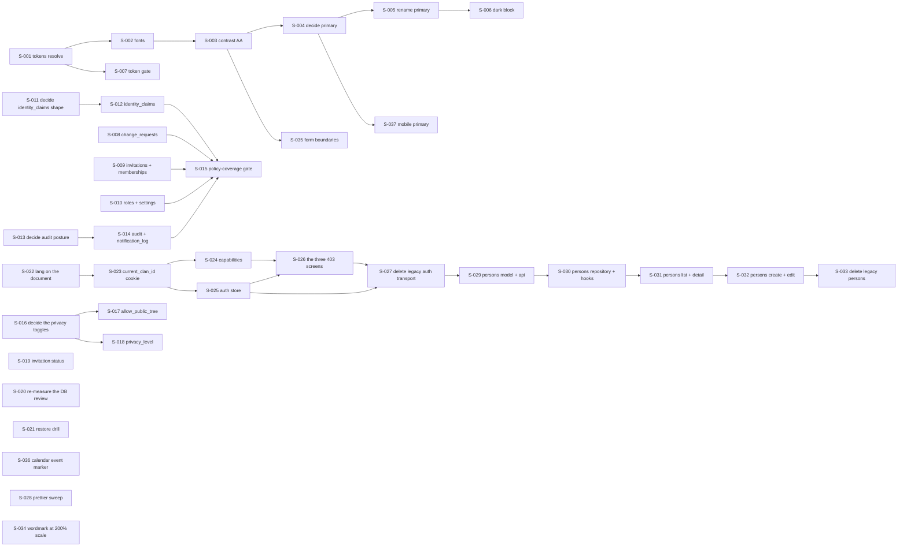

# Seed issue tracker

Scheduled work, decomposed. [`../.claude/rules/seeds.md`](../.claude/rules/seeds.md) is the
authority on what a seed is, what fields it carries, and why. This file is the tracker and does not
restate that rule.

**This file may be cited, and it is the only tracker.** It holds scheduled work as seeds, items owed
with an owner and an unmet trigger, and claims not verified. [`roadmap.md`](roadmap.md) holds the
milestone order and no work.

**This file decides nothing.** Every seed points at the ADR, spec, contract, or source file that
owns its subject. Where a seed and its owner disagree, the seed is the bug.

**Opened 2026-08-13** with 33 seeds, 0 done, 12 open, and 21 blocked.

**Re-taken 2026-08-13, after S-001 and S-002 landed: 34 seeds, 2 done, 14 open, and 18 blocked.**
All four moved, and here is each one:

- **Seeds, 33 to 34.** S-002 opened S-034 while verifying its own work.
- **Done, 0 to 2.** S-001 and S-002.
- **Open, 12 to 14.** S-003, S-007, and S-034 became open. S-001 and S-002 left for `done`.
- **Blocked, 21 to 18.** S-002, S-003, and S-007 left it. Nothing became blocked.

**Re-taken again 2026-08-13, after S-034 landed: 34 seeds, 3 done, 13 open, and 18 blocked.** Two of
the four moved:

- **Done, 2 to 3.** S-034.
- **Open, 14 to 13.** S-034 left for `done`. Nothing became open, because S-034 unblocked nothing.
- **Seeds** stayed 34 and **blocked** stayed 18.

**Re-taken again 2026-08-13, after S-003 landed: 36 seeds, 4 done, 15 open, and 17 blocked.** All
four moved:

- **Seeds, 34 to 36.** S-003 opened S-035 and S-036 while verifying its own work, the same way S-002
  opened S-034.
- **Done, 3 to 4.** S-003.
- **Open, 13 to 15.** S-004 became open, because S-003 was its only blocker. S-035 and S-036 arrived
  open. S-003 left for `done`. Net plus two.
- **Blocked, 18 to 17.** S-004 left it. Nothing became blocked.

**Re-taken again 2026-08-14, after S-004 landed: 37 seeds, 5 done, 16 open, and 16 blocked.** All
four moved:

- **Seeds, 36 to 37.** S-004 opened S-037, the mobile half of its own decision, the same way S-002
  opened S-034 and S-003 opened S-035 and S-036.
- **Done, 4 to 5.** S-004.
- **Open, 15 to 16.** S-005 became open, because S-004 was its only blocker. S-037 arrived open.
  S-004 left for `done`. Net plus one.
- **Blocked, 17 to 16.** S-005 left it. Nothing became blocked.

The figures were taken by reading the board's own `Status` cell, with:

```bash
awk -F'|' '/^\| S-[0-9]/ {gsub(/^ +| +$/,"",$4); c[$4]++; n++} \
  END {printf "seeds: %d\n", n; for (k in c) printf "%s: %d\n", k, c[k]}' docs/SEEDS.md
```

**Re-take them that way rather than by adding one to the previous figures**, and say which of the
four moved. This file's first draft claimed 20 open and 13 blocked, and the board held 12 and 21.
Nothing checks this, which is why the command is written down here rather than remembered.

**The target these seeds run at is the maintainer's**, set the same day: **one real Vietnamese clan
uses the web app for real data.** Mobile M1 to M4 lands after, and only its device-walk unblock is on
the critical path.

## Where the work stands

**Front of the work: S-001 and S-002, both done as of 2026-08-13.** Nothing on a screen could be
verified until the semantic colour tokens resolved and the real typefaces loaded, which is the design
spec's own ordering at
[`superpowers/specs/2026-08-02-design-system-and-screens.md`](superpowers/specs/2026-08-02-design-system-and-screens.md)
§ 2.8.1, line 400: tokens first, then fonts, "because a fallback font changes every measurement".
They sat at the head of M0 and transitively blocked the rest of it. **S-003 is done as of 2026-08-13
too, and **S-004 closed on 2026-08-14 as ADR-041, so S-005 is now the front of the chain**, with
S-006 behind it.

**S-003 moved three token values and changed no pixel, and both halves of that matter.**
`muted-foreground`, `destructive`, and `input` now clear WCAG AA, each taking the value design spec
§ 2.1 already names for its role. The floor is now gated rather than conventional:
`web/src/app/contrast.test.ts` recomputes 30 pairs from `globals.css` in `pnpm test:unit`, which is
the shape spec § 5 `T-01` asks for. Recomputing found two failing pairs the seed did not name, so
**six pairs failed, not four**. But no screen
references any of the three tokens, so nothing on screen improved. Forms still draw their boundary
with `border-gray-300` at 1.47:1. That gap is S-035.

**S-002 opened S-034, and that is the honest cost of measuring something.** Verifying the fonts at
200% text scale, which the seed required, found that `/vi/login` and `/vi/register` scroll
horizontally at 320 px: the `FamilyRoots` wordmark is one unbreakable word in a `max-w-sm` column. It
fails design spec § 5 `T-04`, it is pre-existing, and the mandated font makes it worse rather than
causes it. The measurement is in the S-002 record and the fix was S-034, **done 2026-08-13**: both
wordmarks now carry a `<wbr>` break opportunity, so the mark spends a second line rather than the page
scrolling, and `web/e2e/text-scale.spec.ts` holds the condition at 320 px and 200% scale.

**S-003 withdrew a measurement S-001 recorded, and S-007 has to be rewritten around it.** Tailwind v4
emits an `@theme` variable only when a generated rule references it. So a token that no class in
`web/src` uses is absent from the built CSS, and a `color: var(--color-x)` probe returns the inherited
body colour instead of the value. Re-measured 2026-08-13 on `/vi/login`, in `next dev` and in a
production build: fifteen of the seventeen return `lab(8.11897 0.811279 -12.254)`, **which is the
exact value the S-001 record names as its negative control**. The two states are indistinguishable to
that probe, so the control pinned nothing and S-001's table of seventeen computed values cannot be
reproduced. **S-001's fix is intact**: each token reaches the browser with its declared hex as soon as
a class asks for it, confirmed from build output. What is withdrawn is the reading, not the repair.
The consequence lands on **S-007**, whose job is a gate for exactly this and whose `Sources` line
named that probe as the likely mechanism. Its seed body now carries the warning and two mechanisms
that do work.

**The widest thing open is S-022, and it is one structural edit.** It moves `<html>` and `<body>`
into the locale-aware layout. **It transitively blocks ten seeds**, every one of PR 1 and PR 2, so
nothing in M2 starts before it. Counted from the board's own `Blocked by` cells on 2026-08-13, not
estimated: S-023 through S-027 and S-029 through S-033.

**The most expensive open seed is S-005, and it is not the widest.** It repaints the product. ADR-041
decided on 2026-08-14 that primary is the green `#3E5C38`, that red becomes a four-token `heritage`
family, and that the page ground is one value, `#FBF8F1`. S-005 carries that into `web/src`.
**It transitively blocks one seed**, S-006. So its cost is in the rename rather than in the chain
behind it. **Width and cost are different measures**, and saying so here stops a reader ordering the
work by the wrong one.

**A sentence that stood here until 2026-08-14 was wrong, and it is worth knowing why nobody caught
it.** It said `bg-primary` "paints things red across the app today". Counted while closing S-004:
`bg-primary` appears **zero** times in `web/src`. What paints red is the indexed ramp, 78 times
across 20 files, `ring-primary-500` alone accounting for 28. The claim was plausible, cited the
right file, and named the wrong class. Grep for the class before you size a repaint.

**Read this before writing any isolation seed.** Six of the fourteen clan-owned tables carry a
row-level security policy, measured 2026-08-13 from `backend/migrations/versions/`. Two of the eight
uncovered tables **cannot take the policy shape the other six use**, and that is why S-011 and S-013
exist as decisions rather than as work: `identity_claims` has no `clan_id` column at all, and
`audit_logs.clan_id` is nullable on purpose. A policy copied from migration 027 onto either one
would read as protection and would either hide rows that belong to nobody or break the platform
audit trail.

**Three claims in the files this tracker replaces were already wrong when it was written, and that is
why the rule exists.** Both `roadmap.md` and `work-register.md` read "Last updated: 2026-08-03".
Measured 2026-08-13:

| The old file said | The tree said |
|---|---|
| `roadmap.md:127` listed audit `ip_address`/`user_agent` as dormant | `backend/app/models/audit_log.py:36-37` declares both, `backend/app/infrastructure/event_dispatcher.py:87` writes them |
| `README.md:56` called row-level security an "inert pilot" on documents | Migrations `027`, `028`, and `029` extended it to `events`, `branches`, `parent_child`, `marriages`, and `persons` |
| `work-register.md:31` said Flutter 3.44.8 was installed locally | `which flutter` and `which dart` both return nothing on this machine, 2026-08-13 |

The third is in [Not verified](#not-verified) rather than repaired, because a dated claim about
another machine is not this repository's to correct.

**Where `work-register.md` went, for a reader arriving from an older commit.** It was deleted on
2026-08-13. Its § 1.2 owner actions and § 2.2 mobile blockers became rows in
[Owed](#owed-with-an-owner-and-a-trigger). Its § 3 open gaps became seeds S-019, S-022, and S-028
plus rows in [Not verified](#not-verified). Its § 4 landed table is not carried forward, because
`git log` holds it.

**Ten pointers at the deleted file were left in place on purpose, across six files.** Counted
2026-08-13 with `git grep -n "work-register"`, excluding this file and `roadmap.md`, both of which
mention it only to record that it is gone:

| File | Lines | Why it was left |
|---|---|---|
| `decisions/034-mobile-riverpod-rebuild.md` | 82 | An ADR is a dated record of what was true when it was accepted |
| `decisions/040-metrics-token-floor-and-throttle.md` | 4, 11 | Same. Line 4 says which section it closed, which is the evidence |
| `superpowers/plans/2026-08-02-mobile-m0-spine.md` | 6036, 6102 | A finished plan records the files its own increment edited |
| `superpowers/plans/2026-08-02-web-spine.md` | 3071, 3077, 3114 | Same. Line 3077 records a defect in that plan's own file list |
| `superpowers/specs/2026-08-02-mobile-architecture-design.md` | 405 | Same |
| `mobile/lib/features/auth/presentation/pending_approval_page.dart` | 11 | The only one that is not a historical record. It is in the [Owed](#owed-with-an-owner-and-a-trigger) register with its reason |

**Editing any of the first nine to match today would destroy the evidence it exists to hold.** A
dated record edited to stay current stops being a record. The table above is what a reader arriving
from one of those pointers needs, which is why it names the lines rather than saying "several".

## How to read the chain

A seed with `Blocked by: none` is actionable today. Start there. When a seed is done, read its
`Unblocks` line and mark those seeds `open`.

**The graph is exactly the `Blocked by` relation and holds nothing else.** It carried one extra edge
in its first draft, S-001 to S-022, expressing a preference about which order to work in rather than
a dependency. That edge was removed: a graph that mixes hard blocks with soft preferences cannot be
read for the one thing it is for. Where a preference exists, the seed's own body says so, and S-022
does.



## Status board

| ID | Title | Status | Blocked by |
|---|---|---|---|
| S-001 | Make the seventeen dead semantic colour tokens resolve | done | none |
| S-002 | Load the two mandated typefaces and reference them | done | S-001, done |
| S-003 | Bring the four failing colour pairs to WCAG AA | done | S-002, done |
| S-004 | Decide the primary colour and the heritage family, in ADR-041 | done | S-003, done |
| S-005 | Rename primary to the decided value across `web/src` | open | S-004, done |
| S-006 | Add the `.dark` block, and settle which dark mechanism wins | blocked | S-005 |
| S-007 | Gate: fail the build when an `@theme` token cannot resolve | open | S-001, done |
| S-008 | Enable clan-isolation RLS on `change_requests` | open | none |
| S-009 | Enable clan-isolation RLS on `clan_invitations` and `clan_memberships` | open | none |
| S-010 | Enable clan-isolation RLS on `user_clan_roles` and `clan_settings` | open | none |
| S-011 | Decide the policy shape for `identity_claims`, which has no `clan_id`, in ADR-042 | open | none |
| S-012 | Enable RLS on `identity_claims` in the shape S-011 decides | blocked | S-011 |
| S-013 | Decide the RLS posture for `audit_logs` and `notification_log`, in ADR-043 | open | none |
| S-014 | Enable RLS on the two tables S-013 decides for | blocked | S-013 |
| S-015 | Gate: fail when a clan-owned table carries no policy | blocked | S-008, S-009, S-010, S-012, S-014 |
| S-016 | Decide whether v1 ships `allow_public_tree` and `privacy_level` at all, in ADR-044 | open | none |
| S-017 | Enforce or hide `allow_public_tree` | blocked | S-016 |
| S-018 | Enforce or hide `privacy_level` | blocked | S-016 |
| S-019 | Make a clan invitation's reported status agree with its `expires_at` | open | none |
| S-020 | Re-measure the four dormant database-review items against the code | open | none |
| S-021 | Run the restore drill against a real dump, and date the result | open | none |
| S-022 | Move `<html>` and `<body>` into the locale-aware layout | open | none |
| S-023 | Land the `current_clan_id` cookie and the server request context on it | blocked | S-022 |
| S-024 | Derive capabilities per clan role, in `domain/capability` | blocked | S-023 |
| S-025 | Rewrite the auth store around the clan context | blocked | S-023 |
| S-026 | Land the three blocked-state screens | blocked | S-024, S-025 |
| S-027 | Delete the legacy auth transport and the `axios` dependency | blocked | S-025, S-026 |
| S-028 | Clear the 112-file prettier drift in one sweep | open | none |
| S-029 | Land `features/persons` model and api against the frozen contract | blocked | S-027 |
| S-030 | Land the persons repository, query keys, and hooks | blocked | S-029 |
| S-031 | Land the persons list and detail screens | blocked | S-030 |
| S-032 | Land the persons create and edit forms, with `409 stale_write` | blocked | S-031 |
| S-033 | Delete the legacy persons code | blocked | S-032 |
| S-034 | Make the `FamilyRoots` wordmark survive 200% text scale at 320 px | done | none |
| S-035 | Draw form boundaries with `border-input` rather than `border-gray-300` | open | S-003, done |
| S-036 | Give the calendar's event marker a channel other than gold | open | none |
| S-037 | Move the mobile `ArborTokens` primary onto ADR-041's leaf green | open | none |

**Fourteen seeds carry `Blocked by: none`, and that is a claim about today.** They are S-001, S-008,
S-009, S-010, S-011, S-013, S-016, S-019, S-020, S-021, S-022, S-028, S-034, and S-036. Each was read
on 2026-08-13, and for each one no second decision from the maintainer stands between an agent and its
end state. **S-001 and S-034 are done**, so twelve of the fourteen are open. **S-004, S-007, and
S-035 are also open** without carrying `none`: each had its only blocker satisfied rather than never
having one. **Four seeds are themselves the decision**: S-011, S-013, and S-016 produce an
ADR and nothing else, and S-020 produces seeds and register rows. Those are actionable because
writing the decision down is the work. S-004 is the fourth decision seed, and as of 2026-08-13 it is
open rather than blocked, because S-003 landed.

**Two of the fourteen carry a warning that they may split.** S-009 and S-010 each depend on which
database role a read runs as, and if that read happens before a clan is selected then the seed
contains a decision and must be split. That is the normal outcome the rule describes, and both seed
bodies say so rather than leaving it to be found.

---

## M0. Make the surface verifiable

The design spec fixed its own repair order at
[`superpowers/specs/2026-08-02-design-system-and-screens.md`](superpowers/specs/2026-08-02-design-system-and-screens.md)
lines 399 to 403: tokens first, "because until the semantic tokens resolve, nothing else can be
verified on screen"; then fonts, "because a fallback font changes every measurement"; then contrast;
then the primary rename; then dark mode last, because "a dark palette built on a broken light one
cannot be checked". S-001 to S-007 follow that order. **S-034 sits at the end of this section and
breaks the numbering on purpose**: it was opened on 2026-08-13 by S-002, and a seed ID is allocated
when the seed is written and never renumbered, so it carries 034 while belonging to M0's subject.

**Read `.claude/rules/tailwind.md` before the spec, where the two disagree.** The rule was measured
2026-08-13 and the spec § 2.8.1 was measured 2026-08-03. The rule is newer on three points and all
three matter here: the count of dead tokens was **seventeen** and not thirteen, the mandated
typefaces **are** already in the repository, and S-001 and S-002 closed the token and font defects
later on 2026-08-13. The rule's § 8 is now the record of how the fonts are wired and of the five
traps that setup carries.
The spec's § 2.8.1 A is a dated measurement and is left as the record of that date, so it still
reads as if the tokens were dead. **Do not read § 2.8.1 A as current.** Its § 2.8.1 D and F, on the
primary conflict and the contrast failures, are still true.

## S-001. Make the seventeen dead semantic colour tokens resolve

**Status:** done, 2026-08-13 · **Blocked by:** none · **Unblocks:** S-002, S-007

**The defect is systematic, not a typo, which is why this is one seed and not seventeen.**
`web/src/app/globals.css:36-58` declares seventeen semantic colours in `@theme` in the form
`hsl(var(--x))`. `web/src/app/globals.css:124-147` then defines those variables in `:root` as **hex
strings**, for example `--border: #e5e7eb`. `hsl()` takes hue, saturation, and lightness, so
`hsl(#e5e7eb)` is invalid CSS and the browser drops the whole declaration. The shadcn convention
this was copied from stores bare channels such as `45 33% 95%`, not hex.

**Two of the seventeen are worse than dead.** Neither `--secondary` nor `--secondary-foreground` is
defined anywhere in the file, so `--color-secondary` at `:42` and `--color-secondary-foreground` at
`:43` both resolve against nothing. This seed said "one" when it was written, and the count was
corrected on 2026-08-13 by reading `:root` at `globals.css:124-147` at the parent commit `53f121d`:
it defines fifteen of the seventeen, and both `secondary` names are missing.

**The count is seventeen and two sources say thirteen.** `.claude/rules/tailwind.md` § 2 counted
seventeen on 2026-08-13 and names them. Design spec § 2.8.1 A says thirteen, because it probed
thirteen: it omits `destructive-foreground`, `accent-foreground`, `popover-foreground`, and
`card-foreground`, each of which carries the same `hsl(var(--x))` form. **Take seventeen.** The four
the spec missed are `*-foreground` variants, which is exactly where a partial fix would leave text
unreadable on a repaired background.

**End state.** All seventeen names in `@theme` hold a value the browser accepts, and probing each
one in Chromium returns **exactly the value the file declares for that name**, with the seventeen
no longer collapsing to one identical value. The spec gives the probe at
`design-system-and-screens.md:405-409`: set `color: hsl(var(--<name>))` on an element and read
`getComputedStyle`. All of them returning one identical value is the signature of the current
failure. `--secondary` either gains a value or the token is deleted, and the seed says which.

**This end state said "seventeen different computed values" and that was not reachable.** Counted
from `globals.css:124-147` at the parent commit `53f121d`, the fifteen defined tokens hold only ten
distinct hex values: `#ffffff` is shared by `card`, `popover`, and `destructive-foreground`;
`#1a1a1a` by `foreground`, `card-foreground`, and `popover-foreground`; `#e5e7eb` by `border` and
`input`. Seventeen distinct results would therefore require repainting, which this seed's own
**Out of scope** forbids. The corrected assertion above is what the spec's probe was actually for,
and it is stronger: it pins each token to its own declared value rather than only counting them.

**Verification.** The full web gate in `web/CLAUDE.md`. Plus the browser probe above, re-run, with
the seventeen computed values recorded in the commit message. **The gate does not check this**: no
command in it reads a computed colour, so the probe is the evidence and the gate is only proof
nothing else broke. **Run the probe against the parent commit as a negative control**, and record
that it returns one identical value for all seventeen.

**What was done, 2026-08-13.** The `hsl(var(--x))` indirection was removed rather than repaired:
each of the seventeen now carries its hex literal directly in `@theme`, and the duplicate `:root`
block was deleted. Converting the hex values to the bare HSL channels shadcn expects was rejected,
because rounding to HSL changes the value and this seed may not change a value.
`.claude/rules/tailwind.md` § 2 already told a new token to put its value straight in `@theme`, so
this makes the existing seventeen follow the rule the repository had already written.

`--secondary` **gained a value**, and so did `--secondary-foreground`: `#7a6248` and `#ffffff`,
taken from the `secondary` row of design spec § 2.1 at `design-system-and-screens.md:101`. Deleting
the two tokens was the alternative. Adopting the spec value was chosen because the spec is the named
authority for this file, no source file uses `bg-secondary` today so nothing changes on screen, and
S-004 will need the token to exist. `#ffffff` on `#7a6248` computes to 5.72:1, which clears WCAG AA
for normal text, so this adds no work to S-003. No other token's value changed.

**Measured 2026-08-13**, Chromium via Playwright, `next dev` on `127.0.0.1:3210`, page `/vi/login`:

| Token | Computed | Token | Computed |
|---|---|---|---|
| `border` | `rgb(229, 231, 235)` | `accent` | `rgb(254, 243, 199)` |
| `input` | `rgb(229, 231, 235)` | `accent-foreground` | `rgb(146, 64, 14)` |
| `ring` | `rgb(196, 30, 58)` | `destructive` | `rgb(239, 68, 68)` |
| `background` | `rgb(248, 244, 236)` | `destructive-foreground` | `rgb(255, 255, 255)` |
| `foreground` | `rgb(26, 26, 26)` | `popover` | `rgb(255, 255, 255)` |
| `secondary` | `rgb(122, 98, 72)` | `popover-foreground` | `rgb(26, 26, 26)` |
| `secondary-foreground` | `rgb(255, 255, 255)` | `card` | `rgb(255, 255, 255)` |
| `muted` | `rgb(243, 244, 246)` | `card-foreground` | `rgb(26, 26, 26)` |
| `muted-foreground` | `rgb(107, 114, 128)` | | |

Eleven distinct values across the seventeen, which matches the eleven the file declares. The
negative control was run on the same server with the fix stashed: all seventeen returned
`lab(8.11897 0.811279 -12.254)`, the inherited body colour, and the probe exited non-zero.

> **Corrected 2026-08-13 by S-003. The table above could not be reproduced, and the probe it was
> taken with cannot decide the question it was asked.** Tailwind v4 emits an `@theme` variable only
> when a generated rule references it, so a token no class in `web/src` uses is absent from the
> built CSS and `color: var(--color-x)` falls back to the inherited colour. Re-measured on
> `/vi/login` in `next dev` on `:3210` and again in a production build: only `border` and
> `foreground` return their declared hex, and the other fifteen return
> `lab(8.11897 0.811279 -12.254)`. `border` survives because the `*` rule applies `border-border`,
> and `foreground` because an emitted rule sets `accent-color` from it.
>
> **That is the same value this record names as the negative control**, so a passing probe and a
> failing one are indistinguishable, and the control pinned nothing. What S-001 actually fixed is
> real and still holds: the seventeen carry hex literals in `@theme`, and each reaches the browser
> with its declared value as soon as a class asks for it, verified by build output on 2026-08-13.
> **What is withdrawn is the measurement, not the fix.** Check a token by reading `globals.css`, as
> `web/src/app/contrast.test.ts` does. `.claude/rules/tailwind.md` § 2 carries the full account, and
> S-007 carries the warning for whoever builds the gate.

**What was checked in a browser, and what was not.** Only `/vi/login` was opened. Every other route
redirects to it without a Supabase session, so no dashboard, tree, or member screen was seen. On
`/vi/login`, full-page screenshots before and after the change are byte-identical
(SHA-256 `a812e073d8f9…`), and the four elements that paint a border kept the same computed
`border-color`, because each sets its own `border-gray-*` class. That matters because
`* { @apply border-border }` at `globals.css:143` was dead and is now live.

**Sources.** `web/src/app/globals.css:36-58` for the `@theme` block, `:42` for `--secondary`,
`:124-147` for the `:root` hex values; `.claude/rules/tailwind.md` § 2 for the count of seventeen
and the dead-class list; `superpowers/specs/2026-08-02-design-system-and-screens.md` § 2.8.1 A for
the browser measurement and `:405-409` for the probe.

**Out of scope.** The primary colour conflict, which is S-004, and the rename behind it. Contrast
ratios, which are S-003. Dark mode, which is S-006. Changing which value a token holds beyond making
it resolve: this seed makes the existing intent work, and repainting is a decision.

---

## S-002. Load the two mandated typefaces and reference them

**Status:** done, 2026-08-13 · **Blocked by:** S-001, done 2026-08-13 · **Unblocks:** S-003

**Three separate font defects, and the app renders in none of the fonts anyone chose.**

| # | What happens | Where |
|---|---|---|
| 1 | `Inter` is loaded through `next/font/google` with the Vietnamese subset and exposed as `--font-inter`. Nothing reads `--font-inter` | `web/src/app/[locale]/layout.tsx:10` |
| 2 | `globals.css` hardcodes `font-family: 'Inter', 'Noto Sans', sans-serif` on `body`. A literal family name does not match the obfuscated name `next/font` generates, so the subsetted file is downloaded and discarded | `web/src/app/globals.css:157` |
| 3 | `Playfair Display` is named for headings and never loaded at all: no `next/font` call, no `@font-face`, no dependency | `web/src/app/globals.css:160` |

**Neither font is the mandated font.** The Arbor Heritage mandate is **Plus Jakarta Sans** for
headings and **Manrope** for body. Design spec § 2.8.1 C says neither string appears anywhere in the
repository. **That was true on 2026-08-03 and is not true now**: both files are committed at
`mobile/assets/fonts/PlusJakartaSans.ttf` and `mobile/assets/fonts/Manrope.ttf` and declared in
`mobile/pubspec.yaml`, recorded in `.claude/rules/tailwind.md` § 8. So the web app can load the same
files the mobile app already ships, and the two clients cannot drift.

**This is blocked by S-001 rather than independent, and the reason is measurement.** A fallback font
changes every type measurement in spec § 2.3 and § 6, so contrast and layout checked against the
wrong font have to be re-checked.

**End state.** Plus Jakarta Sans and Manrope load through `next/font/local` from files in the
repository, are exposed as CSS variables, and are referenced by `--font-sans` and `--font-serif` in
`@theme`. No literal family name remains in `globals.css`. The computed `font-family` on `body` and
on an `h1`, read in a browser, names the loaded font and not a system fallback. Vietnamese diacritic
coverage is confirmed by rendering a full-diacritic string, and the seed records which string.

**Verification.** The full web gate. Plus a browser reading of computed `font-family` on `body` and
`h1`, and a screenshot of a full-diacritic Vietnamese string at 200% text scale, which is
requirement `T-04`. State plainly what was and was not checked in a browser.

**Sources.** `web/src/app/[locale]/layout.tsx:10`; `web/src/app/globals.css:60-62` for the `@theme`
font tokens, `:157` and `:160` for the hardcoded families; `.claude/rules/tailwind.md` § 8 for all
three defects and for the correction to the spec; `mobile/pubspec.yaml` for the declared font files;
`superpowers/specs/2026-08-02-design-system-and-screens.md` § 2.3 for the type scale.

**Three of those line numbers had moved by the time the seed was worked**, because S-001 rewrote the
same file in between. Read at the parent commit `bf661c5` on 2026-08-13, the `@theme` font tokens
were `globals.css:66-68` and the two hardcoded families were `:147` and `:150`. The seed's numbers
were taken before S-001 landed. Nothing else in the seed changed, and the defect was where the seed
said it was.

**Out of scope.** `web/src/app/fonts/GeistVF.woff` and `GeistMonoVF.woff`. They are project-template
leftovers that nothing references, and `.claude/rules/tailwind.md` § 8 says not to wire them up.
Deleting them is its own small change and needs no seed.

**What was done, 2026-08-13.** Both families load through `next/font/local` in
`web/src/app/layout.tsx`, which is the layout that renders `<html>`, so the two variables sit on the
document element. `globals.css` reads them through `@theme`: `--font-serif` carries Plus Jakarta Sans
and `--font-sans` carries Manrope, and the `body` and `h1`-to-`h6` rules in `@layer base` now
`@apply font-sans` and `@apply font-serif`. The dead `next/font/google` call for `Inter` and its
unread `--font-inter` variable are deleted. No family name is spelled anywhere in `globals.css`:
`--font-mono` also lost its `JetBrains Mono` and `Menlo` names, which no file loads, and each font
token's fallbacks are now generic keywords only.

**The files are copies, and a test holds them to the originals.**
`web/src/app/fonts/PlusJakartaSans.ttf` and `Manrope.ttf` are byte-for-byte copies of
`mobile/assets/fonts/`, with `OFL.txt` beside them because the licence requires it.
`web/src/app/fonts/fonts-in-sync-with-mobile.test.ts` compares SHA-256 hashes in the unit gate.
Pointing `next/font/local` at the mobile path instead was rejected: it builds here and in CI, but it
depends on the deployment uploading files outside the project root, which is a Vercel setting nobody
in this repository can read. The seed's "the two clients cannot drift" is therefore held by the test
rather than by a shared path.

**Both files are variable fonts, and that changed the wiring.** Read with `fontTools` on 2026-08-13:
each carries a `wght` axis from 200 to 800, and Manrope's name table reads `Manrope ExtraLight` with
its default instance at 200. So both faces declare `weight: '200 800'`. Without the range the browser
paints body text at the ExtraLight default. This is the trap most likely to be reintroduced, and it
is now in `.claude/rules/tailwind.md` § 8.

**Measured 2026-08-13**, Chromium via Playwright, against a **production** build (`pnpm build` then
`pnpm start`), page `/vi/login`:

| Read | Value |
|---|---|
| computed `font-family` on `body` | `manrope, "manrope Fallback", system-ui, sans-serif` |
| computed `font-family` on the `h1` | `plusJakartaSans, "plusJakartaSans Fallback", system-ui, sans-serif` |
| `document.fonts` entries | `plusJakartaSans: loaded, 200 800` and `manrope: loaded, 200 800` |
| `document.fonts.check` on each first family | `true` for both |

**The family name is generated from the JavaScript constant**, not from the file or the family in the
font, so the readable name is `manrope` rather than `Manrope`. **Defect row 2 above calls that name
"obfuscated" and it is not**, at least not under the Turbopack build this repo uses: it is readable
and it tracks the constant. The row is left as written because it is a dated reading, and the defect
it describes was real. Only the word is wrong. `document.fonts.check` against the
whole stack returns `false`, because `next/font` also registers an unused metric-adjusted
`… Fallback` face and `check` is false for any list holding an unloaded face. Both facts cost a test
rewrite and are recorded in `web/e2e/fonts.spec.ts` so the next reader does not pay for them again.

**Vietnamese coverage, checked at source rather than assumed.** `fontTools` reports 721 glyphs in
Plus Jakarta Sans and 678 in Manrope, and neither is missing any character of the string the seed
promised to record:

```
Nguyễn Trần Đỗ Phạm Hưng Việt ạảãăắằẳẵặâấầẩẫậđêếềểễệôốồổỗộơớờởỡợưứừửữựỳỵỷỹý
```

plus its uppercase forms `ÀÁÂÃÈÉÊÌÍÒÓÔÕÙÚĂĐĨŨƠƯ`. Rendered at 200% text scale in Chromium at 320 px
width, every mark paints in both the 400 and 700 weights with no missing glyph box and no clipped
tone mark.

**The negative controls were run, and both halves of the fix are pinned.** Three controls, in the
order they were run:

| The fix removed | What happened |
|---|---|
| body rule back to `font-family: 'Inter', 'Noto Sans', sans-serif` | 3 of the 4 tests then in `web/e2e/fonts.spec.ts` failed, reporting the received value `Inter, "Noto Sans", sans-serif`. The heading test stayed green, correctly: only the body rule was touched |
| `h1`-to-`h6` rule back to `font-family: 'Playfair Display', 'Noto Serif', serif` | **all 4 passed**, which is a hole in the test rather than a passing fix |
| `--font-serif` back to `Playfair Display, Noto Serif, Georgia, serif` | the 3 heading assertions failed and the 2 body ones stayed green |
| one byte appended to `web/src/app/fonts/Manrope.ttf` | the drift test failed and named the file |

**The second control is why there are five tests and not four.** The utilities layer beats the base
layer, so every heading in `web/src` carrying `font-serif` reads the token directly and renders
correctly even when the base rule names a dead font. A fifth test injects a heading with no class,
which is the only way to reach the base rule. It fails under the third control above, so the base
rule is now pinned too.

**What was checked in a browser, and what was not.** Only `/vi/login` and `/vi/register` were opened,
in Chromium and in the Pixel 5 viewport. Every other route redirects to login without a Supabase
session, so no dashboard, tree, or member screen was seen in either font. Firefox and Safari were
not opened at all. The e2e suite reads `/vi/login` only.

**This seed found a T-04 failure that it did not fix, and S-034 owns it.** At 320 px width with the
root font size at 200%, `/vi/login` and `/vi/register` both scroll horizontally: page `scrollWidth`
382 against a `clientWidth` of 320, measured against the production build on 2026-08-13. The
overflowing box is the `FamilyRoots` wordmark, `h1.font-serif.text-3xl`, at `clientWidth` 256 and
`scrollWidth` 350. **It is pre-existing and this change makes it worse.** Re-measured on the same
page with the two tokens forced back to the old literal names, so the browser paints a system
fallback, the page `scrollWidth` is 342 rather than 382: Plus Jakarta Sans is wider than the fallback
at that size. Fixing it is layout work on a wordmark, not font work, so it is its own seed.

**The font payload grew, and no seed owns that.** The production build emits both files whole,
176 KB and 165 KB, measured in `.next/static/media/` on 2026-08-13. `next/font/local` neither
subsets nor converts. Subsetting to woff2 would cut most of the 341 KB, and it is an
[Owed](#owed-with-an-owner-and-a-trigger) row rather than a seed: a derived file cannot be
hash-compared to the mobile original, so the drift test needs a different mechanism first, and that
is a decision.

---

## S-003. Bring the four failing colour pairs to WCAG AA

**Status:** done, 2026-08-13 · **Blocked by:** S-002, done 2026-08-13 · **Unblocks:** S-004, S-035

**Four real failures, computed rather than assumed.** Design spec § 2.8.1 F, at
`design-system-and-screens.md:366-378`, holds ratios computed from the hex values in the file:

| Pair | Ratio | Why it matters |
|---|---|---|
| `muted-foreground #6b7280` on `background #f8f4ec` | 4.41 | The same helper text **passes** on a card at 4.83 and fails on the page. A reviewer checking one screen calls it fine |
| `destructive-foreground #ffffff` on `destructive #ef4444` | 3.76 | The white label on a red confirm button |
| `destructive #ef4444` on white | 3.76 | Red error text |
| `gold-500 #d4af37` on white | 2.10 | Unusable for text at any size |

**The destructive path is the one that matters most and it is the least legible thing in the
palette.** Spec § 2.8.1 F states the reason in full: a 78-year-old trưởng họ most needs to read what
is about to happen. The spec also names a value that clears 4.5, `#b91c1c` or darker.

**Gold is ornament, and nothing stops someone reaching for `text-gold-500`.** Spec § 2.1 already
treats gold as ornament. The seed's job is to make that enforceable rather than conventional.

**End state.** Every foreground and background pair the app actually uses clears 4.5 to 1 for normal
text, or 3 to 1 for large text and non-text boundaries, and the ratios are recomputed from the values
in the file after S-001 and S-002 landed rather than carried forward from 2026-08-03. `muted-foreground`
clears on **both** the card and the page background. Gold is unusable as a text colour, either by
being removed from the text-colour scale or by a lint rule, and the seed says which. The `border`
token at 1.13 gains a value that clears 3 to 1 where it is used on an input, which spec § 2.8.1 F
identifies as the one place a boundary is required.

**Verification.** The full web gate. Plus the ratio table recomputed and recorded in the commit
message, with the date. A ratio is a measurement, so a number carried forward from the spec is not
evidence about the tree after two token seeds have landed.

**What was done, 2026-08-13.** Three token values moved, and each moved to a value design spec § 2.1
already names for that role rather than to one invented here:

| Token | Was | Is | Spec § 2.1 role | `design-system-and-screens.md` |
|---|---|---|---|---|
| `muted-foreground` | `#6b7280` | `#6e6653` | `on-surface-muted`, "Tertiary text, timestamps, helper text" | `:89` |
| `destructive` | `#ef4444` | `#a32218` | `danger` | `:124` |

`destructive` was taken from spec § 2.1 rather than from § 2.8.1 F's floor of `#b91c1c`, which also
clears 4.5 at 6.47. The spec value is the one the S-005 rename will land on, so taking it now avoids
moving the token twice. **It is one digit from `heritage` `#a3182f`**, which is the ceremonial red
for the thủy tổ marker and giỗ and is a separate family on purpose per § 9-J1, so `globals.css`
carries a comment saying do not swap them.

**`input` gained `#8a8072`, and `border` deliberately did not move.** The seed's end state names the
`border` token, and that is the one place this record departs from it. `globals.css` applies
`border-border` to `*`, so darkening `border` draws a visible 1px line around every element, which
the Arbor Heritage no-line rule forbids (`.claude/rules/tailwind.md` § 5). Spec § 2.8.1 F agrees that
`border` at 1.13 "is *not* a defect by itself" and locates the requirement on inputs, and `input` is
the token an input's boundary reads. So `input` is the one held to 3:1. **The value is derived, not
quoted:** spec § 2.1 offers no bordered-input colour because it specifies a filled field instead,
`surface-container-low #F4EFE4`. § 2.8.1 F allows either branch; this seed took the darker border as
the smaller change, and if S-005 adopts the fill then `input` goes away.

**Gold is banned by a lint rule, which is the answer to the seed's "say which".** Removing gold from
the text scale is not available: Tailwind v4 generates `text-gold-500`, `bg-gold-500`, and
`border-gold-500` from the single `--color-gold-500` variable, so trimming the text utility would
also remove the fills § 2.1 wants. `web/eslint.config.mjs` therefore carries a `no-restricted-syntax`
pair matching `text-gold-` in any string literal, so `cn('text-gold-500')` is caught as well as a
`className` attribute. It cannot see a class assembled at runtime. `bg-gold-*` and `border-gold-*`
stay legal. The ramp does not clear 4.5 for text until `gold-800` at 6.22; for genuine gold text
§ 2.1 names `gilt #8a6a16`, which arrives with S-005. **The rule found exactly one violation**,
`components/family-tree/MemberNode.tsx:36`, a `text-gold-500` on a 👑 glyph. It was removed: a colour
emoji font supplies its own colours and ignores `color`, so the class had never painted anything, and
the crown already carries the founder state as a glyph, which is what T-06 asks for.

**Six pairs failed, not four, and eleven cases failed.** Recomputed 2026-08-13 from
`globals.css` at the parent commit `268e61e`, which is after S-001 and S-002 landed. The seed's own
table came from the spec and was one commit stale. The two the seed did not name:

| Pair | Ratio | Why it was missed |
|---|---|---|
| `muted-foreground #6b7280` on `muted #f3f4f6` | 4.39 | The spec table pairs `muted-foreground` with `card` and `background` but never with `muted`, which is the surface named after it. It is the worst of the three |
| `destructive #ef4444` on `cream #fdfbf7` | 3.64 | `body` paints `cream`, not `background`. The spec measured `background` |

`cream` is why the `muted-foreground` defect never showed on screen: at 4.68 it passes on the ground
`body` actually paints, and fails only on the two tokens no screen uses. **Counted 33 pairs, 11
failing before and 0 after.** The full before-and-after table is in the commit message.

**`web/src/app/contrast.test.ts` is the gate, and this is the requirement's own shape.** T-01 asks
for "a token-pair audit script over the approved pairs list, not spot-checking screenshots"
(`design-system-and-screens.md:767`). The test parses the hex values out of `globals.css` and
computes 30 asserted pairs, 4.5:1 for text and 3:1 for `input` and `ring` under T-02. It throws
rather than skipping when a token is renamed, because a pair table that silently resolves to nothing
passes every assertion. **Negative control run 2026-08-13:** with the three old values restored,
`pnpm vitest run --project unit src/app/contrast.test.ts` failed 11 of 31, and they were the 11 the
recomputation named. With the new values, 31 pass.

**The test reads the stylesheet, and that is a finding, not a shortcut.** Tailwind v4 emits an
`@theme` variable only when a generated rule references it. No screen uses these tokens, so they are
**absent from the built CSS**, and a `var(--color-x)` probe returns the inherited body colour
instead. Measured 2026-08-13 on `/vi/login`, in `next dev` on `:3210` and in a production build:
only `border` and `foreground` return their declared hex; the other fifteen return
`lab(8.11897 0.811279 -12.254)`, the body colour. **That is the same value S-001 recorded as its
negative control**, so the probe cannot tell "no class asks for it yet" from "the declaration was
dropped". See the correction added to the S-001 record below, and the warning added to S-007.

**What was checked in a browser, and what was not.** The values were confirmed to reach a real
build, by adding a throwaway file carrying `text-muted-foreground bg-destructive border-input`,
running `pnpm build`, and reading the output: `--color-muted-foreground:#6e6653`,
`--color-destructive:#a32218`, and `--color-input:#8a8072`, each with its
`.class{…var(--color-x)}` rule. The file was deleted in the same step. **No screen was inspected
for a visual change, because there is nothing to see:** counted across `web/src` excluding
`globals.css`, zero files reference `muted-foreground`, `bg-muted`, `bg-background`, `border-input`,
`ring-ring`, or any `*-destructive` class. **So this seed changed no pixel.** Moving the screens onto
the tokens is S-035, and the gold event dot is S-036.

**Sources.** `superpowers/specs/2026-08-02-design-system-and-screens.md:366-378` for the ratio table
and `:385-397` for the destructive, gold, and border reasoning; `:767-768` for `T-01` and `T-02`, and
`:772` for `T-06`, the rule that colour is never the only channel; `:89` for `on-surface-muted`,
`:114-115` for `gilt` and `gilt-decor`, and `:124` for `danger`.

**The `globals.css` citation on this line was wrong, and it is worth saying how.** It read
`web/src/app/globals.css:124-147` "for the current values". Read 2026-08-13 at the parent commit
`268e61e`, lines 124 to 147 held `@layer base`, the `@utility text-balance` block, and the four
`:root` design tokens. **None of the seventeen semantic values was in that range**; they were in
`@theme` at `:42-64`, which is where S-001 put them. After this seed added comments they sit at
`:62-97`. The citation resolved to a real file and a real range, which is why nothing caught it, and
that is the failure mode `.claude/rules/evidence.md` names: a pointer that resolves is not a pointer
that holds the claim.

**Out of scope.** Dark-mode contrast, which cannot be computed until S-006 exists. The primary
colour itself, which S-004 decides. Auditing every screen: this seed fixes the token values, and a
screen that composes them wrongly is that screen's own defect.

---

## S-004. Decide the primary colour and the heritage family, in ADR-041

**Status:** done, 2026-08-14 · **Blocked by:** S-003, done 2026-08-13 · **Unblocks:** S-005, S-037

> **Closed 2026-08-14 by
> [`docs/decisions/041-primary-green-heritage-family-single-background.md`](decisions/041-primary-green-heritage-family-single-background.md).**
> The four questions were answered by the maintainer that day: primary is the leaf green `#3E5C38`;
> `heritage` becomes a four-token family; the page ground is the spec's `#FBF8F1`, so **neither** of
> the two values this seed asked between wins; and the rename lands in one change.
>
> **The ADR decides a fifth thing this seed did not ask, and S-005 cannot start without it.** The
> nine-entry `--color-primary-*` ramp is deleted rather than recoloured, because spec § 2.1
> publishes no nine-step green and an agent told only "rename primary to green" would have to invent
> eight values. The spec's tonal set replaces it, hover and pressed are derived by darkening (spec
> § 4.1 line 582), and `--color-ring` becomes `#1D1B16` rather than the new primary.
>
> **Two claims in the body below were measured false while closing this seed.** They are left
> standing, because a seed is a record of what was believed when it was written, and the corrections
> are here:
> - It says `bg-primary` "is used across the app". It is used **zero** times in `web/src`. The red
>   comes from the indexed ramp, 78 uses across 20 files.
> - It counts "two different values both called the background". There are **four** warm whites in
>   play once the other client is read: `#fdfbf7`, `#f8f4ec`, the spec's `#FBF8F1`, and mobile's
>   `#FDFCF7` at `mobile/lib/core/theme/tokens.dart:29`.
>
> **A third correction lands on the spec, not on this seed.** Spec § 9-J1 names two mobile theme
> files that ADR-034 deleted; `ls` finds neither on 2026-08-14. And spec § 2.1 claims the focus ring
> `#1D1B16` "guarantees ≥3:1 against every ground in the system, including `primary` and `heritage`
> fills". Measured 2026-08-14: 2.29 and 2.24. The ADR keeps the decision and explains what saves it.

**This is a decision seed, and it is here because the answer repaints the product.** One agent
cannot reach the end state without the maintainer, which is the rule's own test at
`.claude/rules/seeds.md`.

> **Line numbers in this seed were re-read 2026-08-13, while S-003 was being closed, and three
> claims below were repaired.** They described `globals.css` as it was **before** S-001 deleted the
> duplicate `:root` block, and S-003 then moved every line below the gold ramp by adding comments.
> The repairs are marked inline. The reasoning in this seed was not touched: the conflict it names is
> real and still unresolved. **Grep for the token rather than trusting a line number here.**

**Two sources disagree about what the primary colour is.** `web/src/app/globals.css:16` and the
`--color-primary` ramp make primary the red `#c41e3a`. Design spec § 2.1 makes primary the green
`#3E5C38`, and reserves red as a separate family, `heritage: #A3182F`, for the thủy tổ marker and
giỗ. So the app's "primary" is the spec's *accent*, and the spec's actual primary does not exist in
the app.

**The spec argues its own side and the argument is not cosmetic.** Spec § 2.8.1 D records the
reasoning: a red-dominant interface reads as alarm in a product whose most common actions are
neutral, and red has to stay affordable for heritage moments and for destructive confirmation. It
concludes "this document is correct and the app is the bug".

**Three names for one value, and two of the three are dead.** `--color-primary-500` at
`globals.css:11`, a bare `--color-primary` at `:16`, and `:root --primary` at `:174` all hold
`#c41e3a`. Only `--color-primary` generates `bg-primary`; the `:root` pair at `:174-175` is dead
code, because `--color-primary` is a literal rather than an `hsl(var(...))` indirection and so
nothing consumes `--primary`.

**Two different values are both called the background, and this seed used to name a third that does
not exist.** `--color-cream` at `:44` is `#fdfbf7` and the body paints it. `--color-background` at
`:65` and `:root --cream` at `:177` are both `#f8f4ec`. **There is no unprefixed `--background`**:
this seed cited one at `:124`, and S-001 deleted the whole duplicate `:root` block that would have
held it, so the token has not existed since 2026-08-13. Two names for two values under three labels
is still the defect, and both values also exist in the cream ramp under different indices, at `:39`
and `:40`. Spec § 2.8.1 E measured this.

**End state.** `docs/decisions/041-*.md` exists and decides four things: which colour is primary,
whether `heritage` becomes a token family, which of the two background values is the background, and
whether the rename happens in one change or per slice. It records the cost either way, because the
red is on screen today and `bg-primary` is used across the app. The ADR number is **041**, allocated
here: 040 was the highest on `main` on 2026-08-13.

**Verification.** No gate. This seed changes one Markdown file under `docs/decisions/` and no code.
The check is that `docs/decisions/README.md` lists the new ADR, which the root `CLAUDE.md` requires
in the same pull request.

**Sources**, all re-read 2026-08-13. `web/src/app/globals.css:11`, `:16`, and `:174` for the three
primary names; `:44` and `:65` for the two background values, with `:177` for the third label and
`:39-40` for the same two values inside the cream ramp;
`superpowers/specs/2026-08-02-design-system-and-screens.md` § 2.1 for the green and the heritage
family, § 2.8.1 D and E for the conflict and the argument; `.claude/rules/tailwind.md` § 2, which
already says to write this ADR before touching a token.

**Out of scope.** Doing the rename, which is S-005. Any other token value. The `radius` and
animation tokens, which nothing disputes.

---

## S-005. Rename primary to the decided value across `web/src`

**Status:** open · **Blocked by:** S-004, done 2026-08-14 · **Unblocks:** S-006

**Read ADR-041 first, and take the values from it rather than from the spec.** The spec is the input
to that decision, not its record. It exists as of 2026-08-14 at
[`decisions/041-primary-green-heritage-family-single-background.md`](decisions/041-primary-green-heritage-family-single-background.md),
and its "What seed S-005 must do" section lists the six edits with their line numbers. Two things in
it are load-bearing and easy to skip: the ramp is **deleted**, not recoloured, and the focus ring
ships with its 2px offset, because the ring measures 2.29:1 directly on a filled button.

**End state.** Every occurrence of the old primary is gone from `web/src`, in all three of the forms
S-004 found: the `@theme` ramp, the bare `--color-primary`, and the dead `:root` pair. `bg-primary`
and `text-primary-foreground` paint the decided colour. The two competing background values are one
value under one name. If ADR-041 created a `heritage` family, it exists in `@theme` and the thủy tổ
marker and giỗ surfaces use it. `.claude/rules/tailwind.md` § 2 is updated in the same change,
because its dead-class list and its "working tokens" list are both wrong once this lands.

**Verification.** The full web gate, and note that `pnpm test:unit` now recomputes the contrast pairs
for you: `web/src/app/contrast.test.ts` holds `primary` and `ring` against every ground, so a primary
that fails AA fails the gate rather than needing a table re-run by hand. **Do not re-run the browser
probe from the S-001 record.** It was withdrawn on 2026-08-13 for the reason in the corrected note
under that seed, and a token this rename touches will read as broken when it is not. Add a row to
`contrast.test.ts` for any new token this seed creates, `heritage` included, because the gate only
checks pairs somebody wrote down.

**Sources**, re-read 2026-08-13 after S-003 added comments to `globals.css` and moved every line
below the gold ramp. `docs/decisions/041-*.md`, which does not exist yet and which this seed reads as
its authority; `web/src/app/globals.css:6-17` for the primary ramp; `:16` and `:174` for the two
surviving duplicates; `:44` `--color-cream: #fdfbf7`, `:65` `--color-background: #f8f4ec`, and `:177`
`--cream: #f8f4ec` for the three names holding two background values. **Two of the three numbers this
line used to carry were wrong before S-003 touched the file**: it cited `:124` and `:131`, which held
`@layer base {` and its closing brace. Grep for the token, not the line. `.claude/rules/tailwind.md`
§ 2 for the two lists that go stale.

**Out of scope.** Dark mode. Any screen's composition. Moving `src/components/ui/` to
`src/shared/ui/`, which `web/CLAUDE.md` records as an undecided sub-project B question.

---

## S-006. Add the `.dark` block, and settle which dark mechanism wins

**Status:** blocked · **Blocked by:** S-005 · **Unblocks:** nothing yet

**Dark mode is declared and not built.** `web/src/app/globals.css:3` declares
`@custom-variant dark (&:is(.dark *))`, which is the class-based form. No `.dark` selector exists
anywhere in the stylesheet, confirmed by walking every loaded `CSSRule` in spec § 2.8.1 B. Nothing
in `web/src` sets a `dark` class, and there are **zero** `dark:` utilities in `web/src` today,
measured 2026-08-13 across `.ts`, `.tsx`, and `.css` in `.claude/rules/tailwind.md` § 3.

**There is a contradiction to settle, and it is small enough to belong to this seed.** Line 3 uses
the class-based variant. Spec § 2.8 asks for `@media (prefers-color-scheme: dark)` **and**
`:root[data-theme="dark"]`. Those are three mechanisms for one behaviour. `.claude/rules/tailwind.md`
§ 3 says to settle it in the ADR rather than in a component; ADR-041 is that ADR if the decision is
still open when S-004 is written, and this seed records which mechanism won and where.

**Zero `dark:` utilities is why this seed is last and not first.** Nothing regresses when it lands,
and nothing depends on it. A dark palette over a broken light palette cannot be checked, which is the
spec's stated reason for putting it last at `:403`.

**End state.** One dark mechanism is chosen and the other two are absent from the stylesheet. The
dark palette from spec § 2.2 is implemented over the repaired light tokens. Every one of the
seventeen semantic names resolves in dark as well as light, checked with the same probe. Contrast is
recomputed for the dark pairs, because a palette inverted from a compliant light set is not
automatically compliant.

**Verification.** The full web gate. Plus the S-001 probe run twice, once light and once dark,
returning seventeen distinct values each time. Plus a dark contrast table, computed and dated.

**Sources.** `web/src/app/globals.css:3`; `superpowers/specs/2026-08-02-design-system-and-screens.md`
§ 2.2 for the dark palette, § 2.8 for the two mechanisms it asks for, § 2.8.1 B for the measurement;
`.claude/rules/tailwind.md` § 3 for the zero-utility count and the contradiction.

**Out of scope.** A user-facing theme switch. Persisting a preference. Components branching on the
theme in TypeScript, which `.claude/rules/tailwind.md` § 3 forbids outright.

---

## S-007. Gate: fail the build when an `@theme` token cannot resolve

**Status:** open · **Blocked by:** S-001, done 2026-08-13 · **Unblocks:** nothing yet

**Seventeen dead tokens survived every gate this repository runs, and that is the finding.** On
2026-08-13 `pnpm type-check`, `pnpm lint`, `pnpm depcruise`, and `pnpm build` all pass over
`globals.css` as it stands. CSS that the browser drops is not a build error. So the class of defect
is invisible, and S-001 fixes the instance while this seed closes the class.

**S-001 left you a working probe to start from.** Its commit message carries the script: Playwright
against `next dev`, injecting one `<span class="text-<name>">` per token and reading
`getComputedStyle`. It needs one temporary source file so Tailwind generates the utilities, which is
the part this seed has to make permanent rather than throwaway.

**Blocked by S-001 and not the reverse, deliberately.** A gate landed first would be red on arrival,
and a red gate gets disabled.

**End state.** A check runs in `web` CI, fails when a name in `@theme` resolves to nothing, and
names the offending token in its output. The check is watched failing against a planted defect
before it is believed: re-introduce one `hsl(var(--x))` over a hex value, see the named failure,
remove it. That negative control is recorded in the commit message. `.github/workflows/web-ci.yml`
runs it in the `build-and-test` job.

**Verification.** The full web gate, plus the new check. Plus the planted-defect run described above.
A gate that has never been seen to fail pins nothing.

**Do not build this on a runtime probe. Read this first, added 2026-08-13 by S-003.** The `Sources`
line below calls the spec's browser probe "the most likely mechanism". It is the wrong mechanism, and
it would produce a gate that reports a defect on a healthy tree. Tailwind v4 emits an `@theme`
variable only when a generated rule references it, so a token that no class in `web/src` uses is
**absent** from the built CSS, and `color: var(--color-x)` then returns the inherited body colour.
Measured on `/vi/login` in `next dev` on `:3210` and in a production build: fifteen of the seventeen
return `lab(8.11897 0.811279 -12.254)` today, and every one of the fifteen is healthy. A probe cannot
tell "no class asks for it yet" from "the declaration was dropped", because both produce that value.

So this seed's end state has to be reached another way, and the choice is the seed's to make. Two
that do work: parse the `@theme` block and fail on any value that is not a literal, which is what
`web/src/app/contrast.test.ts` already does for the pairs it checks; or generate a probe source file
carrying every token's utility class, build, and assert on the emitted CSS, which is how S-003
confirmed its three values reached a real build. **The second is closer to what this seed asks for**,
because it catches an invalid value that is still a literal. Whichever is chosen, the planted-defect
control stays mandatory, and the planted defect must be watched failing on the **shipped** class set
rather than on a probe page.

**Sources.** `.github/workflows/web-ci.yml` for the job list; `web/CLAUDE.md`, "Testing", for the
four existing harnesses; `web/src/app/globals.css` for the defect to plant;
`superpowers/specs/2026-08-02-design-system-and-screens.md:405-409` for the probe, **which the
paragraph above withdraws**; `.claude/rules/tailwind.md` § 2 for the emission rule and the
measurement behind it.

**Out of scope.** Contrast checking in CI, which S-003 landed for token pairs in
`web/src/app/contrast.test.ts` and which this seed does not extend to rendered screens. Token naming
rules. Dark mode.

---

## S-034. Make the `FamilyRoots` wordmark survive 200% text scale at 320 px

**Status:** done, 2026-08-13 · **Blocked by:** none · **Unblocks:** nothing yet

**Opened 2026-08-13 by S-002**, which measured this while verifying the fonts and did not fix it,
because it is layout work on a wordmark rather than font work.

**The measurement, taken against a production build.** `pnpm build` then `pnpm start`, Chromium via
Playwright, viewport 320 px wide, `document.documentElement.style.fontSize` set to `32px`, which is
200% of the 16 px default:

| Page | `scrollWidth` at 100% | `scrollWidth` at 200% | `clientWidth` |
|---|---|---|---|
| `/vi/login` | 320 | 382 | 320 |
| `/vi/register` | 320 | 382 | 320 |

The only overflowing box on either page is the wordmark, `h1.font-serif.text-3xl.text-primary-700`,
at `clientWidth` 256 and `scrollWidth` 350. `FamilyRoots` is one unbreakable word inside a
`max-w-sm` column, so it cannot wrap. Every other element on both pages fits.

**This is a `T-04` failure.** Design spec § 5 requires no clipped glyph, no overlap, and **no
horizontal page scroll at 320 dp width** at 200% text scale. `.claude/rules/tailwind.md` § 7 names
`T-04` as one of the requirements most often missed. Horizontal scroll on the first screen a member
ever sees is the worst place to have it.

**Pre-existing, and S-002 made it worse.** Measured on the same page with `--font-sans` and
`--font-serif` forced back to the old literal family names, so the browser paints a system fallback:
page `scrollWidth` 342 rather than 382, and the wordmark box 310 rather than 350. So the defect
existed before the mandated fonts landed, and Plus Jakarta Sans is wider than the fallback at
`text-3xl`. Do not read this seed as a regression from S-002, and do not "fix" it by changing the
font.

**End state.** At 320 px width and 200% root font size, `/vi/login` and `/vi/register` have
`document.documentElement.scrollWidth` equal to `clientWidth`, and the wordmark is still legible and
still reads as the product name. An e2e test asserts the no-overflow condition at that width and
scale, and it is watched failing against the current markup before it is believed.

**Two shapes are worth weighing before you pick one**, and the seed does not decide: a fluid size
that shrinks the wordmark at small widths, for example `text-2xl sm:text-3xl` or a `clamp()`, or
letting the mark break across two lines. The first keeps one line and costs size, the second keeps
size and costs a line. Whichever you choose, the mandate at `.claude/rules/tailwind.md` § 5 forbids
solving it with a fixed height.

**Verification.** The full web gate in `web/CLAUDE.md`, plus the new e2e assertion, plus the
planted-failure run: revert the layout fix, watch the named test fail, restore it.

**Sources.** `web/src/app/[locale]/(auth)/login/page.tsx:48` and
`web/src/app/[locale]/(auth)/register/page.tsx:117` for the two wordmarks;
`superpowers/specs/2026-08-02-design-system-and-screens.md` § 5 for `T-04`;
`.claude/rules/tailwind.md` § 7 for the requirement list and § 5 for the fixed-height ban; the S-002
record above for the measurement and the fallback comparison.

**Out of scope.** Every other screen at 200% scale. Only the two public pages were measured, because
every other route redirects to login without a Supabase session. A wider sweep needs a session and is
its own seed. Also out of scope: the sidebar and header wordmarks at
`components/layout/Sidebar.tsx:65` and `components/backoffice/BackofficeSidebar.tsx:33`, which were
not measured.

**What was done, 2026-08-13. The mark keeps its size and spends a line.** The seed offered two shapes
and left the choice open. Both `h1` bodies became `Family<wbr />Roots`, at
`web/src/app/[locale]/(auth)/login/page.tsx:48` and `register/page.tsx:117`. `<wbr>` is a break
**opportunity**: the browser uses it only when the line does not fit, so the mark is one line at every
normal size and two lines only when it has to be. Nothing about the type size, the font, or the
column changed.

**Why not the fluid size, which was the other shape offered.** It does not reach. The column is
256 px wide at this width and scale, `px-4` having doubled with the root font size, and the mark
measures 350 px at `text-3xl`. `text-2xl` would still measure about 280 px, so it would leave the
page scrolling; only `text-xl` or smaller would fit. Shrinking the product name to a third of the
surrounding heading scale to satisfy a scale requirement inverts the requirement. A `clamp()` on `vw`
was rejected for a second reason: `vw` does not grow with text zoom, so it fixes the measurement by
opting the wordmark out of scaling at all.

**Measured against a production build, 2026-08-13.** `pnpm build` then `pnpm start` on port 3210,
Chromium via Playwright, viewport 320 px, `:root { font-size: 32px }`:

| Page | Root size | Page `scrollWidth` / `clientWidth` | Wordmark `scrollWidth` / `clientWidth` | Lines |
|---|---|---|---|---|
| `/vi/login` | 16 px | 320 / 320 | 288 / 288 | 1 |
| `/vi/login` | 32 px | 320 / 320 | 256 / 256 | 2 |
| `/vi/register` | 16 px | 320 / 320 | 288 / 288 | 1 |
| `/vi/register` | 32 px | 320 / 320 | 256 / 256 | 2 |

The seed's failing figures were page 382 and wordmark 350 on both pages. `textContent` reads
`FamilyRoots` in all four rows, so nothing a screen reader announces or a copy-paste yields changed.

**Looked at in a browser, and this is what was and was not checked.** Screenshots at both scales on
`/vi/login`: at 100% the mark is one centred line, at 200% it reads `Family` over `Roots`, centred,
with no clipped glyph and nothing overlapping it. That is an eye on two screenshots of one page, not
the per-release screenshot set `T-04` asks for. `/vi/register` was measured but not looked at, and no
other route was either.

**`web/e2e/text-scale.spec.ts` holds the condition**, four tests over two pages, and both Playwright
projects run it, so eight. It asserts the page total and the wordmark box separately: the total alone
reports that something overflows and leaves the next reader to find out what.

**The negative control was run, and the test file was not touched between the two runs.** With both
`<wbr />`s reverted by `git checkout` the eight failed, at page 382 against 320 and wordmark 350
against 256, which are the seed's own figures. Restoring them turned all eight green.

**One trap the test carries, because it cost a confusing log line.** Setting the scale with
`documentElement.style.fontSize`, which is what `e2e/fonts.spec.ts` does, raises a React hydration
attribute mismatch in the dev-server log: `<html>` is React-owned and the test writes to it before
hydration finishes. The warning is produced by the test and says nothing about the app, which is
exactly how a later reader would misread it. This spec injects a `:root` rule with
`page.addStyleTag` instead, and the log is clean.

**Left undone on purpose, and the `Out of scope` line above is wrong about it.** It names two sidebar
wordmarks. There is one. Read 2026-08-13, `grep -rn FamilyRoots web/src/`:
`components/layout/Sidebar.tsx:65` holds `Gia Phả` and the file contains no `FamilyRoots` anywhere,
and the backoffice mark is at `components/backoffice/BackofficeSidebar.tsx:35` rather than `:33`. That
one mark is still one unbreakable word, it carries `text-xs` rather than `text-3xl`, and it sits behind
a Supabase session, so this seed could not measure it. Fixing it blind would be a change nobody has
watched fail. The correction is also in `.claude/rules/tailwind.md` § 7, which is where the next agent
looks.

---

## S-035. Draw form boundaries with `border-input` rather than `border-gray-300`

**Status:** open · **Blocked by:** S-003, done 2026-08-13 · **Unblocks:** nothing yet

**S-003 gave `input` a value that clears 3:1 and no control asks for it.** Counted 2026-08-13 across
`web/src`, excluding `globals.css`: `border-input` appears in zero files. Every form draws its own
boundary with `border-gray-300` `#d1d5db`, which measures **1.47:1 on a white card**. WCAG 1.4.11
wants 3:1 for the boundary of a control a user has to find, and spec § 5 `T-02` restates it. So the
token is compliant and every form on screen is not.

**This is a screen sweep, which is why it is not part of S-003.** That seed's `Out of scope` says
plainly that it fixes token values and that "a screen that composes them wrongly is that screen's own
defect". Doing the sweep inside it would also have changed the look of every form in the app inside a
commit whose stated job was to move three hex values.

**Read this before choosing how.** Spec § 2.1 does not specify a bordered input at all. It specifies
a **filled** field, `surface-container-low #F4EFE4`, and it puts `outline-variant #B3A98F` behind
high-contrast mode only. Spec § 2.8.1 F offers both branches: "It needs a darker value for that use,
or inputs need a filled treatment instead." S-003 built the darker-border branch because it was the
smaller change. If this seed prefers the fill, then `--color-input` in `globals.css` becomes dead and
must be deleted in the same change, along with its row in `web/src/app/contrast.test.ts`. **Either
branch is a design choice, so if it is not obvious after reading § 2.1, stop and make it S-004's
business rather than deciding it in a form.**

**End state.** No `<input>`, `<textarea>`, or `<select>` in `web/src` carries `border-gray-*`. Each
one either carries `border-input` or the filled treatment spec § 2.1 names, and whichever branch was
taken, the boundary or the fill measures at least 3:1 against the surface behind it. `contrast.test.ts`
still passes and its `input` rows agree with the branch taken. If the fill branch won, `--color-input`
is gone rather than left unused.

**Verification.** The full web gate in `web/CLAUDE.md`. Plus a browser reading of one form at 320 px,
because no command in that gate reads a computed colour: open `/vi/login`, read the computed
`border-color` or `background-color` of the email field, and record the measured ratio with the date.
Note that a `var(--color-input)` probe on a page whose classes do not use the token returns the
inherited colour, not the value; `.claude/rules/tailwind.md` § 2 explains why, and the fix for this
seed is exactly what makes the probe start working.

**Sources.** `web/src/app/[locale]/(auth)/login/page.tsx:97` and `:109` for `border-gray-300` on the
two login fields; `web/src/app/[locale]/(auth)/register/page.tsx:161` for the register form;
`web/src/app/[locale]/(dashboard)/admin/clan/page.tsx:30` and `:38` for an input and a textarea;
`web/src/app/globals.css` for `--color-input: #8a8072`;
`superpowers/specs/2026-08-02-design-system-and-screens.md:83` for `surface-container-low`, `:90` for
`outline-variant`, `:392-395` for the two branches, and `:768` for `T-02`.

**Out of scope.** The focus ring, which is `--color-ring` and moves with S-004's primary decision.
Touch-target size (`T-03`) and form semantics (`T-13`) on the same fields: both are real and both are
their own work. Any component extraction: this seed changes classes on the forms that exist, and
moving them into a shared `Input` primitive is a `src/shared/ui/` decision that `web/CLAUDE.md`
records as open.

---

## S-036. Give the calendar's event marker a channel other than gold

**Status:** open · **Blocked by:** none · **Unblocks:** nothing yet

**A 4 px gold dot is the only thing that says a day has an event.** `bg-gold-500` `#d4af37` on the
`cream` `#fdfbf7` ground measures **2.03:1**, recomputed 2026-08-13. It carries information, so WCAG
1.4.11 asks for 3:1, and it is the sole channel, so spec § 5 `T-06` is failed as well: "Every state
carries text or an icon in addition to colour," verified by rendering in greyscale. In greyscale that
dot nearly disappears.

**S-003 banned gold text and left this alone on purpose.** `bg-gold-*` is legal and should stay
legal, because spec § 2.1 keeps `gilt-decor #d4af37` for exactly this kind of ornament. The defect is
not the colour on its own. It is that ornament is being asked to carry meaning.

**End state.** A day with an event is identifiable without colour, checked by viewing the month grid
in greyscale. Whatever marks it measures at least 3:1 against the ground behind it if it is a
graphic, or 4.5:1 if it is text. The count of events on a day is available to a screen reader rather
than implied by a dot, which is what `T-06` and `T-13` together ask for.

**Verification.** The full web gate in `web/CLAUDE.md`. Plus the greyscale reading `T-06` names,
recorded with the date: a screenshot of the month grid with a CSS `grayscale(1)` filter, and a
statement that a day with an event is still identifiable. The calendar sits behind a Supabase
session, so say plainly whether it was reached with a real session or rendered in a component test.

**Sources.** `web/src/components/events/EventCalendar.tsx:77` for the dot;
`superpowers/specs/2026-08-02-design-system-and-screens.md:115` for `gilt-decor` being fills only,
and `:772` for `T-06`.

**Out of scope.** The rest of the events screen, and whether the calendar is the right shape at all.
Gold as a text colour, which S-003 already made a lint error. The lunar calendar rules, which
`docs/architecture/domain-rules.md` owns.

---

## S-037. Move the mobile `ArborTokens` primary onto ADR-041's leaf green

**Status:** open · **Blocked by:** none · **Unblocks:** nothing yet

**Created 2026-08-14 by S-004, and it is not blocked by S-005.** Both seeds read ADR-041 and neither
reads the other. They are separate seeds rather than one because they land in different languages
under different quality gates, and the seeds rule forbids one pull request closing two seeds unless
they are the same change. These are not.

**The two clients disagree about the primary colour, and the disagreement is newer than the spec
says.** `mobile/lib/core/theme/tokens.dart:32` declares `primary: Color(0xFF7A5C2E)`, a bark bronze.
ADR-041 decided on 2026-08-14 that primary is the leaf green `#3E5C38`, which binds both clients:
the Arbor Heritage mandates bind both, per the root `CLAUDE.md`, and a design system that is true on
one client is not one.

**Do not use spec § 9-J1 as the source for what mobile holds.** It names
`mobile/lib/app/theme/colors.dart` `#4A6741` and `mobile/lib/core/theme/app_colors.dart` `#37563B`.
`ls` found neither file on 2026-08-14; ADR-034 deleted both in the Riverpod rebuild. The live value
is the one in `tokens.dart`, and it is neither of those two greens.

**The mobile file is smaller than the web one, and that is the whole reason this seed is cheap.**
`tokens.dart` holds seven colours in one `ArborTokens.light()` factory, and `mobile/CLAUDE.md`
records that `ThemeData` is built *from* the tokens, so no widget hardcodes a colour. Counted
2026-08-14, `mobile/lib` holds seven `0xFF` literals in total, all seven in that one file.

**End state.** `ArborTokens.light()` carries ADR-041's `primary` `#3E5C38` with `onPrimary`
`#FFFFFF`. `surface` is reconciled with ADR-041's `background` `#FBF8F1` or the seed records, in its
own text, why mobile keeps `#FDFCF7`. No `0xFF` literal exists outside `tokens.dart`. Whether
mobile also gains the `heritage` family is this seed's call to make and to write down: no mobile
screen renders a thủy tổ marker yet, so adding the four tokens with no consumer is defensible only
if the seed says so.

**Verification.** The mobile full quality gate, `CLAUDE.md:80`. Note the two traps that gate
carries: `dart run build_runner build` then `git diff --exit-code`, because generated code is
committed, and goldens are excluded from CI but **must be re-baselined locally** if any golden
renders a primary-coloured surface. Look at the 2.0-scale image before accepting it.

**Sources**, all read 2026-08-14. `mobile/lib/core/theme/tokens.dart:32` for the bronze and `:29`
for mobile's `surface` `#FDFCF7`; `docs/decisions/041-primary-green-heritage-family-single-background.md`
for the decision this seed carries; `superpowers/specs/2026-08-02-design-system-and-screens.md`
§ 9-J1 for the two deleted paths, and § 2.1 for the values; `mobile/CLAUDE.md` § "UI: Arbor Heritage
design system" for tokens being the only place a colour may live.

**Out of scope.** The dark palette, spec § 2.2, on either client. Any mobile screen's composition.
The web rename, which is S-005. Reconciling `onSurface` `#1D1B16` with web's `foreground` `#1a1a1a`,
which ADR-041 names and deliberately leaves open.

---

## M1. Finish clan isolation, and settle the data rules

**Six of fourteen clan-owned tables carry a policy, measured 2026-08-13.** Read from
`backend/migrations/versions/`: `documents` in `002_rls_documents_pilot.py`, `events` and `branches`
in `027_rls_events_branches.py`, `parent_child` and `marriages` in `028_rls_edges.py`, and `persons`
in `029_rls_persons.py`. `026_rls_activation_grants.py` carries the grants and the runtime seam, not
a policy.

**Migration 027 is the template, and its predicate is the thing to copy.**
`backend/migrations/versions/027_rls_events_branches.py:26` holds it:
`clan_id = nullif(current_setting('app.clan_id', true), '')::uuid`, applied to both `USING` for
reads and `WITH CHECK` for writes. An unset setting yields NULL, which yields zero rows and a
rejected write. That is fail-closed and it is why the shape is safe to repeat.

**Two of the eight uncovered tables cannot take that shape, which is why S-011 and S-013 exist.**
`identity_claims` has no `clan_id` column: `backend/app/models/identity_claim.py:27-36` reaches a
clan only through `person_id`. `audit_logs.clan_id` is nullable on purpose, and
`backend/app/models/audit_log.py:18-21` records why: platform-level actions have no clan, and
deleting a clan must not erase its audit trail.

**Every isolation seed carries a two-sided test, and a planted inversion.** Clan A cannot read B,
and B cannot read A. Then plant a policy that protects nothing and watch the named test fail. A
green suite passes over both a working policy and a useless one, and that is the whole reason for the
discipline.

## S-008. Enable clan-isolation RLS on `change_requests`

**Status:** open · **Blocked by:** none · **Unblocks:** S-015

**The simplest of the group, and the template fits without a decision.**
`backend/app/models/change_request.py:19` declares `clan_id` as a non-optional
`Mapped[uuid.UUID]`, so the migration 027 predicate applies unchanged.

**This table is why the seed matters more than its size suggests.** A change request holds a
proposed value for another clan's data before anyone approves it. ADR-037 owns the workflow.

**End state.** `change_requests` has row-level security enabled and one policy named
`change_requests_clan_isolation`, with the migration 027 predicate on both `USING` and `WITH CHECK`.
The migration is reversible: `downgrade` drops the policy and disables row-level security. An
integration test proves isolation in both directions and proves a write for the wrong clan is
rejected rather than silently ignored.

**Verification.** The backend full quality gate at `CLAUDE.md:76`, plus `uv run alembic upgrade head`
and the matching `downgrade` both clean. Then the planted inversion: change the policy predicate to
`true`, watch the named test fail, restore it. Set `TEST_PG_DB_NAME` for this run, per
`.claude/rules/seeds.md`.

**Sources.** `backend/app/models/change_request.py:19` for the column;
`backend/migrations/versions/027_rls_events_branches.py:26` for the predicate and `:29-36` for the
migration shape; `docs/decisions/008-rls-defense-in-depth.md` for the layer-2 decision;
`docs/decisions/037-change-requests-workflow.md` for the workflow; `docs/ops/migrations.md` for how
a migration is applied.

**Out of scope.** The seven other uncovered tables. The coverage gate, which is S-015. Any change to
the change-request workflow.

---

## S-009. Enable clan-isolation RLS on `clan_invitations` and `clan_memberships`

**Status:** open · **Blocked by:** none · **Unblocks:** S-015

**Both carry a non-optional `clan_id`**, at `backend/app/models/clan_invitation.py:27` and
`backend/app/models/clan_membership.py:28`, so the template applies to both and they are one seed.

**One thing to check before writing the policy, because it can lock a user out.** The login path
resolves which clans a user belongs to, and ADR-035 makes that selection deterministic. If that
resolution runs under the request role **before** a clan is chosen, then `app.clan_id` is unset, the
predicate yields NULL, and the user sees no memberships at all. Read
`docs/decisions/035-deterministic-login-membership-selection.md` and the login handler before
deciding whether the read runs privileged. If it does not, this seed is blocked by a decision and
must be split, which is the normal outcome the rule describes.

**End state.** Both tables have row-level security enabled with one clan-isolation policy each,
using the migration 027 predicate, reversible in `downgrade`. Login still resolves a user's clans:
a test signs in a user with memberships in two clans and asserts both are returned. Isolation is
proven in both directions for each table.

**Verification.** The backend full quality gate, plus `upgrade` and `downgrade`. Plus the
login-with-two-clans test, watched failing against a policy applied to the pre-selection read. Plus
the planted inversion on each table.

**Sources.** `backend/app/models/clan_invitation.py:27`,
`backend/app/models/clan_membership.py:28` for the columns;
`backend/migrations/versions/027_rls_events_branches.py:26` for the predicate;
`docs/decisions/035-deterministic-login-membership-selection.md` for the login selection;
`docs/architecture/auth-flow.md` and `docs/architecture/multi-tenancy.md` for the request-role seam.

**Out of scope.** Invitation expiry, which is S-019. The `clan_invitations` contract. Anything about
`user_clan_roles`, which is S-010.

---

## S-010. Enable clan-isolation RLS on `user_clan_roles` and `clan_settings`

**Status:** open · **Blocked by:** none · **Unblocks:** S-015

**Both carry a non-optional `clan_id`**, at `backend/app/models/user_clan_role.py:20` and
`backend/app/models/clan_settings.py:17`.

**`user_clan_roles` needs the same check S-009 names, for a sharper reason.** It is the table the
authorization gate reads to decide what a caller may do. A policy that hides a role row does not
merely hide data: it silently downgrades the caller's permissions. Read
`docs/architecture/rbac.md` and the gate before writing the policy, and establish whether the role
read happens with `app.clan_id` already set.

**End state.** Both tables have row-level security enabled with one clan-isolation policy each,
reversible. A test proves a role check still resolves the caller's role for the selected clan, and
proves a role row in another clan is invisible. Isolation is two-sided on both tables.

**Verification.** The backend full quality gate, plus `upgrade` and `downgrade`. Plus a role-check
test for a user holding different roles in two clans, asserting the right role in each context.
Plus the planted inversion on each table.

**Sources.** `backend/app/models/user_clan_role.py:20`, `backend/app/models/clan_settings.py:17` for
the columns; `docs/architecture/rbac.md` for the permission model;
`docs/decisions/008-rls-defense-in-depth.md` for the layer-2 decision;
`backend/migrations/versions/027_rls_events_branches.py:26` for the predicate.

**Out of scope.** Whether `clan_settings` enforces anything, which is S-016 through S-018. Role
assignment surfaces. The platform-admin role, which is not clan-scoped.

---

## S-011. Decide the policy shape for `identity_claims`, which has no `clan_id`, in ADR-042

**Status:** open · **Blocked by:** none · **Unblocks:** S-012

**This is a decision seed, and the reason is a missing column.**
`backend/app/models/identity_claim.py` declares `user_id` at `:27` and `person_id` at `:32` and no
`clan_id` anywhere in the file. So there is no value for the migration 027 predicate to compare, and
every option changes something beyond the policy.

**The options, and what each one costs.** None was chosen on 2026-08-13; the seed's job is to get
one chosen.

| Option | Cost |
|---|---|
| A subquery policy: `person_id IN (SELECT id FROM persons WHERE clan_id = <setting>)` | It runs per row, and `persons` itself carries a policy from migration 029, so the interaction has to be reasoned about rather than assumed |
| Add a denormalized `clan_id` to `identity_claims` | A schema change, a backfill, and a new invariant keeping it equal to the person's clan |
| Leave the table to the application layer | Honest, and it means clan isolation on this table has one layer where every other clan-owned table has two |

**One constraint narrows the choice.** `backend/app/models/identity_claim.py:17-23` declares a
partial unique index enforcing that a user has only **one pending claim globally**, across all
clans. So this table is deliberately not clan-partitioned, and a policy has to keep that invariant
checkable.

**End state.** `docs/decisions/042-*.md` exists, chooses one option, and states what it gives up. If
the choice is a subquery, the ADR records how it interacts with the `persons` policy. If it is a new
column, the ADR names the invariant and where it is enforced. The ADR number is **042**, allocated
here. `docs/decisions/README.md` lists it.

**Verification.** No gate. One Markdown file under `docs/decisions/` and its index row.

**Sources.** `backend/app/models/identity_claim.py:17-23` for the global uniqueness index, `:27` and
`:32` for the two foreign keys, and the absence of `clan_id` in the whole file;
`backend/migrations/versions/029_rls_persons.py` for the `persons` policy the subquery option would
meet; `docs/decisions/007-identity-claims-workflow.md` for the workflow;
`docs/decisions/008-rls-defense-in-depth.md` for what layer 2 is for.

**Out of scope.** Writing the migration, which is S-012. The identity-claims workflow. `audit_logs`
and `notification_log`, which are S-013.

---

## S-012. Enable RLS on `identity_claims` in the shape S-011 decides

**Status:** blocked · **Blocked by:** S-011 · **Unblocks:** S-015

**Read ADR-042 and implement what it chose.** If it chose the application layer, this seed's end
state is a recorded absence rather than a migration, and it says so in one sentence plus a row in
[Not verified](#not-verified).

**End state.** `identity_claims` carries whatever ADR-042 decided, and the global one-pending-claim
invariant at `backend/app/models/identity_claim.py:17-23` still holds under it: a test creates a
pending claim in clan A and proves a second pending claim for the same user in clan B is still
rejected. Isolation is two-sided. The migration is reversible.

**Verification.** The backend full quality gate, plus `upgrade` and `downgrade`. Plus the
cross-clan uniqueness test above, which is the one this table can fail in a way the others cannot.
Plus the planted inversion.

**Sources.** `docs/decisions/042-*.md`, which does not exist yet;
`backend/app/models/identity_claim.py:17-23`; the S-011 body above for the options and their costs.

**Out of scope.** Everything S-011 excluded.

---

## S-013. Decide the RLS posture for `audit_logs` and `notification_log`, in ADR-043

**Status:** open · **Blocked by:** none · **Unblocks:** S-014

**This is a decision seed, and both tables break the template for a different reason each.**

**`audit_logs.clan_id` is nullable on purpose.** `backend/app/models/audit_log.py:18-21` states it:
"platform-level actions have no clan, and deleting a clan must not erase its audit trail", with
`ondelete="SET NULL"`. So the migration 027 predicate would hide every platform action and every row
whose clan was deleted. That is not a bug in the predicate; it is the wrong predicate for this
table. ADR-030 owns the platform audit surface and ADR-009 owns clan-deletion restriction.

**Both tables are written by privileged paths, not by request handlers.**
`backend/app/infrastructure/event_dispatcher.py:87` writes `audit_logs` from the dispatcher, and the
anniversary scheduler writes `notification_log` across clans. `027_rls_events_branches.py:1-10`
records that the cross-clan scheduler reads through a privileged session with no seam, so it already
scans all clans. A policy that assumes a request role will either break those paths or protect
nothing, depending on which role they run as.

**The question is one sentence.** Is a table that only privileged code writes, and that a request
handler reads only through a clan-filtered query, inside layer 2 or outside it? ADR-008 does not
answer it for this case.

**End state.** `docs/decisions/043-*.md` exists and answers that question for each of the two
tables separately, because they may differ. For `audit_logs` it says what happens to rows with a
NULL `clan_id`, and it does so without weakening the platform-admin audit surface ADR-030 defines.
It names which role each writer runs as, read from the code rather than assumed. The ADR number is
**043**, allocated here.

**Verification.** No gate. One Markdown file and its index row. The role each writer runs as is a
measurement, so record the file and line it was read from, with the date.

**Sources.** `backend/app/models/audit_log.py:18-21` for the nullable column and the reason;
`backend/app/infrastructure/event_dispatcher.py:87` for the audit writer;
`backend/migrations/versions/027_rls_events_branches.py:1-10` for the privileged-scheduler note;
`docs/decisions/030-platform-audit-newest-first-retention.md`;
`docs/decisions/009-clan-deletion-restrict.md`;
`docs/decisions/008-rls-defense-in-depth.md`;
`docs/architecture/notifications-scheduler.md`.

**Out of scope.** Writing any migration, which is S-014. Audit retention. The notification surface,
which does not exist.

---

## S-014. Enable RLS on the two tables S-013 decides for

**Status:** blocked · **Blocked by:** S-013 · **Unblocks:** S-015

**Read ADR-043 and implement it per table.** The two tables may get different answers, and if either
is "outside layer 2" then this seed records that and adds a row to
[Not verified](#not-verified) rather than a migration.

**End state.** Each of `audit_logs` and `notification_log` carries what ADR-043 decided. The
anniversary scheduler still reads across clans: a test proves it, because that path is the one a
naive policy breaks and it is not exercised by any request test. The platform audit surface still
returns platform-level rows with a NULL `clan_id`, if ADR-043 kept them visible. Migrations are
reversible.

**Verification.** The backend full quality gate, plus `upgrade` and `downgrade`. Plus a scheduler
test crossing clans. Plus a platform-admin audit read returning NULL-clan rows. Plus the planted
inversion on each table that got a policy.

**Sources.** `docs/decisions/043-*.md`, which does not exist yet;
`docs/architecture/notifications-scheduler.md` for the cron and the advisory lock;
`backend/tests/test_notifications.py` for the existing scheduler tests to extend.

**Out of scope.** Everything S-013 excluded.

---

## S-015. Gate: fail when a clan-owned table carries no policy

**Status:** blocked · **Blocked by:** S-008, S-009, S-010, S-012, S-014 · **Unblocks:** nothing yet

**Eight tables went uncovered for four migrations and nothing said so.** Migrations `027`, `028`,
and `029` each added policies, every gate stayed green, and the coverage gap was found on 2026-08-13
by listing `__tablename__` and grepping the migrations by hand. This seed closes that class.

**It is blocked by all five work seeds for the reason S-007 gives.** A coverage gate that lands
before coverage is red on arrival, and a red gate gets disabled.

**End state.** A check runs in backend CI, reads the live schema, and fails when a table this
repository calls clan-owned has row-level security disabled or carries no policy. The list of
clan-owned tables lives in one place the check reads, so adding a table is a deliberate act rather
than an omission. The check names the offending table in its output. It is watched failing: drop one
policy, see the named failure, restore it.

**Verification.** The backend full quality gate. Plus the planted-defect run above. Plus a run
against a tree with a **new** clan-owned table added and no policy, which is the case the check
exists for and which a drop test does not cover.

**Sources.** `backend/app/models/` for the fourteen `__tablename__` declarations;
`backend/migrations/versions/` for the five existing policy migrations;
`.github/workflows/backend-ci.yml` and `backend/scripts/check.sh` for where a check is wired;
`docs/decisions/013-import-linter-boundary-ratchet.md` for this repository's precedent on ratchet
gates.

**Out of scope.** Checking that a policy is *correct*, which is what the two-sided tests in S-008
through S-014 do. Global tables. Grants.

---

## S-016. Decide whether v1 ships `allow_public_tree` and `privacy_level` at all, in ADR-044

**Status:** open · **Blocked by:** none · **Unblocks:** S-017, S-018

**This is a decision seed, and the reason is that shipping the wrong answer is worse than shipping
nothing.** `backend/app/models/clan_settings.py:28` declares `allow_public_tree` and `:30` declares
`privacy_level`. Searched 2026-08-13 across `backend/app`, no code reads either one. The only other
hits for `clan_settings` are two comments at `backend/app/core/config.py:126-127` and `:33` of the
model, both warning that a column is not wired.

**The rule this seed exists to obey.** A privacy control that restricts nothing is the most
dangerous control in the product: the operator believes the tree is private, and it is not. That
rule came out of the design work and it binds backend work rather than only screens.

**Three options and each is defensible.** Enforce both before any screen exposes them. Delete the
columns and the concept from v1. Keep the columns and expose neither, which needs a note in the
contract so no client renders a toggle for them.

**End state.** `docs/decisions/044-*.md` exists and chooses one option per column, because the two
may differ: `allow_public_tree` is a binary that changes who may read a whole tree, and
`privacy_level` is a `String(20)` whose value domain is not stated anywhere the seed found. If either
is kept, the ADR names the value domain, the enforcement point, and the failure direction, which must
be closed. The ADR number is **044**, allocated here.

**Verification.** No gate. One Markdown file and its index row. The absence claim in this seed is a
measurement, so re-run the search on the day of the work: `grep -rn "allow_public_tree\|privacy_level"
backend/app web/src mobile/lib` and record what it returns, with the date.

**Sources.** `backend/app/models/clan_settings.py:28` and `:30` for the two columns, `:33` for the
existing do-not-read warning; `backend/app/core/config.py:126-127` for the same warning about a
third column; `docs/architecture/multi-tenancy.md` and `docs/architecture/rbac.md` for who may read
what today; `superpowers/specs/2026-08-02-design-system-and-screens.md` for the design rule that no
privacy control ships until enforcement does.

**Out of scope.** `clan_settings.max_upload_size_mb`, which `backend/app/core/config.py:126-127`
already documents as dead and which is a separate question. Enforcement itself, which is S-017 and
S-018. Any screen.

---

## S-017. Enforce or hide `allow_public_tree`

**Status:** blocked · **Blocked by:** S-016 · **Unblocks:** nothing yet

**Read ADR-044 and implement what it chose for this column only.**

**End state.** One of three, and the seed states which: the flag is enforced at the point ADR-044
names, with a test proving an anonymous or non-member read is refused when the flag is false **and**
allowed when it is true; or the column is dropped by a reversible migration and the concept is gone
from the contracts; or the column stays, nothing reads it, and
`docs/contracts/rest-clans-api.md` says plainly that it is inert so no client renders a control for
it. The failure direction is closed: an unreadable or absent setting refuses rather than allows.

**Verification.** The backend full quality gate, plus `upgrade` and `downgrade` if a migration
lands. If enforcement lands, the negative control is the whole point: delete the check, watch the
named test fail. A test that has only ever seen the allow case proves nothing about a privacy
control.

**Sources.** `docs/decisions/044-*.md`, which does not exist yet;
`backend/app/models/clan_settings.py:28`; `docs/contracts/rest-clans-api.md` for the surface;
`docs/architecture/multi-tenancy.md` for the isolation model.

**Out of scope.** `privacy_level`, which is S-018. Any screen.

---

## S-018. Enforce or hide `privacy_level`

**Status:** blocked · **Blocked by:** S-016 · **Unblocks:** nothing yet

**Read ADR-044 and implement what it chose for this column only.** It is separate from S-017 because
the shapes differ: `backend/app/models/clan_settings.py:30` is a `String(20)` defaulting to
`"clan_members"`, and no source the seed found states the full value domain.

**The value domain is the first thing to establish, and it may be a finding rather than a fact.** An
unrecognized value in an unvalidated string column most plausibly reads as the most permissive
branch, which is the failure direction that must be closed. If the domain is genuinely undecided,
that is a decision and it belongs in ADR-044 rather than in this seed.

**End state.** One of three, as in S-017. If it is enforced, the value domain is closed, an
unrecognized value fails closed, and a test proves each value in the domain restricts what it claims
to. If the column is dropped, the migration is reversible. If it stays inert,
`docs/contracts/rest-clans-api.md` says so.

**Verification.** The backend full quality gate, plus `upgrade` and `downgrade` if a migration
lands. Plus a test per value in the domain, and one for an unrecognized value, each watched failing
against a deleted check.

**Sources.** `docs/decisions/044-*.md`, which does not exist yet;
`backend/app/models/clan_settings.py:30` for the column and its default;
`docs/architecture/rbac.md` for the roles a level would interact with.

**Out of scope.** `allow_public_tree`, which is S-017. Field-level visibility, which is a separate
dormant item and is measured by S-020.

---

## S-019. Make a clan invitation's reported status agree with its `expires_at`

**Status:** open · **Blocked by:** none · **Unblocks:** nothing yet

**The security half is already right, and saying so keeps this seed the right size.**
`backend/app/domain/invitation/entity.py:90` refuses to accept an invitation whose `expires_at` has
passed, raising `ConflictError("invitation.expired")`. So an expired invitation cannot be used.

**The defect is what a client is told.** No sweep changes the stored `status`, so a row keeps
`status: "pending"` past `expires_at` and a list of invitations shows an expired one as pending.
The design rule already written for this case is that when a server field and a timestamp disagree,
the timestamp wins. That rule is a client instruction and it does not fix the server's answer.

**Two shapes, and choosing between them is not a maintainer decision, which is why this is one seed
and not two.** Either a scheduled sweep transitions the row, which needs the advisory-lock pattern
the anniversary cron already uses, or the read derives the status from `expires_at` and the contract
says the field is derived. The second is smaller and has no new moving part. Take it unless reading
the contract shows a client depends on the stored value.

**End state.** A read of an invitation reports a status consistent with its `expires_at`, in the list
and in the detail. `docs/contracts/rest-invitations-api.md` states how the field is produced and
whether it is derived. A test creates an invitation, moves time past `expires_at`, and asserts the
reported status. `accept` still refuses, unchanged.

**Verification.** The backend full quality gate. Plus the expiry test above, watched failing against
the current code, which is the negative control this seed gets for free.

**Sources.** `backend/app/domain/invitation/entity.py:90` for the accept-time refusal;
`backend/app/application/invitation/handlers.py:37` for how `expires_at` is set from
`INVITATION_TTL_DAYS`; `docs/contracts/rest-invitations-api.md` for the surface;
`docs/architecture/notifications-scheduler.md` for the advisory-lock pattern the sweep option would
need.

**Out of scope.** Re-invitation. Invitation email delivery. Changing the TTL.

---

## S-020. Re-measure the four dormant database-review items against the code

**Status:** open · **Blocked by:** none · **Unblocks:** nothing yet

**This seed exists because one of the four was already done and the plan still listed it.**
`roadmap.md:125-129`, dated 2026-08-03, named four dormant items from a database review:
`clan_settings` enforcement, audit `ip_address`/`user_agent`, field-level visibility, and edge
cascade-delete on person soft-delete. Measured 2026-08-13, the second is **implemented**:
`backend/app/models/audit_log.py:36-37` declares both columns and
`backend/app/infrastructure/event_dispatcher.py:87` writes them from the request-scoped
`RequestMeta`.

**What was found for the other three on 2026-08-13, so the work is not repeated.**

| Item | What was read | State |
|---|---|---|
| `clan_settings` enforcement | `backend/app/models/clan_settings.py:28,30`; no reader in `backend/app` | open, and it is S-016 through S-018 |
| Field-level visibility | `grep -rni "field_visibility\|visible_fields"` over `backend/app` returned no implementation. The only hits for "field-level" are docstrings in `backend/app/domain/branch/entity.py:5` and `backend/app/domain/event/entity.py:4` about update control, and `docs/decisions/017-optimistic-concurrency.md:27,71` about lost updates. Neither is visibility | open, and no ADR owns it |
| Edge cascade-delete | `backend/app/domain/person/entity.py:267-280` sets the person's own flags and emits `PersonDeleted`. `grep -rn "PersonDeleted"` outside `backend/app/domain/person` returned **no consumer**, so no handler cascades to `parent_child` or `marriages`. The tree functions do filter deleted persons: `infra/supabase/migrations/002_tree_functions.sql:146` | open, and the consequence is not established |

**End state.** Each of the three remaining items is either a new seed with its own end state and
verification, or a row in [Owed](#owed-with-an-owner-and-a-trigger) with a named trigger, and the
`roadmap.md` list they came from no longer exists. For the edge cascade item specifically, the seed
answers one question with a test rather than an opinion: with a person soft-deleted, what does a
relationship read and an edge count return? An orphaned edge that no read surfaces is a different
defect from one that a client can see, and the size of the fix depends on which it is.

**Verification.** The backend full quality gate, if any code changes. The three searches above
re-run on the day of the work and recorded with that date, because each is an absence claim and an
absence claim is a measurement.

**Sources.** All of them are in the table above, with the file and line.
`docs/decisions/006-soft-vs-hard-delete.md` and
`docs/decisions/019-document-soft-delete-purge.md` for the soft-delete posture;
`docs/decisions/025-per-clan-edge-write-serialization.md` for the edge write path.

**Out of scope.** Doing any of the three. This seed produces seeds and rows, which is the same shape
the rule gives for a survey.

---

## S-021. Run the restore drill against a real dump, and date the result

**Status:** open · **Blocked by:** none · **Unblocks:** nothing yet

**A backup nobody has restored is not a backup, and this is the last thing that should be unproven
before real family data arrives.** The machinery exists: `scripts/db_backup.sh` writes the dump,
`.github/workflows/db-backup.yml` runs on a schedule, and `scripts/restore_drill.sh` restores into a
scratch database and prints `DRILL: PASS` or `DRILL: FAIL`. Its header records what it verifies:
`alembic_version` against `alembic heads` as a warning rather than a failure, a row-count smoke
report for the core tables, and one `get_family_tree_flat()` call.

**No dated record of a successful run exists in this repository.** Searched 2026-08-13, nothing under
`docs/ops/` carries a drill result with a date. That absence is the seed.

**End state.** `docs/ops/backup-restore.md` carries a dated drill result: the date, the dump the
drill ran against, the `DRILL:` line, and the alembic comparison. Whatever the drill reported is
recorded as it was, including a warning. If the drill fails, the failure is the result and the fix is
its own seed, because a drill that has to pass before it may be recorded is not a drill.

**Verification.** `bash scripts/restore_drill.sh --latest`, or against a named dump. Record the exact
command and its final line. No application gate applies: this seed runs a script and writes one
document.

**Sources.** `scripts/restore_drill.sh:1-15` for what the drill checks and where it restores;
`scripts/db_backup.sh` for the dump format; `.github/workflows/db-backup.yml` for the schedule;
`docs/ops/backup-restore.md` for the runbook this result belongs in;
`docs/ops/incident-response.md` for what the result feeds.

**Out of scope.** Restoring production. Changing the backup schedule. Point-in-time recovery.

---

## M2. The web slices, PR 1 and PR 2

**The order is decided and dated.**
[`superpowers/specs/2026-08-02-web-architecture-observability-design.md`](superpowers/specs/2026-08-02-web-architecture-observability-design.md)
lines 208 to 217 fix the sequence: auth, persons, relationships, tree, events, documents, then admin
plus platform plus backoffice. Line 219 states the rule that makes it work: "Each PR migrates its
slice **and** deletes the corresponding legacy code. No PR only adds."

**Only PR 1 and PR 2 are seeded, on purpose.** `src/features/` does not exist yet, per
`web/CLAUDE.md`. PR 2 is the reference slice the rest copy, so the pattern is not established until
it lands. PR 3 through PR 7 are a row in [Owed](#owed-with-an-owner-and-a-trigger) with that trigger.

**The legacy trees hold 102 files, counted 2026-08-13:** `web/src/lib` 38, `web/src/components` 27,
`web/src/application` 21, `web/src/infrastructure` 14, `web/src/store` 2. They were scaffolded
against the pre-envelope shapes and `web/CLAUDE.md` calls them frozen.

## S-022. Move `<html>` and `<body>` into the locale-aware layout

**Status:** open · **Blocked by:** none · **Unblocks:** S-023

**Every page in the product tells a screen reader it is English.**
`web/src/app/layout.tsx:11` hardcodes `<html lang="en">`, and `web/src/app/[locale]/layout.tsx`
renders a `<div>` rather than the document element. Locales are `vi | en | zh | fr` with `vi` as the
default and `localePrefix: 'always'`, so every route is prefixed and none of them reaches the `lang`
attribute. A screen reader applies English pronunciation to Vietnamese across the whole product.

**The fix is structural, which is why it is its own seed and comes first in the slice.**
`web/src/app/page.tsx` and `web/src/app/api/*` sit **outside** the `[locale]` segment and still need a
document element. Every other auth seed depends on the layout this one settles.

**A test already pins the broken state and it will turn red on success.**
`web/e2e/smoke.spec.ts:44` is a `test.fail()` asserting `lang` is `vi`. Fixing `lang` makes it pass,
which makes `test.fail()` itself fail. Convert it to a plain `test()` in this same change, or CI goes
red on a correct fix. `.claude/rules/tailwind.md` § 7 states this requirement.

**Blocked by S-001 in the chain graph and not in this field, deliberately.** The layout change does
not need working tokens to be correct. It is drawn after S-001 because a screen touched before the
tokens resolve gets looked at twice.

**End state.** The document element is rendered inside the locale-aware layout and carries the
active locale in `lang`. Requesting `/vi/login` serves `<html lang="vi">` and `/en/login` serves
`<html lang="en">`. Routes outside the `[locale]` segment still render a valid document. The font
class is applied to the document element rather than to a `<div>`, which spec § 2.8.1 C names as the
same structural defect. `web/e2e/smoke.spec.ts:44` is a passing `test()`.

**Verification.** The full web gate in `web/CLAUDE.md`, including `pnpm test:e2e`. Plus a request to
`/vi/login` and `/en/login` with the served `lang` attribute recorded. Requirement `T-12` is what
this closes.

**Sources.** `web/src/app/layout.tsx:11`; `web/src/app/[locale]/layout.tsx` for the `<div>` and the
`next/font` call at `:10`; `web/e2e/smoke.spec.ts:29-46` for the ratchet and its own explanation;
`web/src/i18n/routing.ts` for the locale list and `localePrefix`; `.claude/rules/tailwind.md` § 7;
`docs/sad/11-risks-and-technical-debt.md` for the risk this closes.

**Out of scope.** The cookie, which is S-023. Middleware behaviour beyond what the layout move
requires. Translating anything.

---

## S-023. Land the `current_clan_id` cookie and the server request context on it

**Status:** blocked · **Blocked by:** S-022 · **Unblocks:** S-024, S-025

**The clan context is the thing every later slice trusts, so it is built once here.** The backend
requires `X-Current-Clan-Id` on every clan-scoped request, alongside `Authorization` and
`Accept-Language`. The spine already builds those headers: `apiFetch` in
`web/src/shared/http/api-client.ts` is the only way to reach the backend, and it takes a
`RequestContext` that is always passed in rather than read from a global.

**What the legacy path does instead, and why it cannot be extended.**
`web/src/infrastructure/http/request-context.ts` reads the clan id in order from
`useAuthStore.currentClanId`, then `user.clan_id`, then `localStorage.current_clan_id`, and returns a
minimal context on the server. A value in `localStorage` is invisible to a Server Component, so the
server and the client can disagree about which clan the user is in. A cookie is readable in both.

**End state.** A `current_clan_id` cookie is the single source for the active clan.
`context.server.ts` reads it through `cookies()` and `context.client.ts` reads the same value, so the
same repository function returns the same data in an RSC and in the browser. Selecting a clan writes
the cookie. `web/src/middleware.ts` treats a missing or unparseable cookie as "no clan selected" and
routes to the clan picker rather than sending a request without the header. A test proves an RSC and
a client component resolve the same clan for one session.

**Verification.** The full web gate. Plus a test asserting the same repository call returns the same
result in both runtimes, which `web/CLAUDE.md` names as the point of passing the context in. Plus a
request observed carrying `X-Current-Clan-Id`.

**Sources.** `web/src/shared/http/api-client.ts` and `request-context.ts`, `context.server.ts`,
`context.client.ts` for the spine; `web/src/infrastructure/http/request-context.ts` for the legacy
order; `web/src/middleware.ts` for the existing redirect logic; `web/CLAUDE.md`, "Backend contract",
for the three required headers; `docs/architecture/multi-tenancy.md` for what the header means to the
backend; `superpowers/specs/2026-08-02-web-architecture-observability-design.md:211` for the PR 1
scope.

**Out of scope.** Capabilities, which is S-024. The auth store, which is S-025. Deleting the legacy
context, which is S-027.

---

## S-024. Derive capabilities per clan role, in `domain/capability`

**Status:** blocked · **Blocked by:** S-023 · **Unblocks:** S-026

**A capability is derived, never sent.** The backend enforces permissions; the client decides what
to render. Putting that derivation in `src/domain/capability` rather than in a component means it is
testable without a DOM and cannot drift per screen.

**The dependency rules make this cheap to get wrong in a way CI catches.** `domain-is-pure` forbids
`src/domain/**` from importing any npm package, and `domain-imports-only-domain` forbids it from
importing anything under `src/` outside `src/domain/`. So a capability module cannot reach for the
store or for `apiFetch`, and `pnpm depcruise` fails if it tries.

**End state.** `src/domain/capability` maps a clan role to the set of capabilities that role holds,
taken from `docs/architecture/rbac.md` rather than invented. A unit test covers every role in the
hierarchy, including the least privileged, and asserts the capability set for each. No component
branches on a role string. `pnpm depcruise` reports zero errors, which proves the module stayed pure.

**Verification.** The full web gate, with `pnpm depcruise` and `pnpm test:unit` doing the real work
here. Plus a test per role, watched failing against a table with one role's entry removed.

**Sources.** `docs/architecture/rbac.md` for the roles and the permission model;
`web/CLAUDE.md`, "Dependency rules", for `domain-is-pure` and `domain-imports-only-domain`;
`superpowers/specs/2026-08-02-web-architecture-observability-design.md:225` for the test layer that
covers capabilities per role.

**Out of scope.** Enforcing anything. Screens. Platform-admin capabilities, which are not
clan-scoped and belong to PR 7.

---

## S-025. Rewrite the auth store around the clan context

**Status:** blocked · **Blocked by:** S-023 · **Unblocks:** S-026, S-027

**The store holds the clan id today and the cookie holds it after S-023, so one of the two has to
stop.** `web/src/store/auth.store.ts` holds the session and the current clan. Leaving both means two
sources for one fact, which is the same defect this whole tracker exists to prevent.

**End state.** The auth store holds session state only. The active clan is read from the context
built in S-023, in both runtimes. Nothing reads `localStorage.current_clan_id`. A test proves that
switching clan changes what a query returns without a page reload, and that a reload preserves the
selection, which is the cookie's job.

**Verification.** The full web gate. Plus the switch-clan and reload tests above. Plus
`grep -rn "localStorage.current_clan_id\|current_clan_id" web/src` recorded, showing only the cookie
path remains.

**Sources.** `web/src/store/auth.store.ts`; `web/src/infrastructure/http/request-context.ts:1-40`
for the three-way read this replaces; `web/CLAUDE.md`, "State management split", for the server and
client state boundary; `web/tests/behavior/auth-and-invalidation.test.ts` for the legacy behaviour tests
that describe the current flows.

**Out of scope.** Deleting the legacy transport, which is S-027. The 403 screens, which are S-026.
Token refresh, which the spine already owns in `web/src/shared/http/refresh.ts`.

---

## S-026. Land the three blocked-state screens

**Status:** blocked · **Blocked by:** S-024, S-025 · **Unblocks:** S-027

**Three states where a signed-in user may not proceed, and each needs a different way out.** Spec
`web-architecture-observability-design.md:211` names them as PR 1 scope: unverified email, suspended
clan, and pending approval. The design spec already specifies all three as screens: § 7.1c for email
verification, § 7.2a for pending approval, and § 7.2c for a suspended clan.

**Route on the error `code`, never on the message.** `web/CLAUDE.md` states the rule and the reason:
`message` arrives already localized from the backend, so branching on it breaks in every locale but
one. A 403 never triggers a refresh, because it is a policy decision rather than a stale credential.

**End state.** Each of the three codes routes to its own screen. Each screen has a way forward and
none is a dead end, which is requirement `T-17`: the unverified screen can request a new
verification email, the pending screen says who approves and does not promise a notification, and the
suspended screen says who to contact. Every screen uses the tokens repaired in M0 and no dead class.
Component tests with MSW serve the real envelope shape for each code.

**Verification.** The full web gate, including `pnpm test:component`. Plus a check of each screen at
200% text scale in Vietnamese with full diacritics, which is `T-04`. State plainly what was checked
in a browser and what was not.

**Sources.** `superpowers/specs/2026-08-02-web-architecture-observability-design.md:211` for the
scope; `superpowers/specs/2026-08-02-design-system-and-screens.md` § 7.1c, § 7.2a, § 7.2c for the
three screens; `docs/contracts/error-codes.md` for the codes; `docs/contracts/rest-auth-api.md` for
the resend endpoint; `web/CLAUDE.md`, "The spine", for the code-not-message rule;
`web/src/app/[locale]/(auth)/pending-approval/page.tsx` for the legacy screen being replaced.

**Out of scope.** Deep links from an email, which need the template shape nobody has reported. The
verification email itself. Any notification, because none exists for any queue event.

---

## S-027. Delete the legacy auth transport and the `axios` dependency

**Status:** blocked · **Blocked by:** S-025, S-026 · **Unblocks:** S-029

**"No PR only adds" is the rule this seed enforces**, from
`web-architecture-observability-design.md:219`. PR 1 is not finished until its legacy half is gone.

**End state.** `web/src/lib/api/auth.ts`, `web/src/lib/api/axios.ts`,
`web/src/infrastructure/http/request-context.ts`, and the auth parts of `web/src/application/auth`
and `web/src/infrastructure/auth` are deleted. Nothing in `web/src` imports `axios`, and the package
is removed from `web/package.json`. The legacy tests that only covered the deleted paths go with
them, and the seed names which ones and why, rather than deleting a test to make a suite pass.
`pnpm depcruise` still reports zero errors.

**One thing to check before deleting, because it is easy to miss.** `axios.ts` attaches all three
required headers by interceptor and signs the user out on a 401. Every caller has to be on `apiFetch`
first, or a request silently loses its headers. Enumerate the importers before deleting:
`grep -rn "lib/api/axios\|from 'axios'" web/src`.

**Verification.** The full web gate. Plus the import search above, before and after, recorded. Plus
`pnpm build`, which is the step that catches a dangling import the type-checker misses in a dynamic
path.

**Sources.** `web/CLAUDE.md`, "Migration notes", for which trees are frozen and when each is deleted;
`web/CLAUDE.md`, "Backend contract", for what the axios interceptors do today;
`web-architecture-observability-design.md:219` for the no-only-adds rule;
`web/tests/behavior/auth-and-invalidation.test.ts` and `web/tests/contracts/` for the legacy suites.

**Out of scope.** The persons, tree, events, documents, and admin halves of the legacy trees. Each
leaves with its own slice.

---

## S-028. Clear the 112-file prettier drift in one sweep

**Status:** open · **Blocked by:** none · **Unblocks:** nothing yet

**112 files carry pre-existing prettier drift, and the cost is that nobody may run the formatter.**
`web/CLAUDE.md` says do not run `pnpm format`, and `.claude/rules/tailwind.md` § 9 repeats it,
because a format run would bury the real diff in any pull request. So every contributor hand-tidies
class lists that a tool could fix.

**It is unblocked and standalone on purpose, against the earlier plan to fold it into PR 1.** A
112-file mechanical diff inside a behavioural pull request is exactly what makes a review useless.
Landing it alone, before the auth slice touches those files, is cheaper for everyone.

**`pnpm format:check` is not in the gate today**, so CI is green over the drift. That is why the
sweep has to be deliberate.

**End state.** `pnpm format:check` exits 0 over `web`. `pnpm format:check` is added to the web CI
job, so the drift cannot return. The commit is mechanical: no file changes behaviour, and the
commit message says the diff was produced by `pnpm format` and by nothing else. The two files that
tell contributors not to format, `web/CLAUDE.md` and `.claude/rules/tailwind.md` § 9, are updated in
the same change.

**Verification.** The full web gate, plus `pnpm format:check` exiting 0. The gate matters more than
usual here: a formatter touching 112 files is the cheapest possible way to break something by
accident, and `pnpm test:e2e` is the step that would notice.

**Sources.** `web/CLAUDE.md`, "Commands", for the do-not-run warning and the count of 112;
`.claude/rules/tailwind.md` § 9 for the same warning restated;
`web/.prettierrc` for the config, which includes `prettier-plugin-tailwindcss`;
`.github/workflows/web-ci.yml` for the job the check joins.

**Out of scope.** Changing any prettier setting. Formatting `backend/`, `mobile/`, or `docs/`. Class
ordering decisions beyond what the plugin does.

---

## S-029. Land `features/persons` model and api against the frozen contract

**Status:** blocked · **Blocked by:** S-027 · **Unblocks:** S-030

**This is the first slice in `src/features/`, which does not exist yet.** So this seed sets the
directory pattern every later slice copies, and `web/CLAUDE.md` already fixes what that pattern is:
`api/` is transport only with no React, `model/` holds zod DTOs constrained to the generated OpenAPI
types, `server/` is the repository plus query keys, `hooks/` is TanStack Query, `ui/` is components,
and `index.ts` is the only import path other code may use.

**The contract is frozen and the legacy code does not match it.** Every 2xx body is `{"data": ...}`,
lists add `"meta": {cursor, has_more, limit}`, and date fields are `HistoricalDate` objects. The
legacy persons client was scaffolded against unwrapped bodies, `next_cursor`, scalar dates, and
`*_approx` flags. Write against the envelope, not against the neighbouring legacy file.

**Cursors are opaque.** Never parse or construct one. On `400 invalid_cursor`, drop the cursor and
refetch page one.

**End state.** `web/src/features/persons/{model,api}` exist and follow the layout above.
Zod DTOs are constrained to `web/src/generated/api-types.ts` so a contract change breaks the build
rather than the runtime. The api layer calls `apiFetch` and imports no React, which
`api-layer-has-no-react` enforces. Mappers turn DTOs into domain types, with `HistoricalDate` handled
by `web/src/domain/date/historical-date.ts` rather than re-implemented. Tests use fixtures taken from
`docs/contracts/rest-persons-api.md`, and cover the envelope, `Page<T>`, and `400 invalid_cursor`.

**Verification.** The full web gate. `pnpm depcruise` is the load-bearing part: it proves the new
directory obeys `api-layer-has-no-react` and `cross-feature-only-via-index`. Plus the fixture tests
above.

**Sources.** `docs/contracts/rest-persons-api.md` for the surface and the fixtures;
`docs/contracts/README.md` for the envelope and `HistoricalDate` rules;
`web/CLAUDE.md`, "Architecture" and "Dependency rules", for the directory layout and the nine rules;
`web/src/domain/date/historical-date.ts` for the render rule;
`web/src/shared/http/envelope.ts` for `unwrapData` and `unwrapPage`;
`superpowers/specs/2026-08-02-web-architecture-observability-design.md:212` for the PR 2 scope and
`:226` for this test layer.

**Out of scope.** Hooks and the repository, which are S-030. Any screen. The relationships slice.

---

## S-030. Land the persons repository, query keys, and hooks

**Status:** blocked · **Blocked by:** S-029 · **Unblocks:** S-031

**The repository is where the same function has to work in two runtimes.** It fetches, parses, and
maps to domain, taking a `RequestContext` that is passed in. `web/CLAUDE.md` states the reason: the
same repository function runs, and is tested, in an RSC and in the browser.

**End state.** `web/src/features/persons/{server,hooks}` exist. The repository returns domain types,
never DTOs. Query keys are declared in one place, so invalidation cannot drift. Hooks wrap the
repository with TanStack Query and handle the error paths the spine defines: a 401 triggers the
single-flight refresh in `web/src/shared/http/refresh.ts`, a 403 does not refresh, and a
`400 invalid_cursor` drops the cursor. Tests run the repository in both runtimes and assert the same
result.

**Verification.** The full web gate. Plus the two-runtime test above. Plus a test per error path,
each with MSW serving the real envelope so a test cannot invent a shape.

**Sources.** `web/CLAUDE.md`, "The spine", for the context, the envelope readers, the code-not-message
rule, and the refresh behaviour; `web/src/shared/http/refresh.ts`;
`web/src/shared/testing/` for the MSW harness;
`superpowers/specs/2026-08-02-web-architecture-observability-design.md:227` for this test layer.

**Out of scope.** Screens, which are S-031 and S-032. Cross-feature invalidation, which arrives with
the second slice that needs it.

---

## S-031. Land the persons list and detail screens

**Status:** blocked · **Blocked by:** S-030 · **Unblocks:** S-032

**Build on the repaired tokens from M0, and do not reach for a dead class.**
`.claude/rules/tailwind.md` § 2 lists which classes work. If a screen looks right while using a dead
class, it looks right by inheritance.

**End state.** The list screen paginates by cursor and the detail screen renders one person, both as
Server Components where they can be. `HistoricalDate` renders through the domain rule, never
re-implemented: `date` when precision is exact, otherwise `display`. Loading, empty, and error states
all exist, and no error state is a dead end, which is `T-17`. A skeleton matches the final geometry,
which is `T-09`. The screens replace the legacy routes under
`web/src/app/[locale]/(dashboard)/members/`. `ui/` does not import this slice's own `api/`, which
`ui-does-not-call-transport` enforces.

**Verification.** The full web gate. Plus a browser check at 200% text scale in Vietnamese with full
diacritics, and at 320dp width with no horizontal page scroll, which is `T-04`. Say plainly what was
looked at and what was not.

**Sources.** `superpowers/specs/2026-08-02-design-system-and-screens.md` § 7 for the screen
specifications and § 5 for `T-04`, `T-09`, and `T-17`;
`web/src/domain/date/historical-date.ts` for the render rule;
`web/src/app/[locale]/(dashboard)/members/page.tsx` and `[id]/page.tsx` for the routes being
replaced; `.claude/rules/tailwind.md` § 2, § 6, and § 10 for the working tokens, the breakpoints, and
the order of work for a screen.

**Out of scope.** Create and edit, which are S-032. Deleting legacy code, which is S-033. The tree.

---

## S-032. Land the persons create and edit forms, with `409 stale_write`

**Status:** blocked · **Blocked by:** S-031 · **Unblocks:** S-033

**Optimistic concurrency is the part that is easy to skip and expensive to add later.** ADR-017 makes
a stale write fail with `409`, and the design spec already specifies the screen for it at § 7.7c:
"người khác vừa sửa", someone else just edited this. A form that swallows a 409 loses a clan
member's work silently.

**End state.** Create and edit both work through the repository from S-030, with react-hook-form and
a zod resolver. A `409 stale_write` renders the § 7.7c state and offers a way forward rather than
discarding what the user typed. Validation and warning states follow § 7.7a and the save states
follow § 7.7b. `HistoricalDate` input covers all five precisions and the lunar flag, per ADR-011 and
ADR-018. A component test drives the 409 path with MSW.

**Verification.** The full web gate. Plus the 409 test above, watched failing against a form that
ignores the code. Plus a browser check of the 409 state at 200% text scale.

**Sources.** `docs/decisions/017-optimistic-concurrency.md` for the `409` behaviour;
`superpowers/specs/2026-08-02-design-system-and-screens.md` § 7.7a, § 7.7b, § 7.7c for the three
form states; `docs/decisions/011-historical-date-precision.md` and
`docs/decisions/018-vietnamese-lunar-calendar.md` for the date input;
`docs/contracts/rest-persons-api.md` for the write surface and its error codes;
`docs/architecture/domain-rules.md` for the invariants a write may violate.

**Out of scope.** Change requests, which are a viewer's submit flow and belong to their own slice.
Deleting a person. Bulk edit.

---

## S-033. Delete the legacy persons code

**Status:** blocked · **Blocked by:** S-032 · **Unblocks:** nothing yet

**PR 2 closes here, on the same rule S-027 closed PR 1 with.** No pull request only adds.

**End state.** The legacy persons transport and its feature directories are deleted:
`web/src/lib/api/persons*`, `web/src/lib/hooks/use*Person*`, `web/src/application/persons/`,
`web/src/infrastructure/persons/`, and the person components under `web/src/components/members/`
that the new slice replaced. Legacy person types leave `web/src/types/` and `web/src/lib/types/` for
`src/domain/person/`. Any legacy test that only covered a deleted path goes with it, and the seed
names which and why. `pnpm depcruise` reports zero errors, and the `no-orphans` warning count is
recorded, since deleting importers is the thing that creates orphans.

**One measurement belongs in this seed, because the next five slices are estimated from it.** Count
the files deleted and the files added, and record both. The legacy trees held 102 files on
2026-08-13, and PR 2 is the reference slice, so its ratio is the only evidence anyone will have for
what PR 3 through PR 7 cost.

**Verification.** The full web gate, and `pnpm build` in particular, because a dangling dynamic
import survives type-checking. Plus the file counts above. Plus a search proving nothing imports a
deleted path.

**Sources.** `web/CLAUDE.md`, "Migration notes", for which trees are deleted with which slice and
for where domain types move; `web-architecture-observability-design.md:219` for the rule;
`web/CLAUDE.md`, "Dependency rules", for `no-orphans` being a warning rather than an error.

**Out of scope.** The five slices after this one. `src/components/ui/`, whose move to
`src/shared/ui/` is an undecided sub-project B question per `web/CLAUDE.md`.

---

## Owed, with an owner and a trigger

**This is a register and not a seed list.** A row here is an item that is owed, has an owner, and has
a trigger that is **not met**. It carries no end state and no verification, because it is not
actionable. When a trigger is met, the row becomes one or more seeds above and **the row is deleted
in the same change**. A second place recording completion is a second place to be wrong.

**Thirteen rows, counted 2026-08-13.** Four are owner actions that nobody working in this repository
can perform. Four are milestones waiting on a named seed. Five are deferred work whose dependency
does not exist. The thirteenth was added the same day by S-002.

| Item | Owner | Trigger |
|---|---|---|
| **Create the public `family-roots-avatars` bucket in Supabase, per environment.** ADR-036 is merged, so `PATCH /documents/{id}/set-avatar` returns `503 storage_bucket_not_configured` in every environment today and writes nothing. It must be a public bucket with public read, because the adapter calls `get_bucket()` and refuses to copy if `public` is false; allowed MIME `image/jpeg, image/png, image/webp, image/heic`; size limit at or above `MAX_UPLOAD_SIZE_MB`; write access by service-role key only. The name must not be `family-roots-files`. **Accept the consequence before doing it: publishing is one-way.** Soft-delete and the retention purge remove only the private blob, so the public object and `avatar_url` survive and anyone holding the URL keeps access | maintainer | Before the documents slice, PR 6, or before any real clan uploads a photo, whichever comes first |
| **Report the Supabase email-template link format.** Authentication → Emails → Confirm signup: whether the link uses `{{ .ConfirmationURL }}` or `{{ .TokenHash }}`. Authentication → URL Configuration: the Site URL and the Redirect URLs list. Do not send a real verification email or a live token; only the template shape is needed. Not knowable from this repository, because it depends on project configuration | maintainer | Before the real email-verification flow. It does **not** block S-026, which needs only `POST /auth/resend-verification` |
| **Enable `delete-branch-on-merge` on the repository.** Settings → General, one click. The remote was swept to a single `main` on 2026-08-02 and nothing stops it refilling; every pull request since leaves its branch behind | maintainer | Any time. It is one click and it removes this class of debt permanently |
| **Walk mobile M0 Task 20 on a device.** Everything in mobile M0 is verified against canned transports and a fake-async widget tester, so `Supabase.initialize` and `SentryFlutter.init` have **never executed**: they need platform channels. Login against real Supabase, token refresh, and session survival across a relaunch are unverified. Three blockers, none solvable from this repository: no device or emulator, no real Supabase credentials, and no test accounts (a verified user with an approved membership, a second multi-clan account, and an unverified one). Start the backend with `--host 0.0.0.0`, because the default binds loopback and a phone cannot reach it, and pass the machine's LAN address as `API_BASE_URL`. The checklist is Task 20 step 3 of `superpowers/plans/2026-08-02-mobile-m0-spine.md` | maintainer | Needs a device or emulator, credentials, and accounts. All three are outside the repository |
| Mobile M1 through M4 become seeds: M1 persons, M2 tree, M3 events and documents, M4 push and clan administration. Named in `superpowers/specs/2026-08-02-mobile-architecture-design.md` § 6 with no task detail | flutter-engineer | Task 20 walked on a device. Planning M1 against an unproven spine is how you inherit its mistakes |
| Web PR 3 through PR 7 become seeds: relationships, tree, events, documents, then admin plus platform plus backoffice. The order is fixed at `superpowers/specs/2026-08-02-web-architecture-observability-design.md:213-217`. PR 4, the tree, is the one most likely to slip: XYFlow plus the tree read-model plus performance on a clan of several thousand people | web-engineer | S-033 done, so the reference pattern exists |
| **Decide whether Pulumi is implemented or retired, in an ADR.** Eight `TODO: implement in Prompt 2` markers remain: `infra/pulumi/__main__.py:9,17,23` and one each in `resources/vercel_project.py:3`, `supabase_project.py:3`, `github_settings.py:3`, `firebase_project.py:3`, plus `scripts/seed_dev_data.py` and `scripts/export_tree_pdf.py`. Stubs that describe resources they do not create are worse than no infrastructure code, because a reader believes an environment is reproducible | maintainer | Before an environment is rebuilt from scratch, or before a second environment is created |
| Field-level visibility has no implementation and no ADR. Searched 2026-08-13, `grep -rni "field_visibility\|visible_fields"` over `backend/app` returned nothing | maintainer | S-020 done, which decides whether it becomes a seed or stays here |
| Edge cascade-delete on person soft-delete. `backend/app/domain/person/entity.py:267-280` emits `PersonDeleted` and nothing outside the domain consumes it, so `parent_child` and `marriages` rows survive a soft-deleted person | backend-engineer | S-020 done, which establishes what a client can actually see |
| Change requests beyond `person`-update. The table supports marriages, parent-child, events, and documents with no schema change | backend-engineer | The change-requests slice, which is part of PR 7 |
| A notifications API. None exists, and the design spec refuses to draw a bell for one. No copy anywhere promises a notification, because none exists for any queue event | backend-engineer | Whenever a queue event needs to reach a user outside the app |
| PDF export. Deferred by ADR-020 and depends on the export worker ADR-005 describes and the Redis events ADR-004 describes, neither of which is built. `scripts/export_tree_pdf.py` is a stub that raises `NotImplementedError` | backend-engineer | The worker exists |
| **Subset the two typefaces to woff2 and cut the font payload.** The production build emits both `.ttf` files whole, 176 KB plus 165 KB, measured in `.next/static/media/` on 2026-08-13. `next/font/local` neither subsets nor converts. Vietnamese needs a wide Latin range, so this is a subset rather than a Latin-only cut. **It is a register row and not a seed because it contains a decision**: a converted file cannot be hash-compared to `mobile/assets/fonts/`, so `web/src/app/fonts/fonts-in-sync-with-mobile.test.ts` needs a different anti-drift mechanism first, and choosing one is the work. Do not convert the files and delete the test | web-engineer | A Web Vitals or bundle measurement that names the font payload, or the first performance pass before launch. Nothing has measured it on a real connection yet |

**Two citation defects were left alone on purpose, and both are recorded here rather than repaired.**

- `mobile/lib/features/auth/presentation/pending_approval_page.dart:11` cites "work-register § 2.2",
  which no longer exists. It was not changed because `flutter` and `dart` are absent from this
  machine, measured 2026-08-13, so the mobile gate at `CLAUDE.md:80` cannot be run and an unverified
  edit to a `.dart` file is worse than a stale comment. **Owner:** flutter-engineer. **Trigger:** the
  next edit to that file, or any session on a machine with Flutter installed.
- **Nine more pointers, in five files, are dated historical records and stay.** Two ADRs, two
  finished plans, and one spec. The full list with line numbers is in the table under
  [Where the work stands](#where-the-work-stands), alongside where each part of the deleted file
  went, so a reader arriving from one of them can resolve the pointer. **Owner:** nobody.
  **Trigger:** none. This row exists so the next reader does not re-find them as a defect and
  "repair" them.

## Not verified

**This is a register and not a seed list.** These are claims this repository has **not** established.
**None may be cited as fact until read at source.** A claim leaves this register when something has
been read or run, and the row that replaces it says where.

- **Mobile M0 does not work on a device, and nothing here says it does.** The app compiles and CI
  builds `app-debug.apk`, so it assembles. Whether a user can sign in to real Supabase from a real
  phone is unknown, for the reasons in the Task 20 row above. Everything mobile is verified against
  canned transports.
- **Flutter is not installed on this machine.** `which flutter` and `which dart` both returned
  nothing on 2026-08-13. `work-register.md:31` recorded Flutter 3.44.8 with Dart 3.12.2 as installed
  locally on 2026-08-02. Both may be true of different machines. The consequence is concrete: no
  mobile claim can be verified from this session, so no mobile seed exists above.
- **The in-process event dispatcher has no durable delivery guarantee.** The root `CLAUDE.md`
  forbids treating an in-process event as a durable integration event without explicit mitigation.
  What happens to an event when the process dies mid-transaction has not been measured.
  ADR-014 owns the unit-of-work and domain-event flow.
- **Mobile goldens are excluded from CI** with `flutter test --exclude-tags golden`. The baselines
  were rendered on macOS and golden images are host-renderer sensitive, so on the Linux runner they
  would fail for a reason unrelated to the code. They run locally. Restoring them needs baselines
  generated in a Linux container. So no golden has been checked by any gate since the exclusion
  landed.
- **`flutter build apk --debug` is only ever exercised in CI**, because the machine that writes the
  code has no Android SDK. It passes there. Nobody has run it locally.
- **Whether the Flutter app renders Manrope at weight 400.** `mobile/pubspec.yaml:62-67` declares
  one file for both weight 400 and weight 700, and `fontTools` read on 2026-08-13 reports
  `mobile/assets/fonts/Manrope.ttf` as a variable font whose `wght` axis runs 200 to 800 with its
  **default instance at 200**, named `Manrope ExtraLight`. On the web this is handled by declaring
  the range, and S-002 records why. Whether Flutter applies the axis or paints the default instance
  was **not tested**: `flutter` and `dart` are absent from this machine. If it paints the default,
  every body string in the mobile app is ExtraLight. Do not repair `pubspec.yaml` from this row.
  Read it on a machine with Flutter first.
- **Whether a `paths:` glob in `.claude/rules/` loads the file when a matching file is edited.**
  `nextjs.md` and `tailwind.md` both carry the field and both scope to `web/**`. The whole value of
  the scoping depends on this and it has not been tested here. Treat both files as best-effort.
- **No dated restore-drill result exists.** Searched 2026-08-13, nothing under `docs/ops/` records a
  run of `scripts/restore_drill.sh` with a date and a `DRILL:` line. So "backups work" is not
  established. S-021 is the seed that settles it.
- **The three "not verified" boundaries in [`roadmap.md`](roadmap.md).** That file marks which of its
  milestone boundaries rest on no source. Those marks are the claim, and they are not repeated here.

---

## Maintenance

- A seed is added here **in the same change** that establishes the work, with its end state, its
  verification, its chain edges, and its sources.
- A seed is marked `done` when its verification has been run and its pull request has landed. The
  seed stays in the file, because the chain has to stay readable after the fact.
- Seed IDs are never reused and never renumbered. A seed that turns out to be wrong is marked and
  explained, not deleted.
- When a seed splits, the original stays and names the seeds it split into. Splitting is the normal
  outcome of finding that a seed was not single-agent-sized.
- A row in [Owed](#owed-with-an-owner-and-a-trigger) or [Not verified](#not-verified) is a register
  entry rather than a seed. It carries no end state and no verification, and it is deleted in the
  same change that creates the seed replacing it.
- The four counts in the head of this file are a measurement. Re-take them by reading the board's own
  `Status` cell rather than by adding one to the previous figures, and say which of the four moved.
- Every ADR number a seed allocates is written in that seed. 041 through 044 are taken by S-004,
  S-011, S-013, and S-016. **041 was written on 2026-08-14 when S-004 closed**; 042 through 044 are
  still allocations rather than files. The next free number is 045.
