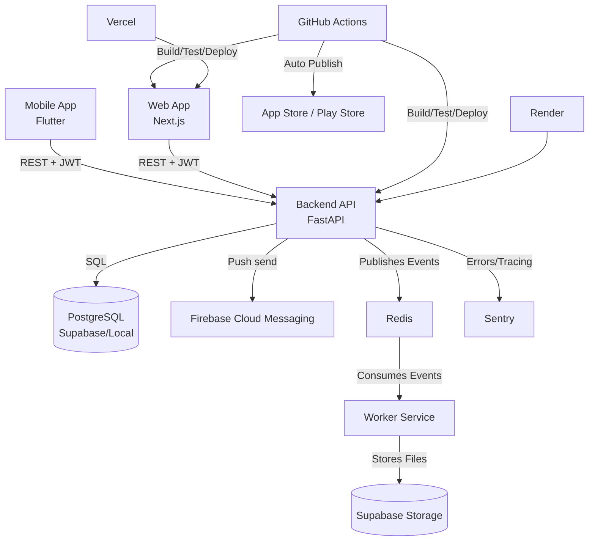

# Architecture

## System Diagram

## Communication Model

### Sync Paths
- Web and mobile communicate with backend via REST under `/api/v1`.
- Auth uses Supabase-issued bearer JWT validated by backend JWKS flow.
- Clan context is selected via `X-Current-Clan-Id` and enforced at API and DB layers.

### Async Paths
- Backend publishes domain events to Redis during Unit of Work commit.
- The dedicated Worker service consumes Redis events for heavy tasks (exports).
- Audit logging subscribes to auditable domain events.
- Notification scheduler and push delivery (FCM) are asynchronous side effects.

## Service Ownership

| Service | Owns | Depends On |
|---------|------|------------|
| backend | Domain rules, persistence, contracts | PostgreSQL, Supabase Auth, FCM, Sentry, Redis |
| web | Browser UX, admin flows | backend REST, Supabase session |
| mobile | Native UX, app navigation | backend REST, Supabase auth, FCM |
| worker | Heavy async processing (exports) | Redis, Supabase Storage |

## Critical User Journeys

### 1. User Login and Clan Context Selection
1. User authenticates via Supabase flow.
2. Client sends token to backend.
3. Backend validates JWT and clan memberships.
4. Client selects active clan and sends `X-Current-Clan-Id`.

### 2. Add Family Member and Relationship Link
1. Client submits person creation to backend.
2. Backend validates invariants and writes via Unit of Work.
3. Domain events are published to Redis.
4. Audit log captures mutation.
5. Client fetches updated person/relationship graph.

### 3. Browse Family Tree
1. Client requests tree with profile/include tuning.
2. Backend queries data with clan scoping.
3. Rendered in XYFlow (web) or custom widgets (mobile).

### 4. Export Family Tree
1. Client requests PDF export.
2. Backend queues task in Redis and returns Job ID.
3. Worker processes job, generates PDF, uploads to Supabase.
4. Worker notifies Backend or Client fetches status.

## Shared Infrastructure
| Component | Purpose | Primary Owner |
|-----------|---------|---------------|
| PostgreSQL/Supabase | Canonical data store and RLS | backend |
| Redis | Event bus / Queue | backend / worker |
| Supabase Auth | Identity and JWT issuance | backend / clients |
| Firebase Cloud Messaging | Push notification delivery | backend / mobile |
| GitHub Actions | CI/CD automation & Mobile App Store Publish | repo-wide |

## Scalability Assumptions
- Moderate clan sizes handled by REST query optimization.
- Redis provides durable async message brokering.
- Heavy processing is isolated to the Worker to protect Backend API latency.

## Failure Assumptions
- If Redis fails, background tasks are delayed, but API should ideally queue locally or fail gracefully.
- Docker-compose must always be monitored for backend/frontend stability.

## Constraints to Preserve
- Strict domain boundaries in backend.
- Extreme care with `person` and `user` entities (Landmines).
- Automated CI pipeline for Flutter mobile app must remain unbroken.