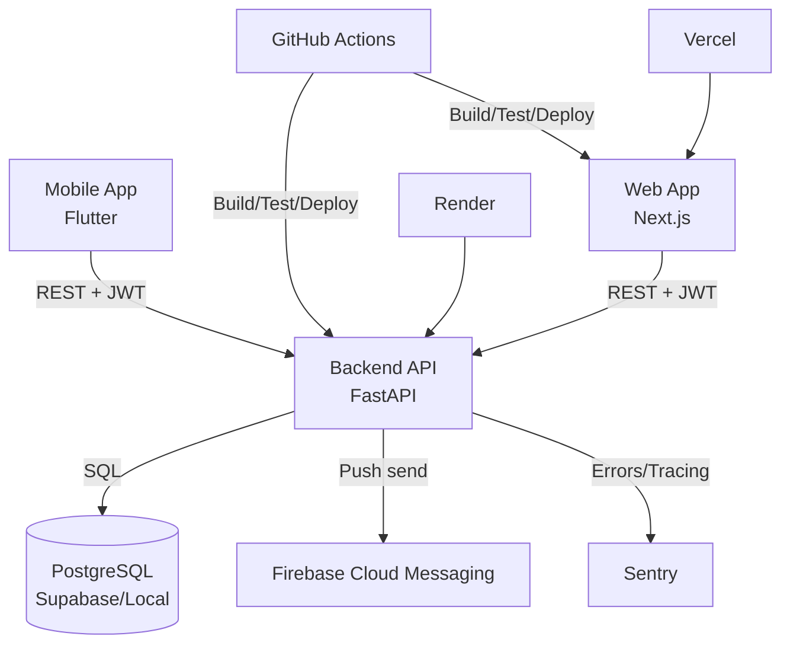

# Architecture

## System Diagram

## Communication Model

### Sync Paths
- Web and mobile communicate with backend via REST under /api/v1.
- Auth uses Supabase-issued bearer JWT validated by backend JWKS flow.
- Clan context is selected via X-Current-Clan-Id and enforced at API and DB layers.

### Async Paths
- Backend emits in-process domain events during Unit of Work commit.
- Audit logging subscribes to auditable domain events.
- Notification scheduler and push delivery are asynchronous side effects.

## Service Ownership

| Service | Owns | Depends On |
|---------|------|------------|
| backend | Domain rules, canonical persistence, contracts, audit logic | PostgreSQL, Supabase Auth, FCM, Sentry |
| web | Browser UX, admin/backoffice flows, route/session state | backend REST, Supabase session |
| mobile | Native UX, app navigation/state, device-level behavior | backend REST, Supabase auth, FCM |

## Critical User Journeys

### 1. User Login and Clan Context Selection
1. User authenticates via Supabase flow (web/mobile).
2. Client sends bearer token to backend /auth or /me endpoints.
3. Backend validates JWT, ensures user profile exists, resolves clan memberships.
4. Client selects active clan and includes X-Current-Clan-Id in subsequent calls.

### 2. Add Family Member and Relationship Link
1. Client submits person creation request to backend.
2. Backend command handler validates business invariants and writes through Unit of Work.
3. Domain events are collected and dispatched in-process.
4. Audit log captures mutation metadata.
5. Client fetches updated person/relationship graph via query APIs.

### 3. Browse Family Tree
1. Client requests /tree or /tree/subtree with optional profile/include tuning.
2. Backend query handlers load graph-relevant data with clan scoping.
3. Response is rendered in XYFlow (web) or custom tree widgets (mobile).
4. Any missing/invalid links are surfaced via API error envelope for UI handling.

## Shared Infrastructure and Ownership

| Component | Purpose | Primary Owner |
|-----------|---------|---------------|
| PostgreSQL/Supabase | Canonical data store and RLS | backend
| Supabase Auth | Identity and JWT issuance | backend integration + client auth flows
| Firebase Cloud Messaging | Push notification delivery | backend/mobile integration
| Sentry | Error and performance telemetry | all services (integration strongest in backend/mobile)
| Render | Backend runtime hosting | backend/infra
| Vercel | Web runtime hosting | web/infra
| GitHub Actions | CI/CD automation | repo-wide
| Pulumi | IaC intent and future automation | infra (currently partial)

## Scalability Assumptions
- Current architecture assumes moderate clan sizes with REST query optimization via profile/include fields.
- PostgreSQL with indexes, trigram/unaccent search, and RLS should serve current growth stage.
- In-process event dispatch is acceptable for current scale but may require broker-backed durability for critical workflows.
- Read/write hotspots are expected around persons, relationships, and tree traversal queries.

## Failure Assumptions
- If Supabase JWKS fetch fails transiently, auth validation can degrade and must be retried/fallback-cached.
- If event dispatch fails inside Unit of Work, write completion may be impacted based on transaction boundary behavior.
- If clan context header is missing or incorrect, requests should fail closed rather than leak cross-clan data.
- If push delivery fails, core write operations should remain successful and log recoverable notification errors.

## Constraints to Preserve
- Backend domain layer remains framework-agnostic.
- Application layer keeps strict dependency direction.
- Contract changes require docs/contracts updates and compatibility analysis.
- Mobile UI must preserve Arbor Heritage and localization rules.

## Related Docs
- tenant-design.md
- api-design.md
- database-schema.md
- rbac.md
- iac-guide.md
- onboarding.md
- contracts/README.md
- ops/README.md
- decisions/README.md
- contracts/
