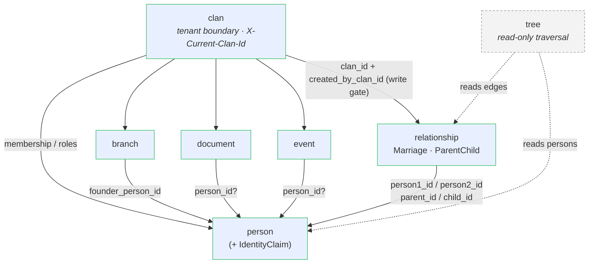
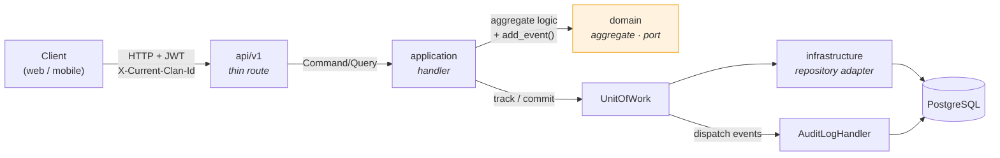

# Bounded Contexts

This document maps the backend domain into its bounded contexts (one folder per
context under `backend/app/domain/<context>/`), the aggregate root each owns, and
how the contexts relate. It is the high-level companion to [ADR-001](../decisions/001-ddd-cqrs-hexagonal.md)
(DDD + CQRS + hexagonal) and the per-rule reference in [Domain Rules](domain-rules.md).

> Source of truth is the code. When a context's aggregate, port, or relationship
> changes, update this map in the same PR.

## Context map

| Context | Subdomain | Aggregate root / shape | Write side? | Purpose |
|---------|-----------|------------------------|-------------|---------|
| **person** | Core | `Person` aggregate (+ `IdentityClaim` entity) | Yes | Clan-scoped person records; the genealogy "node" |
| **relationship** | Core | `Marriage`, `ParentChild` aggregates (+ `RelationshipDomainValidator`) | Yes | Genealogy edges between persons |
| **tree** | Core | Query port only (`TreeRepository`) | No (read) | Tree traversal: descendants, ancestors, path-finding |
| **clan** | Core | No domain aggregate (ORM `Clan` in `app/models/clan.py`) | Yes | Tenant entity + membership/role administration |
| **branch** | Supporting | `Branch` aggregate | Yes | Sub-lineage grouping inside a clan |
| **document** | Supporting | `Document` aggregate (+ `StoragePort`) | Yes | Photos / files attached to clan or person |
| **event** | Supporting | `Event` aggregate | Yes | Anniversaries, ceremonies, reminders |
| **auth** | Generic | No aggregate (`AuthRepository`, `AuthQueryPort`, `FCMTokenRepository`) | Yes | Supabase JWT login, clan onboarding, push tokens |
| **me** | Generic | Query port only (`MeQueryPort`) | No (read) | Current-user projection (my clans, my membership) |
| **platform_admin** | Generic | Query port only (`PlatformAdminQueryPort`) | No (read) | Cross-clan observability for super-admin |
| **shared** | — | `Entity`, `AggregateRoot`, `DomainEvent`, `ActorInfo`, `ClanScope`, exceptions | — | Domain building blocks reused by all contexts |

Read-only contexts (`tree`, `me`, `platform_admin`) and the read paths of write
contexts are implemented as **CQRS query ports** (`*_query_port.py`) that may join
across aggregates — see [ADR-001](../decisions/001-ddd-cqrs-hexagonal.md).

## Relationships between contexts

> 🇻🇳 **Ghi chú:** `clan` (dòng họ) là ranh giới đa người thuê (tenant). Mọi
> aggregate đều mang `clan_id`. `person` (nhân khẩu) và các cạnh quan hệ là
> **dữ liệu cô lập theo dòng họ** — mỗi dòng họ chỉ thấy các bản ghi do chính mình
> tạo ra (`created_by_clan_id`); truy vấn chéo dòng họ trả về not-found.
> Mũi tên nét đứt (`tree`) là context **chỉ đọc**, không thay đổi dữ liệu.

Key cross-context rules:

- **`clan` is the tenant boundary.** Every other aggregate carries `clan_id`.
  Persons and relationship edges are **strictly clan-isolated**: a clan reads only
  the records it created (`created_by_clan_id`); cross-clan reads return not-found.
  See [Multi-Tenancy](multi-tenancy.md) and [ADR-002](../decisions/002-clan-scoped-multitenancy.md).
- **`person` is distinct from the authenticated user, and is clan-scoped.**
  `created_by_clan_id` is the scoping key for both reads and writes. Isolation is
  enforced in the application/repository layer (every clan-scoped read takes
  `clan_id`). This is the "person vs user" distinction called out in [overview.md](overview.md).
- **Invitation flow (coexists with self-request-join):** a clan admin creates an
  email-targeted invite token; the invitee follows the link, accepts, and is granted
  an approved `UserClanRole` membership (`approved_by` / `approved_at` set on
  acceptance). One pending invite per `(clan_id, email)` is enforced.
- **`relationship` references `person`** (`person1_id`/`person2_id`,
  `parent_id`/`child_id`) and uses `RelationshipQueryPort` to read persons for
  validation (birth dates, ancestry) — it never imports the person context directly.
- **`tree` reads** persons + marriages + parent-child edges; it mutates nothing.
- **`document` / `event` / `branch`** optionally link to a `person` (`person_id`,
  `founder_person_id`) but own no person state.
- **`auth`** creates clans + memberships on onboarding; **`me`** and
  **`platform_admin`** are pure read projections over the same tables.

## Where each context lives

- Domain (ports, aggregates, events, validators): `backend/app/domain/<context>/`
- Commands / queries / handlers: `backend/app/application/<context>/`
- Adapters (repositories, query ports): `backend/app/infrastructure/persistence/`
- HTTP routes: `backend/app/api/v1/`

See `backend/CLAUDE.md` for the layer rules and composition root
(`infrastructure/dependencies.py`).

A write request flows through the hexagonal layers like this:

> 🇻🇳 **Ghi chú:** Tầng `domain` (màu cam) là **lõi nghiệp vụ thuần** — không được
> import FastAPI / SQLAlchemy / Pydantic. Mọi thao tác ghi đều đi qua `UnitOfWork`:
> flush → thu thập domain events → phát sự kiện (ghi audit) → commit, tất cả trong
> **cùng một transaction**.

## Related docs

- [Domain Rules](domain-rules.md) — invariants enforced inside these contexts
- [Domain Events Catalog](../contracts/domain-events-catalog.md) — events each context emits
- [Data Model](data-model.md) — the tables behind these aggregates
- [Identity Claims Workflow](../decisions/007-identity-claims-workflow.md)
