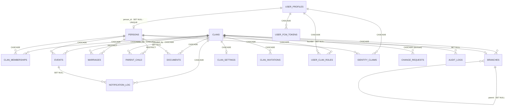
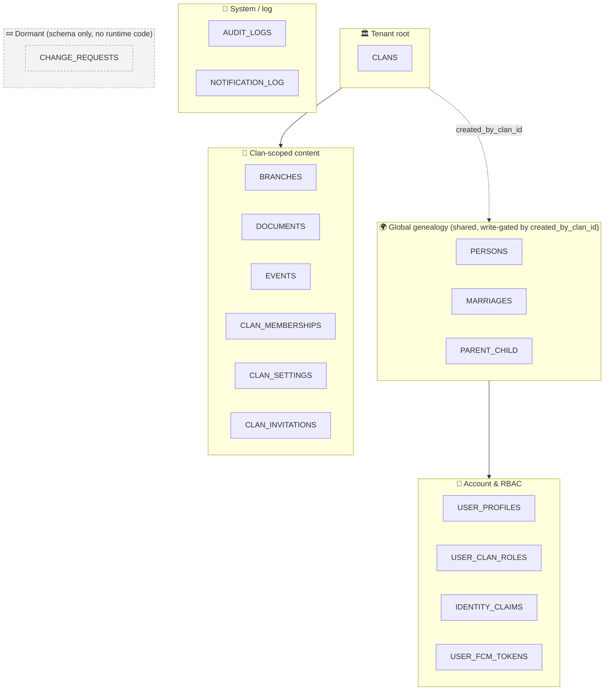

# Database Design Review — Schema & Business Logic (2026-07-02)

**Scope:** The persistence layer as the source of truth for business intent — every
table, constraint, index, delete behavior, and DB function in
`backend/migrations/versions/` + `backend/app/models/`, checked against the
*intended* genealogy business. Complements the broader
[Backend Design Review (2026-06-28)](backend-design-review-2026-06-28.md) (which
covered code correctness / cross-clan holes) by focusing on **schema ↔ business
fit**.

**Method:** Read the real migrations (001–006) and ORM models, grepped runtime
usage to distinguish live vs dormant schema, then walked each finding with the
product owner to confirm intent and record decisions.

---

## 1. Verdict

The schema is **well-modelled and genuinely captures the domain**: global-person +
M:N membership, write-gating by `created_by_clan_id`, soft-delete on the
irreplaceable genealogy core, and a set of well-chosen partial-unique indexes.
Vietnamese-specific needs (name variants, lunar dates, đa thê, chi/phái) are all
represented. The issues are **not architectural** — they are dormant scaffolding,
one dead table, and doc drift. All resolved or scheduled below.

---

## 2. Relationship map (redrawn)

Delete behavior is business-meaningful, so it is annotated on each edge.

Grouped by role (color = lifecycle/ownership):

> 🇻🇳 **Đọc sơ đồ:** Nhãn trên cạnh là hành vi `ON DELETE`. Nhóm **🌍 Global** dùng
> chung toàn hệ thống nhưng khóa quyền ghi theo `created_by_clan_id`. Cạnh
> `PERSONS→MARRIAGES/PARENT_CHILD` là **RESTRICT** vì person dùng soft-delete (xem §4 E3).
> `CHANGE_REQUESTS` (💤) có schema nhưng chưa có code.

---

## 3. Business rules encoded in the DB

Confirmed correct against intended business:

- **Genealogy graph:** `persons` global (no `clan_id`), edges `marriages` /
  `parent_child` global, visibility via `clan_memberships` (M:N).
- **Two distinct "role" columns** (do not conflate): `clan_memberships.role ∈
  {blood, spouse, adopted}` = kinship to the clan; `user_clan_roles.role ∈ {admin,
  editor, viewer}` = RBAC. A `person` ≠ a `user`.
- **Person exists without an account.** Living elders who never log in are plain
  `person` rows; `user_profile` + `identity_claims` only appear when someone
  authenticates and claims a node. (E2.1 — confirmed a core requirement.)
- **Integrity checks:** `death ≥ birth`, `divorce ≥ marriage`, no self-marriage /
  self-parent, gender/status/type enumerations, upload ≤ 50 MB, `notify_days_before ∈
  [0,30]`, `user_clan_roles` approval-consistency.
- **Partial-unique indexes** (all correct): 1 PENDING claim / user; 1 live married
  edge / pair; 1 live parent-child edge; 1 pending invitation / (clan,email); 1 role
  / (user,clan).
- **Vietnamese search:** GIN full-text + trigram over `f_unaccent(full_name)`
  (diacritic-insensitive).
- **đa thê (E1 — confirmed):** multiple concurrent marriages allowed;
  `spouse_order` orders them; no hard limit by design.

---

## 4. Findings & decisions (D + E)

| # | Finding | Decision (2026-07-02) | Status |
|---|---------|-----------------------|--------|
| **D1** | `change_requests` — full schema + ORM + Pydantic schema, **no runtime code** (cross-clan propose-and-approve workflow) | **Will build** — the missing piece of the global-person model | 📋 Roadmap |
| **D2** | `user_devices` — dead table (already dropped by migration 004; superseded by `user_fcm_tokens`) | **Removed from baseline** (edited 001 + 004; no new migration, pre-golive) | ✅ Done |
| **D3** | `clan_settings` — most knobs never enforced; DB caps upload at 50 MB but setting says 10 MB | **Will build** enforcement; **reconcile** upload limit to one source of truth | 📋 Roadmap |
| **D4** | RLS is a `documents`-only pilot (`ENABLE`d not `FORCE`d), app connects as bypass role → **inert**; older docs implied it was active | **Reconciled docs** (ADR-002 note, multi-tenancy, data-model, rbac) + indexed ADR-008. Runtime activation stays roadmap per ADR-008 | ✅ Docs done / 📋 activation roadmap |
| **D5** | `audit_logs.ip_address` / `user_agent` never populated | **Will populate** (needs request context → dispatcher); wanted for mobile | 📋 Roadmap |
| **E1** | đa thê / multiple marriages | **Confirmed intended**; keep flexible, no hard constraint | ✅ Confirmed |
| **E2** | Global-person visibility | Row-level **already correct** (clan B sees only the in-law, verified via clan-scoped tree SQL in migration 005). **Field-level filtering NOT built** — sensitive fields shared across clans | 📋 Roadmap (field visibility) |
| **E3** | `RESTRICT` FK vs soft-delete → orphan edges; doc said CASCADE | **Doc fixed** (RESTRICT). **Decision:** soft-deleting a person will also soft-delete its edges (restore restores only edges hidden by that delete) | ✅ Doc done / 📋 behavior roadmap |

---

## 5. Roadmap (feature builds — need separate design)

1. **D1 — Cross-clan change-request workflow:** domain context `change_request` +
   handler + router; consume `clan_settings.approval_config` (ties to D3).
2. **D3 — Clan settings enforcement:** wire `max_upload_size_mb` (reconcile 10 vs
   50 MB), `privacy_level`, `allow_public_tree`, `approval_config`,
   `notification_defaults`; drop knobs not kept.
3. **D5 — Forensic audit:** thread request IP/user-agent (a `ContextVar` set in the
   request path) into `AuditLogHandler`; serves mobile too.
4. **E2 — Field-level visibility:** owner-only vs public fields for a shared person.
   *Open:* confirm owner-only set (suggest `phone`, `email`, `residence_place`,
   `notes`), and whether `biography` / full `birth_date` are public.
5. **E3-behavior — Cascade soft-delete of edges** on person soft-delete, with
   restore semantics (only re-activate edges hidden by that same delete).
6. **F-1 — Standardize the `{"data": ...}` response envelope** across auth / claims /
   invitations / platform_admin routes. Client-facing contract change — coordinate
   with web + mobile.
7. **F-5 — Decide destructive-op policy** for events (Editor vs Admin delete) and
   align with the other aggregates.
8. **F-6 — Notifications REST surface** — build notification preferences/history
   endpoints (unmount the stub until then). Ties to the FCM/notification feature.

---

## 6. Repository-layer clan-isolation audit

Since clan isolation is the **only enforced layer** (RLS inert), every persistence
method was audited for a clan predicate + soft-delete filter. The layer is largely
correct, and the 2026-06-28 tree cross-clan leak (spouse fan-out / ancestor walk)
is **confirmed fixed** by the clan-scoped SQL functions (migration 005). Remaining
findings and fixes:

| Severity | Method | Issue | Fix |
|----------|--------|-------|-----|
| 🔴 Cross-clan leak | `person_repository.get_stats_for_persons` | spouse/child counts had **no `created_by_clan_id`** → leaked existence of other clans' edges (via `GET /persons?include=stats` + `/batch`) | Added `clan_id` param + `AND *.created_by_clan_id=:clan_id`; updated protocol, handler, both routes |
| 🟠 Soft-delete | `person_repository.get_in_clan` | detail path could return a soft-deleted person | Added `is_deleted=false` (with `include_deleted=True` escape hatch for `restore()`) |
| 🟠 Soft-delete / self-containment | `person_query_port.get_timeline` (person fetch) | birth/death fetched with no clan/soft-delete scope (only route-guarded) | Scoped by `clan_memberships` join + `is_deleted=false` |
| 🟠 Soft-delete | `tree_repository.get_ancestors` (CTE anchor) | root row not filtered `is_deleted` | Added `AND p.is_deleted = false` to anchor |

**Deferred (🟡, model-consistency, not leaks):**
- `relationship_repository` write-path validators (`count_bio_parents`,
  `has_active_marriage`, `has_parent_child_link`) read edge tables with no clan
  predicate — couples clans via validation outcomes; align to edge-ownership later.
- `claim_repository.list_clan_claims` scopes by `created_by_clan_id` instead of the
  `clan_memberships` read-path convention; `get_person` is a global PK fetch guarded
  by an explicit handler check.

**Verification status (2026-07-02):** `ruff` + `mypy` + affected unit tests pass;
the new two-sided integration test `tests/integration/test_person_stats_isolation.py`
(+ existing relationship/timeline isolation tests) is written but **not yet run** —
it needs Postgres (`docker compose up -d pgdb`).

## 7. Application-layer audit (write side)

Audited every command handler for Unit-of-Work / audit discipline, cross-clan write
validation, and business-rule orchestration. **Two big themes from the 2026-06-28
review are confirmed CLOSED:**
- **Theme E (writes without audit / forgotten `uow.track`)** — resolved by the
  "auto-track at the repository seam" refactor (`save()/delete()` auto-track);
  handlers also track explicitly. Claims path no longer tracks a raw ORM model.
- **Theme B (cross-clan write / `clan_id` spoofing)** — closed: `clan_id` /
  `created_by_clan_id` are forced from the auth context (never body), update
  whitelists exclude them, and the relationship validator (max-2-bio, cycle, age
  gap, duplicates) is invoked by both create handlers.

Three residual gaps found and **fixed 2026-07-02:**

| Severity | Handler | Issue | Fix |
|----------|---------|-------|-----|
| 🔴 | `document.set_avatar` | avatar change wrote **no audit row** (`Document.set_avatar()` carries no domain event) | Route now passes `actor`; handler emits `document.set_avatar` audit via `emit_audit_event` (commits doc + old-avatar clears + audit in one tx) |
| 🟠 | `document.upload` | body `person_id` not validated in-clan (unlike event/branch) | Added `person_in_clan` guard (new repo method + protocol) → `person_not_found` if cross-clan |
| 🟠 | `auth._assign_clan_membership` | clan creation + self-granted admin / join request emitted **no audit** | Emit `clan.create` / `clan.join_request` audit events |

**Deferred (🟡):** relationship write-path validators read edge tables with no clan
predicate (booleans only — couples clans via outcomes); `branch.update` doesn't
check transitive parent cycles (documented).

**Verification (2026-07-02):** `ruff` + `mypy` + **180 unit tests pass**; two-sided
integration tests for these paths need Postgres and are pending.

## 8. API-layer audit (routes / authz / contract)

Audited all 15 route modules + `security.py` / `permissions.py` / exception handlers.
**No critical security gaps:** every mutating clan-scoped route carries a `Require*`
role guard, every platform write carries `get_super_admin`, and **mass-assignment is
clean** (`clan_id`/`created_by_clan_id` always forced from context, `is_approved`
never client-settable). **Theme F (error envelope) is confirmed RESOLVED** — `AppError`
subclasses `HTTPException` with `{code, detail}`, the auth/RBAC surface raises only
`AppError`, and all five handlers (AppError/DomainError/RequestValidationError/
HTTPException/Exception) are registered.

Fixed 2026-07-02:

| Severity | Finding | Fix |
|----------|---------|-----|
| 🟠 F-2 | Missing/malformed `Authorization` → 403 "forbidden" (HTTPBearer `auto_error=True`) instead of 401 | `HTTPBearer(auto_error=False)` + `get_current_user` raises `AuthenticationError("missing_token")` (401); added `error.missing_token` to all 4 locales |
| 🟠 F-4 | Admin claim mutations (approve/reject/unlink/prelink) didn't bind path `clan_id` to the active clan (handler re-verified, but latent footgun) | Added `clan_id != active_clan_id → ForbiddenError("clan_context_mismatch")` guard, matching `list_clan_claims`/invitations |

Deferred to roadmap (need product/contract decision — see §5):

- **F-1** Response-envelope inconsistency — auth/claims/invitations/platform_admin
  routes return bare models/dicts instead of `{"data": ...}`. Standardizing is a
  **client-facing contract change** (web + mobile).
- **F-5** `DELETE /events` requires only Editor, while person/branch/relationship
  deletes require Admin — confirm intended destructive-op policy.
- **F-6** ✅ DONE (2026-07-05, PR #37): the empty `notifications.py` stub mounted at
  `/api/v1/notifications` was removed (unmounted). A real router can be built when the
  notifications feature ships.

**Verification (2026-07-02):** `ruff` + `mypy` + **180 unit tests pass** (incl. i18n
coverage); integration pending Postgres.

## 9. Related

- [Backend Design Review (2026-06-28)](backend-design-review-2026-06-28.md) — code correctness / cross-clan audit
- [Data Model](data-model.md) · [Bounded Contexts](bounded-contexts.md) · [Domain Rules](domain-rules.md)
- [ADR-002](../decisions/002-clan-scoped-multitenancy.md) · [ADR-006](../decisions/006-soft-vs-hard-delete.md) · [ADR-008](../decisions/008-rls-defense-in-depth.md)
