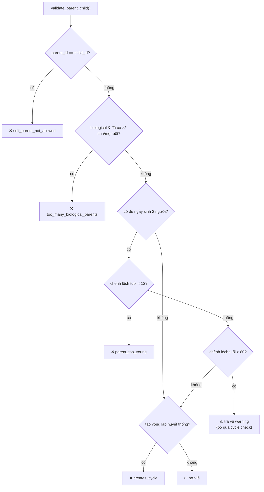
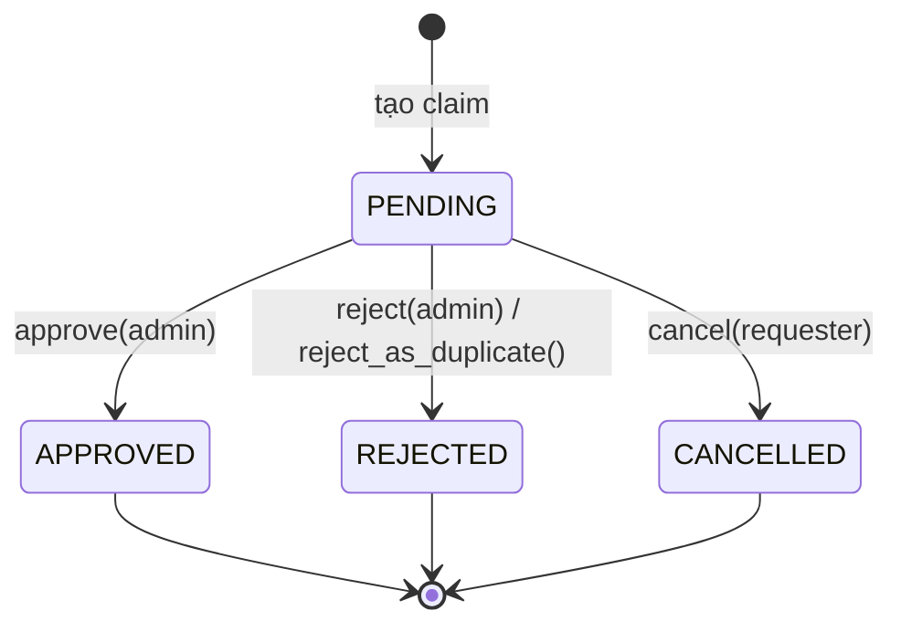

# Domain Rules Reference

The genealogy and integrity rules enforced inside the domain layer
(`backend/app/domain/`). These are the invariants that keep family data correct
regardless of which client or API path triggers a write. Each rule lists the
**error code** raised so clients and contract docs stay aligned.

> All rules live in pure-domain code (no FastAPI / SQLAlchemy). Domain exceptions
> are mapped to the structured error envelope by `app/core/exceptions.py`
> (`{ "error": { "code", "message", "detail" } }`). See [API Design](api-design.md).

## Exception types

Defined in `app/domain/shared/exceptions.py`:

| Exception | Meaning | Typical HTTP |
|-----------|---------|--------------|
| `EntityNotFoundError` | Aggregate not found / not in clan | 404 |
| `BusinessRuleViolation` | Domain invariant broken | 422 |
| `ConflictError` | Duplicate / conflicting state | 409 |
| `ForbiddenError` | Permission denied at domain level | 403 |
| `ValidationError` | Input shape invalid | 422 |
| `AuthenticationError` | Auth failure | 401 |

## Relationship rules

Enforced by `RelationshipDomainValidator` (`app/domain/relationship/validator.py`)
and the `Marriage` / `ParentChild` aggregates (`app/domain/relationship/entities.py`).

| Rule | Condition | Error code | Type |
|------|-----------|------------|------|
| No self-marriage | `person1_id == person2_id` | `self_marriage_not_allowed` | BusinessRuleViolation |
| No self-parent | `parent_id == child_id` | `self_parent_not_allowed` | BusinessRuleViolation |
| Max 2 biological parents | child already has ≥2 `biological` parents | `relationship.too_many_biological_parents` | ConflictError |
| Minimum parent age gap | parent <12 yrs older than child | `relationship.parent_too_young` (detail: `{min_age_gap: 12, actual}`) | BusinessRuleViolation |
| Unusual age gap | parent >80 yrs older than child | *(no error — returns `{warning}`)* | warning |
| Cycle prevention | new parent is already a descendant of child | `relationship.creates_cycle` | BusinessRuleViolation |
| No duplicate parent-child | link already exists | `relationship.duplicate_parent_child` | ConflictError |
| No duplicate marriage | active marriage already exists | `relationship.duplicate_marriage` | ConflictError |

Age gap is computed as `(child_birth - parent_birth).days / 365.25`; the check is
skipped when either birth date is missing. Ancestry/cycle and biological-parent
counts are queried through `RelationshipQueryPort` (kept infrastructure-free).

The parent-child validation pipeline (`validate_parent_child`):

> 🇻🇳 **Lưu ý:** khi chênh lệch tuổi **> 80 năm**, validator trả về cảnh báo
> (`warning`) và **dừng luôn** — *không* chạy kiểm tra vòng lặp huyết thống. Đây là
> hành vi hiện tại của code (`validator.py`), cần biết để không hiểu nhầm là đã
> kiểm tra cycle trong nhánh này.

## Person rules

`app/domain/person/entity.py`:

- **Clan-scoped, not globally shared.** A `Person` is distinct from the
  authenticated user. Persons are **strictly clan-isolated**: cross-clan reads
  return not-found. Read isolation is enforced via a JOIN on `clan_memberships`
  (`ClanMembership.clan_id == clan_id`) in the repository layer — a clan sees
  persons that are *members* of it (M:N). A person may belong to multiple clans
  via membership; each member-clan sees it. `Person.created_by_clan_id` records
  the *originating clan* (write attribution) and is nullable; it is NOT the read
  filter. Isolation is enforced in the application/repository layer (every
  clan-scoped read passes `clan_id`); RLS is a planned SP-3 defense-in-depth
  addition, not yet active.
  By contrast, **relationship edges** (Marriage, ParentChild) are read-scoped by
  `created_by_clan_id == active clan`; cross-clan → not-found.
  *(Legacy note: earlier docs described persons as "globally shared / visible across
  clans". That model was superseded by strict isolation in SP-2B.)*
- **Soft delete.** `soft_delete()` sets `is_deleted`, `deleted_at`, `deleted_by` and
  emits `PersonDeleted`; `restore()` clears them and emits `PersonRestored`.
  Records are never physically removed. See [ADR-006](../decisions/006-soft-vs-hard-delete.md).
- **A soft-deleted person is invisible everywhere, including every write guard
  (M3, review 2026-07-18).** It's not just reads: marriage, parent-child, event,
  and document creation all treat a soft-deleted `person_id` reference as
  `404 person_not_found`, the same as a nonexistent one (these fields are
  create-only — immutable on `PATCH` — so the guard only needs to run there);
  branch `founder_person_id` gets the same treatment on **both** create and
  update, since it's one of the updatable fields. `GET /events/upcoming` was
  the one consumer that diverged from this (it leaked a soft-deleted person's
  giỗ) and now matches the anniversary scheduler. A **sixth** hole (found in
  final branch review, after the sweep above) was the identity-claim path:
  `submit_claim`/`prelink_identity` resolved the claim target via an unfiltered
  getter, so a soft-deleted person could still be claimed and bound to a live
  user once approved — fixed via `SqlAlchemyClaimRepository.get_live_person`
  (is_deleted-filtered), used only at the two claim-*creation* sites;
  `cancel_claim`'s non-gating audit lookup and `unlink_identity`'s resolution
  of an already-established link keep the unfiltered `get_person`, since
  filtering an already-existing reference there could strand a legitimate
  in-flight operation. Proven in
  `backend/tests/integration/test_soft_delete_consistency.py`, whose
  `test_every_person_guard_filters_soft_deleted` source-scans every
  `person(s)_in_clan` guard in `app/infrastructure/persistence/` as a class
  gate against a future aggregate reintroducing the hole — that gate only
  matches guards literally named `person(s)_in_clan`, so the differently-named
  `get_live_person` is pinned separately by
  `test_claim_live_person_resolver_filters_soft_deleted` in the same file.
- **Audited updates.** `update()` records old/new values into the `PersonUpdated`
  event for the audit trail.

### Identity claims

`IdentityClaim` entity — links a `user_id` to a `person_id` so a user can claim
"this is me". Full flow in [ADR-007](../decisions/007-identity-claims-workflow.md).

- Status machine: `PENDING → APPROVED | REJECTED | CANCELLED`.
- `cancel(user_id)` — only the original requester, only while `PENDING`.
- `approve(admin_id, note)` / `reject(admin_id, note)` — only from `PENDING`.
- `reject_as_duplicate()` — idempotent rejection.
- **Invariant:** at most **one PENDING claim per user globally** (unique constraint).

> 🇻🇳 **Ghi chú:** Đây là cơ chế "nhận thân" — người dùng (`user`) xác nhận một bản
> ghi nhân khẩu (`person`) trong gia phả chính là mình. Mỗi người dùng chỉ được có
> **một yêu cầu đang chờ duyệt (PENDING)** tại một thời điểm để chống spam. Quản trị
> dòng họ (admin) là người duyệt/từ chối. Chi tiết: [ADR-007](../decisions/007-identity-claims-workflow.md).

## Branch rules

`app/domain/branch/entity.py`:

| Rule | Error code | Type |
|------|------------|------|
| A branch cannot be its own parent (`parent_branch_id == id`) | `branch_cannot_be_own_parent` | BusinessRuleViolation |
| Only whitelisted fields are updatable (`name`, `description`, `founder_person_id`, `parent_branch_id`, `branch_order`) | `field_not_updatable` | BusinessRuleViolation |

Branches are **hard-deleted** (no soft-delete flag) — see [ADR-006](../decisions/006-soft-vs-hard-delete.md).

## Document rules

`app/domain/document/entity.py`:

| Rule | Constraint | Error code |
|------|-----------|------------|
| Valid document type | `{photo, id_document, certificate, audio, video, other}` | `invalid_document_type` |
| Allowed MIME type | jpeg, png, webp, heic, pdf, mpeg, wav, mp4, quicktime | `invalid_mime_type` |
| File size limit | ≤ 50 MB | `file_too_large` |
| Avatar needs a person | `set_avatar()` requires `person_id` | `document_not_linked_to_person` |
| Only photos as avatar | `document_type == "photo"` | `only_photo_can_be_avatar` |

Documents are **soft-deleted** (ADR-019): the row is flagged and the storage blob
survives; an admin can `POST /documents/{id}/restore` until the daily purge job
permanently removes blob + row after `DOCUMENT_RETENTION_DAYS` (default 30).
Storage layout is path-isolated per clan: `clans/{clan_id}/...`.

## Event rules

`app/domain/event/entity.py`:

| Rule | Constraint | Error code |
|------|-----------|------------|
| Valid event type | `{death_anniversary, birthday, wedding_anniversary, clan_ceremony, custom}` | `invalid_event_type` |
| Whitelisted updates only | `event_type`, `title`, `description`, `event_date`, `is_lunar_calendar`, `is_recurring`, `notify_days_before` | `field_not_updatable` |

Events support lunar-calendar dates (`is_lunar_calendar`) and recurrence
(`is_recurring`), with per-event notification lead time (`notify_days_before`,
default 7). Anniversary reminders are driven by APScheduler — see `backend/CLAUDE.md`
(`NOTIFICATION_CRON_HOUR` / `NOTIFICATION_DAYS_BEFORE`).

## Clan membership rules

`app/domain/clan/` (administration over the ORM `Clan` / `UserClanRole`):

- Roles: `viewer < editor < admin` (clan) plus platform `super_admin`. See [RBAC](rbac.md).
- Membership requires `is_approved = True` before access is granted.
- Admin actions emit auditable events: `UserApproved`, `UserRejected`,
  `UserRoleChanged`, `UserRemoved`, `ClanUpdated`.
- `count_admins()` is used to guard against removing/demoting the last admin.
- **Exactly one live founder (thủy tổ) per clan** ([ADR-026](../decisions/026-single-founder-designation.md)):
  `clan_memberships.is_founder` is DB-backstopped by the partial unique index
  `uq_clan_memberships_one_founder` (`clan_id`) `WHERE is_founder = true`
  (migration 023) — a concurrent write that would create a second live founder
  for a clan hits `23505` → the generic `conflict` 409. Set only via
  `PUT /clans/me/founder` (admin-only), which swaps rather than accumulates.
  `find_clan_founder` treats a soft-deleted founder person as no founder at
  all, and an undesignated/founder-less clan makes `GET /tree` (no
  `root_person_id`) 404 `clan_founder_not_found` — the onboarding signal, not
  a domain violation.

## Soft-delete vs hard-delete summary

| Aggregate | Delete strategy |
|-----------|-----------------|
| Person | Soft (`is_deleted`, restorable) |
| Marriage, ParentChild | Soft |
| Document | Soft + retention purge (ADR-019) |
| Event, Branch | Hard |

Rationale and the consistency concern are recorded in
[ADR-006](../decisions/006-soft-vs-hard-delete.md) (documents row superseded by
[ADR-019](../decisions/019-document-soft-delete-purge.md)).

## 🇻🇳 Thuật ngữ gia phả Việt Nam (glossary)

Các trường dữ liệu mang đặc thù văn hóa Việt — ghi lại ý nghĩa để cả người không
rành gia phả lẫn lập trình viên hiểu đúng. Tên trường lấy từ `Person`
(`app/domain/person/entity.py`) và bảng `persons` ([data-model.md](data-model.md)).

### Các loại tên gọi (`Person`)
| Trường | Tiếng Việt | Giải thích |
|--------|-----------|-----------|
| `full_name` | Họ và tên đầy đủ | Tên dùng hiển thị chính |
| `birth_name` | Tên húy / tên khai sinh | Tên thật lúc sinh, thường kiêng gọi |
| `courtesy_name` | Tên tự (tên chữ) | Tên đặt khi trưởng thành |
| `posthumous_name` | Tên thụy / tên hèm | Tên dùng khi cúng giỗ sau khi mất |
| `alias_name` | Biệt hiệu / tên hiệu | Tên gọi khác, bút danh |
| `title_rank` | Chức tước / phẩm hàm | Tước vị, học vị, chức quan |

### Lịch âm và ngày tháng
- `birth_date` / `death_date` — ngày **dương lịch**, kèm `*_precision`
  (`exact|year|month|circa|unknown`) và `*_display` (text hiển thị khi không chính
  xác, vd "khoảng 1750"). Cờ `*_approx` cũ đã bị thay thế (migrations 012→014,
  ADR-011); API serialize thành object HistoricalDate `{date, precision, display, lunar}`.
- `lunar_birth_date` / `lunar_death_date` — ngày **âm lịch**, chỉ dùng để *hiển thị*
  (display-only) trên `Person`; đây vẫn là text người dùng tự nhập, không được engine
  nào tự sinh ra.
- Sự kiện (`Event`) có cờ `is_lunar_calendar` để đánh dấu ngày theo âm lịch — quan
  trọng với ngày giỗ. Kể từ [ADR-018](../decisions/018-vietnamese-lunar-calendar.md),
  với sự kiện `is_recurring=true, is_lunar_calendar=true`, backend **có tính toán**
  ngày giỗ âm lịch kế tiếp (quy đổi sang dương lịch qua thuật toán Hồ Ngọc Đức, UTC+7,
  `app/services/lunar_calendar.py`) để phục vụ scheduler nhắc nhở và `/events/upcoming`
  — phạm vi tính toán chỉ là ngày lặp lại (recurrence), không sinh ra chuỗi hiển thị
  `HistoricalDate.lunar` ở trên.
- **Kinship theo tuổi**: các từ xưng hô phụ thuộc tuổi (bác/chú, cậu/dì…) chỉ được
  suy ra khi **cả hai** ngày sinh có `precision == "exact"` — không khẳng định vai
  vế dựa trên ngày ước lượng (`relationship_descriptor`).

### Loại sự kiện (`event_type`)
| Mã | Tiếng Việt |
|----|-----------|
| `death_anniversary` | Ngày giỗ |
| `birthday` | Sinh nhật |
| `wedding_anniversary` | Kỷ niệm ngày cưới |
| `clan_ceremony` | Lễ/việc họ (giỗ tổ, tế lễ…) |
| `custom` | Tùy chỉnh |

### Vai trò (role) trong dòng họ
| Mã | Tiếng Việt | Quyền |
|----|-----------|-------|
| `admin` | Quản trị dòng họ | Quản lý thành viên, duyệt, sửa cấu hình |
| `editor` | Biên tập viên | Thêm/sửa nhân khẩu, quan hệ, tài liệu, sự kiện |
| `viewer` | Người xem | Chỉ đọc |
| `super_admin` | Quản trị nền tảng | Cấp toàn hệ thống (xem [RBAC](rbac.md)) |

## Related docs

- [Bounded Contexts](bounded-contexts.md)
- [Domain Events Catalog](../contracts/domain-events-catalog.md)
- [API Design](api-design.md) — how error codes surface to clients
- [RBAC](rbac.md)
