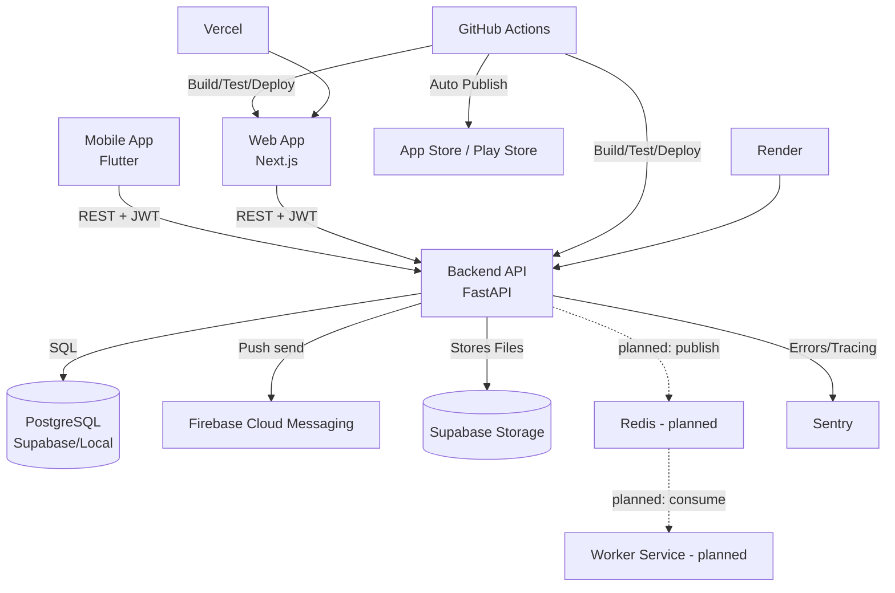

# Architecture

> **Status (2026-06-28):** The **Redis event bus** and the **dedicated Worker
> service** below are **planned, not implemented** (ADR-004, ADR-005). Today the
> backend dispatches domain events **in-process** (`InMemoryEventDispatcher`) within
> the Unit-of-Work transaction — the audit-log and notification handlers run inline,
> not via Redis, and there is no separate worker process or async export pipeline.
> Items marked _(planned)_ describe the target architecture, not current behavior.

## System Diagram

## Communication Model

### Sync Paths
- Web and mobile communicate with backend via REST under `/api/v1`.
- Auth uses Supabase-issued bearer JWT validated by backend JWKS flow.
- Clan context is selected via `X-Current-Clan-Id` and enforced at API and DB layers.

### Event / Async Paths
- On Unit-of-Work commit, the backend collects domain events from tracked aggregates
  and dispatches them **in-process** (`InMemoryEventDispatcher`), within the same
  transaction. This is **not** a durable integration bus.
- Audit logging subscribes to auditable domain events (writes `audit_logs` rows inline).
- Notification scheduling (APScheduler) and push delivery (FCM) are in-process side effects.
- _(planned, ADR-004/005)_ A Redis bus + dedicated Worker for durable async work
  (e.g. PDF exports). Not implemented.

## Service Ownership

| Service | Owns | Depends On |
|---------|------|------------|
| backend | Domain rules, persistence, contracts | PostgreSQL, Supabase Auth, FCM, Sentry |
| web | Browser UX, admin flows | backend REST, Supabase session |
| mobile | Native UX, app navigation | backend REST, Supabase auth, FCM |
| worker _(planned)_ | Heavy async processing (exports) | Redis, Supabase Storage |

## Critical User Journeys

### 1. User Login and Clan Context Selection
1. User authenticates via Supabase flow.
2. Client sends token to backend.
3. Backend validates JWT and clan memberships.
4. Client selects active clan and sends `X-Current-Clan-Id`.

### 2. Add Family Member and Relationship Link
1. Client submits person creation to backend.
2. Backend validates invariants and writes via Unit of Work.
3. Domain events are dispatched in-process on commit.
4. Audit log handler captures the mutation in the same transaction.
5. Client fetches updated person/relationship graph.

### 3. Browse Family Tree
1. Client requests tree with profile/include tuning.
2. Backend queries data with clan scoping.
3. Rendered in XYFlow (web) or custom widgets (mobile).

### 4. Export Family Tree _(planned — ADR-005, not implemented)_
1. Client requests PDF export.
2. Backend queues task in Redis and returns Job ID.
3. Worker processes job, generates PDF, uploads to Supabase.
4. Worker notifies Backend or Client fetches status.

## Shared Infrastructure
| Component | Purpose | Primary Owner |
|-----------|---------|---------------|
| PostgreSQL/Supabase | Canonical data store; app-layer clan isolation (RLS pilot only) | backend |
| Redis _(planned)_ | Event bus / Queue (ADR-004) | backend / worker |
| Supabase Auth | Identity and JWT issuance | backend / clients |
| Firebase Cloud Messaging | Push notification delivery | backend / mobile |
| GitHub Actions | CI/CD automation & Mobile App Store Publish | repo-wide |

## Scalability Assumptions
- Moderate clan sizes handled by REST query optimization.
- _(planned)_ Redis would provide durable async message brokering; heavy processing
  would be isolated to the Worker to protect Backend API latency. Until then, event
  handling is in-process and synchronous with the request.

## Failure Assumptions
- Domain-event handlers run inside the write transaction: if a handler fails, the
  whole write is rolled back (no business change without its audit trail), at the cost
  of in-process coupling — see the in-process-dispatcher caveat in the contracts docs.
- _(planned)_ With Redis, a broker failure would delay background tasks; the API
  should queue locally or fail gracefully.

## Constraints to Preserve
- Strict domain boundaries in backend.
- Extreme care with `person` and `user` entities (Landmines).
- Automated CI pipeline for Flutter mobile app must remain unbroken.