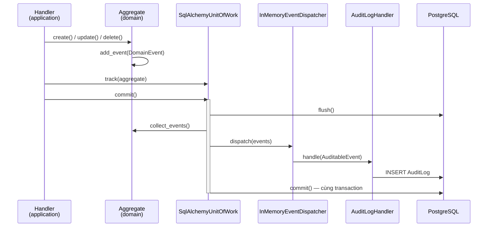

# Contract: Domain Events Catalog

## Type
Internal Domain Event Stream (in-process)

## Owner
backend

## Consumers
- `AuditLogHandler` (writes an `AuditLog` row for every `AuditableEvent`)
- notification / downstream handlers where wired
- *(future)* worker service via Redis — see [ADR-004](../decisions/004-redis-pubsub-events.md)
  and [Redis Domain Events](redis-domain-events.md)

This catalog covers the **internal** domain events emitted by aggregates and
dispatched inside the Unit of Work commit path. It complements
[domain-events-audit.md](domain-events-audit.md) (the audit-stream contract) with a
concrete per-event listing. The Redis envelope for *integration* events is a
separate, externally-facing contract.

## Mechanics

Defined in `app/domain/shared/events.py`:

- `DomainEvent` — base: `occurred_at` (UTC), `event_id` (UUID).
- `AuditableEvent(DomainEvent)` — adds `clan_id`, `actor_id`, `actor_role`,
  `action`, `resource_type`, `resource_id`, `old_value`, `new_value`.

Aggregates call `add_event(...)`; `SqlAlchemyUnitOfWork.commit()` flushes, collects
events from all tracked aggregates, dispatches them, then commits — so audit rows
land **in the same transaction**. Every event below is an `AuditableEvent` and is
therefore auto-audited.

> **Durability:** the dispatcher is in-process (`InMemoryEventDispatcher`) and is
> **not** a durable integration channel. Do not treat these as cross-process
> guarantees — see [ADR-004](../decisions/004-redis-pubsub-events.md).

Lifecycle of a single write (commit path):

> 🇻🇳 **Ghi chú:** Sự kiện được phát **trước khi** transaction commit, nên bản ghi
> audit (`AuditLog`) nằm cùng một transaction với thay đổi nghiệp vụ — hoặc cùng
> thành công, hoặc cùng rollback. Vì dispatcher chạy in-process nên đây **chưa** là
> kênh tích hợp bền vững (durable); muốn gửi sang service khác cần qua Redis (ADR-004).

## Event catalog

All events carry the common `AuditableEvent` fields. The table lists the
distinguishing payload fields, the `action` code, and the trigger.

### person
| Event | `action` | Key payload | Trigger |
|-------|----------|-------------|---------|
| `PersonCreated` | `person.create` | `person_id`, `full_name` | `Person.create()` |
| `PersonUpdated` | `person.update` | `person_id`, `changes`, `old_values` | `Person.update()` |
| `PersonDeleted` | `person.delete` | `person_id` | `Person.soft_delete()` |
| `PersonRestored` | `person.restore` | `person_id` | `Person.restore()` |

### relationship
| Event | `action` | Key payload | Trigger |
|-------|----------|-------------|---------|
| `MarriageCreated` | `marriage.create` | `marriage_id`, `person1_id`, `person2_id` | `Marriage.create()` |
| `MarriageUpdated` | `marriage.update` | `marriage_id`, `changes` | `Marriage.update()` |
| `MarriageDeleted` | `marriage.delete` | `marriage_id` | `Marriage.soft_delete()` |
| `ParentChildCreated` | `parent_child.create` | `link_id`, `parent_id`, `child_id`, `relationship_type` | `ParentChild.create()` |
| `ParentChildUpdated` | `parent_child.update` | `link_id`, `changes` | `ParentChild.update()` |
| `ParentChildDeleted` | `parent_child.delete` | `link_id` | `ParentChild.soft_delete()` |

### branch
| Event | `action` | Key payload | Trigger |
|-------|----------|-------------|---------|
| `BranchCreated` | `branch.create` | `branch_id`, `name` | `Branch.create()` |
| `BranchUpdated` | `branch.update` | `branch_id`, `changes`, `old_values` | `Branch.update()` |
| `BranchDeleted` | `branch.delete` | `branch_id` | `Branch.delete()` |

### document
| Event | `action` | Key payload | Trigger |
|-------|----------|-------------|---------|
| `DocumentCreated` | `document.upload` | `document_id`, `title`, `document_type` | `Document.create()` |
| `DocumentDeleted` | `document.delete` | `document_id` | `Document.mark_deleted()` |

### event
| Event | `action` | Key payload | Trigger |
|-------|----------|-------------|---------|
| `EventCreated` | `event.create` | `event_id`, `title`, `event_type` | `Event.create()` |
| `EventUpdated` | `event.update` | `event_id`, `changes`, `old_values` | `Event.update()` |
| `EventDeleted` | `event.delete` | `event_id` | `Event.delete()` |

### clan
| Event | `action` | Key payload | Trigger |
|-------|----------|-------------|---------|
| `ClanUpdated` | `clan.update` | `changes` | clan profile edit |
| `UserApproved` | `user.approve` | `target_user_id` (`resource_type=user_clan_role`) | approve pending member |
| `UserRejected` | `user.reject` | `target_user_id` | reject pending member |
| `UserRoleChanged` | `user.change_role` | `target_user_id`, `old_role`→`new_role` (in `old_value`/`new_value`) | change member role |
| `UserRemoved` | `user.remove` | `target_user_id` | remove member |

### person — identity claims
These do not have dedicated event classes: the claim handlers emit the generic
`CrudAuditEvent` via `track_audit_event(...)` (see the backend developer guide), so they
carry the same `AuditableEvent` fields and route through the same fail-closed dispatcher
as every other write. All use `resource_type = identity_claim`.

| `action` | Key payload (`old_value` → `new_value`) | Trigger |
|----------|------------------------------------------|---------|
| `claim.submit` | → `{status: PENDING, ...}` | user submits an identity claim |
| `claim.cancel` | `{status: PENDING}` → `{status: CANCELLED}` | claimant cancels their pending claim (audited unconditionally — M12) |
| `claim.approve` | `{status: PENDING}` → `{status: APPROVED, person_id}` | admin approves a claim |
| `claim.reject` | `{status: PENDING}` → `{status: REJECTED}` | admin rejects a claim |
| `claim.unlink` | link removal | admin unlinks an established user↔person identity |
| `claim.prelink` | → link creation | admin pre-links a user to a person |

Before M12 these rows were written directly by `claim_repository.add_audit`, bypassing the
dispatcher — so they lacked `ip_address`/`user_agent`. That writer is retired; claims now
enrich like every other audited write.

## Versioning & Compatibility Rules
- Additive payload fields are preferred.
- Renaming/removing a field or an `action` code requires a compatibility shim in
  handlers and a paired note here.
- When events move to the Redis broker, semantic `action` names must be preserved
  (or a translation layer added) — see [ADR-004](../decisions/004-redis-pubsub-events.md).

## Related docs
- [Domain Rules](../architecture/domain-rules.md) — what raises these events
- [Bounded Contexts](../architecture/bounded-contexts.md)
- [domain-events-audit.md](domain-events-audit.md) — audit-stream contract
- [redis-domain-events.md](redis-domain-events.md) — external integration envelope
