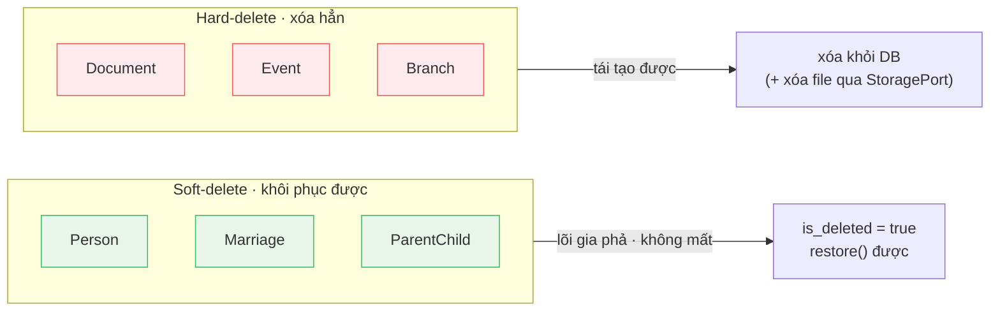

# ADR-006: Selective Soft-Delete by Aggregate

## Status
Accepted.

> **Update (2026-07-02):** Person/Marriage/ParentChild FKs use `ON DELETE RESTRICT`
> (persons are never hard-deleted). Soft-deleting a person currently leaves its edges
> live (they are hidden from the clan-scoped tree, which filters `is_deleted=false`,
> but the edge rows remain). **Decision:** soft-deleting a person will also
> soft-delete its edges; `restore` re-activates only the edges hidden by that same
> delete. Behavior change is scheduled (roadmap item E3 from the 2026-07-02 DB
> design review).

## Context
Genealogy records carry historical value and are often referenced by other
records. Accidentally losing a person or a marriage edge is far more damaging than
losing a document or a calendar event. At the same time, soft-delete everywhere
adds query-filter burden and storage growth.

Current behaviour (in `app/domain/`):
- `Person`, `Marriage`, `ParentChild` carry `is_deleted` / `deleted_at` /
  `deleted_by` and are **soft-deleted** (restorable; `Person` exposes `restore()`).
- `Document`, `Event`, `Branch` are **hard-deleted** by their repositories.

> 🇻🇳 **Tóm tắt:** Dữ liệu lõi gia phả (nhân khẩu và các cạnh huyết thống/hôn nhân)
> **xóa mềm** để có thể khôi phục và truy vết. Dữ liệu phụ trợ (tài liệu, sự kiện,
> chi/phái) **xóa cứng** vì có thể tạo lại; mọi lần xóa đều ghi vào nhật ký audit
> trước khi thực hiện.

## Decision
Apply soft-delete **only** to the core genealogy aggregates whose loss is
irreversible and audit-sensitive — persons and the edges between them. Keep
supporting aggregates (documents, events, branches) on hard-delete, since they are
re-creatable and not part of the irreplaceable lineage graph.

- Soft-delete writes `deleted_by` + `deleted_at` and emits a delete domain event
  for the audit trail; restoration emits a restore event.
- Hard-delete removes the row (and, for documents, the storage object via
  `StoragePort`) and emits a delete domain event for audit before removal.

## Consequences
Easier:
- Lineage data (persons, marriages, parent-child links) is recoverable and never
  silently lost; deletions are attributable via the audit log.
- Supporting tables stay lean without soft-delete filters everywhere.

Harder:
- **Mixed model** — contributors must know which aggregates are soft vs hard; all
  person/edge reads must filter `is_deleted`. The asymmetry is the main cost.
- Hard-deleted documents/events cannot be restored; rely on the audit log for the
  record of what existed.

See the per-aggregate summary in
[Domain Rules](../architecture/domain-rules.md#soft-delete-vs-hard-delete-summary).
