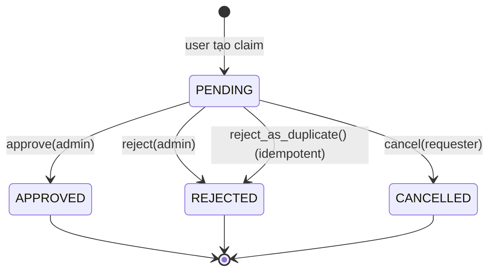

# ADR-007: Identity Claims Workflow

## Status
Accepted

> **Update (2026-07-05):** Claim review is authorized by the person's **origin clan**
> (`person.created_by_clan_id`, provenance) — an admin of the clan that entered the
> person into its tree reviews claims on that record. This is a deliberate choice (a
> membership-based model is a separate, unimplemented decision). A person whose origin
> clan was cleared to `NULL` (see ADR-009 `SET NULL`) has no controlling clan, so its
> claims cannot be reviewed. Documented and pinned on
> `ClaimCommandHandler._verify_admin_access` and its negative tests.

## Context
`Person` records are genealogy nodes and are not the same entity as an
authenticated `user` (the "person vs user" landmine in
[overview.md](../architecture/overview.md)). A real user often needs to assert
"this person record is me" — to surface their own node, manage their profile, or
gain context-specific access. This assertion must be reviewable (a user cannot
simply self-assign any node) and resistant to spam.

## Decision
Model the assertion as an explicit `IdentityClaim` entity in the `person` context
(`app/domain/person/entity.py`) with an admin-reviewed state machine:

> 🇻🇳 **Tóm tắt:** "Nhận thân" — người dùng xác nhận một bản ghi nhân khẩu trong gia
> phả chính là mình. Chỉ người gửi được tự hủy (khi còn PENDING); admin dòng họ
> duyệt hoặc từ chối. Mỗi người dùng chỉ có tối đa **một yêu cầu chờ duyệt** để
> tránh spam.

Rules:
- `cancel()` is allowed **only** for the original requester and **only** while
  `PENDING`.
- `approve()` / `reject()` act **only** from `PENDING` and record
  `reviewed_by`, `reviewed_at`, `reviewer_note`.
- **Spam guard:** at most **one PENDING claim per user globally** (enforced by a
  unique constraint), so a user cannot flood multiple pending claims.

The claim lifecycle flows through the standard application/handler + Unit of Work
path; the REST surface is documented in
[contracts/rest-claims-api.md](../contracts/rest-claims-api.md).

## Consequences
Easier:
- Clear, auditable bridge between authenticated users and genealogy nodes.
- Admins gate the mapping; the unique-pending constraint limits abuse.

Harder:
- Requires an admin review step (latency before a claim resolves).
- Duplicate / contested claims need an explicit resolution path
  (`reject_as_duplicate`) and clear messaging to the requester.

## Related
- [Domain Rules — Identity claims](../architecture/domain-rules.md#identity-claims)
- [Bounded Contexts](../architecture/bounded-contexts.md)
- [RBAC](../architecture/rbac.md)
