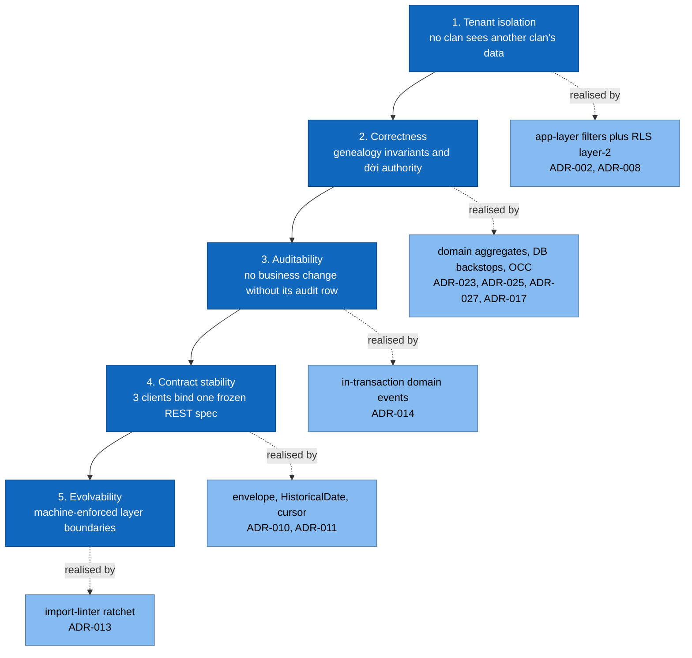

# 1. Introduction and Goals

## 1.1 What the system does

Lets Vietnamese clans (*dòng họ*) maintain an accurate, shared family tree across web
and mobile, with role-based collaboration, full auditability, and strict per-clan data
isolation so many clans coexist in one deployment.

## 1.2 Requirements overview

| # | Capability | Owner surface |
|---|---|---|
| R1 | Clan-scoped person records with rich Vietnamese naming + historical dates | `person` |
| R2 | Genealogy edges: marriage (incl. đa thê), parent-child | `relationship` |
| R3 | Tree read: descendants, ancestors, focus view, computed **đời** | `tree` |
| R4 | Multi-clan membership + clan switching | `clan`, `me` |
| R5 | RBAC: `viewer < editor < admin`, plus platform `super_admin` | `auth`, `clan` |
| R6 | Documents (photos/files), events, giỗ anniversary reminders | `document`, `event` |
| R7 | Identity claims — link an auth user to a person record | `person` |
| R8 | Clan export — lossless JSON archive + GEDCOM 5.5.1 interop | `export` |
| R9 | Audit trail on every mutation | cross-cutting |
| R10 | 4 locales: `vi` (default), `en`, `zh`, `fr` | cross-cutting |

## 1.3 Quality goals (top 5, ranked)

Detail: [10-quality-requirements.md](10-quality-requirements.md).

## 1.4 Stakeholders

| Role | Cares about |
|---|---|
| Clan admin | Membership approval, roles, accuracy, export |
| Clan editor / viewer | Adding relatives; browsing the tree; giỗ reminders |
| Platform super-admin | Cross-clan observability, audit log, clan suspension |
| Backend / web / mobile devs | Layer rules, frozen contracts, test harness |
| Operator | Deploys, migrations, backups, incidents |
