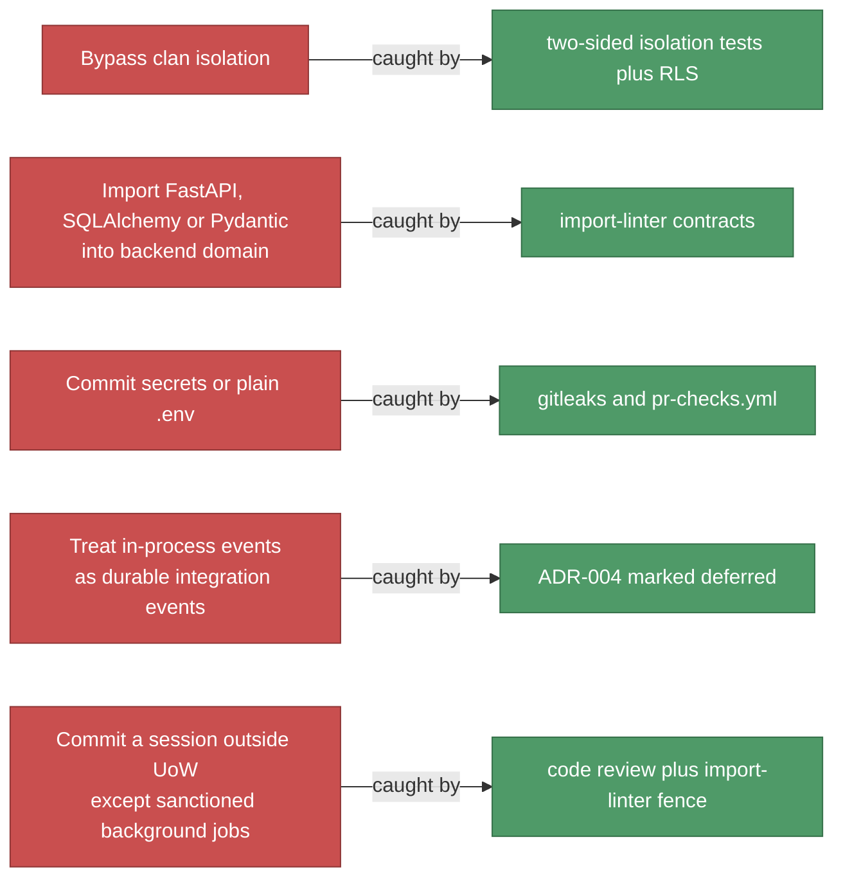
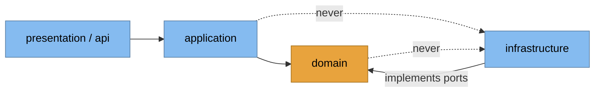

# 2. Architecture Constraints

## 2.1 Technical

| Constraint | Consequence |
|---|---|
| Python 3.14 · FastAPI · SQLAlchemy async (psycopg v3) · Pydantic v2 | Backend stack fixed |
| PostgreSQL, **single schema**, `clan_id` isolation | No per-tenant schema/DB (ADR-002) |
| Alembic, one **linear** chain, revision id ≤ 32 chars | No migration branches |
| Next.js 16 · React 19 · TypeScript strict | Web stack fixed |
| Flutter · Dart · BLoC · Dio/Retrofit · get_it | Mobile stack fixed |
| Supabase Auth issues JWTs; backend validates via JWKS | Backend never mints tokens |
| Supabase Storage, one bucket, path isolation `clans/{clan_id}/…` | No per-clan bucket |
| Render (backend) + Vercel (web); region `singapore` | Latency budget set by region |

## 2.2 Organizational / process

- **Docs-with-code:** API change → update `docs/contracts/*` in the same PR;
  architectural change → new ADR in the same PR.
- **Quality gate before "done"** (backend): `pytest -q` · `ruff check .` ·
  `ruff format --check .` · `mypy app/ tests/` · `lint-imports`.
- Integration tests run against a **real Postgres**, never mocks (ADR-016).
- `main` → production directly. **No staging gate.**

## 2.3 Conventions — hard rules

Layer dependency rule (all three codebases share this shape):

