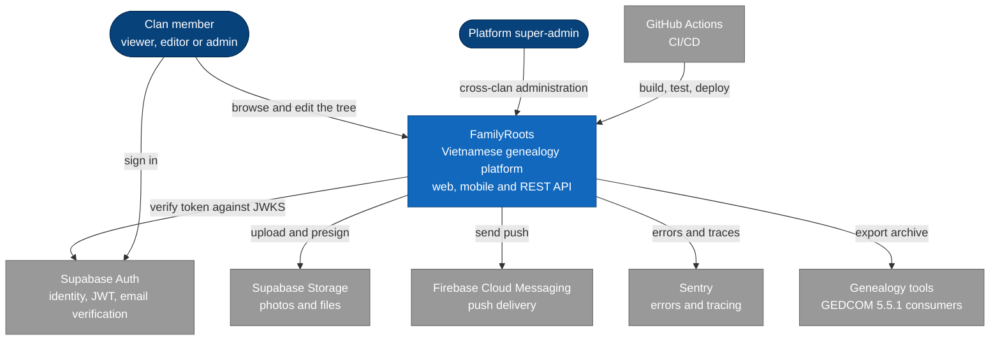

# 3. Context and Scope — C4 Level 1 (System Context)

## 3.1 System context

FamilyRoots as a single box: the people who use it and the external systems it depends
on or serves. Internal decomposition starts in
[05-building-block-view](05-building-block-view.md).

## 3.2 External interfaces

| Neighbour | Direction | Protocol / contract |
|---|---|---|
| Supabase Auth | out + in | Auth REST for login/register; JWKS for token verification (cached 1 h) |
| Supabase Storage | out | Bucket `family-roots-files`, path `clans/{clan_id}/…`, presigned URLs |
| FCM | out | Firebase Admin SDK; tokens in `user_fcm_tokens` |
| Sentry | out | DSN, error + trace ingest |
| GEDCOM consumers | out | GEDCOM 5.5.1 file (ADR-020) |
| GitHub Actions | in | Render deploy hook, Vercel CLI, `pg_dump` backup |

## 3.3 In scope / out of scope

**In:** clan-scoped genealogy data, tree read models, RBAC, documents, events +
giỗ reminders, identity claims, exports, audit, i18n (vi/en/zh/fr).

**Out (today):** durable event bus and async worker (ADR-004/005, _deferred_);
PDF export; staging environment; real-time collaboration; payments.
