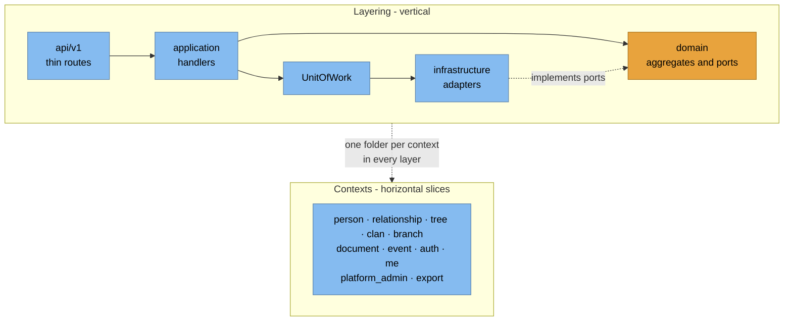
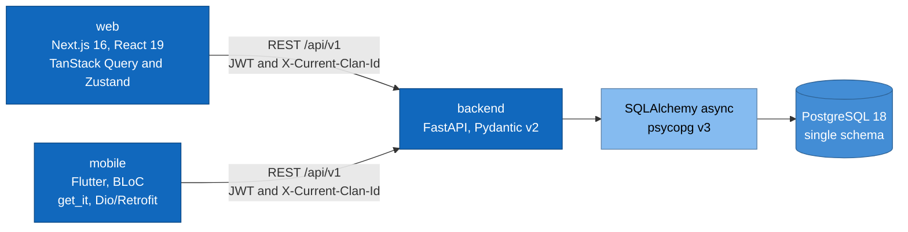

# 4. Solution Strategy

## 4.1 Goal → approach

| Goal | Approach | Ref |
|---|---|---|
| Tenant isolation | App-layer `clan_id` filter (primary) + Postgres RLS (layer-2) | ADR-002, ADR-008 |
| Domain correctness | DDD aggregates + DB backstop constraints/triggers + OCC `version` | ADR-023/025, ADR-017 |
| Auditability | Domain events dispatched **inside** the write transaction | ADR-014 |
| One contract, 3 clients | REST-first, frozen envelope + `HistoricalDate` + cursor pagination | ADR-003/010/011 |
| Evolvability | Hexagonal layers, machine-enforced by import-linter ratchet | ADR-001, ADR-013 |
| Read performance | CQRS query ports + recursive-CTE tree functions, bulk-fetch (no N+1) | ADR-001 |
| Test confidence | Real-Postgres integration harness, two-sided isolation tests | ADR-016 |

## 4.2 Decomposition strategy

Vertical layering, horizontal context slices — one folder per context in every layer.

**Write side** → aggregate + repository port + UoW + domain events.
**Read side** → CQRS query port, may join across aggregates, no aggregate load.

## 4.3 Key technology choices

## 4.4 Deliberately deferred

- **Redis event bus + worker service** (ADR-004/005) — in-process
  `InMemoryEventDispatcher` today; not a durable integration bus.
- **Async/PDF export** — exports are synchronous and request-scoped.
- **Staging environment** — `main` is production.
