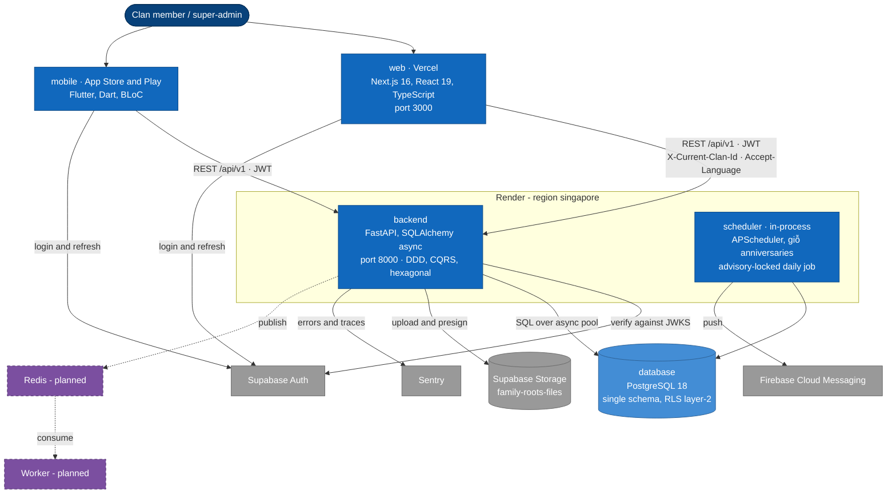
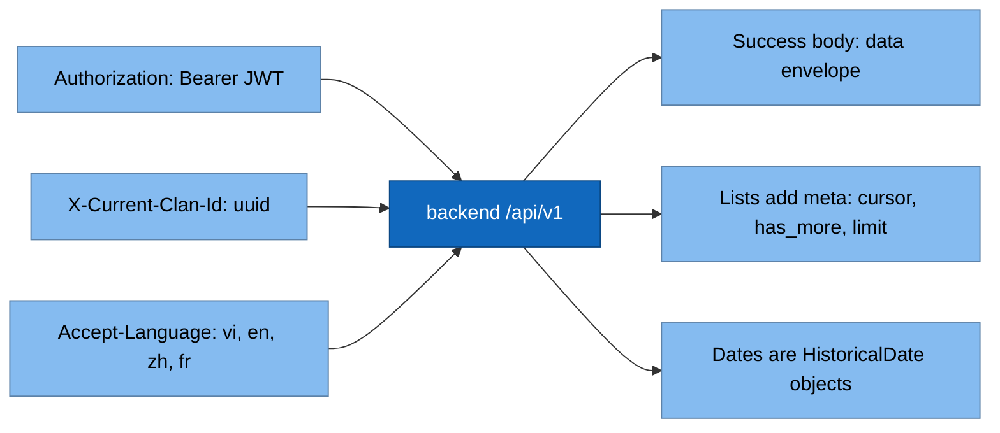
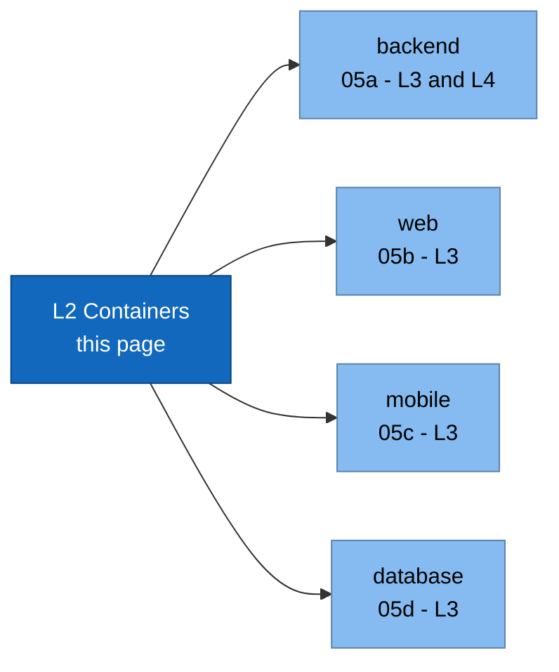

# 5. Building Block View — C4 Level 2 (Containers)

## 5.1 Container diagram

## 5.2 Container responsibilities

| Container | Responsibility | Must not |
|---|---|---|
| **web** | Browser UX, admin/backoffice, clan switcher, tree render (XYFlow) | Hold business rules; bypass application ports |
| **mobile** | Native UX, offline-ish cache, push receipt | Assemble auth headers ad-hoc |
| **backend** | All business rules, persistence, authz, contracts, export | Leak infra into domain |
| **scheduler** | Daily anniversary scan + FCM fan-out | Write via UoW (sanctioned out-of-band writer) |
| **database** | Canonical state + invariant backstops + RLS | Be reached by any client directly |

## 5.3 Interfaces between containers

Surfaces: `auth · me · clans · branches · persons · relationships · tree · documents ·
events · exports · claims · invitations · platform-admin` (+ `/health`).
Spec: [`docs/contracts/`](../contracts/README.md).

## 5.4 Drill down (C4 Level 3)

- [05a — backend components (L3) + code (L4)](05a-backend-components.md)
- [05b — web components (L3)](05b-web-components.md)
- [05c — mobile components (L3)](05c-mobile-components.md)
- [05d — database components (L3)](05d-database-components.md)
