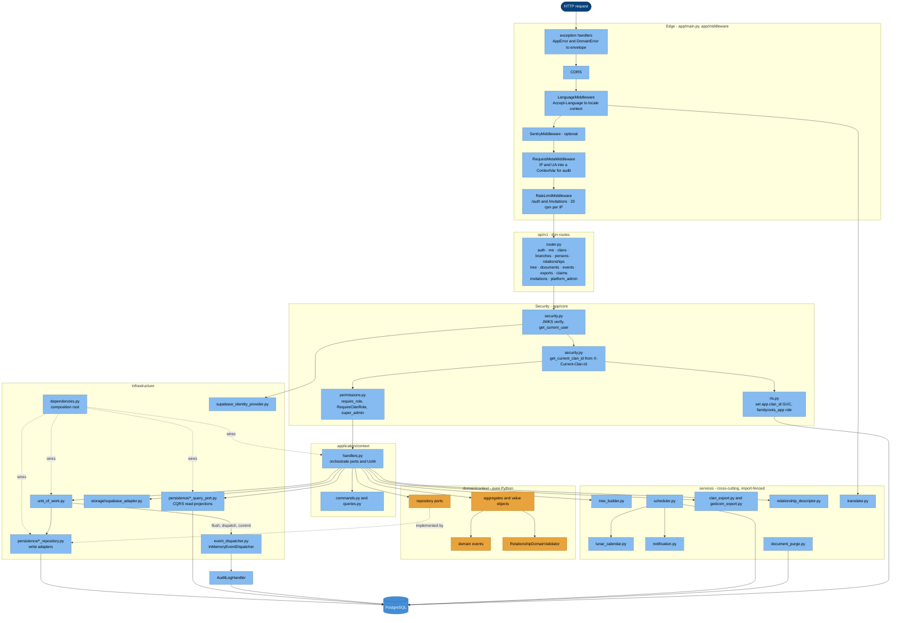
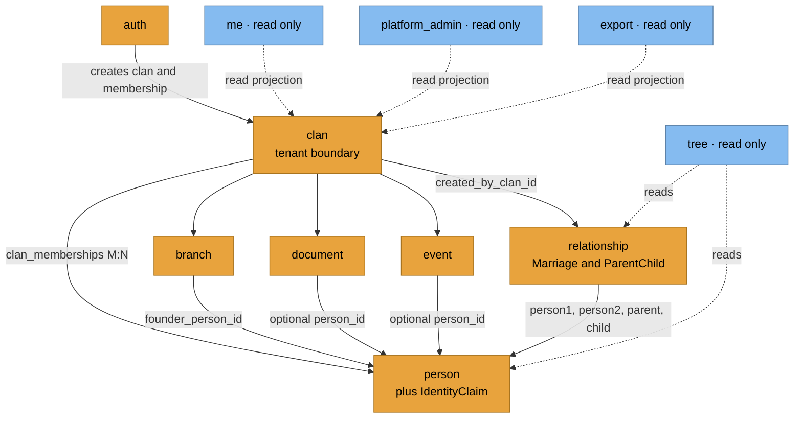
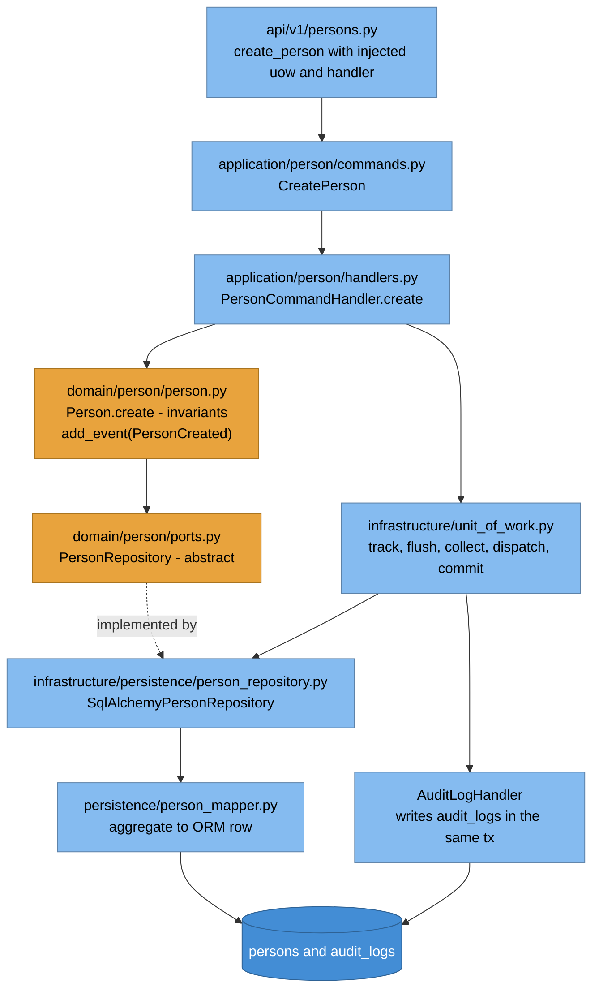
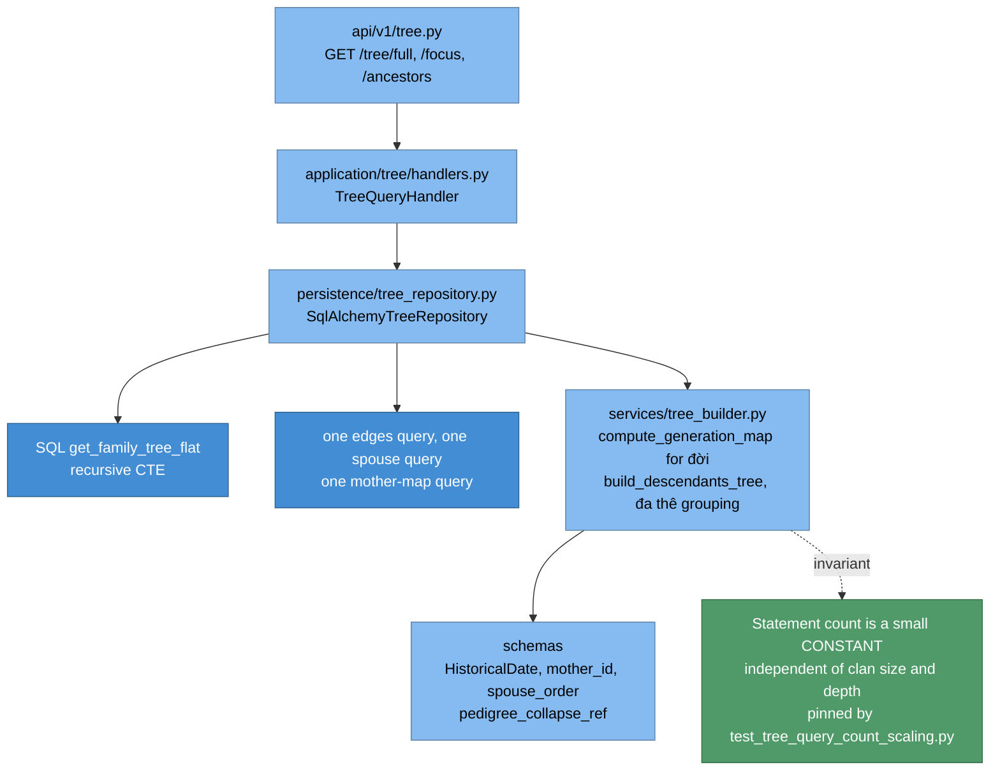

# 5.1 Backend — C4 Level 3 (Components) + Level 4 (Code)

`backend/app/` · FastAPI · DDD + CQRS + hexagonal. Layer rules machine-enforced by
`uv run lint-imports` (ADR-013).

## 5.1.1 Component diagram

## 5.1.2 Component responsibilities

| Component | Owns | Rule |
|---|---|---|
| `api/v1/*` | HTTP shape, status codes, DTO in/out | Thin — no business logic |
| `application/*` | Use-case orchestration, transaction scope | Imports domain only |
| `domain/*` | Invariants, aggregates, ports, events | No FastAPI/SQLAlchemy/Pydantic |
| `infrastructure/persistence/*_repository` | Write adapters for domain ports | Clan filter on every read |
| `infrastructure/persistence/*_query_port` | Read projections, cross-aggregate joins | No aggregate hydration |
| `infrastructure/unit_of_work` | flush → collect events → dispatch → commit | Sole commit path for writes |
| `infrastructure/dependencies` | Composition root → FastAPI `Depends` | Only place that wires concretes |
| `services/*` | Tree build, lunar, scheduler, notify, export, purge | Fenced: no api/application/domain/models imports |

## 5.1.3 Bounded contexts (domain map)

Detail: [bounded-contexts.md](../architecture/bounded-contexts.md).

## 5.1.4 C4 Level 4 — code: a write path (`person`)

Invariants enforced here: OCC `version` (ADR-017), soft-delete rules (ADR-006),
clan membership on referenced persons, `HistoricalDate` precision (ADR-011).

## 5.1.5 C4 Level 4 — code: the tree read path

đời authority: **con theo đời cha** — thủy tổ = 1, đời = canonical parent's đời + 1
(ADR-027). Detail: [tree-read-model.md](../architecture/tree-read-model.md).

## 5.1.6 Testing components

| Suite | Location | Backing |
|---|---|---|
| unit | `tests/unit/{api,domain,infrastructure}` | dict/row factories, no DB |
| integration | `tests/integration/` | **real Postgres**, full Alembic chain (ADR-016) |
| isolation | `test_cross_clan_edge_guard.py`, RLS phase tests | two-sided: A sees, B does not |
| perf net | `test_tree_query_count_scaling.py`, `test_person_list_scaling.py` | statement-count + index pins |
