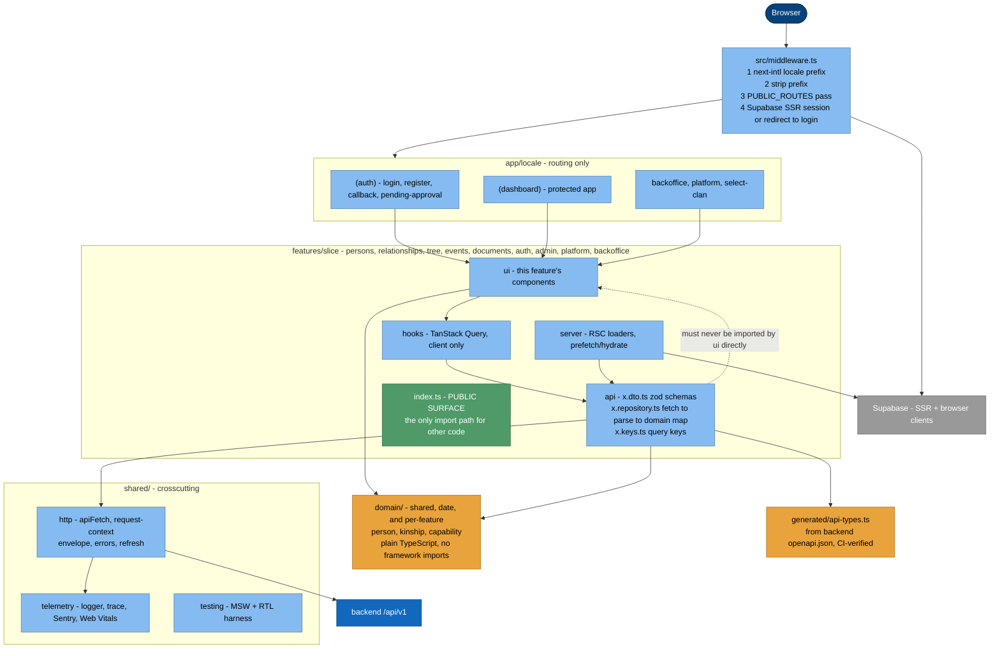
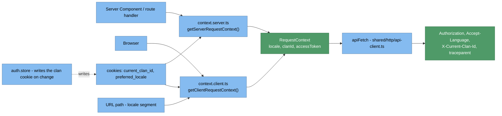

# 5.2 Web (frontend) — C4 Level 3 (Components)

`web/src/` · Next.js 16 App Router · React 19 · TypeScript strict · pnpm 10.

Mid-migration. The spine (`domain/`, `shared/http`, `shared/telemetry`, `generated/`,
the four test harnesses, dependency-cruiser) landed as PR 0 of sub-project A
(`docs/superpowers/plans/2026-08-02-web-spine.md`). It adds no screens and touches no
existing component. `src/lib/api`, `src/lib/hooks`, `src/application/<feature>/` and
`src/infrastructure/<feature>/` are the pre-envelope legacy this replaces — still
load-bearing until each feature slice PR migrates its screens onto the target shape below
and deletes them (`axios` goes with them).

## 5.2.1 Target component diagram

`src/features/` does not exist yet — it is created by the first feature slice PR, one
`<slice>/` at a time. Until then, code that isn't part of the spine lives in the legacy
trees this diagram excludes; see `docs/sad/11-risks-and-technical-debt.md` R3/R11.

## 5.2.2 Layer rules

The intended import directions — the frontend counterpart of the backend's `lint-imports`
ratchet (ADR-013):

| Layer | May import | Must not import |
|---|---|---|
| `domain/**` | `domain/**` only | react, next, zod, fetch, tanstack, zustand, supabase |
| `features/*/api` | `domain`, `shared/http`, `generated` | react, ui, hooks, other features |
| `features/*/hooks`, `server`, `model` | own `api` + `domain`, `shared/**` | other features' internals |
| `features/*/ui` | own `hooks`/`model`, `domain`, shared presentational components | `api` (no direct transport) |
| `features/A` | `features/B` **via `index.ts` only** | `features/B/api/...` |
| `app/**` | `features/*/index.ts`, `shared/**` | `api` directly |
| anything | — | `app/**` |

**Only the third column is machine-enforced.** `pnpm depcruise` runs nine rules in
`.dependency-cruiser.cjs`, and dependency-cruiser can only forbid — it has no allow-list —
so the *May import* column is architecture we hold ourselves to, not a gate that will catch
us. The rule names and exactly what each one forbids are listed in `web/CLAUDE.md`;
consult that before assuming a boundary is protected. `src/shared/` is `http/`,
`telemetry/` and `testing/` — there is no `shared/ui/` yet, and where reusable
presentational components should live is an open sub-project B decision.

The legacy trees (`src/lib/api`, `src/lib/hooks`, `src/application`, `src/infrastructure`,
`src/types`) are excluded from these rules — they are being deleted, not refactored into
compliance.

Path alias `@/*` → `./src/*`.

## 5.2.3 Request context resolution (the spine, built)

The clan id lives in a cookie (`current_clan_id`, readable by both runtimes), not
`localStorage` (unreadable from a Server Component) — the reason the clan selector moved
there. `context.client.ts` reads the locale from the URL path rather than a store, so it is
correct on the very first render before anything has hydrated.

**Rule:** never assemble the three contract headers ad-hoc — construct a `RequestContext`
via `getServerRequestContext()` / `getClientRequestContext()` and pass it to `apiFetch`.
The pre-spine rule ("route through the shared Axios instance or `getRequestContext()`" in
`src/infrastructure/http/`) still applies to legacy code only, until it is deleted.

## 5.2.4 i18n and routing

- `next-intl`, locales `vi | en | zh | fr`, default **`vi`**, `localePrefix: 'always'`
  → every route is `/vi/…`, `/en/…`. Config: `src/i18n/routing.ts`, strings in `messages/*.json`.
- If Supabase env vars are missing, the middleware **skips** the auth check — local-dev footgun.
- `src/app/layout.tsx` hardcodes `<html lang="en">`; `src/app/[locale]/layout.tsx` renders a
  `
`, not an `<html>`, so the negotiated locale never reaches the `lang` attribute —
  tracked as **R-lang** in
  [11-risks-and-technical-debt.md](11-risks-and-technical-debt.md), ratcheted by a
  `test.fail()` in `web/e2e/smoke.spec.ts`.

## 5.2.5 Contract binding

Response handling must follow the frozen contract: `{data}` envelope, list `meta`
cursor pagination, `HistoricalDate` rendering (`date` when `precision === "exact"`,
else `display`, falling back to `date`), `profile` / `include` / `fields`.
**Gotcha:** keys from `include_by_id` must be merged into the sparse `fields` set or
compound includes are dropped.

The spine's `shared/http/envelope.ts` (`unwrapData` / `unwrapPage`) and
`src/domain/date/historical-date.ts` are the only code that implements these rules; new
code calls them rather than re-implementing.

⚠️ Legacy clients (`lib/api/auth.ts`, parts of `infrastructure/**`, member/tree types)
were scaffolded against **pre-envelope** shapes — see
[11-risks-and-technical-debt.md](11-risks-and-technical-debt.md).

## 5.2.6 Testing

Four harnesses, one gate each — see `web/CLAUDE.md` for the exact commands:

- `pnpm test:unit` — Vitest, node environment. Domain and `shared/http` logic.
- `pnpm test:component` — Vitest, jsdom, React Testing Library + MSW
  (`src/shared/testing/`).
- `pnpm test:e2e` — Playwright, against a real `next dev` server, desktop + mobile
  viewports (`web/playwright.config.ts`, `web/e2e/`).
- `tests/behavior/*.test.ts` (`pnpm test:behavior`) and `tests/contracts/*.test.mjs`
  (`pnpm test:contracts`) — the pre-spine Node built-in test runner suites, scoped to the
  legacy trees; not part of the gate for new code.

CI gate (`.github/workflows/web-ci.yml`): type-check, lint, `depcruise`, unit, component,
build, e2e, and `api-types-fresh` (fails if `src/generated/api-types.ts` drifts from the
backend's OpenAPI schema — triggered by changes under `web/**` **or** `backend/app/**`).
