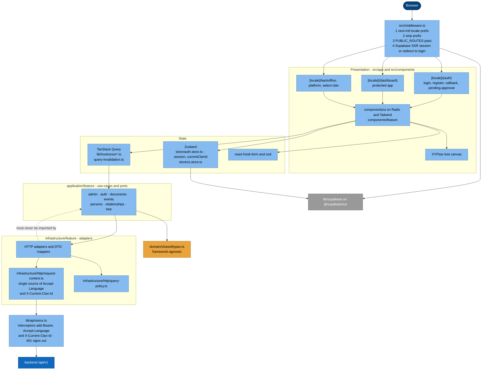
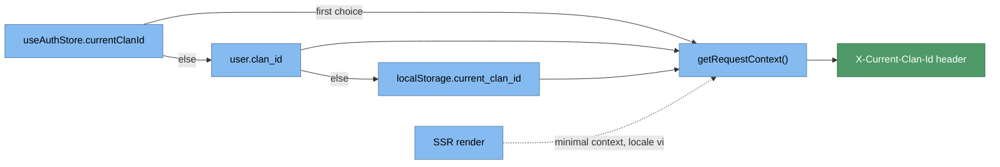

# 5.2 Web (frontend) — C4 Level 3 (Components)

`web/src/` · Next.js 16 App Router · React 19 · TypeScript strict · pnpm 10.
Mid-migration to layered DDD + Clean; legacy `src/lib/api` and `src/lib/hooks` are still
load-bearing.

## 5.2.1 Component diagram

## 5.2.2 Layer rules

| Layer | May import | Must not import |
|---|---|---|
| `domain/` | nothing framework-y | React, Next, Axios, Supabase, Zustand, TanStack |
| `application/<feature>/` | domain, own ports | infrastructure implementations |
| `infrastructure/<feature>/` | application ports, axios, supabase | presentation |
| presentation (`app/`, `components/`, `lib/hooks/`, `store/`) | application use-cases | repositories directly |

Path alias `@/*` → `./src/*`.

## 5.2.3 Clan context resolution

**Rule:** never assemble the three contract headers ad-hoc — route through the shared
Axios instance or `getRequestContext()`.

## 5.2.4 i18n and routing

- `next-intl`, locales `vi | en | zh | fr`, default **`vi`**, `localePrefix: 'always'`
  → every route is `/vi/…`, `/en/…`. Config: `src/i18n/routing.ts`, strings in `messages/*.json`.
- If Supabase env vars are missing, the middleware **skips** the auth check — local-dev footgun.

## 5.2.5 Contract binding

Response handling must follow the frozen contract: `{data}` envelope, list `meta`
cursor pagination, `HistoricalDate` rendering (`date` when `precision === "exact"`,
else `display`), `profile` / `include` / `fields`.
**Gotcha:** keys from `include_by_id` must be merged into the sparse `fields` set or
compound includes are dropped.

⚠️ Legacy clients (`lib/api/auth.ts`, parts of `infrastructure/**`, member/tree types)
were scaffolded against **pre-envelope** shapes — see
[11-risks-and-technical-debt.md](11-risks-and-technical-debt.md).

## 5.2.6 Testing

Node built-in test runner only (no Jest/Vitest): `tests/behavior/*.test.ts`
(`pnpm test:behavior`) and `tests/contracts/*.test.mjs` (`pnpm test:contracts`).
Gate: `pnpm type-check && pnpm lint`.
