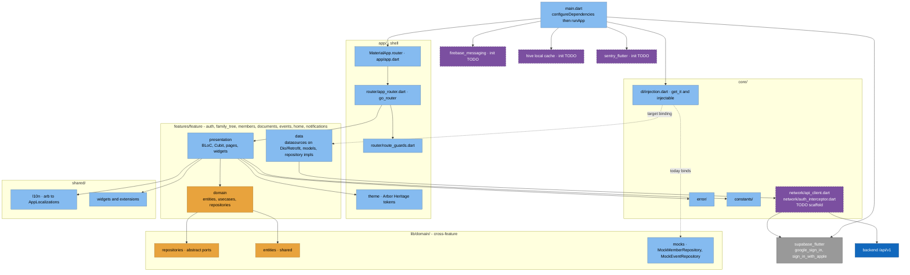
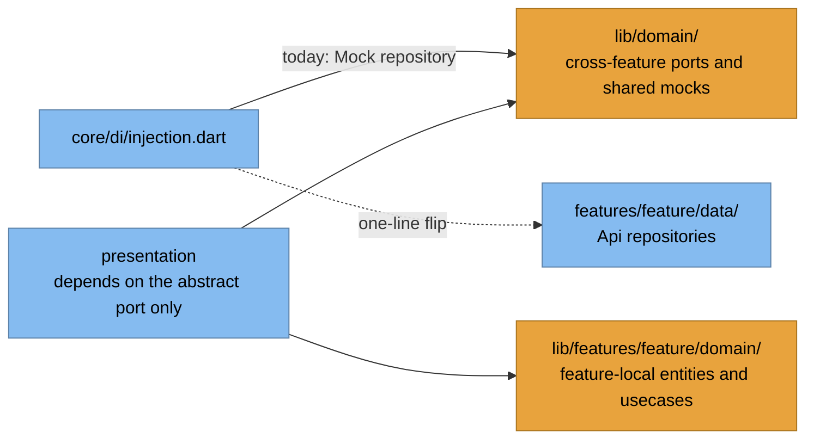
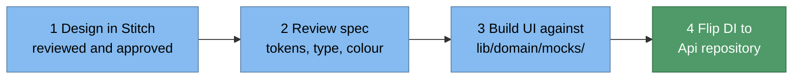

# 5.3 Mobile — C4 Level 3 (Components)

`mobile/lib/` · Flutter · Clean Architecture + feature-first modules + BLoC.

## 5.3.1 Component diagram

## 5.3.2 Two "domain" locations — read carefully

Flipping a feature from mock to real API is a **one-line DI change** — no widget edits.

## 5.3.3 Building blocks

| Concern | Choice | Note |
|---|---|---|
| State | `flutter_bloc` — Cubit (simple) / BLoC (event-driven) | Cubits registered **factory** → fresh per screen |
| DI | `get_it` + `injectable` (codegen) | Manual bindings in `core/di/injection.dart` |
| Routing | `go_router` + guards | Root is `MaterialApp.router` |
| Network | `dio` + `retrofit` typed clients | Interceptor must attach the 3 contract headers + refresh on 401 |
| Local cache | `hive` / `hive_flutter` | Init is TODO |
| Auth | `supabase_flutter` | + Google / Apple sign-in |
| Push | `firebase_core` + `firebase_messaging` | Init is TODO |
| Errors | `sentry_flutter` | Init is TODO |
| i18n | `.arb` in `shared/l10n` → `AppLocalizations` | No hardcoded user-facing strings |
| Codegen | `build_runner` | Re-run after BLoC/Freezed/Retrofit/injectable changes |

## 5.3.4 UI-first workflow (mandated)

Arbor Heritage mandates: no 1px separator borders, Plus Jakarta Sans (headings) /
Manrope (body), radius `9999px` buttons and `2rem` nodes, ambient depth not drop
shadows, glass surfaces at 80% + 20px blur, never `#000000`.

## 5.3.5 Known scaffold state

`core/network/api_client.dart`, `core/network/auth_interceptor.dart`, Firebase/Sentry/Hive
init in `main.dart`, and most per-feature `data/` adapters are **intentional stubs**;
the DI container still resolves mocks. Gate: `flutter test && dart analyze .`.
