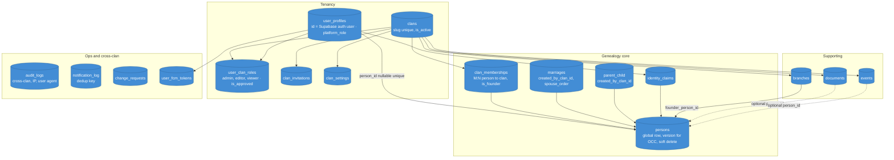
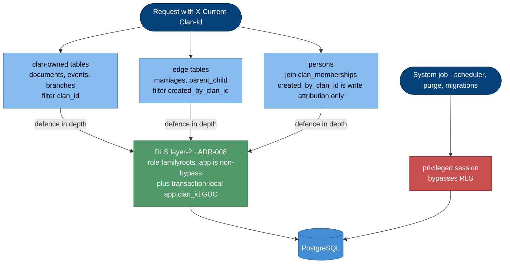
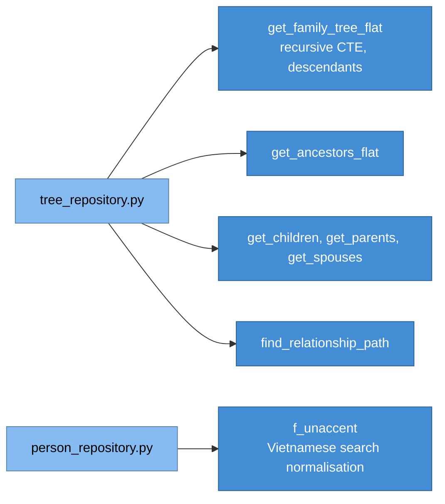
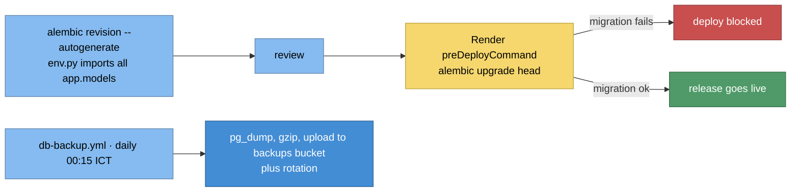

# 5.4 Database — C4 Level 3 (Components)

PostgreSQL 18 · **single `public` schema** · isolation by `clan_id` (ADR-002) ·
Alembic single linear chain. Full column reference:
[data-model.md](../architecture/data-model.md).

## 5.4.1 Table groups

## 5.4.2 Isolation mechanism — differs by table

RLS **ENABLED** on: `documents`, `events`, `branches`, `marriages`, `parent_child`,
`persons` (migrations `002`, `027`, `028`, `029`). Remaining clan-scoped tables roll
out table-by-table. Gated by `RLS_ENABLED` for code-free rollback.
App-layer filtering remains the **primary** guarantee.

## 5.4.3 Invariant backstops in the DB

| Object | Guards |
|---|---|
| `trg_parent_child_integrity` → `parent_child_integrity_guard()` | Graph invariants on edge write (ADR-023) |
| `trg_parent_child_clan_lock` → `parent_child_clan_lock()` | Per-clan edge-write serialization (ADR-025) |
| `idx_parent_child_unique_edge`, `idx_marriages_unique_pair` | No duplicate edges |
| `uq_marriages_spouse_order` | Two-sided per-person `spouse_order` (ADR-029) |
| `uq_clan_memberships_one_founder` | One thủy tổ per clan (ADR-026) |
| `uq_identity_claim_user_pending`, `uq_clan_invitations_pending` | One pending claim / invite |
| `idx_notification_log_dedup` | Idempotent anniversary push |
| `persons.version` + friends | Optimistic concurrency (ADR-017) |
| FK `RESTRICT` on clan delete | ADR-009 |

## 5.4.4 Read-model SQL functions

## 5.4.5 Performance surfaces

- Keyset/cursor pagination on `(created_at, id)` — `idx_persons_fullname_keyset`.
- Trigram search: `idx_persons_fullname_trgm`, `idx_persons_birthname_trgm`.
- Partial indexes for hot filters: `idx_documents_purge_due`,
  `idx_events_recurring_date`, `idx_user_clan_roles_pending`,
  `idx_change_requests_pending`, `idx_parent_child_parent_clan_live`.
- Clan-scope index pinned by `test_person_list_scaling.py` (`enable_seqscan=off` +
  asserts `idx_clan_memberships_clan`).

## 5.4.6 Lifecycle

Soft delete: `persons`, `documents` (+ retention purge, ADR-019), `events` (ADR-022),
edges. Hard delete elsewhere (ADR-006).
