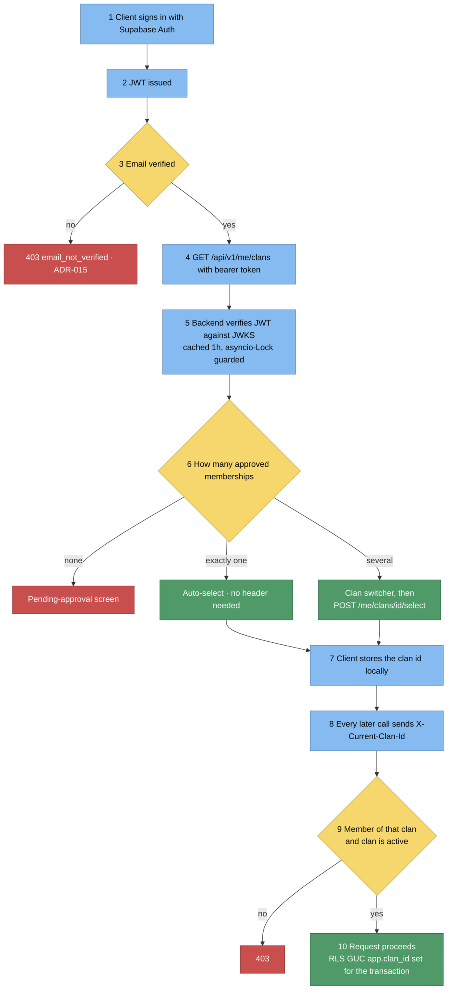
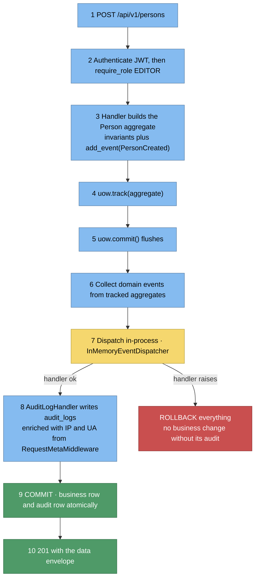
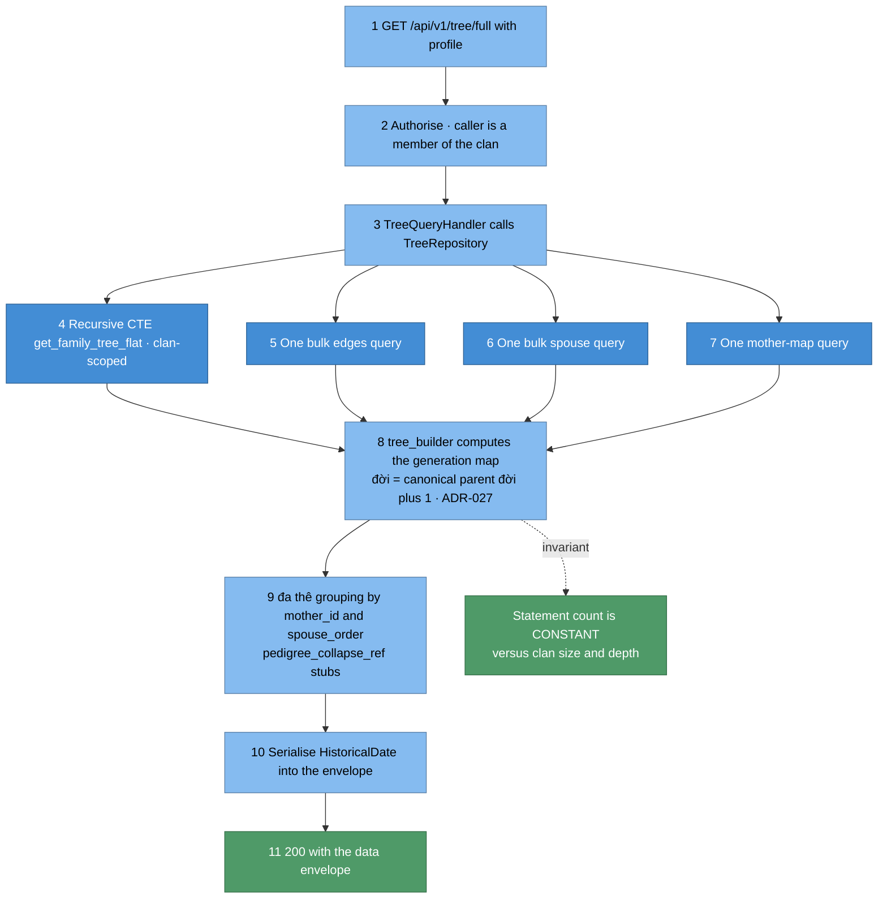
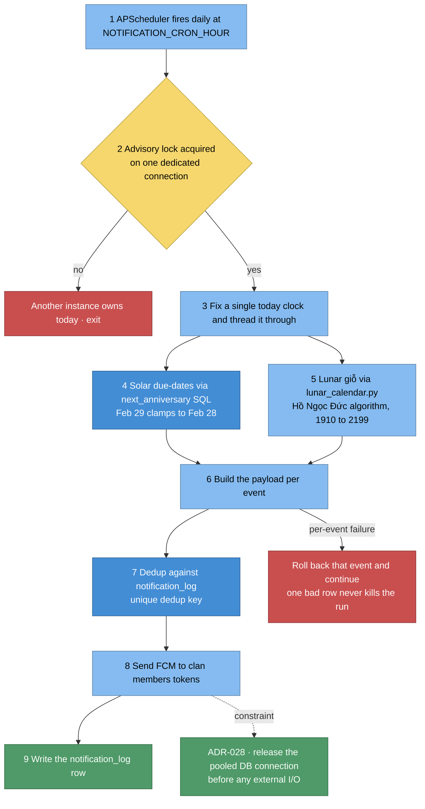
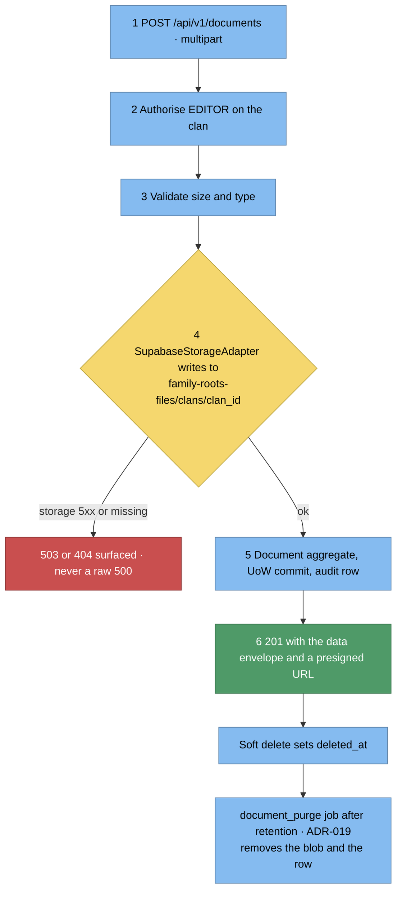
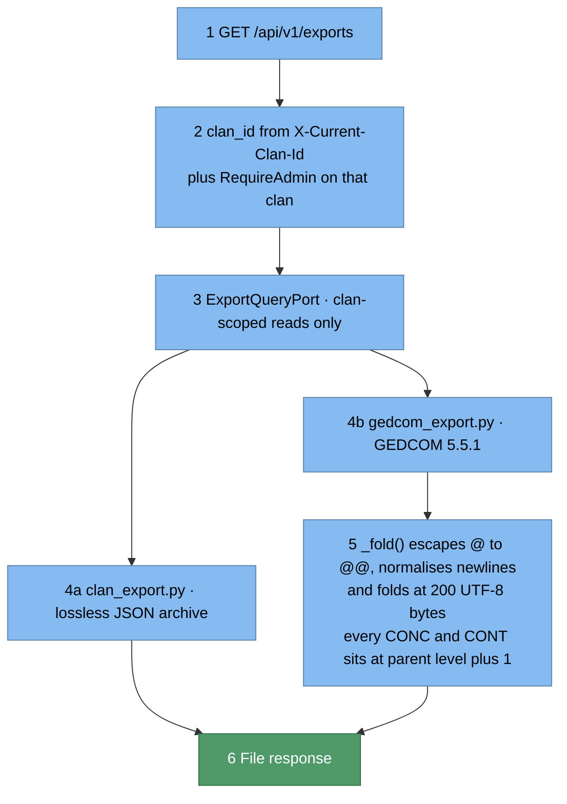
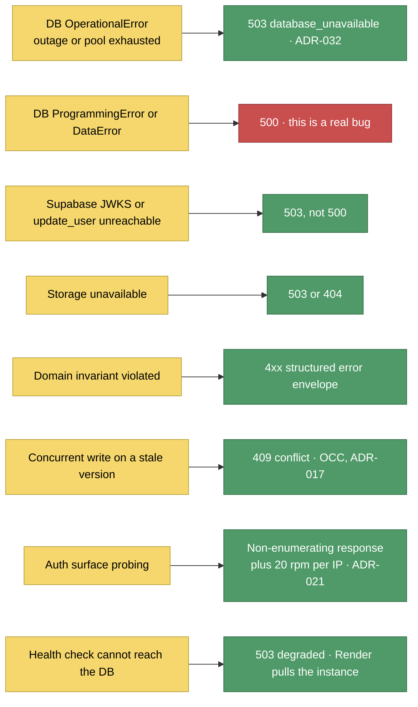

# 6. Runtime View

## 6.1 Login and clan-context selection

## 6.2 Write path — create a person (UoW + audit in one transaction)

**Consequence (ADR-014):** audit is guaranteed, but a failing handler fails the write —
accepted coupling. Events are **not** durable integration events.

## 6.3 Read path — full tree

## 6.4 Giỗ (death anniversary) notification job

## 6.5 Document upload

## 6.6 Clan export

Synchronous and request-scoped — the async worker of ADR-005 is **not** built.

## 6.7 Failure modes

