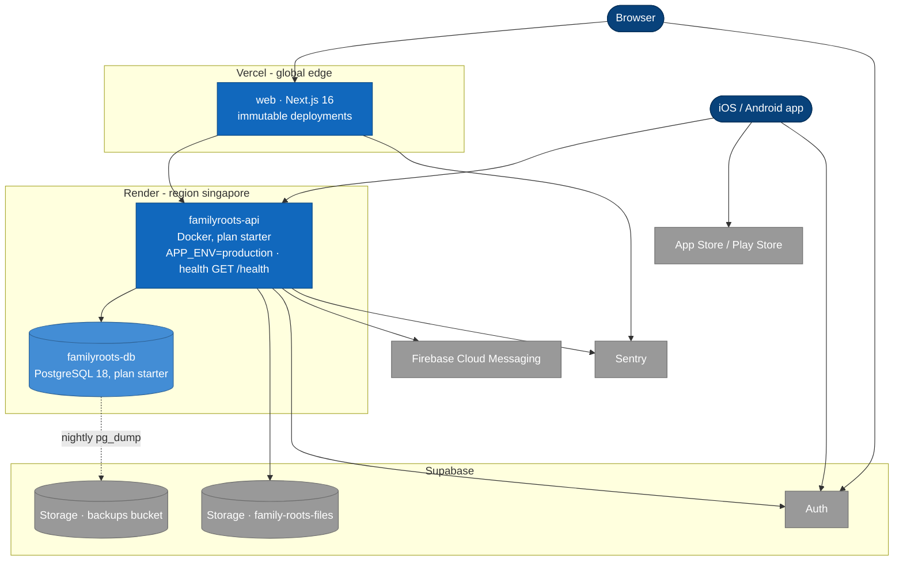
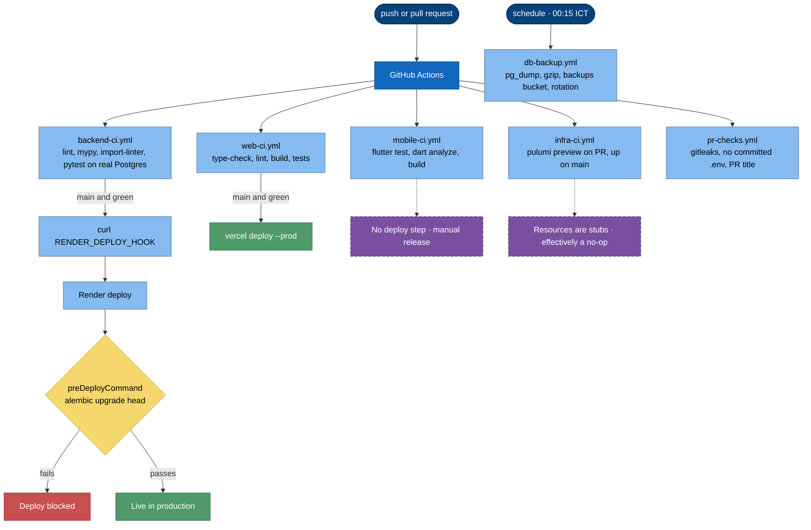
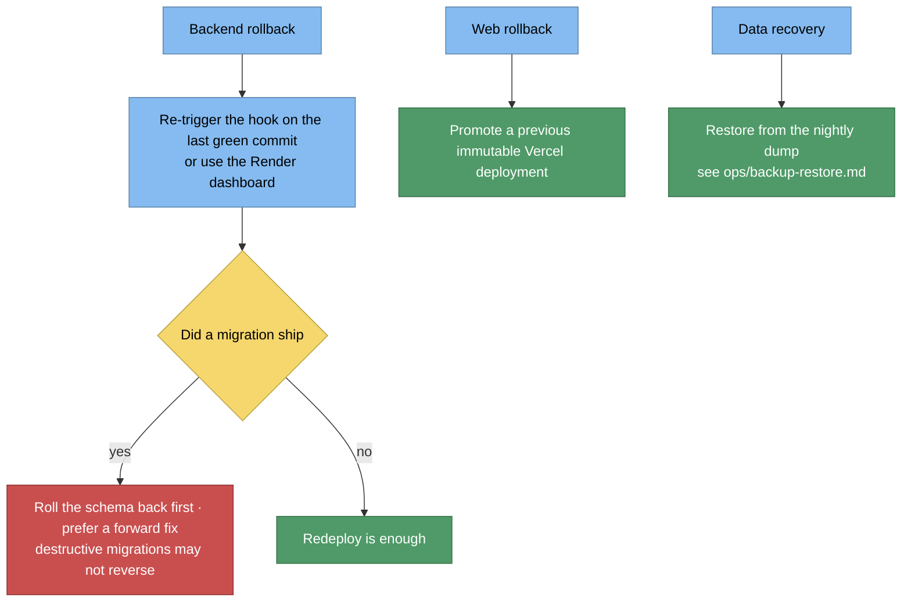

# 7. Deployment View

## 7.1 Production topology

Notable: no load balancer tier of our own, no Redis, no worker process — the
scheduler runs **in-process** inside the API container (advisory-locked so multiple
instances are safe).

## 7.2 CI/CD pipelines

**There is no staging gate — `main` merges reach production.** `develop` runs CI only.

## 7.3 Environments

| Env | Backend | Web | DB |
|---|---|---|---|
| local | `uv run uvicorn app.main:app --reload` :8000 | `pnpm dev` :3000 | `docker compose up -d pgdb pgadmin` |
| test | pytest process | node test runner | throwaway `family_roots_schema_test`, full Alembic chain |
| production | Render Docker, singapore | Vercel | Render Postgres 18, singapore |

## 7.4 Configuration and secrets

- All backend settings in `app/core/config.py` (`pydantic-settings`, reads `.env`);
  required keys listed in `.env.example`.
- Production config **fails fast** on an unsafe setup (e.g. wildcard `ALLOWED_HOSTS`).
- `APP_SECRET_KEY` generated by Render; `DATABASE_URL` injected `fromDatabase`.
- Docs (`/docs`, `/redoc`) only mount when `APP_DEBUG=true`.
- Secrets never committed — enforced by gitleaks + the no-`.env` gate.

## 7.5 Rollback

