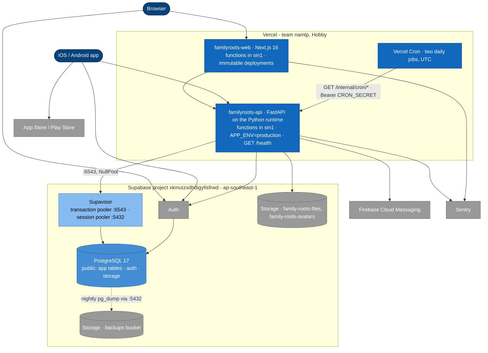
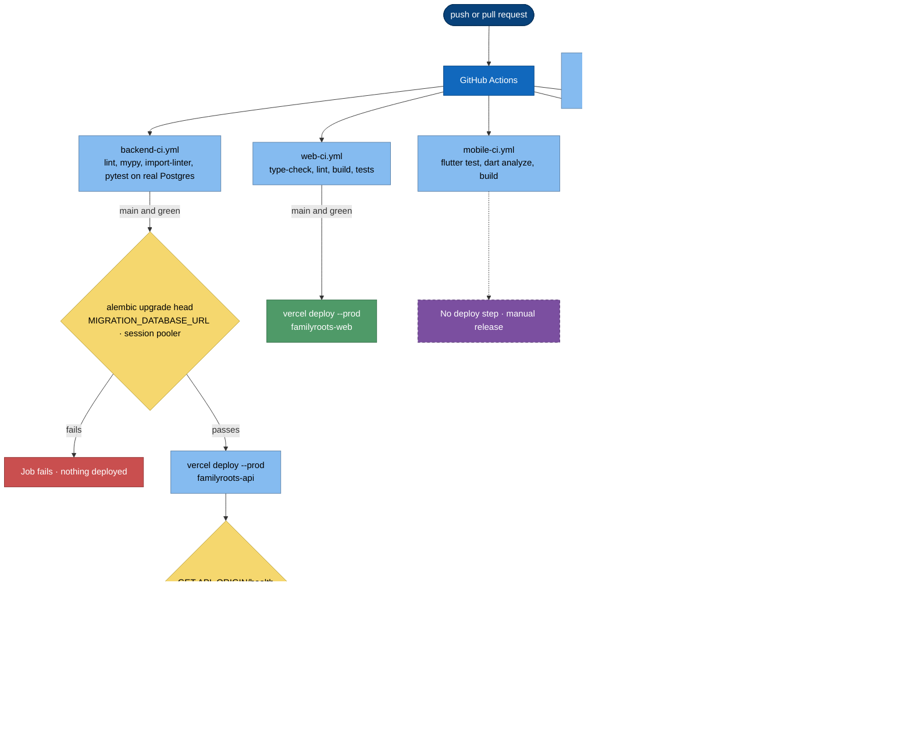
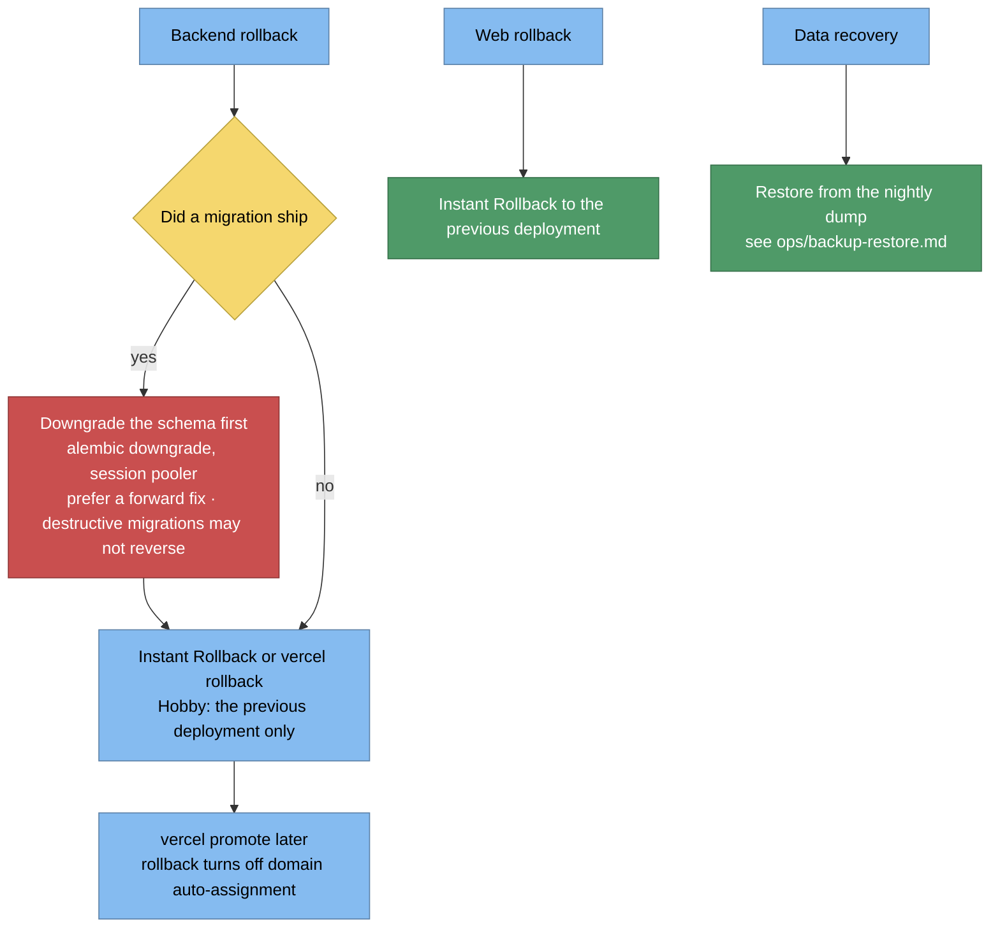

# 7. Deployment View

Since 2026-10-10 (#250, #251, #252; ADR-065, ADR-066). Render is retired. The runbook, with
every project id, variable and owner step, is [../ops/deployment.md](../ops/deployment.md).

## 7.1 Production topology

```mermaid
graph TB
  browser([Browser]):::person
  device([iOS / Android app]):::person

  subgraph vercel[Vercel - team namtp, Hobby]
    web[familyroots-web · Next.js 16<br/>functions in sin1 · immutable deployments]:::host
    api[familyroots-api · FastAPI on the Python runtime<br/>functions in sin1 · APP_ENV=production · GET /health]:::host
    vcron[Vercel Cron · two daily jobs, UTC]:::host
  end

  subgraph supabase[Supabase project xkmutzxdhdigyfisfrwd - ap-southeast-1]
    pooler[Supavisor<br/>transaction pooler :6543 · session pooler :5432]:::comp
    pg[(PostgreSQL 17<br/>public: app tables · auth · storage)]:::store
    sauth[Auth]:::ext
    sstor[(Storage · family-roots-files, family-roots-avatars)]:::ext
    sbk[(Storage · backups bucket)]:::ext
  end

  fcm[Firebase Cloud Messaging]:::ext
  sentry[Sentry]:::ext
  stores[App Store / Play Store]:::ext

  browser --> web
  web --> api
  device --> api
  device --> stores
  browser --> sauth
  device --> sauth
  vcron -->|GET /internal/cron/* · Bearer CRON_SECRET| api
  api -->|:6543, NullPool| pooler
  pooler --> pg
  sauth --> pg
  api --> sstor
  api --> sauth
  api --> fcm
  api --> sentry
  web --> sentry
  pg -.->|nightly pg_dump via :5432| sbk

  classDef person fill:#08427b,stroke:#052e56,color:#ffffff
  classDef host fill:#1168bd,stroke:#0b4884,color:#ffffff
  classDef comp fill:#85bbf0,stroke:#5d82a8,color:#000000
  classDef store fill:#438dd5,stroke:#2e6295,color:#ffffff
  classDef ext fill:#999999,stroke:#6b6b6b,color:#ffffff
```

Notable: no load balancer tier of our own, no Redis, no worker process, and no long-running
process. The two scheduled jobs (anniversary notifications, document purge) no longer run
in-process. Vercel Cron calls them over HTTP once a day. Each job holds a transaction-scoped
advisory lock, so a concurrent duplicate delivery skips, and the jobs' own dedup covers a later
one (ADR-065). The database, auth and storage share one
Supabase project, and so do the nightly dumps (see [../ops/backup-restore.md](../ops/backup-restore.md)).

## 7.2 CI/CD pipelines

```mermaid
graph TB
  push([push or pull request]):::person
  cron([schedule · 00:15 ICT]):::person
  gha[GitHub Actions]:::host

  b1[backend-ci.yml<br/>lint, mypy, import-linter, pytest on real Postgres]:::comp
  w1[web-ci.yml<br/>type-check, lint, build, tests]:::comp
  m1[mobile-ci.yml<br/>flutter test, dart analyze, build]:::comp
  i1[infra-ci.yml<br/>pulumi preview on PR, up on main]:::comp
  p1[pr-checks.yml<br/>gitleaks, no committed .env, PR title]:::comp
  d1[db-backup.yml<br/>pg_dump, gzip, backups bucket, rotation]:::comp

  mig{alembic upgrade head<br/>MIGRATION_DATABASE_URL · session pooler}:::dec
  stop[Job fails · nothing deployed]:::bad
  bdeploy[vercel deploy --prod<br/>familyroots-api]:::comp
  health{GET API_ORIGIN/health<br/>migrations = current}:::dec
  red[Job fails · roll back]:::bad
  live[Live in production]:::good
  vdeploy[vercel deploy --prod<br/>familyroots-web]:::good
  manual[No deploy step · manual release]:::v2
  noop[Resources are stubs · effectively a no-op]:::v2

  push --> gha
  cron --> d1
  gha --> b1
  gha --> w1
  gha --> m1
  gha --> i1
  gha --> p1
  b1 -->|main and green| mig
  mig -->|fails| stop
  mig -->|passes| bdeploy
  bdeploy --> health
  health -->|no| red
  health -->|yes| live
  w1 -->|main and green| vdeploy
  m1 -.-> manual
  i1 -.-> noop

  classDef person fill:#08427b,stroke:#052e56,color:#ffffff
  classDef host fill:#1168bd,stroke:#0b4884,color:#ffffff
  classDef comp fill:#85bbf0,stroke:#5d82a8,color:#000000
  classDef dec fill:#f5d76e,stroke:#b8a13c,color:#000000
  classDef good fill:#4f9a68,stroke:#357049,color:#ffffff
  classDef bad fill:#c94f4f,stroke:#8f3636,color:#ffffff
  classDef v2 fill:#7b4fa0,stroke:#54356f,color:#ffffff,stroke-dasharray:5 4
```

**There is no staging gate — `main` merges reach production.** `develop` runs CI only. Every
deploy step skips with a warning until its secrets exist.

**The health read comes after the deployment is already live.** Vercel promotes a deployment when
its build is ready, without requesting it first. So a failed read means production already serves
the new deployment, and the response is a rollback, not a blocked deploy. Under Render the boot
gate blocked the release itself.

## 7.3 Environments

| Env | Backend | Web | DB |
|---|---|---|---|
| local | `uv run uvicorn app.main:app --reload` :8000 | `pnpm dev` :3000 | `docker compose up -d pgdb pgadmin` (Postgres 18), plus the local Supabase stack for auth and storage |
| test | pytest process | node test runner | throwaway `family_roots_schema_test`, full Alembic chain |
| production | Vercel `familyroots-api`, `sin1` | Vercel `familyroots-web`, `sin1` | Supabase `xkmutzxdhdigyfisfrwd`, Postgres 17, `ap-southeast-1` |

## 7.4 Configuration and secrets

- All backend settings in `app/core/config.py` (`pydantic-settings`, reads `.env`);
  required keys listed in `.env.example`.
- Production config **fails fast** on an unsafe setup (e.g. wildcard `ALLOWED_HOSTS`). On
  Vercel that fails every cold start of a live deployment, not the deploy itself.
- Every production variable is set by hand in the Vercel project. No file declares them. The list
  is [../ops/deployment.md](../ops/deployment.md), "Go-live checklist".
- `backend/vercel.json` and `web/vercel.json` pin the region, name the framework and turn off
  Git-triggered deploys. The backend file also sets `maxDuration` and declares the crons.
- Docs (`/docs`, `/redoc`) only mount when `APP_DEBUG=true`.
- Secrets never committed — enforced by gitleaks + the no-`.env` gate.

## 7.5 Rollback

```mermaid
graph TB
  b[Backend rollback]:::comp
  bd{Did a migration ship}:::dec
  b3[Downgrade the schema first<br/>alembic downgrade, session pooler<br/>prefer a forward fix · destructive migrations may not reverse]:::bad
  b1[Instant Rollback or vercel rollback<br/>Hobby: the previous deployment only]:::comp
  bp[vercel promote later<br/>rollback turns off domain auto-assignment]:::comp
  w[Web rollback]:::comp
  w1[Instant Rollback to the previous deployment]:::good
  d[Data recovery]:::comp
  d1[Restore from the nightly dump<br/>see ops/backup-restore.md]:::good

  b --> bd
  bd -->|yes| b3
  b3 --> b1
  bd -->|no| b1
  b1 --> bp
  w --> w1
  d --> d1

  classDef comp fill:#85bbf0,stroke:#5d82a8,color:#000000
  classDef dec fill:#f5d76e,stroke:#b8a13c,color:#000000
  classDef good fill:#4f9a68,stroke:#357049,color:#ffffff
  classDef bad fill:#c94f4f,stroke:#8f3636,color:#ffffff
```

A code rollback across a migration cannot boot: the boot gate demands that `alembic_version`
equal the deployment's own head, exactly. Hence the downgrade first.
