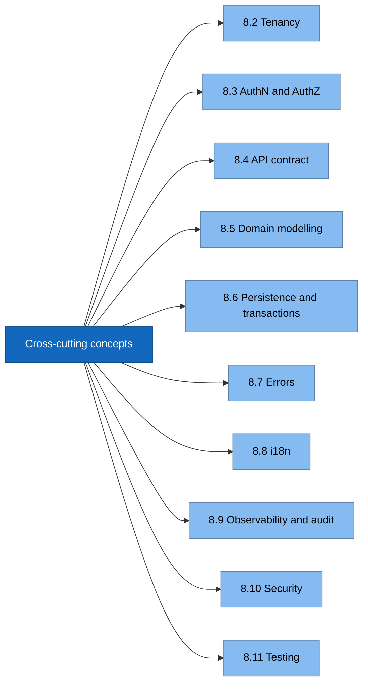
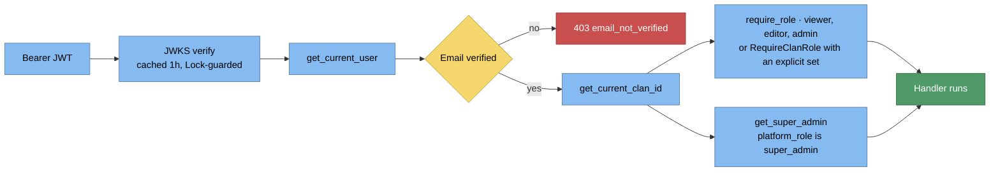
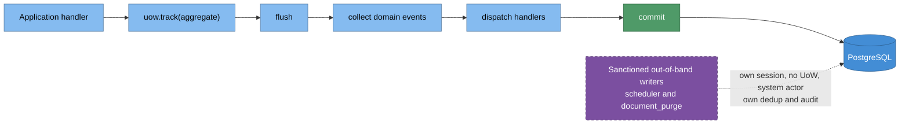
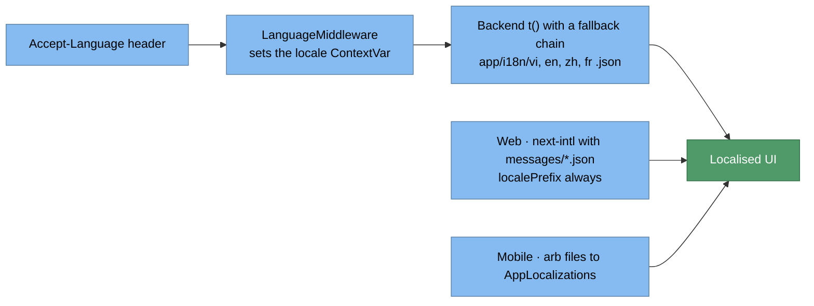
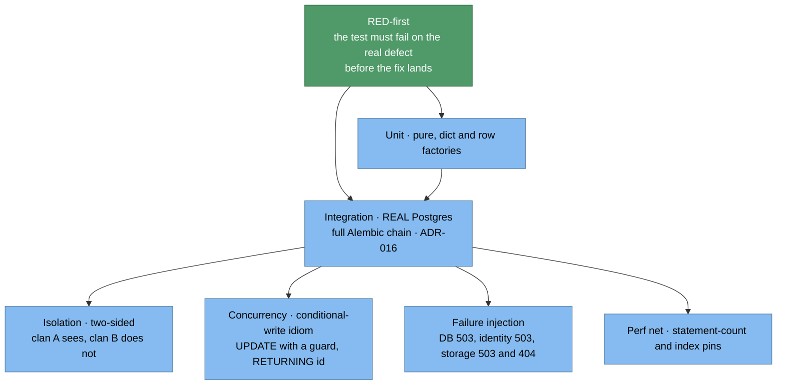

# 8. Cross-cutting Concepts

## 8.1 Map

## 8.2 Tenancy

Single schema, `clan_id`. Active clan comes from `X-Current-Clan-Id`, validated
against approved memberships and clan `is_active`. **No tenant middleware** — scoping
lives in repositories. RLS is layer-2 only.
→ [multi-tenancy.md](../architecture/multi-tenancy.md), [05d](05d-database-components.md).

## 8.3 AuthN / AuthZ

Roles are re-derived from `user_clan_roles` per request (`is_approved = true`) — never
trusted from the token. → [rbac.md](../architecture/rbac.md), [auth-flow.md](../architecture/auth-flow.md).

## 8.4 API contract (frozen)

| Rule | Value |
|---|---|
| Success | `{"data": ...}` on every 2xx; 204 empty; `/health` exempt |
| Lists | `+ "meta": {cursor, has_more, limit}` — opaque cursor, `(created_at, id)` ASC |
| Exception | super-admin `GET /audit-log` is DESC (ADR-030) |
| Dates | `HistoricalDate {date, precision, display, lunar}` (ADR-011) |
| Shaping | `profile=summary\|detail\|full`, `include`, sparse `fields` |
| Adjunct info | goes in `meta` (`meta.errors`, `meta.warning`) — never beside `data` |

→ [contracts/README.md](../contracts/README.md).

## 8.5 Domain modelling

- Aggregates own invariants; ports are abstract; events are recorded via `add_event()`.
- **đời authority** — con theo đời cha; thủy tổ = 1 (ADR-027). `clan_memberships.generation`
  is deprecated as a display source.
- **đa thê** — child nodes carry derived `mother_id` + `mother_spouse_order`;
  `pedigree_collapse_ref` marks a stub under a non-canonical in-tree parent.
- Kinship terms are emitted only when **both** birth dates have `precision == "exact"`.
- **person ≠ user** — `persons` is genealogy data; `user_profiles` is an account.
  Linking them is the identity-claim workflow (ADR-007).

## 8.6 Persistence and transactions

Handlers must never commit the session directly. OCC `version` on genealogy writes
(ADR-017). No external I/O while holding a pooled DB connection (ADR-028).

## 8.7 Errors

`AppError` / `DomainError` → structured envelope via `app/core/exceptions.py`.
Codes are catalogued in [error-codes.md](../contracts/error-codes.md); a **new code
requires** an ADR + contract update + i18n in `en/vi/zh/fr` in the same PR.
Transient DB failures → 503 (ADR-032); programming errors stay 500.

## 8.8 i18n

Locales `vi` (default) · `en` · `zh` · `fr` across all three surfaces.

## 8.9 Observability and audit

- **Correlation:** every request carries a W3C `traceparent` — `TraceContextMiddleware`
  continues an inbound one or generates a new one, and sits just inside `CORS` in the
  chain (outermost → innermost: `Prometheus → TrustedHost → CORS → TraceContext →
  Language → RequestMeta → Sentry → RateLimit`) so every log line for the request,
  including a localized 429 from the rate limiter, carries it. Prometheus is outermost
  so RED latency covers the whole stack — `TrustedHost` rejections included. An
  unhandled 500 is the exception to the chain: Starlette hoists the catch-all
  `Exception` handler into `ServerErrorMiddleware`, outside all of the above, so the
  context is re-read from the request scope's `state` there.
- **Logs:** JSON log lines gain `trace_id`/`span_id`, plus `route`/`clan_id` where known,
  while inside a request. `route` is the **raw request path** (UUIDs and all), not a route
  template; `clan_id` is the **claimed** `X-Current-Clan-Id` header, truncated to 64
  chars — not an authorized clan. Outside a request (scheduler, purge jobs) those keys
  are **absent**, not null, so a trace-id log search never matches system-initiated work.
- **Response/CORS:** the response echoes `traceparent`, and CORS exposes it — browsers
  hide non-safelisted response headers from JS otherwise — so a web client can show the
  user a trace id to quote to an admin.
- **Errors/tracing:** Sentry keeps its own distributed tracing (FastAPI integration,
  `sentry-trace` / `baggage` headers) on backend, web, and mobile (mobile init still
  TODO); we additionally tag events with `trace_id`, the pivot from a Sentry issue to
  log search.
- **Metrics:** RED metrics at `GET /internal/metrics` — opt-in (`METRICS_ENABLED`),
  token-guarded (`X-Metrics-Token` header vs `METRICS_TOKEN`), 404 on every failure path
  (ADR-021), envelope-exempt like `/health`.
- **Audit:** every mutation writes `audit_logs` in the same transaction, enriched with
  client IP + User-Agent captured by `RequestMetaMiddleware` (ADR-021).
- **Health:** `GET /health` probes DB → 503 `degraded` when unreachable.
- → ADR-033, [ops/monitoring.md](../ops/monitoring.md).

## 8.10 Security

Non-enumerating auth surfaces + 20 rpm/IP rate limit on `/auth` and `/invitations`
(ADR-021) · path-isolated storage + presigned URLs · gitleaks + no-`.env` CI gate ·
prod config fail-fast · docs endpoints off unless `APP_DEBUG`.

## 8.11 Testing

Gate before "done" (backend): `pytest -q` · `ruff check .` · `ruff format --check .` ·
`mypy app/ tests/` · `lint-imports`.
