# 9. Architecture Decisions

Authoritative index: [docs/decisions/README.md](../decisions/README.md) (ADR-001 … 033).
This page groups them by the concern they settle.

## 9.1 Decision map

```mermaid
graph TB
  subgraph structure[Structure]
    a001[001 DDD, CQRS, hexagonal]:::comp
    a013[013 import-linter ratchet]:::comp
    a003[003 REST-first contract]:::comp
  end

  subgraph tenancy[Tenancy and access]
    a002[002 single-schema clan scoping]:::comp
    a008[008 RLS defence-in-depth]:::comp
    a031[031 cross-clan edges are an app-layer guarantee]:::comp
    a009[009 clan delete RESTRICT]:::comp
    a021[021 non-enumerating auth plus rate limit]:::comp
    a015[015 email verification]:::comp
    a007[007 identity claims]:::comp
  end

  subgraph contract[Contract]
    a010[010 envelope plus cursor pagination]:::comp
    a011[011 HistoricalDate precision]:::comp
    a024[024 non-canonical exceptions typed as-is]:::comp
    a030[030 audit log newest-first]:::comp
  end

  subgraph semantics[Genealogy semantics]
    a012[012 computed đời and mother attribution]:::comp
    a027[027 con theo đời cha · single authority]:::comp
    a026[026 single founder · thủy tổ]:::comp
    a029[029 two-sided spouse_order]:::comp
    a018[018 in-house lunar calendar]:::comp
  end

  subgraph integrity[Integrity and concurrency]
    a014[014 in-transaction domain events for audit]:::comp
    a017[017 optimistic concurrency]:::comp
    a023[023 parent_child DB backstop]:::comp
    a025[025 per-clan edge-write serialization]:::comp
    a006[006 selective soft delete]:::comp
    a019[019 document purge]:::comp
    a022[022 event soft delete plus OCC]:::comp
  end

  subgraph runtime[Runtime and ops]
    a028[028 no external I/O holding a DB connection]:::comp
    a032[032 transient DB failure returns 503]:::comp
    a033[033 W3C trace context via traceparent]:::comp
    a016[016 real-Postgres test harness]:::comp
    a020[020 export formats · JSON and GEDCOM]:::comp
  end

  subgraph deferred[Deferred - not built]
    a004[004 Redis event bus]:::v2
    a005[005 dedicated export worker]:::v2
  end

  a001 --> a013
  a001 --> a014
  a002 --> a008
  a002 --> a031
  a003 --> a010
  a010 --> a011
  a012 --> a027
  a027 --> a026
  a023 --> a025

  classDef comp fill:#85bbf0,stroke:#5d82a8,color:#000000
  classDef v2 fill:#7b4fa0,stroke:#54356f,color:#ffffff,stroke-dasharray:5 4
```

## 9.2 The five that shape everything

| ADR | Decision | Trade-off accepted |
|---|---|---|
| **001** | DDD + CQRS + hexagonal | More files per feature; layer discipline required |
| **002** | Single schema + `clan_id` | Isolation depends on code correctness → mitigated by ADR-008 + two-sided tests |
| **010/011** | Frozen envelope + `HistoricalDate` | Every client must migrate off pre-envelope shapes |
| **014** | Domain events dispatched inside the write transaction | Audit is guaranteed; a failing handler rolls back the business write |
| **008** | RLS as layer-2, rolled out table-by-table | Two enforcement points to keep in sync |

## 9.3 Status watch

- **ADR-004 / ADR-005 deferred** — no durable bus, no worker. Do not describe
  in-process events as integration events.
- **ADR-008** is live (Phases 1–4: documents, events, branches, marriages,
  parent_child, persons), not the "inert pilot" older prose describes — see
  [11-risks-and-technical-debt.md](11-risks-and-technical-debt.md).
- **ADR-024** — a few endpoints are intentionally non-canonical; normalize before the
  frontend binds them.

**Rule:** any architectural choice or breaking change ships a new ADR **in the same PR**.
