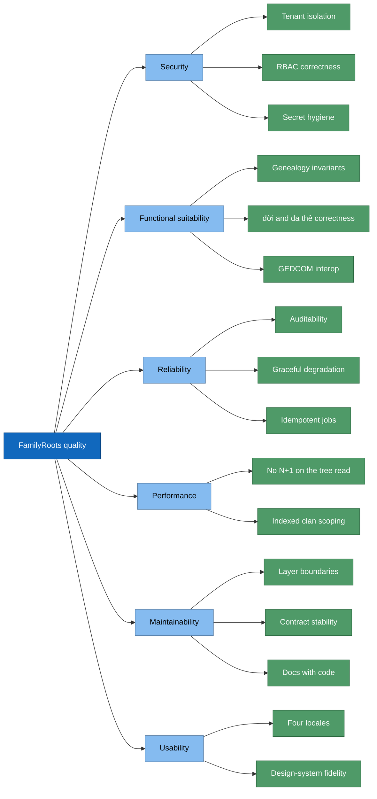

# 10. Quality Requirements

## 10.1 Quality tree

## 10.2 Quality scenarios

| # | Attribute | Scenario | Response | Verified by |
|---|---|---|---|---|
| QS1 | Isolation | Clan B requests a person of clan A by id | 404 not-found, no leak | two-sided isolation tests + RLS |
| QS2 | Isolation | A row is inserted with a foreign `clan_id` under the request role | RLS policy rejects | RLS phase tests |
| QS3 | AuthZ | Viewer attempts a write | 403 | route dependency tests |
| QS4 | AuthZ | Non-super-admin hits a platform route | 403 | all 6 routes carry `get_super_admin` |
| QS5 | Auditability | Audit handler fails mid-write | Whole write rolls back | ADR-014 + integration test |
| QS6 | Concurrency | Two admins change the same role at once | One wins; loser gets a typed 409/error, no phantom audit | race tests (conditional-write idiom) |
| QS7 | Concurrency | Approve vs reject membership race | Exactly one outcome persists | race tests |
| QS8 | Performance | Clan grows 3× / tree deepens | Tree statement count **unchanged** | `test_tree_query_count_scaling.py` |
| QS9 | Performance | Person list on a large clan | Uses `idx_clan_memberships_clan`, not a seq scan | `test_person_list_scaling.py` |
| QS10 | Reliability | Postgres unreachable | 503 `database_unavailable`; `/health` 503 degraded | failure-injection tests (ADR-032) |
| QS11 | Reliability | Supabase identity/JWKS unreachable | 503, not 500 | failure-injection tests |
| QS12 | Reliability | Storage unavailable | 503/404 through real routes | storage failure-injection tests |
| QS13 | Reliability | Scheduler runs on 2 instances | Advisory lock → one run; dedup → no double push | scheduler design + `notification_log` |
| QS14 | Correctness | Biography with paragraph breaks exported to GEDCOM | Continuations stay at parent level + 1; no text dropped | strict-parser round-trip test |
| QS15 | Correctness | Person with `precision != exact` birth date | Kinship age terms suppressed; `display` rendered | domain + schema tests |
| QS16 | Maintainability | Domain imports SQLAlchemy | CI fails | `lint-imports` (ADR-013) |
| QS17 | Maintainability | Response shape changes | Contract doc updated in the same PR | review rule |
| QS18 | Security | Login probing for valid emails | Non-enumerating response, 20 rpm/IP | ADR-021 tests |
| QS19 | Usability | Any user-facing string added | Present in all 4 locales | i18n coverage guard |

## 10.3 Verification posture

Explicitly **not** yet quantified: latency SLOs, throughput targets, RTO/RPO. Backups
run nightly; recovery time is untested — see
[11-risks-and-technical-debt.md](11-risks-and-technical-debt.md).
