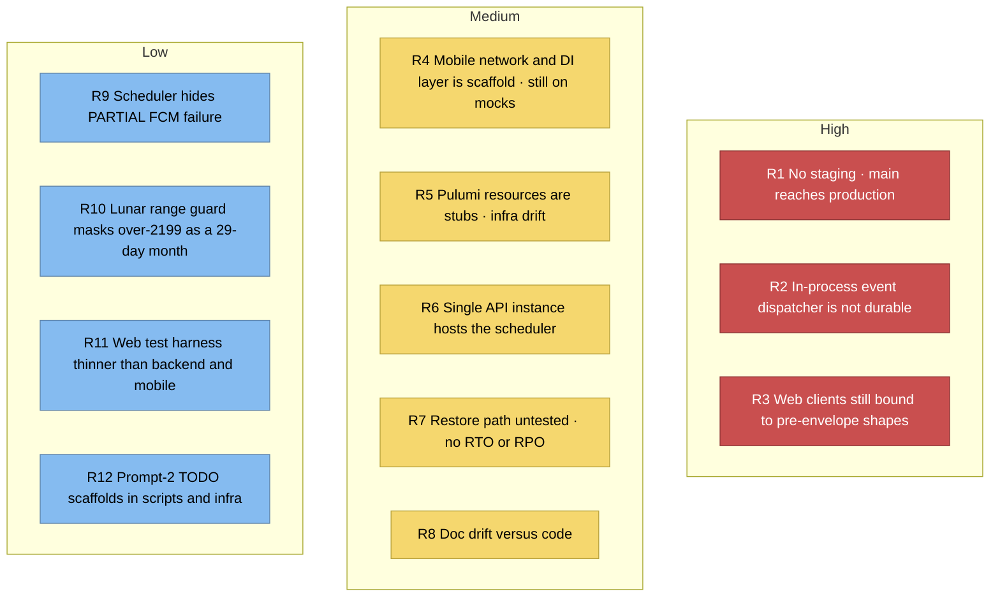

# 11. Risks and Technical Debt

## 11.1 Risk map

## 11.2 Register

| # | Risk / debt | Impact | Current mitigation | Next move |
|---|---|---|---|---|
| R1 | **No staging gate** — merge to `main` deploys | A bad merge is a production incident | Full CI gate + migration-blocking pre-deploy + rollback path | Add a staging env / promotion flow |
| R2 | **In-process events** (ADR-004/005 deferred) | Handler failure rolls back the write; no cross-service integration | Deliberate: audit atomicity chosen over decoupling (ADR-014) | Build the Redis bus only when a second consumer exists |
| R3 | **Web pre-envelope clients** — `lib/api/auth.ts`, parts of `infrastructure/**`, member/tree types expect unwrapped bodies, `next_cursor`, scalar dates, `*_approx` | Runtime breakage as endpoints are adopted | New code written against the frozen shapes | Planned migration to `docs/contracts/*` |
| R4 | **Mobile still on mocks** — `api_client.dart`, `auth_interceptor.dart`, Firebase/Sentry/Hive init are TODO | Mobile has no real backend path yet | UI-first workflow is deliberate; DI flip is one line | Wire Dio interceptor with the 3 contract headers + 401 refresh |
| R5 | **Pulumi stubs** — `infra-ci.yml` `pulumi up` is a no-op | Declared infra ≠ real infra | Render/Vercel config is checked in and authoritative | Implement or explicitly retire the Pulumi path |
| R6 | **Single API instance hosts the scheduler** | Instance loss = missed job window that day | Advisory lock makes N instances safe; `notification_log` dedups | Scale out, or extract the job when the worker lands |
| R7 | **Backups unverified** | Unknown recovery time | Nightly `pg_dump` + rotation to the `backups` bucket | Run a restore drill; record RTO/RPO |
| R8 | **Doc drift** — the ADR index still calls ADR-008 "pilot only — inert at runtime"; `overview.md` and `multi-tenancy.md` describe an older RLS scope | Misleads the next reader on a security control | Code is the truth: RLS is live for `documents`, `events`, `branches`, `marriages`, `parent_child`, `persons` | Correct those three docs in one follow-up PR |
| R9 | **Scheduler partial-failure blindness** — `status = "sent" if sent > 0` with no `error_message` | A run with `sent>0 & failed>0` logs as clean success | Per-event try/rollback keeps the run alive | Record partial counts + error detail |
| R10 | **Lunar range masking** — `_days_in_lunar_month` catches `ValueError` broadly | Year > 2199 silently becomes a 29-day month | Engine range 1910–2199 is fail-loud elsewhere | Narrow the except clause |
| R11 | **Thin web tests** — Node runner, behavior + contract suites only | Regressions land in the browser layer | Type-check + lint gate | Grow contract tests alongside the envelope migration |
| R12 | **`services/` legacy fence** | Cross-cutting code outside the hexagon | import-linter fences it; new aggregates go through `application/` | Keep the ratchet shrinking |

## 11.3 Debt principles in force

- **Ratchet, never loosen:** import-linter `ignore_imports` lists may shrink, never grow.
- **`_(planned)_` must stay honest** — if it isn't built, it says so.
- **Code wins over docs** — when they disagree, fix the doc in the same PR.
