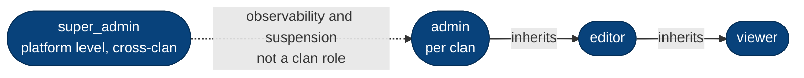

# 12. Glossary

## 12.1 Vietnamese genealogy terms

| Term | Meaning | Where it shows up |
|---|---|---|
| **dòng họ** | Clan / lineage — the tenant boundary | `clans`, `X-Current-Clan-Id` |
| **đời** | Generation number; thủy tổ = 1, then canonical parent's đời + 1 (*con theo đời cha*) | computed on every tree endpoint (ADR-027) |
| **thủy tổ** | Founding ancestor of the clan; exactly one per clan | `clan_memberships.is_founder` (ADR-026) |
| **đa thê** | Polygyny — multiple wives; children grouped by mother | `mother_id`, `mother_spouse_order` (ADR-012) |
| **giỗ** | Death anniversary, usually lunar-dated | scheduler + `lunar_calendar.py` (ADR-018) |
| **nhân khẩu** | A person record in the tree | `persons` |
| **gia phả** | The family-tree book / record itself | export formats (ADR-020) |

## 12.2 Architecture terms

| Term | Meaning |
|---|---|
| **Aggregate** | Consistency boundary in the domain layer; owns its invariants |
| **Port / Adapter** | Abstract interface in `domain/`; concrete implementation in `infrastructure/` |
| **UoW** | Unit of Work — flush → collect events → dispatch → commit, one transaction |
| **Query port** | CQRS read projection; may join across aggregates, hydrates no aggregate |
| **Composition root** | `infrastructure/dependencies.py` — the only place concretes are wired |
| **Ratchet** | import-linter `ignore_imports` list that may shrink but never grow (ADR-013) |
| **Envelope** | `{"data": ...}` on every 2xx; lists add `meta` |
| **HistoricalDate** | `{date, precision, display, lunar}` — every date field in a response |
| **OCC** | Optimistic concurrency via a `version` column (ADR-017) |
| **RLS** | Postgres Row-Level Security — defense-in-depth layer-2 (ADR-008) |
| **GUC** | `app.clan_id`, set transaction-locally so RLS policies can read the active clan |
| **Pedigree collapse** | Same ancestor reachable by two paths; stub node flagged `pedigree_collapse_ref` |
| **Two-sided test** | Asserts clan A *sees* its row **and** clan B *does not* |
| **RED-first** | Write a test that fails on the real defect before fixing it |
| **Sanctioned out-of-band writer** | Background job (scheduler, purge) that commits outside UoW by design |

## 12.3 Roles

`user_profiles.platform_role ∈ {user, super_admin}` ·
`user_clan_roles.role ∈ {admin, editor, viewer}` with `is_approved`.

## 12.4 Abbreviations

ADR · CQRS · DDD · CTE · FCM · GEDCOM · GUC · JWKS · JWT · M:N · OCC · RBAC · RLS ·
SAD · UoW.
