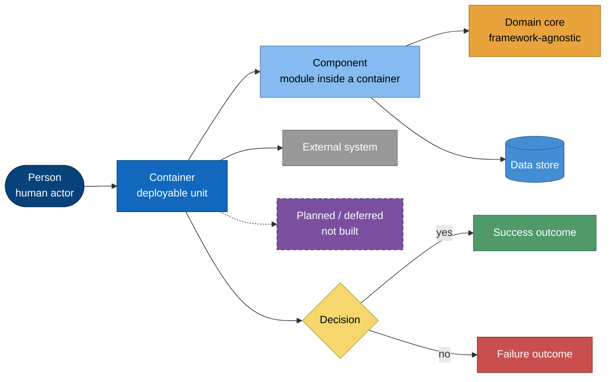
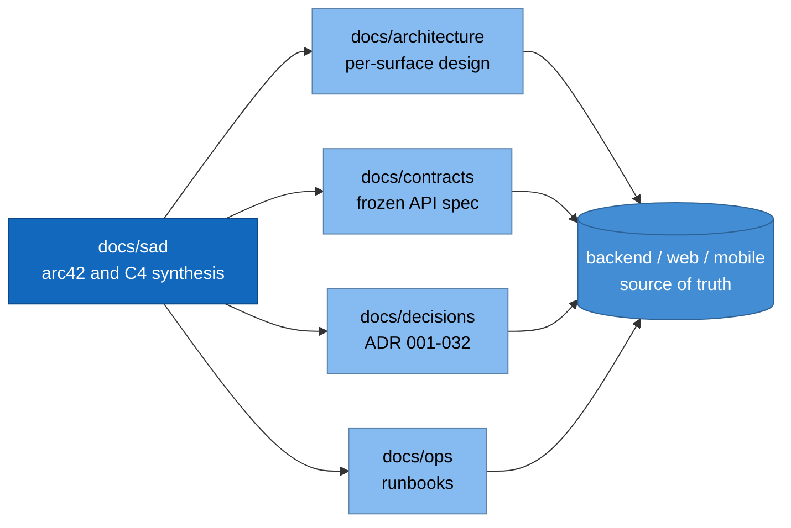

# Software Architecture Document (SAD)

FamilyRoots — Vietnamese genealogy platform. Structure: **arc42** (12 sections).
Views: **C4** (Context → Container → Component → Code). Diagrams: Mermaid.

**Status:** as-built on `main` (2026-08-02). Code is the source of truth.
_(planned)_ marks target state that is **not** implemented.

## Reading order — overview to detail

| # | arc42 section | C4 level | Doc |
|---|---|---|---|
| 1 | Introduction & Goals | — | [01-introduction-and-goals.md](01-introduction-and-goals.md) |
| 2 | Constraints | — | [02-architecture-constraints.md](02-architecture-constraints.md) |
| 3 | Context & Scope | **L1 Context** | [03-context-and-scope.md](03-context-and-scope.md) |
| 4 | Solution Strategy | — | [04-solution-strategy.md](04-solution-strategy.md) |
| 5 | Building Blocks | **L2 Container** | [05-building-block-view.md](05-building-block-view.md) |
| 5.1 | ↳ backend | **L3 + L4** | [05a-backend-components.md](05a-backend-components.md) |
| 5.2 | ↳ web (frontend) | **L3** | [05b-web-components.md](05b-web-components.md) |
| 5.3 | ↳ mobile | **L3** | [05c-mobile-components.md](05c-mobile-components.md) |
| 5.4 | ↳ database | **L3** | [05d-database-components.md](05d-database-components.md) |
| 6 | Runtime View | — | [06-runtime-view.md](06-runtime-view.md) |
| 7 | Deployment View | — | [07-deployment-view.md](07-deployment-view.md) |
| 8 | Cross-cutting Concepts | — | [08-crosscutting-concepts.md](08-crosscutting-concepts.md) |
| 9 | Decisions | — | [09-architecture-decisions.md](09-architecture-decisions.md) |
| 10 | Quality Requirements | — | [10-quality-requirements.md](10-quality-requirements.md) |
| 11 | Risks & Technical Debt | — | [11-risks-and-technical-debt.md](11-risks-and-technical-debt.md) |
| 12 | Glossary | — | [12-glossary.md](12-glossary.md) |

## Diagram conventions

One palette across every view, so a colour means the same thing at every C4 level.

Solid arrow = live path. **Dashed arrow = planned, or a rule/annotation** rather than a
call. Purple dashed nodes are designed but not built.

## Relation to the rest of `docs/`

The SAD is the **navigable synthesis**. Authoritative detail stays where it lives:

**Rule:** change a surface → update its owning doc in the same PR; update the SAD only
when a *structural* fact changes (a container, a component boundary, a quality goal).
